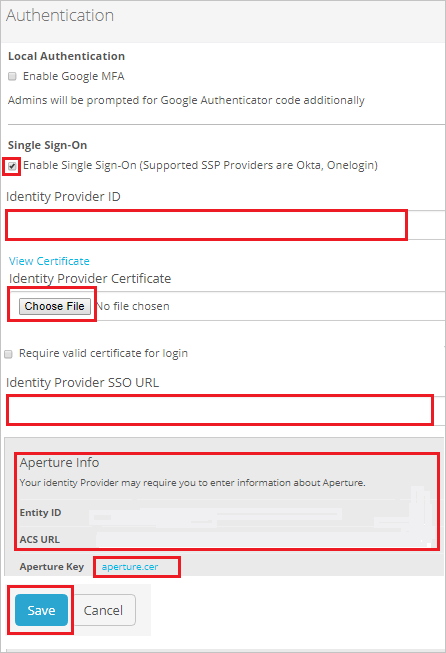

# Configure Palo Alto Networks - Aperture for Single sign-on with Microsoft Entra ID

In this article,  you learn how to integrate Palo Alto Networks - Aperture with Microsoft Entra ID. When you integrate Palo Alto Networks - Aperture with Microsoft Entra ID, you can:

* Control in Microsoft Entra ID who has access to Palo Alto Networks - Aperture.
* Enable your users to be automatically signed-in to Palo Alto Networks - Aperture with their Microsoft Entra accounts.
* Manage your accounts in one central location.

## Prerequisites
The scenario outlined in this article assumes that you already have the following prerequisites:

[!INCLUDE [common-prerequisites.md](~/identity/saas-apps/includes/common-prerequisites.md)]
* Palo Alto Networks - Aperture single sign-on (SSO) enabled subscription.

## Scenario description

In this article,  you configure and test Microsoft Entra single sign-on in a test environment.

* Palo Alto Networks - Aperture supports **SP** and **IDP** initiated SSO.

## Add Palo Alto Networks - Aperture from the gallery

To configure the integration of Palo Alto Networks - Aperture into Microsoft Entra ID, you need to add Palo Alto Networks - Aperture from the gallery to your list of managed SaaS apps.

1. Sign in to the [Microsoft Entra admin center](https://entra.microsoft.com) as at least a [Cloud Application Administrator](~/identity/role-based-access-control/permissions-reference.md#cloud-application-administrator).
1. Browse to **Entra ID** > **Enterprise apps** > **New application**.
1. In the **Add from the gallery** section, type **Palo Alto Networks - Aperture** in the search box.
1. Select **Palo Alto Networks - Aperture** from results panel and then add the app. Wait a few seconds while the app is added to your tenant.

 Alternatively, you can also use the [Enterprise App Configuration Wizard](https://portal.office.com/AdminPortal/home?Q=Docs#/azureadappintegration). In this wizard, you can add an application to your tenant, add users/groups to the app, assign roles, and walk through the SSO configuration as well. [Learn more about Microsoft 365 wizards.](/microsoft-365/admin/misc/azure-ad-setup-guides)

## Configure and test Microsoft Entra SSO

In this section, you configure and test Microsoft Entra single sign-on with Palo Alto Networks - Aperture based on a test user called **B.Simon**.
For single sign-on to work, a link relationship between a Microsoft Entra user and the related user in Palo Alto Networks - Aperture needs to be established.

To configure and test Microsoft Entra single sign-on with Palo Alto Networks - Aperture, perform the following steps:

1. **[Configure Microsoft Entra SSO](#configure-azure-ad-sso)** - to enable your users to use this feature.
	1. **Create a Microsoft Entra test user** - to test Microsoft Entra single sign-on with Britta Simon.
	1. **Assign the Microsoft Entra test user** - to enable Britta Simon to use Microsoft Entra single sign-on.
2. **[Configure Palo Alto Networks - Aperture SSO](#configure-palo-alto-networks---aperture-sso)** - to configure the Single Sign-On settings on application side.
	1. **[Create Palo Alto Networks - Aperture test user](#create-palo-alto-networks---aperture-test-user)** - to have a counterpart of Britta Simon in Palo Alto Networks - Aperture that's linked to the Microsoft Entra representation of user.
3. **[Test SSO](#test-sso)** - to verify whether the configuration works.

## Configure Microsoft Entra SSO

Follow these steps to enable Microsoft Entra SSO.

1. Sign in to the [Microsoft Entra admin center](https://entra.microsoft.com) as at least a [Cloud Application Administrator](~/identity/role-based-access-control/permissions-reference.md#cloud-application-administrator).
1. Browse to **Entra ID** > **Enterprise apps** > **Palo Alto Networks - Aperture** > **Single sign-on**.
1. On the **Select a single sign-on method** page, select **SAML**.
1. On the **Set up single sign-on with SAML** page, select the pencil icon for **Basic SAML Configuration** to edit the settings.

   

1. On the **Basic SAML Configuration** section, if you wish to configure the application in **IDP** initiated mode, perform the following steps:

    a. In the **Identifier** text box, type a URL using the following pattern:
    `https://<subdomain>.aperture.paloaltonetworks.com/d/users/saml/metadata`

    b. In the **Reply URL** text box, type a URL using the following pattern:
    `https://<subdomain>.aperture.paloaltonetworks.com/d/users/saml/auth`

5. Select **Set additional URLs** and perform the following step if you wish to configure the application in **SP** initiated mode:

    In the **Sign-on URL** text box, type a URL using the following pattern:
    `https://<subdomain>.aperture.paloaltonetworks.com/d/users/saml/sign_in`

	> [!NOTE]
	> These values aren't real. Update these values with the actual Identifier, Reply URL and Sign-on URL. Contact [Palo Alto Networks - Aperture Client support team](https://live.paloaltonetworks.com/t5/custom/page/page-id/Support) to get these values. You can also refer to the patterns shown in the **Basic SAML Configuration** section.

6. On the **Set up Single Sign-On with SAML** page, in the **SAML Signing Certificate** section, select **Download** to download the **Certificate (Base64)** from the given options as per your requirement and save it on your computer.

	

7. On the **Set up Palo Alto Networks - Aperture** section, copy the appropriate URL(s) as per your requirement.

	

[!INCLUDE [create-assign-users-sso.md](~/identity/saas-apps/includes/create-assign-users-sso.md)]

## Configure Palo Alto Networks - Aperture SSO

1. In a different web browser window, login to Palo Alto Networks - Aperture as an Administrator.

2. On the top menu bar, select **SETTINGS**.

	

3. Navigate to **APPLICATION** section select **Authentication** form the left side of menu.

	
	
4. On the **Authentication** page perform the following steps:
	
	

	a. Check the **Enable Single Sign-On(Supported SSP Providers are Okta, One login)** from **Single Sign-On** field.

	b. In the **Identity Provider ID** textbox, paste the value of **Microsoft Entra Identifier**.

	c. Select **Choose File** to upload the downloaded Certificate from Microsoft Entra ID in the **Identity Provider Certificate** field.

	d. In the **Identity Provider SSO URL** textbox, paste the value of **Login URL**.

	e. Review the IdP information from **Aperture Info** section and download the certificate from **Aperture Key** field.

	f. Select **Save**.

### Create Palo Alto Networks - Aperture test user

In this section, you create a user called Britta Simon in Palo Alto Networks - Aperture. Work with [Palo Alto Networks - Aperture Client support team](https://live.paloaltonetworks.com/t5/custom/page/page-id/Support) to add the users in the Palo Alto Networks - Aperture platform. Users must be created and activated before you use single sign-on.

## Test SSO 

In this section, you test your Microsoft Entra single sign-on configuration with following options. 

#### SP initiated:

* Select **Test this application**, this option redirects to Palo Alto Networks - Aperture Sign on URL where you can initiate the login flow.  

* Go to Palo Alto Networks - Aperture Sign-on URL directly and initiate the login flow from there.

#### IDP initiated:

* Select **Test this application**, and you should be automatically signed in to the Palo Alto Networks - Aperture for which you set up the SSO 

You can also use Microsoft My Apps to test the application in any mode. When you select the Palo Alto Networks - Aperture tile in the My Apps, if configured in SP mode you would be redirected to the application sign on page for initiating the login flow and if configured in IDP mode, you should be automatically signed in to the Palo Alto Networks - Aperture for which you set up the SSO. For more information about the My Apps, see [Introduction to the My Apps](https://support.microsoft.com/account-billing/sign-in-and-start-apps-from-the-my-apps-portal-2f3b1bae-0e5a-4a86-a33e-876fbd2a4510).

## Related content

Once you configure Palo Alto Networks - Aperture you can enforce session control, which protects exfiltration and infiltration of your organization’s sensitive data in real time. Session control extends from Conditional Access. [Learn how to enforce session control with Microsoft Defender for Cloud Apps](/cloud-app-security/proxy-deployment-any-app).
