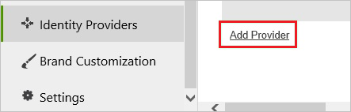

# Configure Panopto for Single sign-on with Microsoft Entra ID

In this article,  you learn how to integrate Panopto with Microsoft Entra ID. When you integrate Panopto with Microsoft Entra ID, you can:

* Control in Microsoft Entra ID who has access to Panopto.
* Enable your users to be automatically signed-in to Panopto with their Microsoft Entra accounts.
* Manage your accounts in one central location.

## Prerequisites
The scenario outlined in this article assumes that you already have the following prerequisites:

[!INCLUDE [common-prerequisites.md](~/identity/saas-apps/includes/common-prerequisites.md)]
* Panopto single sign-on (SSO) enabled subscription.

## Scenario description

In this article,  you configure and test Microsoft Entra single sign-on in a test environment.

* Panopto supports **SP** initiated SSO.

* Panopto supports **Just In Time** user provisioning.

> [!NOTE]
> Identifier of this application is a fixed string value so only one instance can be configured in one tenant.

## Add Panopto from the gallery

To configure the integration of Panopto into Microsoft Entra ID, you need to add Panopto from the gallery to your list of managed SaaS apps.

1. Sign in to the [Microsoft Entra admin center](https://entra.microsoft.com) as at least a [Cloud Application Administrator](~/identity/role-based-access-control/permissions-reference.md#cloud-application-administrator).
1. Browse to **Entra ID** > **Enterprise apps** > **New application**.
1. In the **Add from the gallery** section, type **Panopto** in the search box.
1. Select **Panopto** from results panel and then add the app. Wait a few seconds while the app is added to your tenant.

 Alternatively, you can also use the [Enterprise App Configuration Wizard](https://portal.office.com/AdminPortal/home?Q=Docs#/azureadappintegration). In this wizard, you can add an application to your tenant, add users/groups to the app, assign roles, and walk through the SSO configuration as well. [Learn more about Microsoft 365 wizards.](/microsoft-365/admin/misc/azure-ad-setup-guides)

## Configure and test Microsoft Entra SSO for Panopto

Configure and test Microsoft Entra SSO with Panopto using a test user called **B.Simon**. For SSO to work, you need to establish a link relationship between a Microsoft Entra user and the related user in Panopto.

To configure and test Microsoft Entra SSO with Panopto, perform the following steps:

1. **[Configure Microsoft Entra SSO](#configure-azure-ad-sso)** - to enable your users to use this feature.
    1. **Create a Microsoft Entra test user** - to test Microsoft Entra single sign-on with B.Simon.
    1. **Assign the Microsoft Entra test user** - to enable B.Simon to use Microsoft Entra single sign-on.
1. **[Configure Panopto SSO](#configure-panopto-sso)** - to configure the single sign-on settings on application side.
    1. **[Create Panopto test user](#create-panopto-test-user)** - to have a counterpart of B.Simon in Panopto that's linked to the Microsoft Entra representation of user.
1. **[Test SSO](#test-sso)** - to verify whether the configuration works.

## Configure Microsoft Entra SSO

Follow these steps to enable Microsoft Entra SSO.

1. Sign in to the [Microsoft Entra admin center](https://entra.microsoft.com) as at least a [Cloud Application Administrator](~/identity/role-based-access-control/permissions-reference.md#cloud-application-administrator).
1. Browse to **Entra ID** > **Enterprise apps** > **Panopto** > **Single sign-on**.
1. On the **Select a single sign-on method** page, select **SAML**.
1. On the **Set up single sign-on with SAML** page, select the pencil icon for **Basic SAML Configuration** to edit the settings.

   

1. On the **Basic SAML Configuration** section, perform the following steps:

    In the **Sign-on URL** text box, type a URL using the following pattern:
    `https://<TENANT_NAME>.panopto.com`

	> [!NOTE]
	> The value isn't real. Update the value with the actual Sign-On URL. Contact [Panopto Client support team](mailto:support@panopto.com) to get the value. You can also refer to the patterns shown in the **Basic SAML Configuration** section.

1. On the **Set up Single Sign-On with SAML** page, in the **SAML Signing Certificate** section, select **Download** to download the **Federation Metadata XML** from the given options as per your requirement and save it on your computer.

	

6. On the **Set up Panopto** section, copy the appropriate URL(s) as per your requirement.

	

[!INCLUDE [create-assign-users-sso.md](~/identity/saas-apps/includes/create-assign-users-sso.md)]

## Configure Panopto SSO

1. In a different web browser window, log in to your Panopto company site as an administrator.

2. In the toolbar on the left, select **System**, and then select **Identity Providers**.
   
    

3. Select **Add Provider**.
   
    
   
4. In the SAML provider section, perform the following steps:
   
    
	
	a. From the **Provider Type** list, select **SAML20**.    
	
	b. In the **Instance Name** textbox, type a name for the instance.

	c. In the **Friendly Description** textbox, type a friendly description.
	
	d. In **Bounce Page Url** textbox, paste the value of **Login URL**.

	e. In the **Issuer** textbox, paste the value of **Microsoft Entra Identifier**.

	f. Open your base-64 encoded certificate, which you have downloaded from Azure portal, copy the content of it in to your clipboard, and then paste it to the **Public Key**  textbox.

5. Select **Save**.

### Create Panopto test user

In this section, a user called Britta Simon is created in Panopto. Panopto supports just-in-time user provisioning, which is enabled by default. There's no action item for you in this section. If a user doesn't already exist in Panopto, a new one is created after authentication.

>[!NOTE]
>You can use any other Panopto user account creation tools or APIs provided by Panopto to provision Microsoft Entra user accounts.
>

## Test SSO

In this section, you test your Microsoft Entra single sign-on configuration with following options. 

* Select **Test this application**, this option redirects to Panopto Sign-on URL where you can initiate the login flow. 

* Go to Panopto Sign-on URL directly and initiate the login flow from there.

* You can use Microsoft My Apps. When you select the Panopto tile in the My Apps, this option redirects to Panopto Sign-on URL. For more information about the My Apps, see [Introduction to the My Apps](https://support.microsoft.com/account-billing/sign-in-and-start-apps-from-the-my-apps-portal-2f3b1bae-0e5a-4a86-a33e-876fbd2a4510).

## Related content

Once you configure Panopto you can enforce session control, which protects exfiltration and infiltration of your organization’s sensitive data in real time. Session control extends from Conditional Access. [Learn how to enforce session control with Microsoft Defender for Cloud Apps](/cloud-app-security/proxy-deployment-aad).
