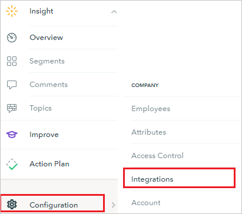
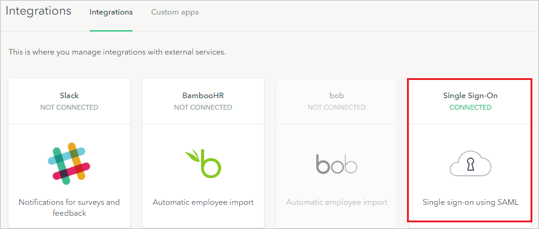

# Configure Peakon for Single sign-on with Microsoft Entra ID

In this article,  you learn how to integrate Peakon with Microsoft Entra ID. When you integrate Peakon with Microsoft Entra ID, you can:

* Control in Microsoft Entra ID who has access to Peakon.
* Enable your users to be automatically signed-in to Peakon with their Microsoft Entra accounts.
* Manage your accounts in one central location.

## Prerequisites
The scenario outlined in this article assumes that you already have the following prerequisites:

[!INCLUDE [common-prerequisites.md](~/identity/saas-apps/includes/common-prerequisites.md)]
* Peakon single sign-on (SSO) enabled subscription.

> [!NOTE]
> This integration is also available to use from Microsoft Entra US Government Cloud environment. You can find this application in the Microsoft Entra US Government Cloud Application Gallery and configure it in the same way as you do from public cloud.

## Scenario description

In this article,  you configure and test Microsoft Entra single sign-on in a test environment.

* Peakon supports **SP** and **IDP** initiated SSO.
* Peakon supports [**automated** user provisioning and deprovisioning](peakon-provisioning-tutorial.md) (recommended).

## Add Peakon from the gallery

To configure the integration of Peakon into Microsoft Entra ID, you need to add Peakon from the gallery to your list of managed SaaS apps.

1. Sign in to the [Microsoft Entra admin center](https://entra.microsoft.com) as at least a [Cloud Application Administrator](~/identity/role-based-access-control/permissions-reference.md#cloud-application-administrator).
1. Browse to **Entra ID** > **Enterprise apps** > **New application**.
1. In the **Add from the gallery** section, type **Peakon** in the search box.
1. Select **Peakon** from results panel and then add the app. Wait a few seconds while the app is added to your tenant.

 Alternatively, you can also use the [Enterprise App Configuration Wizard](https://portal.office.com/AdminPortal/home?Q=Docs#/azureadappintegration). In this wizard, you can add an application to your tenant, add users/groups to the app, assign roles, and walk through the SSO configuration as well. [Learn more about Microsoft 365 wizards.](/microsoft-365/admin/misc/azure-ad-setup-guides)

## Configure and test Microsoft Entra SSO for Peakon

Configure and test Microsoft Entra SSO with Peakon using a test user called **B.Simon**. For SSO to work, you need to establish a link relationship between a Microsoft Entra user and the related user in Peakon.

To configure and test Microsoft Entra SSO with Peakon, perform the following steps:

1. **[Configure Microsoft Entra SSO](#configure-azure-ad-sso)** - to enable your users to use this feature.
    1. **Create a Microsoft Entra test user** - to test Microsoft Entra single sign-on with B.Simon.
    1. **Assign the Microsoft Entra test user** - to enable B.Simon to use Microsoft Entra single sign-on.
1. **[Configure Peakon SSO](#configure-peakon-sso)** - to configure the single sign-on settings on application side.
    1. **[Create Peakon test user](#create-peakon-test-user)** - to have a counterpart of B.Simon in Peakon that's linked to the Microsoft Entra representation of user.
1. **[Test SSO](#test-sso)** - to verify whether the configuration works.

## Configure Microsoft Entra SSO

Follow these steps to enable Microsoft Entra SSO.

1. Sign in to the [Microsoft Entra admin center](https://entra.microsoft.com) as at least a [Cloud Application Administrator](~/identity/role-based-access-control/permissions-reference.md#cloud-application-administrator).
1. Browse to **Entra ID** > **Enterprise apps** > **Peakon** > **Single sign-on**.
1. On the **Select a single sign-on method** page, select **SAML**.
1. On the **Set up single sign-on with SAML** page, select the pencil icon for **Basic SAML Configuration** to edit the settings.

   

1. On the **Basic SAML Configuration** section, if you wish to configure the application in **IDP** initiated mode, perform the following steps:

    a. In the **Identifier** text box, type a URL using the following pattern:
    `https://app.peakon.com/saml/<companyid>/metadata`

    b. In the **Reply URL** text box, type a URL using the following pattern:
    `https://app.peakon.com/saml/<companyid>/assert`

5. Select **Set additional URLs** and perform the following step if you wish to configure the application in **SP** initiated mode:

    In the **Sign-on URL** text box, type the URL:
    `https://app.peakon.com/login`

	> [!NOTE]
	> These values aren't real. Update these values with the actual Identifier and Reply URL which is explained later in the article. You can also refer to the patterns shown in the **Basic SAML Configuration** section.

6. On the **Set up Single Sign-On with SAML** page, in the **SAML Signing Certificate** section, select **Download** to download the **Certificate (Raw)** from the given options as per your requirement and save it on your computer.

	

7. On the **Set up Peakon** section, copy the appropriate URL(s) as per your requirement.

	

[!INCLUDE [create-assign-users-sso.md](~/identity/saas-apps/includes/create-assign-users-sso.md)]

## Configure Peakon SSO

1. In a different web browser window, sign in to Peakon as an Administrator.

2. In the menu bar on the left side of the page, select **Configuration**, then navigate to **Integrations**.

	

3. On **Integrations** page, select **Single Sign-On**.

	

4. Under **Single Sign-On** section, select **Enable**.

	

5. On the **Single sign-on for employees using SAML** section, perform the following steps:

	

	a. In the **SSO Login URL** textbox, paste the value of **Login URL**, which you copied previously.

	b. In the **SSO Logout URL** textbox, paste the value of **Logout URL**, which you copied previously.

	c. Select **Choose file** to upload the certificate that you have downloaded, into the Certificate box.

	d. Select the **icon** to copy the **Entity ID** and paste in **Identifier** textbox in **Basic SAML Configuration** section.

	e. Select the **icon** to copy the **Reply URL (ACS)** and paste in **Reply URL** textbox in **Basic SAML Configuration** section.

	f. Select **Save**.

### Create Peakon test user

For enabling Microsoft Entra users to sign in to Peakon, they must be provisioned into Peakon.  
In the case of Peakon, provisioning is a manual task.

**To provision a user account, perform the following steps:**

1. Sign in to your Peakon company site as an administrator.

2. In the menu bar on the left side of the page, select **Configuration**, then navigate to **Employees**.

    

3. On the top right side of the page, select **Add employee**.

    

3. On the **New employee** dialog page, perform the following steps:

    

    1. In the **Name** textbox, type first name as **Britta** and last name as **simon**.

    1. In the **Email** textbox, type the email address like **Brittasimon\@contoso.com**.

    1. Select **Create employee**.

## Test SSO 

In this section, you test your Microsoft Entra single sign-on configuration with following options. 

#### SP initiated:

* Select **Test this application**, this option redirects to Peakon Sign on URL where you can initiate the login flow.  

* Go to Peakon Sign-on URL directly and initiate the login flow from there.

#### IDP initiated:

* Select **Test this application**, and you should be automatically signed in to the Peakon for which you set up the SSO. 

You can also use Microsoft My Apps to test the application in any mode. When you select the Peakon tile in the My Apps, if configured in SP mode you would be redirected to the application sign on page for initiating the login flow and if configured in IDP mode, you should be automatically signed in to the Peakon for which you set up the SSO. For more information, see [Microsoft Entra My Apps](/azure/active-directory/manage-apps/end-user-experiences#azure-ad-my-apps).

## Related content

Once you configure FreshDesk you can enforce session control, which protects exfiltration and infiltration of your organization’s sensitive data in real time. Session control extends from Conditional Access. [Learn how to enforce session control with Microsoft Cloud App Security](/cloud-app-security/proxy-deployment-aad).
