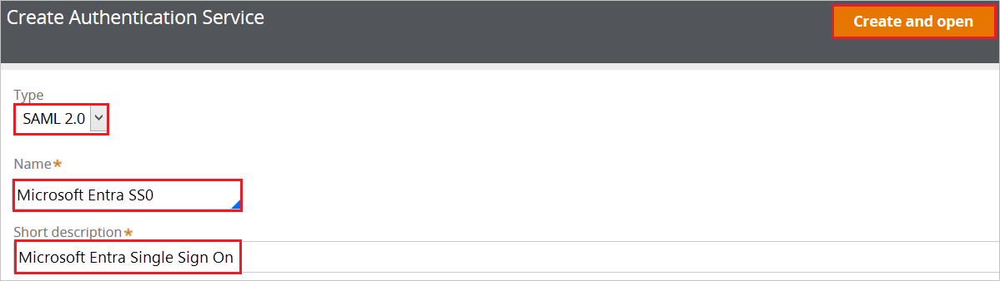
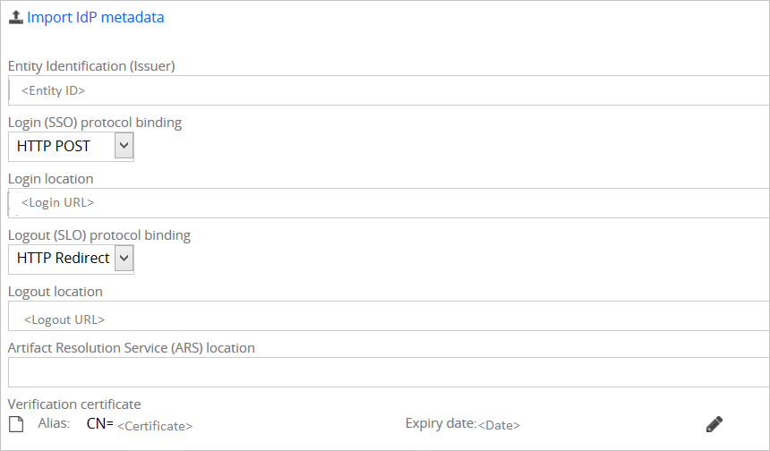
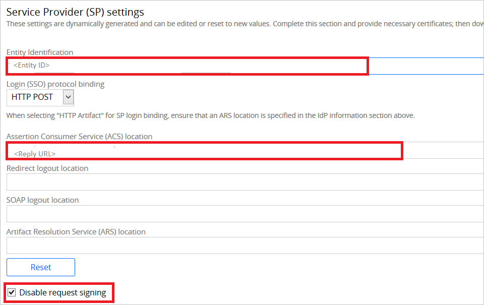

# Configure Pega Systems for Single sign-on with Microsoft Entra ID

In this article,  you learn how to integrate Pega Systems with Microsoft Entra ID. When you integrate Pega Systems with Microsoft Entra ID, you can:

* Control in Microsoft Entra ID who has access to Pega Systems.
* Enable your users to be automatically signed-in to Pega Systems with their Microsoft Entra accounts.
* Manage your accounts in one central location.

## Prerequisites
The scenario outlined in this article assumes that you already have the following prerequisites:

[!INCLUDE [common-prerequisites.md](~/identity/saas-apps/includes/common-prerequisites.md)]
* Pega Systems single sign-on (SSO) enabled subscription.

## Scenario description

In this article,  you configure and test Microsoft Entra single sign-on in a test environment.

* Pega Systems supports SP-initiated and IdP-initiated SSO.

## Add Pega Systems from the gallery

To configure the integration of Pega Systems into Microsoft Entra ID, you need to add Pega Systems from the gallery to your list of managed SaaS apps.

1. Sign in to the [Microsoft Entra admin center](https://entra.microsoft.com) as at least a [Cloud Application Administrator](~/identity/role-based-access-control/permissions-reference.md#cloud-application-administrator).
1. Browse to **Entra ID** > **Enterprise apps** > **New application**.
1. In the **Add from the gallery** section, type **Pega Systems** in the search box.
1. Select **Pega Systems** from results panel and then add the app. Wait a few seconds while the app is added to your tenant.

 Alternatively, you can also use the [Enterprise App Configuration Wizard](https://portal.office.com/AdminPortal/home?Q=Docs#/azureadappintegration). In this wizard, you can add an application to your tenant, add users/groups to the app, assign roles, and walk through the SSO configuration as well. [Learn more about Microsoft 365 wizards.](/microsoft-365/admin/misc/azure-ad-setup-guides)

## Configure and test Microsoft Entra SSO for Pega Systems

Configure and test Microsoft Entra SSO with Pega Systems using a test user called **B.Simon**. For SSO to work, you need to establish a link relationship between a Microsoft Entra user and the related user in Pega Systems.

To configure and test Microsoft Entra SSO with Pega Systems, perform the following steps:

1. **[Configure Microsoft Entra SSO](#configure-azure-ad-sso)** - to enable your users to use this feature.
    1. **Create a Microsoft Entra test user** - to test Microsoft Entra single sign-on with B.Simon.
    1. **Assign the Microsoft Entra test user** - to enable B.Simon to use Microsoft Entra single sign-on.
1. **[Configure Pega Systems SSO](#configure-pega-systems-sso)** - to configure the single sign-on settings on application side.
    1. **[Create Pega Systems test user](#create-pega-systems-test-user)** - to have a counterpart of B.Simon in Pega Systems that's linked to the Microsoft Entra representation of user.
1. **[Test SSO](#test-sso)** - to verify whether the configuration works.

## Configure Microsoft Entra SSO

Follow these steps to enable Microsoft Entra SSO.

1. Sign in to the [Microsoft Entra admin center](https://entra.microsoft.com) as at least a [Cloud Application Administrator](~/identity/role-based-access-control/permissions-reference.md#cloud-application-administrator).
1. Browse to **Entra ID** > **Enterprise apps** > **Pega Systems** > **Single sign-on**.
1. On the **Select a single sign-on method** page, select **SAML**.
1. On the **Set up single sign-on with SAML** page, select the pencil icon for **Basic SAML Configuration** to edit the settings.

   

4. In the **Basic SAML Configuration** dialog box, if you want to configure the application in IdP-initiated mode, perform the following steps.

    1. In the **Identifier** box, type a URL using the following pattern:

       `https://<customername>.pegacloud.io:443/prweb/sp/<instanceID>`

    1. In the **Reply URL** box, type a URL using the following pattern:

       `https://<customername>.pegacloud.io:443/prweb/PRRestService/WebSSO/SAML/AssertionConsumerService`

5. If you want to configure the application in SP-initiated mode, select **Set additional URLs** and complete the following steps.

	1. In the **Sign on URL** box, enter the sign on URL value.

    1. In the **Relay State** box, enter a URL in this pattern:
       `https://<customername>.pegacloud.io/prweb/sso`

	> [!NOTE]
	> The values provided here are placeholders. You need to use the actual Identifier, Reply URL, Sign on URL and Relay state URL. You can get the identifier and reply URL values from a Pega application, as explained later in this article. To get the relay state value, contact the [Pega Systems support team](https://www.pega.com/contact-us). You can also refer to the patterns shown in the **Basic SAML Configuration** section.

6. The Pega Systems application needs the SAML assertions to be in a specific format. To get them in the correct format, you need to add custom attribute mappings to your SAML token attributes configuration. The following screenshot shows the default attributes. Select the **Edit** icon to open the **User Attributes** dialog box:

	

7. In addition to the attributes shown in the previous screenshot, the Pega Systems application requires a few more attributes to be passed back in the SAML response. In the **User claims** section of the **User Attributes** dialog box, complete the following steps to add these SAML token attributes:
	
   - `uid`
   - `cn`
   - `mail`
   - `accessgroup`  
   - `organization`  
   - `orgdivision`
   - `orgunit`
   - `workgroup`  
   - `Phone`

	> [!NOTE]
	> These values are specific to your organization. Provide the appropriate values.

	1. Select **Add new claim** to open the **Manage user claims** dialog box:

	

	

	1. In the **Name** box, enter the attribute name shown for that row.

	1. Leave the **Namespace** box empty.

	1. For the **Source**, select **Attribute**.

	1. In the **Source attribute** list, select the attribute value shown for that row.

	1. Select **Ok**.

	1. Select **Save**.

8. On the **Set up Single Sign-On with SAML** page, in the **SAML Signing Certificate** section, select the **Download** link next to **Federation Metadata XML**, per your requirements, and save the certificate on your computer:

	

9. In the **Set up Pega Systems** section, copy the appropriate URLs, based on your requirements.

	

[!INCLUDE [create-assign-users-sso.md](~/identity/saas-apps/includes/create-assign-users-sso.md)]

## Configure Pega Systems SSO

1. To configure single sign-on on the **Pega Systems** side, sign in to the Pega Portal with an admin account in another browser window.

1. Select **Create** > **SysAdmin** > **Authentication Service**:

	
	
1. Perform the following steps on the **Create Authentication Service** screen.

	

	1. In the **Type** list, select **SAML 2.0**.

	1. In the **Name** box, enter any name (for example, **Microsoft Entra SSO**).

	1. In the **Short description** box, enter a description.  

	1. Select **Create and open**.
	
1. In the **Identity Provider (IdP) information** section, select **Import IdP metadata** and browse to the metadata file that you downloaded. Select **Submit** to load the metadata:

	
	
    The import will populate the IdP data as shown here:

	
	
1. Perform the following steps in the **Service Provider (SP) settings** section.

	

	1. Copy the **Entity Identification** value and paste it into the **Identifier** box in the **Basic SAML Configuration** section.

	1. Copy the **Assertion Consumer Service (ACS) location** value and paste it into the **Reply URL** box in the **Basic SAML Configuration** section.

	1. Select **Disable request signing**.

1. Select **Save**.

### Create Pega Systems test user

Next, you need to create a user named Britta Simon in Pega Systems. Work with the [Pega Systems support team](https://www.pega.com/contact-us) to create users.

## Test SSO

In this section, you test your Microsoft Entra single sign-on configuration with following options. 

#### SP initiated:

* Select **Test this application**, this option redirects to Pega Systems Sign on URL where you can initiate the login flow.  

* Go to Pega Systems Sign-on URL directly and initiate the login flow from there.

#### IDP initiated:

* Select **Test this application**, and you should be automatically signed in to the Pega Systems for which you set up the SSO. 

You can also use Microsoft My Apps to test the application in any mode. When you select the Pega Systems tile in the My Apps, if configured in SP mode you would be redirected to the application sign on page for initiating the login flow and if configured in IDP mode, you should be automatically signed in to the Pega Systems for which you set up the SSO. For more information about the My Apps, see [Introduction to the My Apps](https://support.microsoft.com/account-billing/sign-in-and-start-apps-from-the-my-apps-portal-2f3b1bae-0e5a-4a86-a33e-876fbd2a4510).

## Related content

Once you configure Pega Systems you can enforce session control, which protects exfiltration and infiltration of your organization’s sensitive data in real time. Session control extends from Conditional Access. [Learn how to enforce session control with Microsoft Defender for Cloud Apps](/cloud-app-security/proxy-deployment-aad).
