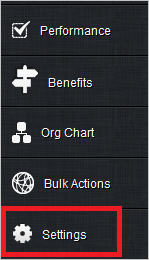
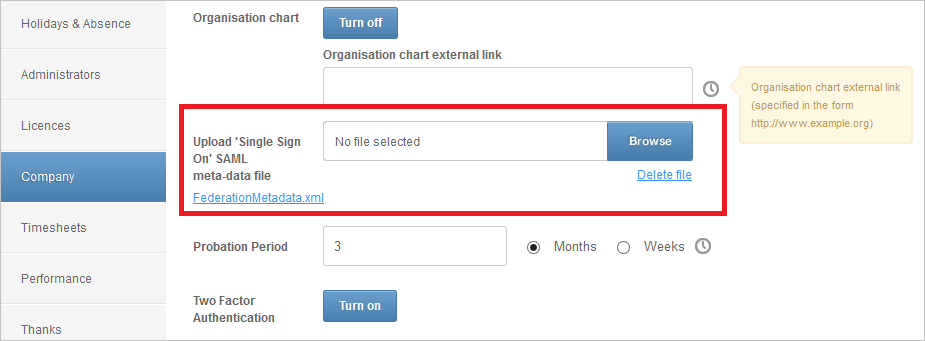
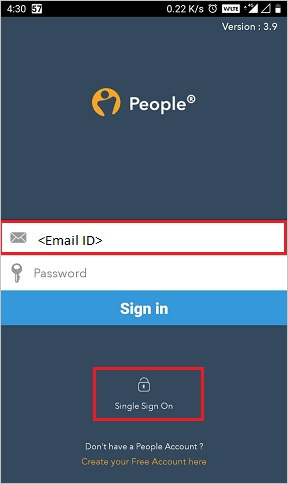
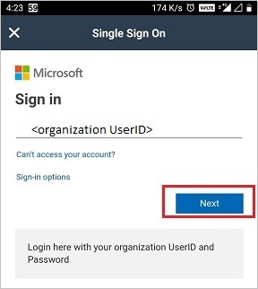
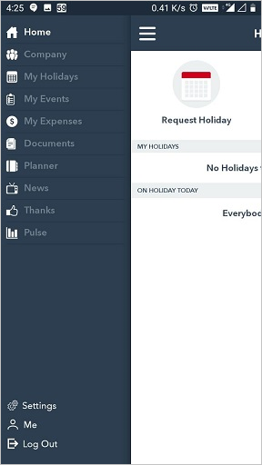

# Configure People for Single sign-on with Microsoft Entra ID

In this article,  you learn how to integrate People with Microsoft Entra ID. When you integrate People with Microsoft Entra ID, you can:

* Control in Microsoft Entra ID who has access to People.
* Enable your users to be automatically signed-in to People with their Microsoft Entra accounts.
* Manage your accounts in one central location.

## Prerequisites
The scenario outlined in this article assumes that you already have the following prerequisites:

[!INCLUDE [common-prerequisites.md](~/identity/saas-apps/includes/common-prerequisites.md)]
* People single sign-on (SSO) enabled subscription.

## Scenario description

In this article,  you configure and test Microsoft Entra SSO in a test environment.

* People supports **SP** initiated SSO
* People Mobile application can now be configured with Microsoft Entra ID for enabling SSO. In this article,  you configure and test Microsoft Entra SSO in a test environment.

>[!NOTE]
>Identifier of this application is a fixed string value so only one instance can be configured in one tenant.

## Add People from the gallery

To configure the integration of People into Microsoft Entra ID, you need to add People from the gallery to your list of managed SaaS apps.

1. Sign in to the [Microsoft Entra admin center](https://entra.microsoft.com) as at least a [Cloud Application Administrator](~/identity/role-based-access-control/permissions-reference.md#cloud-application-administrator).
1. Browse to **Entra ID** > **Enterprise apps** > **New application**.
1. In the **Add from the gallery** section, type **People** in the search box.
1. Select **People** from results panel and then add the app. Wait a few seconds while the app is added to your tenant.

 Alternatively, you can also use the [Enterprise App Configuration Wizard](https://portal.office.com/AdminPortal/home?Q=Docs#/azureadappintegration). In this wizard, you can add an application to your tenant, add users/groups to the app, assign roles, and walk through the SSO configuration as well. [Learn more about Microsoft 365 wizards.](/microsoft-365/admin/misc/azure-ad-setup-guides)

## Configure and test Microsoft Entra SSO for People

Configure and test Microsoft Entra SSO with People using a test user called **B.Simon**. For SSO to work, you need to establish a link relationship between a Microsoft Entra user and the related user in People.

To configure and test Microsoft Entra SSO with People, perform the following steps:

1. **[Configure Microsoft Entra SSO](#configure-azure-ad-sso)** - to enable your users to use this feature.
    1. **Create a Microsoft Entra test user** - to test Microsoft Entra single sign-on with B.Simon.
    1. **Assign the Microsoft Entra test user** - to enable B.Simon to use Microsoft Entra single sign-on.
2. **[Configure People SSO](#configure-people-sso)** - to configure the Single Sign-On settings on application side.
    1. **[Create People test user](#create-people-test-user)** - to have a counterpart of B.Simon in People that's linked to the Microsoft Entra representation of user.
6. **[Test SSO](#test-sso)** - to verify whether the configuration works.

## Configure Microsoft Entra SSO

Follow these steps to enable Microsoft Entra SSO.

1. Sign in to the [Microsoft Entra admin center](https://entra.microsoft.com) as at least a [Cloud Application Administrator](~/identity/role-based-access-control/permissions-reference.md#cloud-application-administrator).
1. Browse to **Entra ID** > **Enterprise apps** > **People** application integration page, find the **Manage** section and select **Single sign-on**.
1. On the **Select a Single sign-on method** page, select **SAML**.
1. On the **Set up Single Sign-On with SAML** page, select the pencil icon for **Basic SAML Configuration** to edit the settings.

   

1. On the **Basic SAML Configuration** section, enter the values for the following fields:

    a. In the **Sign-on URL** text box, type a URL using the following pattern:
    `https://<company name>.peoplehr.net`

    b. In the **Identifier** box, type the URL:
    `https://www.peoplehr.com`

    c. In the **Reply URL** text box, type a URL using the following pattern:
    `https://<company name>.peoplehr.net/Pages/Saml/ConsumeAzureAD.aspx`

	> [!NOTE]
	> These values aren't real. Update these values with the actual Sign-On URL and Reply URL. Contact [People Client support team](mailto:customerservices@peoplehr.com) to get these values. You can also refer to the patterns shown in the **Basic SAML Configuration** section.

4. On the **Set up Single Sign-On with SAML** page, in the **SAML Signing Certificate** section,  find **Federation Metadata XML** and select **Download** to download the certificate and save it on your computer.

	

1. On the **Set up People** section, copy the appropriate URL(s) based on your requirement.

	

[!INCLUDE [create-assign-users-sso.md](~/identity/saas-apps/includes/create-assign-users-sso.md)]

## Configure People SSO

1. In a different web browser window, sign in to your People company site as an administrator
   
4. In the menu on the left side, select **Settings**.

	

5. Select **Company**.

	

6. On the **Upload 'Single Sign On' SAML meta-data file**, select **Browse** to upload the downloaded metadata file.

	

### Create People test user

In this section, you create a user called B.Simon in People. Work with [People Client support team](mailto:customerservices@peoplehr.com) to add the users in the People platform. Users must be created and activated before you use single sign-on.

## Test SSO 

In this section, you test your Microsoft Entra single sign-on configuration with following options. 

* Select **Test this application**, this option redirects to People Sign-on URL where you can initiate the login flow. 

* Go to People Sign-on URL directly and initiate the login flow from there.

* You can use Microsoft My Apps. When you select the People tile in the My Apps, this option redirects to People Sign-on URL. For more information about the My Apps, see [Introduction to the My Apps](https://support.microsoft.com/account-billing/sign-in-and-start-apps-from-the-my-apps-portal-2f3b1bae-0e5a-4a86-a33e-876fbd2a4510).

## Test SSO for People (Mobile)

1. Open People Mobile application. On the sign in page, enter the **Email ID** and then select **Single Sign On**.

	

2. Enter **organization UserID** and select **Next**.

	

3. Finally after successful sign in, the application homepage is displayed shown below:

	

## Related content

Once you configure People you can enforce session control, which protects exfiltration and infiltration of your organization’s sensitive data in real time. Session control extends from Conditional Access. [Learn how to enforce session control with Microsoft Defender for Cloud Apps](/cloud-app-security/proxy-deployment-any-app).
