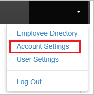
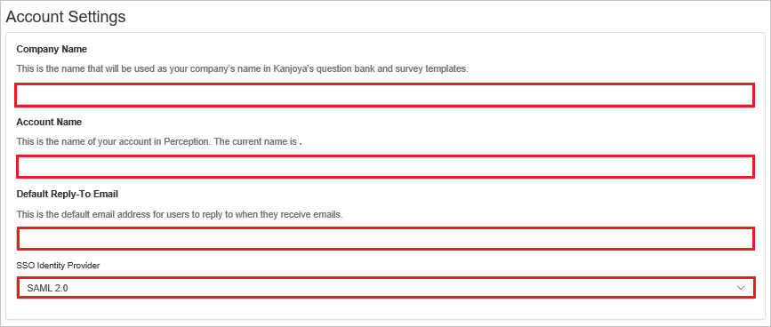
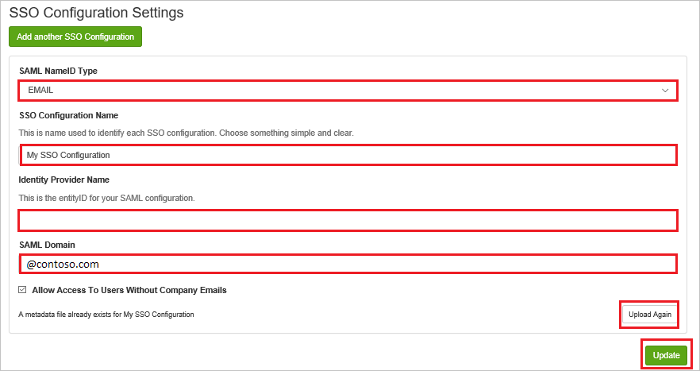

# Configure UltiPro Perception for Single sign-on with Microsoft Entra ID

In this article,  you learn how to integrate UltiPro Perception with Microsoft Entra ID. When you integrate UltiPro Perception with Microsoft Entra ID, you can:

* Control in Microsoft Entra ID who has access to UltiPro Perception.
* Enable your users to be automatically signed-in to UltiPro Perception with their Microsoft Entra accounts.
* Manage your accounts in one central location.

## Prerequisites
The scenario outlined in this article assumes that you already have the following prerequisites:

[!INCLUDE [common-prerequisites.md](~/identity/saas-apps/includes/common-prerequisites.md)]
* UltiPro Perception single sign-on (SSO) enabled subscription.

## Scenario description

In this article,  you configure and test Microsoft Entra single sign-on in a test environment.

* UltiPro Perception supports **IDP** initiated SSO.

> [!NOTE]
> Identifier of this application is a fixed string value so only one instance can be configured in one tenant.

## Add UltiPro Perception from the gallery

To configure the integration of UltiPro Perception into Microsoft Entra ID, you need to add UltiPro Perception from the gallery to your list of managed SaaS apps.

1. Sign in to the [Microsoft Entra admin center](https://entra.microsoft.com) as at least a [Cloud Application Administrator](~/identity/role-based-access-control/permissions-reference.md#cloud-application-administrator).
1. Browse to **Entra ID** > **Enterprise apps** > **New application**.
1. In the **Add from the gallery** section, type **UltiPro Perception** in the search box.
1. Select **UltiPro Perception** from results panel and then add the app. Wait a few seconds while the app is added to your tenant.

 Alternatively, you can also use the [Enterprise App Configuration Wizard](https://portal.office.com/AdminPortal/home?Q=Docs#/azureadappintegration). In this wizard, you can add an application to your tenant, add users/groups to the app, assign roles, and walk through the SSO configuration as well. [Learn more about Microsoft 365 wizards.](/microsoft-365/admin/misc/azure-ad-setup-guides)

## Configure and test Microsoft Entra SSO for UltiPro Perception

Configure and test Microsoft Entra SSO with UltiPro Perception using a test user called **B.Simon**. For SSO to work, you need to establish a link relationship between a Microsoft Entra user and the related user in UltiPro Perception.

To configure and test Microsoft Entra SSO with UltiPro Perception, perform the following steps:

1. **[Configure Microsoft Entra SSO](#configure-azure-ad-sso)** - to enable your users to use this feature.
    1. **Create a Microsoft Entra test user** - to test Microsoft Entra single sign-on with B.Simon.
    1. **Assign the Microsoft Entra test user** - to enable B.Simon to use Microsoft Entra single sign-on.
1. **[Configure UltiPro Perception SSO](#configure-ultipro-perception-sso)** - to configure the single sign-on settings on application side.
    1. **[Create UltiPro Perception test user](#create-ultipro-perception-test-user)** - to have a counterpart of B.Simon in UltiPro Perception that's linked to the Microsoft Entra representation of user.
1. **[Test SSO](#test-sso)** - to verify whether the configuration works.

## Configure Microsoft Entra SSO

Follow these steps to enable Microsoft Entra SSO.

1. Sign in to the [Microsoft Entra admin center](https://entra.microsoft.com) as at least a [Cloud Application Administrator](~/identity/role-based-access-control/permissions-reference.md#cloud-application-administrator).
1. Browse to **Entra ID** > **Enterprise apps** > **UltiPro Perception** > **Single sign-on**.
1. On the **Select a single sign-on method** page, select **SAML**.
1. On the **Set up single sign-on with SAML** page, select the pencil icon for **Basic SAML Configuration** to edit the settings.

   

1. On the **Basic SAML Configuration** page, perform the following steps:

    a. In the **Reply URL** text box, type a URL using the following pattern:
    `https://perception.kanjoya.com/sso?idp=<entity_id>`

	b. The **UltiPro Perception** application requires the **Microsoft Entra Identifier** value as <entity_id>, which you get from the **Set up UltiPro Perception** section, to be URI-encoded. To get the URI-encoded value, use the following link: **http://www.url-encode-decode.com/**.

	c. After getting the URI-encoded value combine it with the **Reply URL** as mentioned below-

	`https://perception.kanjoya.com/sso?idp=<URI encoded entity_id>`
	
	d. Paste the above value in the **Reply URL** textbox.

1. On the **Set up Single Sign-On with SAML** page, in the **SAML Signing Certificate** section, select **Download** to download the **Federation Metadata XML** from the given options as per your requirement and save it on your computer.

	

6. On the **Set up UltiPro Perception** section, copy the appropriate URL(s) as per your requirement.

	

[!INCLUDE [create-assign-users-sso.md](~/identity/saas-apps/includes/create-assign-users-sso.md)]

## Configure UltiPro Perception SSO

1. In another browser window, sign on to your UltiPro Perception company site as an administrator.

2. In the main toolbar, select **Account Settings**.

    

3. On the **Account Settings** page, perform the following steps:

	

	a. In the **Company Name** textbox, type the name of the **Company**.
	
	b. In the **Account Name** textbox, type the name of the **Account**.

	c. In **Default Reply-To Email** text box, type the valid **Email**.

	d. Select **SSO Identity Provider** as **SAML 2.0**.

4. On the **SSO Configuration** page, perform the following steps:

    

	a. Select **SAML NameID Type** as **EMAIL**.

	b. In the **SSO Configuration Name** textbox, type the name of your **Configuration**.
	
	c. In **Identity Provider Name** textbox, paste the value of **Microsoft Entra Identifier**. 

	d. In **SAML Domain textbox**, enter the domain like @contoso.com.

	e. Select **Upload Again** to upload the **Metadata XML** file.

	f. Select **Update**.

### Create UltiPro Perception test user

In this section, you create a user called Britta Simon in UltiPro Perception. Work with [UltiPro Perception support team](https://www.ultimatesoftware.com/Contact/ContactUs) to add the users in the UltiPro Perception platform.

## Test SSO

In this section, you test your Microsoft Entra single sign-on configuration with following options.

* Select **Test this application**, and you should be automatically signed in to the UltiPro Perception for which you set up the SSO.

* You can use Microsoft My Apps. When you select the UltiPro Perception tile in the My Apps, you should be automatically signed in to the UltiPro Perception for which you set up the SSO. For more information, see [Microsoft Entra My Apps](/azure/active-directory/manage-apps/end-user-experiences#azure-ad-my-apps).

## Related content

Once you configure UltiPro Perception you can enforce session control, which protects exfiltration and infiltration of your organization’s sensitive data in real time. Session control extends from Conditional Access. [Learn how to enforce session control with Microsoft Defender for Cloud Apps](/cloud-app-security/proxy-deployment-aad).
