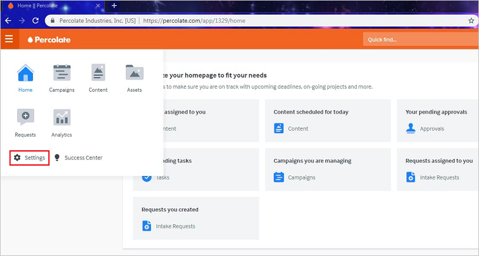
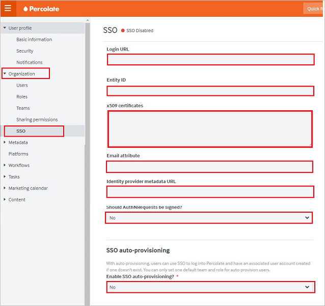
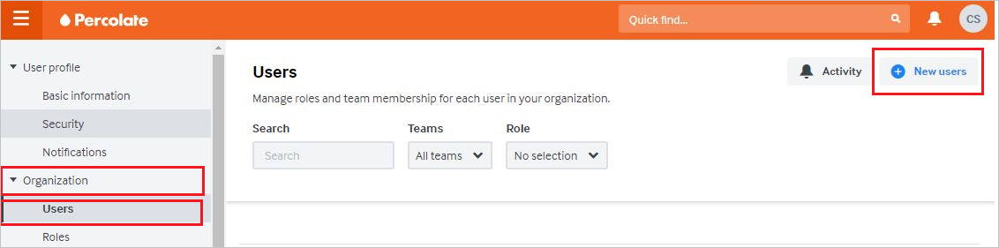
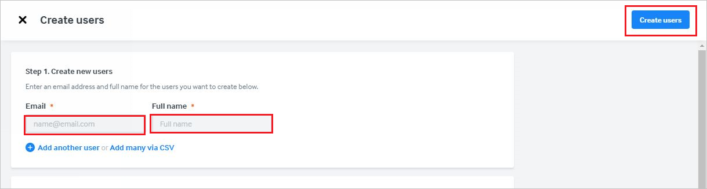

# Configure Percolate for Single sign-on with Microsoft Entra ID

In this article,  you learn how to integrate Percolate with Microsoft Entra ID. When you integrate Percolate with Microsoft Entra ID, you can:

* Control in Microsoft Entra ID who has access to Percolate.
* Enable your users to be automatically signed-in to Percolate with their Microsoft Entra accounts.
* Manage your accounts in one central location.

## Prerequisites
The scenario outlined in this article assumes that you already have the following prerequisites:

[!INCLUDE [common-prerequisites.md](~/identity/saas-apps/includes/common-prerequisites.md)]
* A Percolate subscription that has single sign-on enabled.

## Scenario description

In this article,  you configure and test Microsoft Entra single sign-on in a test environment.

* Percolate supports SP-initiated and IdP-initiated SSO.

## Add Percolate from the gallery

To configure the integration of Percolate into Microsoft Entra ID, you need to add Percolate from the gallery to your list of managed SaaS apps.

1. Sign in to the [Microsoft Entra admin center](https://entra.microsoft.com) as at least a [Cloud Application Administrator](~/identity/role-based-access-control/permissions-reference.md#cloud-application-administrator).
1. Browse to **Entra ID** > **Enterprise apps** > **New application**.
1. In the **Add from the gallery** section, type **Percolate** in the search box.
1. Select **Percolate** from results panel and then add the app. Wait a few seconds while the app is added to your tenant.

 Alternatively, you can also use the [Enterprise App Configuration Wizard](https://portal.office.com/AdminPortal/home?Q=Docs#/azureadappintegration). In this wizard, you can add an application to your tenant, add users/groups to the app, assign roles, and walk through the SSO configuration as well. [Learn more about Microsoft 365 wizards.](/microsoft-365/admin/misc/azure-ad-setup-guides)

## Configure and test Microsoft Entra SSO for Percolate

Configure and test Microsoft Entra SSO with Percolate using a test user called **B.Simon**. For SSO to work, you need to establish a link relationship between a Microsoft Entra user and the related user in Percolate.

To configure and test Microsoft Entra SSO with Percolate, perform the following steps:

1. **[Configure Microsoft Entra SSO](#configure-azure-ad-sso)** - to enable your users to use this feature.
    1. **Create a Microsoft Entra test user** - to test Microsoft Entra single sign-on with B.Simon.
    1. **Assign the Microsoft Entra test user** - to enable B.Simon to use Microsoft Entra single sign-on.
1. **[Configure Percolate SSO](#configure-percolate-sso)** - to configure the single sign-on settings on application side.
    1. **[Create Percolate test user](#create-percolate-test-user)** - to have a counterpart of B.Simon in Percolate that's linked to the Microsoft Entra representation of user.
1. **[Test SSO](#test-sso)** - to verify whether the configuration works.

## Configure Microsoft Entra SSO

Follow these steps to enable Microsoft Entra SSO.

1. Sign in to the [Microsoft Entra admin center](https://entra.microsoft.com) as at least a [Cloud Application Administrator](~/identity/role-based-access-control/permissions-reference.md#cloud-application-administrator).
1. Browse to **Entra ID** > **Enterprise apps** > **Percolate** > **Single sign-on**.
1. On the **Select a single sign-on method** page, select **SAML**.
1. On the **Set up single sign-on with SAML** page, select the pencil icon for **Basic SAML Configuration** to edit the settings.

   

4. In the **Basic SAML Configuration** dialog box, you don't need to take any action to configure the application in IdP-initiated mode. The app is already integrated with Azure.

5. If you want to configure the application in SP-initiated mode, select **Set additional URLs** and, in the **Sign on URL** box, enter **https://percolate.com/app/login**.

6. On the **Set up Single Sign-On with SAML** page, in the **SAML Signing Certificate** section, select the **Copy** icon to copy the **App Federation Metadata Url**. Save this URL.

	

7. In the **Set up Percolate** section, copy the appropriate URLs, based on your requirements.

	

[!INCLUDE [create-assign-users-sso.md](~/identity/saas-apps/includes/create-assign-users-sso.md)]

## Configure Percolate SSO

1. In a new web browser window, sign in to Percolate as an admin.

2. On the left side of the home page, select **Settings**:
	
	

3. In the left pane, select **SSO** under **Organization**:

	

	1. In the **Login URL** box, paste the **Login URL** value that you copied.

	1. In the **Entity ID** box, paste the **Microsoft Entra Identifier** value that you copied.

	1. In Notepad, open the base-64 encoded certificate that you downloaded. Copy its content and paste it into the **x509 certificates** box.

	1. In the **Email attribute** box, enter **emailaddress**.

	1. The **Identity provider metadata URL** box is an optional field. If you copied an **App Federation Metadata Url**, you can paste it into this box.

	1. In the **Should AuthNRequests be signed?** list, select **No**.

	1. In the **Enable SSO auto-provisioning** list, select **No**.

	1. Select **Save**.

### Create Percolate test user

To enable Microsoft Entra users to sign in to Percolate, you need to add them to Percolate. You need to add them manually.

To create a user account, take these steps:

1. Sign in to Percolate as an admin.

2. In the left pane, select **Users** under **Organization**. Select **New users**:

	

3. On the **Create users** page, take the following steps.

	

	1. In the **Email** box, enter the email address of the user. For example, brittasimon@contoso.com.

	1. In the **Full name** box, enter the name of the user. For example, **Brittasimon**.

	1. Select **Create users**.

## Test SSO

In this section, you test your Microsoft Entra single sign-on configuration with following options. 

#### SP initiated:

* Select **Test this application**, this option redirects to Percolate Sign on URL where you can initiate the login flow.  

* Go to Percolate Sign-on URL directly and initiate the login flow from there.

#### IDP initiated:

* Select **Test this application**, and you should be automatically signed in to the Percolate for which you set up the SSO. 

You can also use Microsoft My Apps to test the application in any mode. When you select the Percolate tile in the My Apps, if configured in SP mode you would be redirected to the application sign on page for initiating the login flow and if configured in IDP mode, you should be automatically signed in to the Percolate for which you set up the SSO. For more information, see [Microsoft Entra My Apps](/azure/active-directory/manage-apps/end-user-experiences#azure-ad-my-apps).

## Related content

Once you configure Percolate you can enforce session control, which protects exfiltration and infiltration of your organization’s sensitive data in real time. Session control extends from Conditional Access. [Learn how to enforce session control with Microsoft Defender for Cloud Apps](/cloud-app-security/proxy-deployment-aad).
