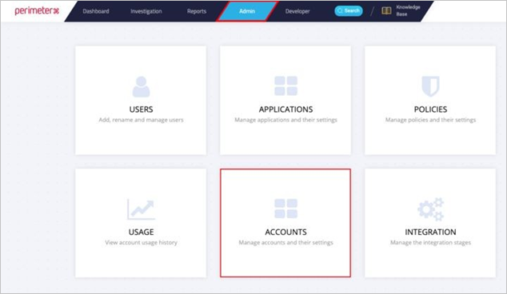
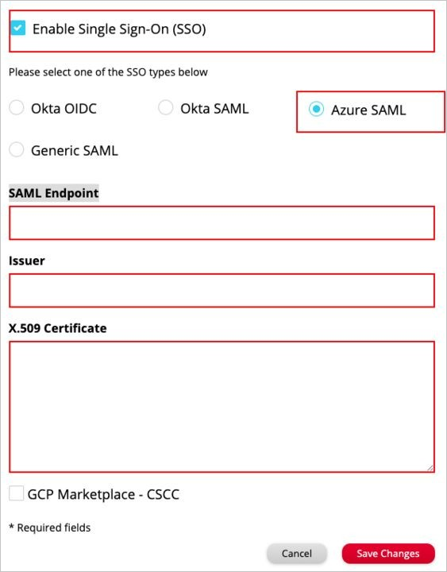

# Configure PerimeterX for Single sign-on with Microsoft Entra ID

In this article,  you learn how to integrate PerimeterX with Microsoft Entra ID. When you integrate PerimeterX with Microsoft Entra ID, you can:

* Control in Microsoft Entra ID who has access to PerimeterX.
* Enable your users to be automatically signed-in to PerimeterX with their Microsoft Entra accounts.
* Manage your accounts in one central location.

## Prerequisites
The scenario outlined in this article assumes that you already have the following prerequisites:

[!INCLUDE [common-prerequisites.md](~/identity/saas-apps/includes/common-prerequisites.md)]
* PerimeterX single sign-on (SSO) enabled subscription.

## Scenario description

In this article,  you configure and test Microsoft Entra SSO in a test environment.

* PerimeterX supports **IDP** initiated SSO

## Adding PerimeterX from the gallery

To configure the integration of PerimeterX into Microsoft Entra ID, you need to add PerimeterX from the gallery to your list of managed SaaS apps.

1. Sign in to the [Microsoft Entra admin center](https://entra.microsoft.com) as at least a [Cloud Application Administrator](~/identity/role-based-access-control/permissions-reference.md#cloud-application-administrator).
1. Browse to **Entra ID** > **Enterprise apps** > **New application**.
1. In the **Add from the gallery** section, type **PerimeterX** in the search box.
1. Select **PerimeterX** from results panel and then add the app. Wait a few seconds while the app is added to your tenant.

 Alternatively, you can also use the [Enterprise App Configuration Wizard](https://portal.office.com/AdminPortal/home?Q=Docs#/azureadappintegration). In this wizard, you can add an application to your tenant, add users/groups to the app, assign roles, and walk through the SSO configuration as well. [Learn more about Microsoft 365 wizards.](/microsoft-365/admin/misc/azure-ad-setup-guides)

## Configure and test Microsoft Entra SSO for PerimeterX

Configure and test Microsoft Entra SSO with PerimeterX using a test user called **B.Simon**. For SSO to work, you need to establish a link relationship between a Microsoft Entra user and the related user in PerimeterX.

To configure and test Microsoft Entra SSO with PerimeterX, perform the following steps:

1. **[Configure Microsoft Entra SSO](#configure-azure-ad-sso)** - to enable your users to use this feature.
    1. **Create a Microsoft Entra test user** - to test Microsoft Entra single sign-on with B.Simon.
    1. **Assign the Microsoft Entra test user** - to enable B.Simon to use Microsoft Entra single sign-on.
1. **[Configure PerimeterX SSO](#configure-perimeterx-sso)** - to configure the single sign-on settings on application side.
    1. **[Create PerimeterX test user](#create-perimeterx-test-user)** - to have a counterpart of B.Simon in PerimeterX that's linked to the Microsoft Entra representation of user.
1. **[Test SSO](#test-sso)** - to verify whether the configuration works.

## Configure Microsoft Entra SSO

Follow these steps to enable Microsoft Entra SSO.

1. Sign in to the [Microsoft Entra admin center](https://entra.microsoft.com) as at least a [Cloud Application Administrator](~/identity/role-based-access-control/permissions-reference.md#cloud-application-administrator).
1. Browse to **Entra ID** > **Enterprise apps** > **PerimeterX** > **Single sign-on**.
1. On the **Select a single sign-on method** page, select **SAML**.
1. On the **Set up single sign-on with SAML** page, select the edit/pen icon for **Basic SAML Configuration** to edit the settings.

   

1. On the **Basic SAML Configuration** section, the application is pre-configured and the necessary URLs are already pre-populated with Azure. The user needs to save the configuration by selecting the **Save** button.

1. PerimeterX application expects the SAML assertions in a specific format, which requires you to add custom attribute mappings to your SAML token attributes configuration. The following screenshot shows the list of default attributes.

	

1. In addition to above, PerimeterX application expects few more attributes to be passed back in SAML response which are shown below. These attributes are also pre populated but you can review them as per your requirements.
	
	| Name | Source Attribute|
	| ------------ | --------- |
	| firstName | user.givenname |
    | lastName  | user.surname |

1. On the **Set up single sign-on with SAML** page, in the **SAML Signing Certificate** section,  find **Certificate (Base64)** and select **Download** to download the certificate and save it on your computer.

	

1. On the **Set up PerimeterX** section, copy the appropriate URL(s) based on your requirement.

	

[!INCLUDE [create-assign-users-sso.md](~/identity/saas-apps/includes/create-assign-users-sso.md)]

## Configure PerimeterX SSO

1. Login to your PerimeterX console with Admin permissions.

1. Navigate to **Admin > ACCOUNTS** 

    

1. Select **Edit**

4.	In the Edit Account dialog, perform the following steps.

    

    a.	Check **Enable Single Sign-On (SSO)**

    b.	Select **Azure SAML**.

    c.  In the **SAML Endpoint** textbox, paste the **Login URL** value you copied the Azure portal.

    d. In the **Issuer** textbox, Paste the Microsoft Entra Identifier value copied.

    e. Open the downloaded **Certificate (Base64)** into Notepad and paste the content into the **X.509 Certificate** textbox.

    f. Select **Save Changes**

### Create PerimeterX test user

Please refer to the [PerimeterX Managing Users Guide](https://docs.perimeterx.com/pxconsole/docs/managing-users) for instructions on how to create the PerimeterX test user.

## Test SSO 

In this section, you test your Microsoft Entra single sign-on configuration with following options.

1. Select **Test this application**, and you should be automatically signed in to the PerimeterX for which you set up the SSO

1. You can use Microsoft Access Panel. When you select the PerimeterX tile in the Access Panel, you should be automatically signed in to the PerimeterX for which you set up the SSO. For more information about the Access Panel, see [Introduction to the Access Panel](https://support.microsoft.com/account-billing/sign-in-and-start-apps-from-the-my-apps-portal-2f3b1bae-0e5a-4a86-a33e-876fbd2a4510).

## Related content

Once you configure PerimeterX you can enforce session control, which protects exfiltration and infiltration of your organization’s sensitive data in real time. Session control extends from Conditional Access. [Learn how to enforce session control with Microsoft Defender for Cloud Apps](/cloud-app-security/proxy-deployment-any-app).
