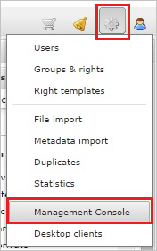
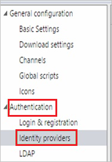
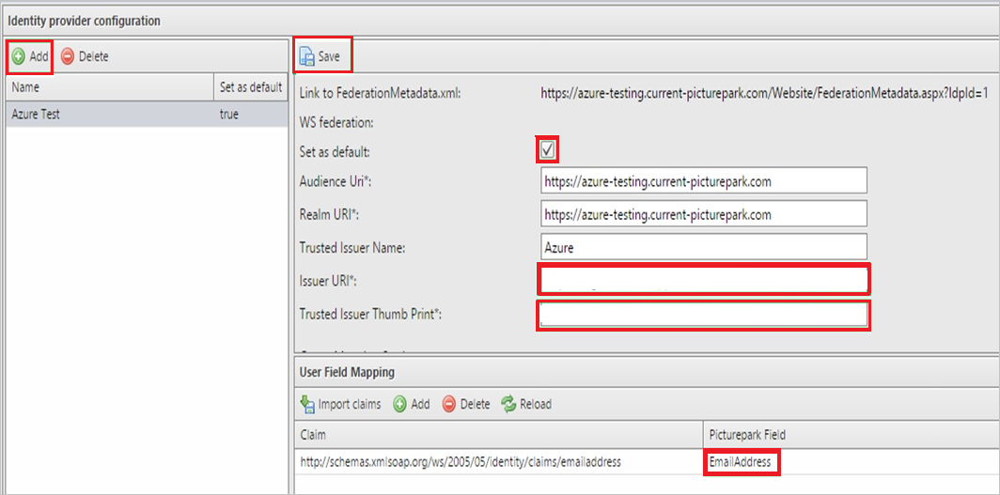

# Microsoft Entra integration with Picturepark

In this article,  you learn how to integrate Picturepark with Microsoft Entra ID. When you integrate Picturepark with Microsoft Entra ID, you can:

* Control in Microsoft Entra ID who has access to Picturepark.
* Enable your users to be automatically signed-in to Picturepark with their Microsoft Entra accounts.
* Manage your accounts in one central location.

## Prerequisites
The scenario outlined in this article assumes that you already have the following prerequisites:
[!INCLUDE [common-prerequisites.md](~/identity/saas-apps/includes/common-prerequisites.md)]
* Picturepark single sign-on enabled subscription.

## Scenario description

In this article,  you configure and test Microsoft Entra single sign-on in a test environment.

* Picturepark supports **SP** initiated SSO.

## Add Picturepark from the gallery

To configure the integration of Picturepark into Microsoft Entra ID, you need to add Picturepark from the gallery to your list of managed SaaS apps.

1. Sign in to the [Microsoft Entra admin center](https://entra.microsoft.com) as at least a [Cloud Application Administrator](~/identity/role-based-access-control/permissions-reference.md#cloud-application-administrator).
1. Browse to **Entra ID** > **Enterprise apps** > **New application**.
1. In the **Add from the gallery** section, type **Picturepark** in the search box.
1. Select **Picturepark** from results panel and then add the app. Wait a few seconds while the app is added to your tenant.

 Alternatively, you can also use the [Enterprise App Configuration Wizard](https://portal.office.com/AdminPortal/home?Q=Docs#/azureadappintegration). In this wizard, you can add an application to your tenant, add users/groups to the app, assign roles, and walk through the SSO configuration as well. [Learn more about Microsoft 365 wizards.](/microsoft-365/admin/misc/azure-ad-setup-guides)

## Configure and test Microsoft Entra SSO for Picturepark

Configure and test Microsoft Entra SSO with Picturepark using a test user called **B.Simon**. For SSO to work, you need to establish a link relationship between a Microsoft Entra user and the related user in Picturepark.

To configure and test Microsoft Entra SSO with Picturepark, perform the following steps:

1. **[Configure Microsoft Entra SSO](#configure-azure-ad-sso)** - to enable your users to use this feature.
    1. **Create a Microsoft Entra test user** - to test Microsoft Entra single sign-on with B.Simon.
    1. **Assign the Microsoft Entra test user** - to enable B.Simon to use Microsoft Entra single sign-on.
1. **[Configure Picturepark SSO](#configure-picturepark-sso)** - to configure the single sign-on settings on application side.
    1. **[Create Picturepark test user](#create-picturepark-test-user)** - to have a counterpart of B.Simon in Picturepark that's linked to the Microsoft Entra representation of user.
1. **[Test SSO](#test-sso)** - to verify whether the configuration works.

## Configure Microsoft Entra SSO

Follow these steps to enable Microsoft Entra SSO.

1. Sign in to the [Microsoft Entra admin center](https://entra.microsoft.com) as at least a [Cloud Application Administrator](~/identity/role-based-access-control/permissions-reference.md#cloud-application-administrator).
1. Browse to **Entra ID** > **Enterprise apps** > **Picturepark** > **Single sign-on**.
1. On the **Select a single sign-on method** page, select **SAML**.
1. On the **Set up single sign-on with SAML** page, select the pencil icon for **Basic SAML Configuration** to edit the settings.

   

1. On the **Basic SAML Configuration** section, perform the following steps:

    a. In the **Identifier (Entity ID)** text box, type a URL using one of the following patterns:

    | Identifier URL |
    |---|
    |`https://<COMPANY_NAME>.current-picturepark.com`|
    |`https://<COMPANY_NAME>.picturepark.com`|
    |`https://<COMPANY_NAME>.next-picturepark.com`|
    |
    
    b. In the **Sign on URL** text box, type a URL using the following pattern: 
    `https://<COMPANY_NAME>.picturepark.com`

	> [!NOTE]
	> These values aren't real. Update these values with the actual Identifier and Sign on URL. Contact [Picturepark Client support team](https://picturepark.com/company/picturepark-customer-support) to get these values. You can also refer to the patterns shown in the **Basic SAML Configuration** section.

5. In the **SAML Signing Certificate** section, select **Edit** button to open **SAML Signing Certificate** dialog.

	

6. In the **SAML Signing Certificate** section, copy the **Thumbprint** and save it on your computer.

    

7. On the **Set up Picturepark** section, copy the appropriate URL(s) as per your requirement. For **Login URL**, use the value with the following pattern: `https://login.microsoftonline.com/_my_directory_id_/wsfed`

    > [!Note]
    > *my_directory_id* is the tenant id of Microsoft Entra subscription.

	

[!INCLUDE [create-assign-users-sso.md](~/identity/saas-apps/includes/create-assign-users-sso.md)]

## Configure Picturepark SSO

1. In a different web browser window, sign into your Picturepark company site as an administrator.

2. In the toolbar on the top, select **Administrative tools**, and then select **Management Console**.
   
    

3. Select **Authentication**, and then select **Identity providers**.
   
    

4. In the **Identity provider configuration** section, perform the following steps:
   
    
   
    a. Select **Add**.
  
    b. Type a name for your configuration.
   
    c. Select **Set as default**.
   
    d. In **Issuer URI** textbox, paste the value of **Login URL**..
   
    e. In **Trusted Issuer Thumb Print** textbox, paste the value of **Thumbprint** which you have copied from **SAML Signing Certificate** section. 

5. Select **JoinDefaultUsersGroup**.

6. To set the **Emailaddress** attribute in the **Claim** textbox, type `http://schemas.xmlsoap.org/ws/2005/05/identity/claims/emailaddress` and select **Save**.

      

### Create Picturepark test user

In order to enable Microsoft Entra users to sign into Picturepark, they must be provisioned into Picturepark. In the case of Picturepark, provisioning is a manual task.

**To provision a user account, perform the following steps:**

1. Sign in to your **Picturepark** tenant.

1. In the toolbar on the top, select **Administrative tools**, and then select **Users**.
   
    

1. In the **Users overview** tab, select **New**.
   
    

1. On the **Create User** dialog, perform the following steps of a valid Microsoft Entra user you want to provision:
   
    
   
    a. In the **Email Address** textbox, type the **email address** of the user `BrittaSimon@contoso.com`.  
   
    b. In the **Password** and **Confirm Password** textboxes, type the **password** of BrittaSimon. 
   
    c. In the **First Name** textbox, type the **First Name** of the user **Britta**. 
   
    d. In the **Last Name** textbox, type the **Last Name** of the user **Simon**.
   
    e. In the **Company** textbox, type the **Company name** of the user. 
   
    f. In the **Country** textbox, select the **Country/Region** of the user.
  
    g. In the **ZIP** textbox, type the **ZIP code** of the city.
   
    h. In the **City** textbox, type the **City name** of the user.

    i. Select a **Language**.
   
    j. Select **Create**.

>[!NOTE]
>You can use any other Picturepark user account creation tools or APIs provided by Picturepark to provision Microsoft Entra user accounts.
>

## Test SSO

In this section, you test your Microsoft Entra single sign-on configuration with following options. 

* Select **Test this application**, this option redirects to Picturepark Sign-on URL where you can initiate the login flow. 

* Go to Picturepark Sign-on URL directly and initiate the login flow from there.

* You can use Microsoft My Apps. When you select the Picturepark tile in the My Apps, this option redirects to Picturepark Sign-on URL. For more information about the My Apps, see [Introduction to the My Apps](https://support.microsoft.com/account-billing/sign-in-and-start-apps-from-the-my-apps-portal-2f3b1bae-0e5a-4a86-a33e-876fbd2a4510).

## Related content

Once you configure Picturepark you can enforce session control, which protects exfiltration and infiltration of your organization’s sensitive data in real time. Session control extends from Conditional Access. [Learn how to enforce session control with Microsoft Defender for Cloud Apps](/cloud-app-security/proxy-deployment-aad).
