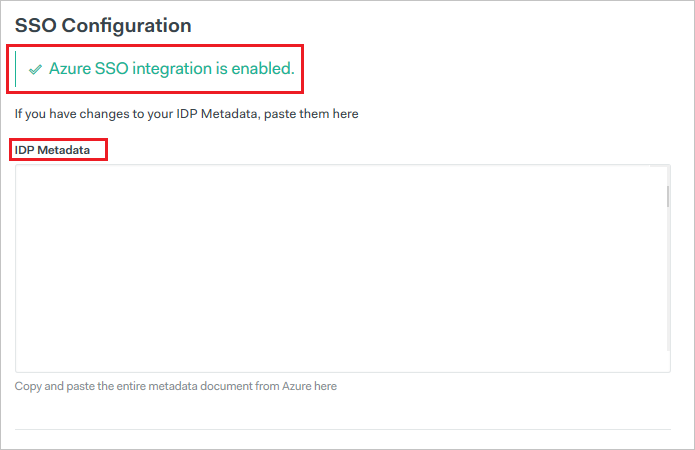
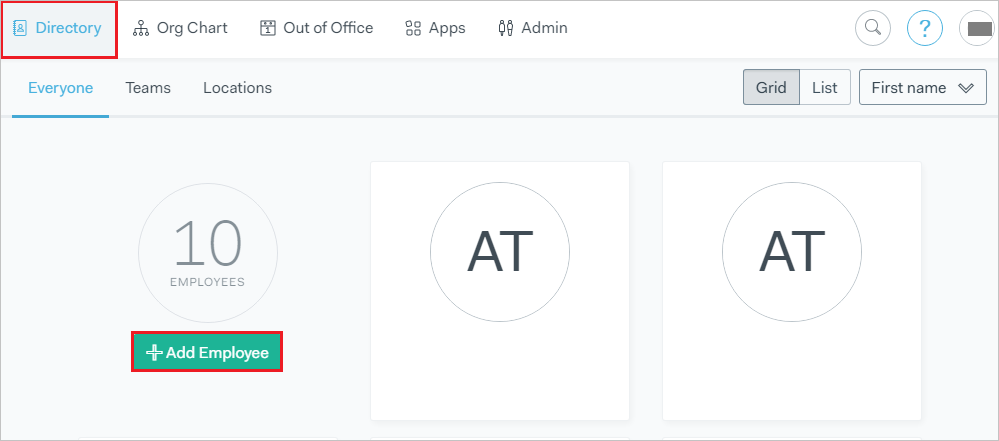
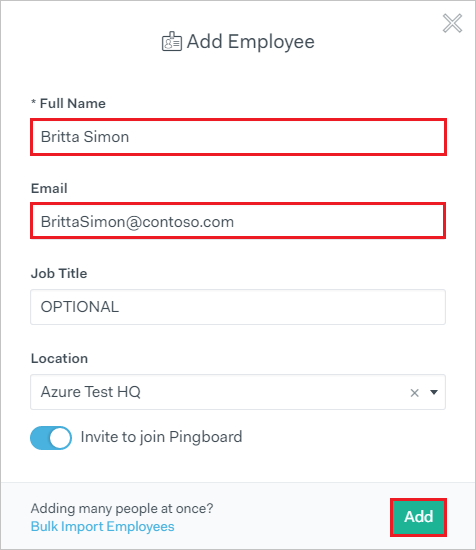
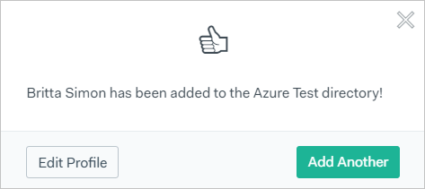

# Configure Pingboard for Single sign-on with Microsoft Entra ID

In this article,  you learn how to integrate Pingboard with Microsoft Entra ID. When you integrate Pingboard with Microsoft Entra ID, you can:

* Control in Microsoft Entra ID who has access to Pingboard.
* Enable your users to be automatically signed-in to Pingboard with their Microsoft Entra accounts.
* Manage your accounts in one central location.

## Prerequisites
The scenario outlined in this article assumes that you already have the following prerequisites:

[!INCLUDE [common-prerequisites.md](~/identity/saas-apps/includes/common-prerequisites.md)]
* Pingboard single sign-on (SSO) enabled subscription.

## Scenario description

In this article,  you configure and test Microsoft Entra single sign-on in a test environment.

* Pingboard supports **SP** and **IDP** initiated SSO.

* Pingboard supports [Automated user provisioning](./pingboard-provisioning-tutorial.md). 

> [!NOTE]
> Identifier of this application is a fixed string value so only one instance can be configured in one tenant.

## Add Pingboard from the gallery

To configure the integration of Pingboard into Microsoft Entra ID, you need to add Pingboard from the gallery to your list of managed SaaS apps.

1. Sign in to the [Microsoft Entra admin center](https://entra.microsoft.com) as at least a [Cloud Application Administrator](~/identity/role-based-access-control/permissions-reference.md#cloud-application-administrator).
1. Browse to **Entra ID** > **Enterprise apps** > **New application**.
1. In the **Add from the gallery** section, type **Pingboard** in the search box.
1. Select **Pingboard** from results panel and then add the app. Wait a few seconds while the app is added to your tenant.

 Alternatively, you can also use the [Enterprise App Configuration Wizard](https://portal.office.com/AdminPortal/home?Q=Docs#/azureadappintegration). In this wizard, you can add an application to your tenant, add users/groups to the app, assign roles, and walk through the SSO configuration as well. [Learn more about Microsoft 365 wizards.](/microsoft-365/admin/misc/azure-ad-setup-guides)

## Configure and test Microsoft Entra SSO for Pingboard

Configure and test Microsoft Entra SSO with Pingboard using a test user called **B.Simon**. For SSO to work, you need to establish a link relationship between a Microsoft Entra user and the related user in Pingboard.

To configure and test Microsoft Entra SSO with Pingboard, perform the following steps:

1. **[Configure Microsoft Entra SSO](#configure-azure-ad-sso)** - to enable your users to use this feature.
    1. **Create a Microsoft Entra test user** - to test Microsoft Entra single sign-on with B.Simon.
    1. **Assign the Microsoft Entra test user** - to enable B.Simon to use Microsoft Entra single sign-on.
1. **[Configure Pingboard SSO](#configure-pingboard-sso)** - to configure the single sign-on settings on application side.
    1. **[Create Pingboard test user](#create-pingboard-test-user)** - to have a counterpart of B.Simon in Pingboard that's linked to the Microsoft Entra representation of user.
1. **[Test SSO](#test-sso)** - to verify whether the configuration works.

## Configure Microsoft Entra SSO

Follow these steps to enable Microsoft Entra SSO.

1. Sign in to the [Microsoft Entra admin center](https://entra.microsoft.com) as at least a [Cloud Application Administrator](~/identity/role-based-access-control/permissions-reference.md#cloud-application-administrator).
1. Browse to **Entra ID** > **Enterprise apps** > **Pingboard** > **Single sign-on**.
1. On the **Select a single sign-on method** page, select **SAML**.
1. On the **Set up single sign-on with SAML** page, select the pencil icon for **Basic SAML Configuration** to edit the settings.

   

1. On the **Basic SAML Configuration** section, if you wish to configure the application in **IDP** initiated mode, perform the following steps:

    a. In the **Identifier** text box, type the URL:
    `http://app.pingboard.com/sp`

    b. In the **Reply URL** text box, type a URL using the following pattern:
    `https://<ENTITY_ID>.pingboard.com/auth/saml/consume`

5. Select **Set additional URLs** and perform the following step if you wish to configure the application in **SP** initiated mode:

    In the **Sign-on URL** text box, type a URL using the following pattern:
    `https://<SUBDOMAIN>.pingboard.com/sign_in`

	> [!NOTE]
	> These values aren't real. Update these values with the actual Reply URL and Sign-on URL. Contact [Pingboard Client support team](https://help.workleap.com/en//) to get these values. You can also refer to the patterns shown in the **Basic SAML Configuration** section.

6. On the **Set up Single Sign-On with SAML** page, in the **SAML Signing Certificate** section, select **Download** to download the **Federation Metadata XML** from the given options as per your requirement and save it on your computer.

	

7. On the **Set up Pingboard** section, copy the appropriate URL(s) as per your requirement.

	

[!INCLUDE [create-assign-users-sso.md](~/identity/saas-apps/includes/create-assign-users-sso.md)]

## Configure Pingboard SSO

1. To configure SSO on Pingboard side, open a new browser window and sign in to your Pingboard Account. You must be a Pingboard admin to set up single sign on.

2. From the top menu,, select **Apps > Integrations**

	

3. On the **Integrations** page, find the **Microsoft Entra ID** tile, and select it.

4. In the dialog that appears, select **"Configure"**.

5. On the following page, you notice that "Azure SSO Integration is enabled". Open the downloaded Metadata XML file in a notepad and paste the content in **IDP Metadata**.

	

6. The file is validated, and if everything is correct, single sign-on will now be enabled.

### Create Pingboard test user

The objective of this section is to create a user called Britta Simon in Pingboard. Pingboard supports automatic user provisioning, which is by default enabled. You can find more details [here](pingboard-provisioning-tutorial.md) on how to configure automatic user provisioning.

**If you need to create user manually, perform following steps:**

1. Sign in to your Pingboard company site as an administrator.

2. Select **“Add Employee”** button on **Directory** page.

    

3. On the **“Add Employee”** dialog page, perform the following steps:

	

	a. In the **Full Name** textbox, type the full name of user like **Britta Simon**.

	b. In the **Email** textbox, type the email address of user like **brittasimon@contoso.com**.

	c. In the **Job Title** textbox, type the job title of Britta Simon.

	d. In the **Location** dropdown, select the location  of Britta Simon.

	e. Select **Add**.

4. A confirmation screen comes up to confirm the addition of user.

	

	> [!NOTE]
    > The Microsoft Entra account holder receives an email and follows a link to confirm their account before it becomes active.

## Test SSO

In this section, you test your Microsoft Entra single sign-on configuration with following options. 

#### SP initiated:

* Select **Test this application**, this option redirects to Pingboard Sign on URL where you can initiate the login flow.  

* Go to Pingboard Sign-on URL directly and initiate the login flow from there.

#### IDP initiated:

* Select **Test this application**, and you should be automatically signed in to the Pingboard for which you set up the SSO. 

You can also use Microsoft My Apps to test the application in any mode. When you select the Pingboard tile in the My Apps, if configured in SP mode you would be redirected to the application sign on page for initiating the login flow and if configured in IDP mode, you should be automatically signed in to the Pingboard for which you set up the SSO. For more information about the My Apps, see [Introduction to the My Apps](https://support.microsoft.com/account-billing/sign-in-and-start-apps-from-the-my-apps-portal-2f3b1bae-0e5a-4a86-a33e-876fbd2a4510).

## Related content

Once you configure Pingboard you can enforce session control, which protects exfiltration and infiltration of your organization’s sensitive data in real time. Session control extends from Conditional Access. [Learn how to enforce session control with Microsoft Defender for Cloud Apps](/cloud-app-security/proxy-deployment-aad).
