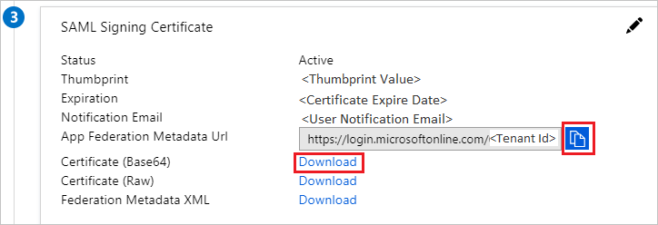
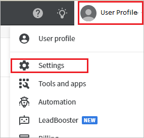

# Configure Pipedrive for Single sign-on with Microsoft Entra ID

In this article,  you learn how to integrate Pipedrive with Microsoft Entra ID. When you integrate Pipedrive with Microsoft Entra ID, you can:

* Control in Microsoft Entra ID who has access to Pipedrive.
* Enable your users to be automatically signed-in to Pipedrive with their Microsoft Entra accounts.
* Manage your accounts in one central location.

## Prerequisites
The scenario outlined in this article assumes that you already have the following prerequisites:

[!INCLUDE [common-prerequisites.md](~/identity/saas-apps/includes/common-prerequisites.md)]
* Pipedrive single sign-on (SSO) enabled subscription.

## Scenario description

In this article,  you configure and test Microsoft Entra SSO in a test environment.

* Pipedrive supports **SP and IDP** initiated SSO

## Add Pipedrive from the gallery

To configure the integration of Pipedrive into Microsoft Entra ID, you need to add Pipedrive from the gallery to your list of managed SaaS apps.

1. Sign in to the [Microsoft Entra admin center](https://entra.microsoft.com) as at least a [Cloud Application Administrator](~/identity/role-based-access-control/permissions-reference.md#cloud-application-administrator).
1. Browse to **Entra ID** > **Enterprise apps** > **New application**.
1. In the **Add from the gallery** section, type **Pipedrive** in the search box.
1. Select **Pipedrive** from results panel and then add the app. Wait a few seconds while the app is added to your tenant.

 Alternatively, you can also use the [Enterprise App Configuration Wizard](https://portal.office.com/AdminPortal/home?Q=Docs#/azureadappintegration). In this wizard, you can add an application to your tenant, add users/groups to the app, assign roles, and walk through the SSO configuration as well. [Learn more about Microsoft 365 wizards.](/microsoft-365/admin/misc/azure-ad-setup-guides)

## Configure and test Microsoft Entra SSO for Pipedrive

Configure and test Microsoft Entra SSO with Pipedrive using a test user called **B.Simon**. For SSO to work, you need to establish a link relationship between a Microsoft Entra user and the related user in Pipedrive.

To configure and test Microsoft Entra SSO with Pipedrive, perform the following steps:

1. **[Configure Microsoft Entra SSO](#configure-azure-ad-sso)** - to enable your users to use this feature.
    * **Create a Microsoft Entra test user** - to test Microsoft Entra single sign-on with B.Simon.
    * **Assign the Microsoft Entra test user** - to enable B.Simon to use Microsoft Entra single sign-on.
1. **[Configure Pipedrive SSO](#configure-pipedrive-sso)** - to configure the single sign-on settings on application side.
    * **[Create Pipedrive test user](#create-pipedrive-test-user)** - to have a counterpart of B.Simon in Pipedrive that's linked to the Microsoft Entra representation of user.
1. **[Test SSO](#test-sso)** - to verify whether the configuration works.

## Configure Microsoft Entra SSO

Follow these steps to enable Microsoft Entra SSO.

1. Sign in to the [Microsoft Entra admin center](https://entra.microsoft.com) as at least a [Cloud Application Administrator](~/identity/role-based-access-control/permissions-reference.md#cloud-application-administrator).
1. Browse to **Entra ID** > **Enterprise apps** > **Pipedrive** > **Single sign-on**.
1. On the **Select a single sign-on method** page, select **SAML**.
1. On the **Set up single sign-on with SAML** page, select the pencil icon for **Basic SAML Configuration** to edit the settings.

   

1. On the **Basic SAML Configuration** section, if you wish to configure the application in **IDP** initiated mode, enter the values for the following fields:

    a. In the **Identifier** text box, type a URL using the following pattern:
    `https://<COMPANY-NAME>.pipedrive.com/sso/auth/samlp/metadata.xml`

    b. In the **Reply URL** text box, type a URL using the following pattern:
    `https://<COMPANY-NAME>.pipedrive.com/sso/auth/samlp`

1. Select **Set additional URLs** and perform the following step if you wish to configure the application in **SP** initiated mode:

    In the **Sign-on URL** text box, type a URL using the following pattern:
    `https://<COMPANY-NAME>.pipedrive.com/`

	> [!NOTE]
	> These values aren't real. Update these values with the actual Identifier, Reply URL and Sign-on URL. Contact [Pipedrive Client support team](mailto:support@pipedrive.com) to get these values. You can also refer to the patterns shown in the **Basic SAML Configuration** section.

1. Pipedrive application expects the SAML assertions in a specific format, which requires you to add custom attribute mappings to your SAML token attributes configuration. The following screenshot shows the list of default attributes.

	

1. In addition to above, Pipedrive application expects few more attributes to be passed back in SAML response which are shown below. These attributes are also pre populated but you can review them as per your requirements.

	| Name | Source Attribute|
	| ------------ | --------- |
	| email | user.mail |

1. On the **Set up single sign-on with SAML** page, in the **SAML Signing Certificate** section,  find **Certificate (Base64)** and select **Download** to download the certificate and save it on your computer and also copy the **App Federation Metadata Url** and save it on your computer.

	

1. On the **Set up Pipedrive** section, copy the appropriate URL(s) based on your requirement.

	

[!INCLUDE [create-assign-users-sso.md](~/identity/saas-apps/includes/create-assign-users-sso.md)]

## Configure Pipedrive SSO

1. In a different browser window, sign into Pipedrive website as an administrator.

1. Select **User Profile** and select **Settings**.

    

1. Scroll down to Defender for Cloud and select **Single sign-on**.

    

1. On the **SAML configuration for pipedrive** section, perform the following steps:

    

    a. In the **Issuer** textbox, paste the **App Federation Metadata Url** value, which you copied previously.

    b. In the **Single Sign On(SSO) url** textbox, paste the **Login URL** value, which you copied previously.

    c. In the **Single Log Out(SLO) url** textbox, paste the **Logout URL** value, which you copied previously.

    d. In the **x.509 certificate** textbox, open the downloaded **Certificate (Base64)** file from Azure portal into Notepad and copy the content of it and paste into **x.509 certificate** textbox and save changes.

### Create Pipedrive test user

1. In a different browser window, sign into Pipedrive website as an administrator.

1. Scroll down to company and select **manage users**.

    

1. Select **Add users**.
    
    

1. On the **Manage users** section, perform the following steps:

    

    a. In the **Email** textbox, enter the email address of the user like `B.Simon@contoso.com`.

    b. In the **First name** textbox, enter the first name of user.

    c. In the **Last name** textbox, enter the last name of user.

    d. Select **Confirm and invite users**.

## Test SSO 

In this section, you test your Microsoft Entra single sign-on configuration with following options. 

#### SP initiated:

* Select **Test this application**, this option redirects to Pipedrive Sign on URL where you can initiate the login flow.  

* Go to Pipedrive Sign-on URL directly and initiate the login flow from there.

#### IDP initiated:

* Select **Test this application**, and you should be automatically signed in to the Pipedrive for which you set up the SSO. 

You can also use Microsoft My Apps to test the application in any mode. When you select the Pipedrive tile in the My Apps, if configured in SP mode you would be redirected to the application sign on page for initiating the login flow and if configured in IDP mode, you should be automatically signed in to the Pipedrive for which you set up the SSO. For more information about the My Apps, see [Introduction to the My Apps](https://support.microsoft.com/account-billing/sign-in-and-start-apps-from-the-my-apps-portal-2f3b1bae-0e5a-4a86-a33e-876fbd2a4510).

## Related content

Once you configure Pipedrive you can enforce session control, which protects exfiltration and infiltration of your organization’s sensitive data in real time. Session control extends from Conditional Access. [Learn how to enforce session control with Microsoft Defender for Cloud Apps](/cloud-app-security/proxy-deployment-any-app).
