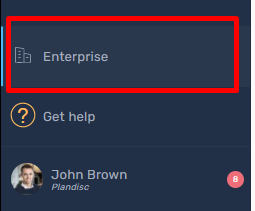
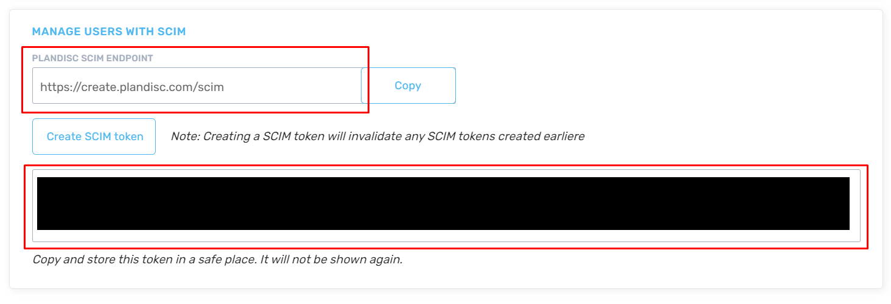

# Configure Plandisc for automatic user provisioning with Microsoft Entra ID

This article describes the steps you need to do in both Plandisc and Microsoft Entra ID to configure automatic user provisioning. When configured, Microsoft Entra ID automatically provisions and de-provisions users and groups to [Plandisc](https://plandisc.com) using the Microsoft Entra provisioning service. For important details on what this service does, how it works, and frequently asked questions, see [Automate user provisioning and deprovisioning to SaaS applications with Microsoft Entra ID](~/identity/app-provisioning/user-provisioning.md). 

## Capabilities supported
> [!div class="checklist"]
> * Create users in Plandisc
> * Remove users in Plandisc when they don't require access anymore
> * Keep user attributes synchronized between Microsoft Entra ID and Plandisc
> * [Single sign-on](~/identity/enterprise-apps/add-application-portal-setup-oidc-sso.md) to Plandisc (recommended).

## Prerequisites

The scenario outlined in this article assumes that you already have the following prerequisites:

[!INCLUDE [common-prerequisites.md](~/identity/saas-apps/includes/common-prerequisites.md)]
* A Plandisc Enterprise subscription
* A user account in Plandisc with Admin permission

## Step 1: Plan your provisioning deployment
1. Learn about [how the provisioning service works](~/identity/app-provisioning/user-provisioning.md).
1. Determine who's in [scope for provisioning](~/identity/app-provisioning/define-conditional-rules-for-provisioning-user-accounts.md).
1. Determine what data to [map between Microsoft Entra ID and Plandisc](~/identity/app-provisioning/customize-application-attributes.md). 

## Step 2: Configure Plandisc to support provisioning with Microsoft Entra ID

1. Sign in to [Plandisc](https://create.plandisc.com) and navigate to **Enterprise**

	

1. Scroll down to see section **Manage users with SCIM** section.
Here you find values to be entered in the Provisioning tab of your Plandisc application. 
The **SCIM endpoint** is inserted into the Tenant URL field.
The **SCIM token** is inserted into the Secret Token field.

   

## Step 3: Add Plandisc from the Microsoft Entra application gallery

Add Plandisc from the Microsoft Entra application gallery to start managing provisioning to Plandisc. If you have previously setup Plandisc for SSO, you can use the same application. However it's recommended you create a separate app when testing out the integration initially. Learn more about adding an application from the gallery [here](~/identity/enterprise-apps/add-application-portal.md). 

## Step 4: Define who is in scope for provisioning 

[!INCLUDE [create-assign-users-provisioning.md](~/identity/saas-apps/includes/create-assign-users-provisioning.md)]

## Step 5: Configure automatic user provisioning to Plandisc 

This section guides you through the steps to configure the Microsoft Entra provisioning service to create, update, and disable users and groups in Plandisc based on user and group assignments in Microsoft Entra ID.

### To configure automatic user provisioning for Plandisc in Microsoft Entra ID:

1. Sign in to the [Microsoft Entra admin center](https://entra.microsoft.com) as at least a [Cloud Application Administrator](~/identity/role-based-access-control/permissions-reference.md#cloud-application-administrator).
1. Browse to **Entra ID** > **Enterprise apps**

	

1. In the applications list, select **Plandisc**.

	

1. Select the **Provisioning** tab.

	

1. Select **+ New configuration**.

	

1. In the **Tenant URL** field, enter your Plandisc Tenant URL and Secret Token. Select **Test Connection** to ensure Microsoft Entra ID can connect to Plandisc. If the connection fails, ensure your Plandisc account has the required admin permissions and try again.

	

1. Select **Create** to create your configuration.

1. Select **Properties** in the **Overview** page.

1. Select the pencil to edit the properties. Enable notification emails and provide an email to receive quarantine emails. Enable accidental deletions prevention. Select **Apply** to save the changes.

	

1. Select **Attribute Mapping** in the left panel and select **users**.

1. Review the user attributes that are synchronized from Microsoft Entra ID to Plandisc in the **Attribute-Mapping** section. The attributes selected as **Matching** properties are used to match the user accounts in Plandisc for update operations. If you choose to change the [matching target attribute](~/identity/app-provisioning/customize-application-attributes.md), you need to ensure that the Plandisc API supports filtering users based on that attribute. Select the **Save** button to commit any changes.

   |Attribute|Type|Supported for filtering|Required by Plandisc|
   |---|---|---|---|
   |userName|String|&check;|&check;
   |active|Boolean||&check;
   |emails[type eq "work"].value|String||&check;
   |displayName|String||&check;
   |externalId|String||&check;
   |preferredLanguage|String|

1. To configure scoping filters, refer to the following instructions provided in the [Scoping filter article](~/identity/app-provisioning/define-conditional-rules-for-provisioning-user-accounts.md).

1. Use [on-demand provisioning](~/identity/app-provisioning/provision-on-demand.md) to validate sync with a small number of users before deploying more broadly in your organization.

1. When you're ready to provision, select **Start Provisioning** from the **Overview** page.

## Step 6: Monitor your deployment

[!INCLUDE [monitor-deployment.md](~/identity/saas-apps/includes/monitor-deployment.md)]

## More resources

* [Managing user account provisioning for Enterprise Apps](~/identity/app-provisioning/configure-automatic-user-provisioning-portal.md)
* [What is application access and single sign-on with Microsoft Entra ID?](~/identity/enterprise-apps/what-is-single-sign-on.md)

## Related content

* [Learn how to review logs and get reports on provisioning activity](~/identity/app-provisioning/check-status-user-account-provisioning.md)
