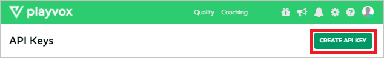
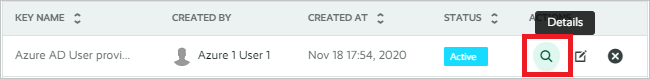
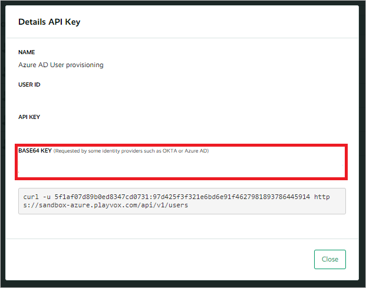

# Configure Configure Playvox for for automatic user provisioning with Microsoft Entra ID

This article describes the steps to follow in both Playvox and Microsoft Entra ID to configure automatic user provisioning. When configured, Microsoft Entra ID automatically provisions and de-provisions users or groups to [Playvox](https://www.playvox.com) by using the Microsoft Entra provisioning service. For important details on what this service does and how it works, and for frequently asked questions, see [Automate user provisioning and deprovisioning to SaaS applications with Microsoft Entra ID](~/identity/app-provisioning/user-provisioning.md).

## Capabilities supported
> [!div class="checklist"]
> * Create users in Playvox.
> * Remove users in Playvox when they don't need access anymore.
> * Keep user attributes synchronized between Microsoft Entra ID and Playvox.

## Prerequisites

The scenario in this article assumes that you already have the following prerequisites:

* [A Microsoft Entra tenant](~/identity-platform/quickstart-create-new-tenant.md).
* One of the following roles: [Application Administrator](/entra/identity/role-based-access-control/permissions-reference#application-administrator), [Cloud Application Administrator](/entra/identity/role-based-access-control/permissions-reference#cloud-application-administrator), or [Application Owner](/entra/fundamentals/users-default-permissions#owned-enterprise-applications).
* A user account in [Playvox](https://www.playvox.com) with Super Admin permissions.

## Step 1: Plan your provisioning deployment

1. Learn [how the provisioning service works](~/identity/app-provisioning/user-provisioning.md).

2. Determine who's [in scope for provisioning](~/identity/app-provisioning/define-conditional-rules-for-provisioning-user-accounts.md).

3. Determine what data to [map between Microsoft Entra ID and Playvox](~/identity/app-provisioning/customize-application-attributes.md).

## Step 2: Configure Playvox to support provisioning by using Microsoft Entra ID

1. Log in to the Playvox admin console and go to **Settings > API Keys**.

2. Select **Create API Key**.

    

3. Enter a meaningful name for the API key, and then select **Save**. After the API key is generated, select **Close**.

4. On the API key that you created, select the **Details** icon.

    

5. Copy and save the **BASE64 KEY** value. Later, in the Azure portal, you enter this value in the **Secret Token** text box in the **Provisioning** tab of your Playvox application.

    

## Step 3: Add Playvox from the Microsoft Entra application gallery

To start to manage provisioning to Playvox, add Playvox to your Microsoft Entra tenant from the application gallery. To learn more, see [Quickstart: Add an application to your Microsoft Entra tenant](~/identity/enterprise-apps/add-application-portal.md).

If you've previously set up Playvox for single sign-on (SSO), you can use the same application. However, we recommend that you create a separate app when testing the integration initially.

## Step 4: Define who is in scope for provisioning

[!INCLUDE [create-assign-users-provisioning.md](~/identity/saas-apps/includes/create-assign-users-provisioning.md)]

## Step 5: Configure automatic user provisioning to Playvox

This section guides you through the steps to configure the Microsoft Entra provisioning service to create, update, and disable users or groups, based on user or group assignments in Microsoft Entra ID.

To configure automatic user provisioning for Playvox in Microsoft Entra ID:

1. Sign in to the [Microsoft Entra admin center](https://entra.microsoft.com) as at least a [Cloud Application Administrator](~/identity/role-based-access-control/permissions-reference.md#cloud-application-administrator).
1. Browse to **Entra ID** > **Enterprise apps**.

    

1. In the applications list, search for and select **Playvox**.

    

1. Select the **Provisioning** tab.

    

1. Select **+ New configuration**.

    

1. In the **Tenant URL** field, enter your Playvox Tenant URL and Secret Token. Select **Test Connection** to ensure Microsoft Entra ID can connect to Playvox. If the connection fails, ensure your Playvox account has the required admin permissions and try again.

    

1. Select **Create** to create your configuration.

1. Select **Properties** in the **Overview** page.

1. Select the pencil to edit the properties. Enable notification emails and provide an email to receive quarantine emails. Enable accidental deletions prevention. Select **Apply** to save the changes.

    

1. Select **Attribute Mapping** in the left panel and select **users**.

9. Review the user attributes that are synchronized from Microsoft Entra ID to Playvox in the **Attribute-Mapping** section. The attributes selected as **Matching** properties are used to match the user accounts in Playvox for update operations. If you choose to change the [matching target attribute](~/identity/app-provisioning/customize-application-attributes.md), make sure that the Playvox API supports filtering users based on that attribute. Select **Save** to commit any changes.

   |Attribute|Type|Supported for filtering|
   |---|---|---|
   |userName|String|&check;|
   |active|Boolean|
   |displayName|String|
   |emails[type eq "work"].value|String|
   |name.givenName|String|
   |name.familyName|String|
   |name.formatted|String|
   |externalId|String|

1. To configure scoping filters, refer to the following instructions provided in the [Scoping filter article](~/identity/app-provisioning/define-conditional-rules-for-provisioning-user-accounts.md).

1. Use [on-demand provisioning](~/identity/app-provisioning/provision-on-demand.md) to validate sync with a small number of users before deploying more broadly in your organization.

1. When you're ready to provision, select **Start Provisioning** from the **Overview** page.

## Step 6: Monitor your deployment

[!INCLUDE [monitor-deployment.md](~/identity/saas-apps/includes/monitor-deployment.md)]

## Additional resources

* [Managing user account provisioning for enterprise apps](~/identity/app-provisioning/configure-automatic-user-provisioning-portal.md)
* [What is application access and single sign-on with Microsoft Entra ID?](~/identity/enterprise-apps/what-is-single-sign-on.md)

## Related content

* [Learn how to review logs and get reports on provisioning activity](~/identity/app-provisioning/check-status-user-account-provisioning.md)
