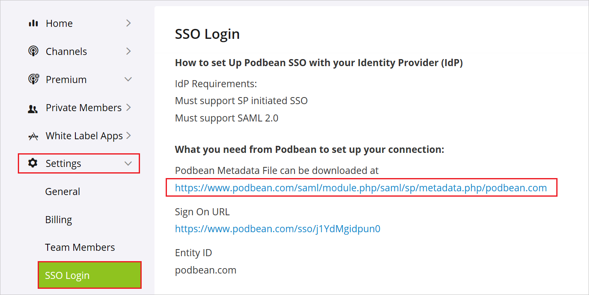
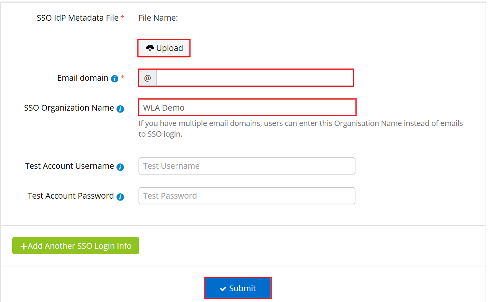

# Configure Podbean for Single sign-on with Microsoft Entra ID

In this article,  you learn how to integrate Podbean with Microsoft Entra ID. When you integrate Podbean with Microsoft Entra ID, you can:

* Control in Microsoft Entra ID who has access to Podbean.
* Enable your users to be automatically signed-in to Podbean with their Microsoft Entra accounts.
* Manage your accounts in one central location.

## Prerequisites
The scenario outlined in this article assumes that you already have the following prerequisites:

[!INCLUDE [common-prerequisites.md](~/identity/saas-apps/includes/common-prerequisites.md)]
* Podbean single sign-on (SSO) enabled subscription.

## Scenario description

In this article,  you configure and test Microsoft Entra SSO in a test environment.

* Podbean supports **SP** initiated SSO

* Podbean supports **Just In Time** user provisioning

## Adding Podbean from the gallery

To configure the integration of Podbean into Microsoft Entra ID, you need to add Podbean from the gallery to your list of managed SaaS apps.

1. Sign in to the [Microsoft Entra admin center](https://entra.microsoft.com) as at least a [Cloud Application Administrator](~/identity/role-based-access-control/permissions-reference.md#cloud-application-administrator).
1. Browse to **Entra ID** > **Enterprise apps** > **New application**.
1. In the **Add from the gallery** section, type **Podbean** in the search box.
1. Select **Podbean** from results panel and then add the app. Wait a few seconds while the app is added to your tenant.

 Alternatively, you can also use the [Enterprise App Configuration Wizard](https://portal.office.com/AdminPortal/home?Q=Docs#/azureadappintegration). In this wizard, you can add an application to your tenant, add users/groups to the app, assign roles, and walk through the SSO configuration as well. [Learn more about Microsoft 365 wizards.](/microsoft-365/admin/misc/azure-ad-setup-guides)

## Configure and test Microsoft Entra SSO for Podbean

Configure and test Microsoft Entra SSO with Podbean using a test user called **B.Simon**. For SSO to work, you need to establish a link relationship between a Microsoft Entra user and the related user in Podbean.

To configure and test Microsoft Entra SSO with Podbean, perform the following steps:

1. **[Configure Microsoft Entra SSO](#configure-azure-ad-sso)** - to enable your users to use this feature.
    1. **Create a Microsoft Entra test user** - to test Microsoft Entra single sign-on with B.Simon.
    1. **Assign the Microsoft Entra test user** - to enable B.Simon to use Microsoft Entra single sign-on.
1. **[Configure Podbean SSO](#configure-podbean-sso)** - to configure the single sign-on settings on application side.
    1. **[Create Podbean test user](#create-podbean-test-user)** - to have a counterpart of B.Simon in Podbean that's linked to the Microsoft Entra representation of user.
1. **[Test SSO](#test-sso)** - to verify whether the configuration works.

## Configure Microsoft Entra SSO

Follow these steps to enable Microsoft Entra SSO.

1. Sign in to the [Microsoft Entra admin center](https://entra.microsoft.com) as at least a [Cloud Application Administrator](~/identity/role-based-access-control/permissions-reference.md#cloud-application-administrator).
1. Browse to **Entra ID** > **Enterprise apps** > **Podbean** > **Single sign-on**.
1. On the **Select a single sign-on method** page, select **SAML**.
1. On the **Set up single sign-on with SAML** page, select the edit/pen icon for **Basic SAML Configuration** to edit the settings.

   

1. On the **Basic SAML Configuration** section, enter the values for the following fields:

    In the **Sign-on URL** text box, type a URL using the following pattern:
    `https://www.podbean.com/sso/<CUSTOM_ID>`

	> [!NOTE]
	> The value isn't real. Update the value with the actual Sign-On URL. Contact [Podbean Client support team](mailto:support@podbean.com) to get the value. You can also refer to the patterns shown in the **Basic SAML Configuration** section.

1. On the **Set up single sign-on with SAML** page, in the **SAML Signing Certificate** section,  find **Federation Metadata XML** and select **Download** to download the certificate and save it on your computer.

	

1. On the **Set up Podbean** section, copy the appropriate URL(s) based on your requirement.

	

[!INCLUDE [create-assign-users-sso.md](~/identity/saas-apps/includes/create-assign-users-sso.md)]

## Configure Podbean SSO

1. In a different web browser window, sign in to Podbean as an Administrator.

1. Select **Settings** > **SSO Login** on the left sidebar.

1. Select the URL, which is showing in the below image to download the **Podbean SSO Metadata File** and save it in your computer.

	

1. Upload the **Federation Metadata XML** file in the **SSO IDP Metadata File**.

1. Set your **Email domain**, **SSO Organization Name** and select **Submit**.

	

### Create Podbean test user

In this section, a user called Britta Simon is created in Podbean. Podbean supports just-in-time user provisioning, which is enabled by default. There's no action item for you in this section. If a user doesn't already exist in Podbean, a new one is created after authentication.

## Test SSO 

In this section, you test your Microsoft Entra single sign-on configuration with following options. 

1. Select **Test this application**, this option redirects to Podbean Sign-on URL where you can initiate the login flow. 

2. Go to Podbean Sign-on URL directly and initiate the login flow from there.

3. You can use Microsoft Access Panel. When you select the Podbean tile in the Access Panel, this option redirects to Podbean Sign-on URL. For more information about the Access Panel, see [Introduction to the Access Panel](https://support.microsoft.com/account-billing/sign-in-and-start-apps-from-the-my-apps-portal-2f3b1bae-0e5a-4a86-a33e-876fbd2a4510).

## Related content

Once you configure Podbean you can enforce session control, which protects exfiltration and infiltration of your organization’s sensitive data in real time. Session control extends from Conditional Access. [Learn how to enforce session control with Microsoft Defender for Cloud Apps](/cloud-app-security/proxy-deployment-any-app).
