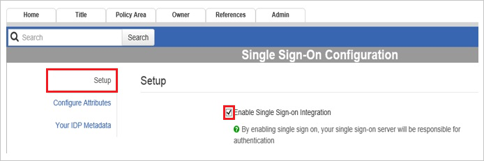

# Configure PolicyStat for Single sign-on with Microsoft Entra ID

In this article,  you learn how to integrate PolicyStat with Microsoft Entra ID. When you integrate PolicyStat with Microsoft Entra ID, you can:

* Control in Microsoft Entra ID who has access to PolicyStat.
* Enable your users to be automatically signed-in to PolicyStat with their Microsoft Entra accounts.
* Manage your accounts in one central location.

## Prerequisites
The scenario outlined in this article assumes that you already have the following prerequisites:

[!INCLUDE [common-prerequisites.md](~/identity/saas-apps/includes/common-prerequisites.md)]
* PolicyStat single sign-on (SSO) enabled subscription.

> [!NOTE]
> This integration is also available to use from Microsoft Entra US Government Cloud environment. You can find this application in the Microsoft Entra US Government Cloud Application Gallery and configure it in the same way as you do from public cloud.

## Scenario description

In this article,  you configure and test Microsoft Entra single sign-on in a test environment.

* PolicyStat supports **SP** initiated SSO.

* PolicyStat supports **Just In Time** user provisioning.

## Add PolicyStat from the gallery

To configure the integration of PolicyStat into Microsoft Entra ID, you need to add PolicyStat from the gallery to your list of managed SaaS apps.

1. Sign in to the [Microsoft Entra admin center](https://entra.microsoft.com) as at least a [Cloud Application Administrator](~/identity/role-based-access-control/permissions-reference.md#cloud-application-administrator).
1. Browse to **Entra ID** > **Enterprise apps** > **New application**.
1. In the **Add from the gallery** section, type **PolicyStat** in the search box.
1. Select **PolicyStat** from results panel and then add the app. Wait a few seconds while the app is added to your tenant.

 Alternatively, you can also use the [Enterprise App Configuration Wizard](https://portal.office.com/AdminPortal/home?Q=Docs#/azureadappintegration). In this wizard, you can add an application to your tenant, add users/groups to the app, assign roles, and walk through the SSO configuration as well. [Learn more about Microsoft 365 wizards.](/microsoft-365/admin/misc/azure-ad-setup-guides)

## Configure and test Microsoft Entra SSO for PolicyStat

Configure and test Microsoft Entra SSO with PolicyStat using a test user called **B.Simon**. For SSO to work, you need to establish a link relationship between a Microsoft Entra user and the related user in PolicyStat.

To configure and test Microsoft Entra SSO with PolicyStat, perform the following steps:

1. **[Configure Microsoft Entra SSO](#configure-azure-ad-sso)** - to enable your users to use this feature.
    1. **Create a Microsoft Entra test user** - to test Microsoft Entra single sign-on with B.Simon.
    1. **Assign the Microsoft Entra test user** - to enable B.Simon to use Microsoft Entra single sign-on.
1. **[Configure PolicyStat SSO](#configure-policystat-sso)** - to configure the single sign-on settings on application side.
    1. **[Create PolicyStat test user](#create-policystat-test-user)** - to have a counterpart of B.Simon in PolicyStat that's linked to the Microsoft Entra representation of user.
1. **[Test SSO](#test-sso)** - to verify whether the configuration works.

## Configure Microsoft Entra SSO

Follow these steps to enable Microsoft Entra SSO.

1. Sign in to the [Microsoft Entra admin center](https://entra.microsoft.com) as at least a [Cloud Application Administrator](~/identity/role-based-access-control/permissions-reference.md#cloud-application-administrator).
1. Browse to **Entra ID** > **Enterprise apps** > **PolicyStat** > **Single sign-on**.
1. On the **Select a single sign-on method** page, select **SAML**.
1. On the **Set up single sign-on with SAML** page, select the pencil icon for **Basic SAML Configuration** to edit the settings.

   

1. On the **Basic SAML Configuration** section, perform the following steps:

    1. In the **Identifier (Entity ID)** text box, type a URL using the following pattern: `https://<companyname>.policystat.com/saml2/metadata/`

    1. In the **Sign on URL** text box, type a URL using the following pattern: `https://<companyname>.policystat.com`

        >[!NOTE]
        >These values aren't real. Update these values with the actual Identifier and Sign on URL. Contact [PolicyStat Client support team](https://rldatix.com/en-apac/customer-success/community/) to get these values. You can also refer to the patterns shown in the **Basic SAML Configuration** section.

1. On the **Set up Single Sign-On with SAML** page, in the **SAML Signing Certificate** section, select **Download** to download the **Federation Metadata XML** from the given options as per your requirement and save it on your computer.

    

1. Your PolicyStat application expects the SAML assertions in a specific format, which requires you to add custom attribute mappings to your SAML token attributes configuration. The following screenshot shows the list of default attributes. Select **Edit** icon to open **User Attributes** dialog.

    

1. In addition to above, PolicyStat application expects few more attributes to be passed back in SAML response. In the **User Claims** section on the **User Attributes** dialog, perform the following steps to add SAML token attribute as shown in the below table:

    | Name | Source Attribute |
    |------------------- | -------------------- |
    | uid | ExtractMailPrefix([mail]) |

    1. Select **Add new claim** to open the **Manage user claims** dialog.
	
        

        

    1. In the **Name** textbox, type the attribute name shown for that row.

    1. Leave the **Namespace** blank.

    1. Select Source as **Transformation**.

    1. From the **Transformation** list, type the attribute value shown for that row.

    1. From the **Parameter 1** list, type the attribute value shown for that row.

    1. Select **Save**.

1. On the **Set up PolicyStat** section, copy the appropriate URL(s) as per your requirement.

    

[!INCLUDE [create-assign-users-sso.md](~/identity/saas-apps/includes/create-assign-users-sso.md)]

## Configure PolicyStat SSO

1. In a different web browser window, log in to your PolicyStat company site as an administrator.

1. Select the **Admin** tab, and then select **Single Sign-On Configuration** in left navigation pane.
   
    

1. Select **Your IDP Metadata**, and then, in the **Your IDP Metadata** section, perform the following steps:
   
    
   
    1. Open your downloaded metadata file, copy the content, and  then paste it into the **Your Identity Provider Metadata** textbox.

    1. Select **Save Changes**.

1. Select **Configure Attributes**, and then, in the **Configure Attributes** section, perform the following steps using the **CLAIM NAMES** found in your Azure configuration:
   
    1. In the **Username Attribute** textbox, type the username claim value you're passing over as the key username attribute. The default value in Azure is UPN, but if you already have accounts in PolicyStat, you need to match those username values to avoid duplicate accounts or update the existing accounts in PolicyStat to the UPN value. To update existing usernames in bulk, please contact RLDatix PolicyStat Support https://websupport.rldatix.com/support-form/.
    Default value to enter to pass the UPN **`http://schemas.xmlsoap.org/ws/2005/05/identity/claims/name`** .

    1. In the **First Name Attribute** textbox, type the First Name Attribute claim name from Azure **`http://schemas.xmlsoap.org/ws/2005/05/identity/claims/givenname`**.

    1. In the **Last Name Attribute** textbox, type the Last Name Attribute claim name from Azure **`http://schemas.xmlsoap.org/ws/2005/05/identity/claims/surname`**.

    1. In the **Email Attribute** textbox, type the Email Attribute claim name from Azure **`http://schemas.xmlsoap.org/ws/2005/05/identity/claims/emailaddress`**.

    1. Select **Save Changes**.

1. In the **Setup** section, select **Enable Single Sign-on Integration**.
   
    

### Create PolicyStat test user

In this section, a user called Britta Simon is created in PolicyStat. PolicyStat supports just-in-time user provisioning, which is enabled by default. There's no action item for you in this section. If a user doesn't already exist in PolicyStat, a new one is created after authentication.

>[!NOTE]
>You can use any other PolicyStat user account creation tools or APIs provided by PolicyStat to provision Microsoft Entra user accounts.

## Test SSO

In this section, you test your Microsoft Entra single sign-on configuration with following options. 

* Select **Test this application**, this option redirects to PolicyStat Sign-on URL where you can initiate the login flow. 

* Go to PolicyStat Sign-on URL directly and initiate the login flow from there.

* You can use Microsoft My Apps. When you select the PolicyStat tile in the My Apps, this option redirects to PolicyStat Sign-on URL. For more information, see [Microsoft Entra My Apps](/azure/active-directory/manage-apps/end-user-experiences#azure-ad-my-apps).

## Related content

Once you configure PolicyStat you can enforce session control, which protects exfiltration and infiltration of your organization’s sensitive data in real time. Session control extends from Conditional Access. [Learn how to enforce session control with Microsoft Cloud App Security](/cloud-app-security/proxy-deployment-aad).
