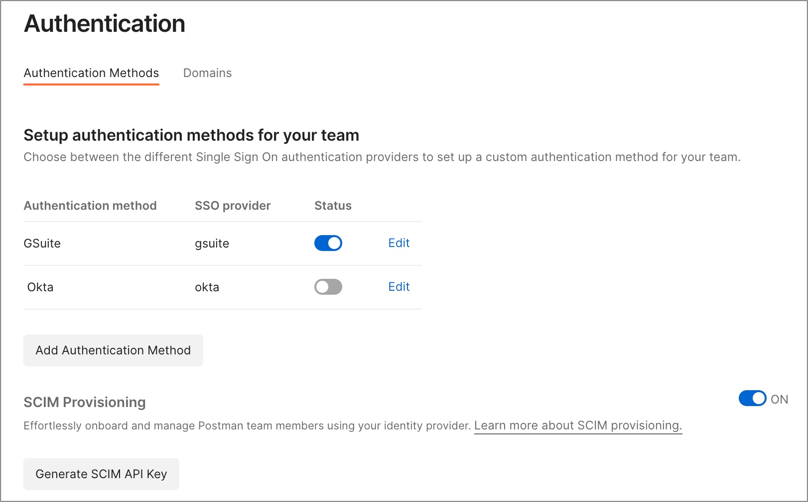
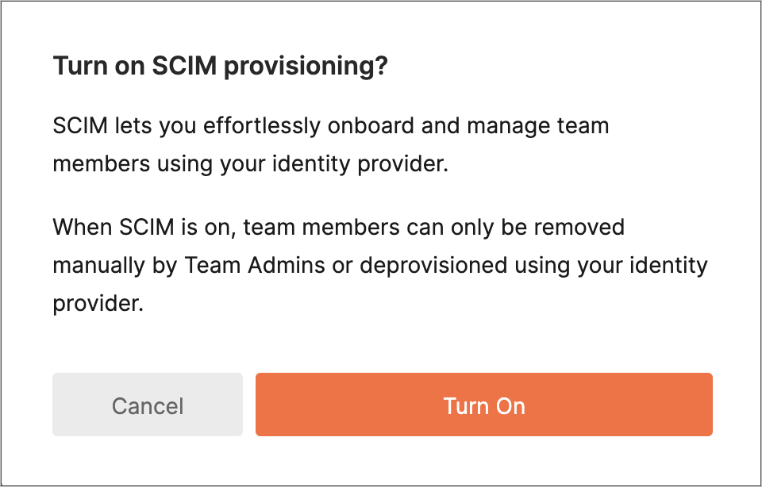
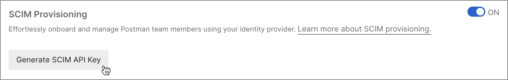

# Configure Postman for automatic user provisioning with Microsoft Entra ID

This article describes the steps you need to perform in both Postman and Microsoft Entra ID to configure automatic user provisioning. When configured, Microsoft Entra ID automatically provisions and de-provisions users and groups to [Postman](https://www.postman.com/) using the Microsoft Entra provisioning service. For important details on what this service does, how it works, and frequently asked questions, see [Automate user provisioning and deprovisioning to SaaS applications with Microsoft Entra ID](~/identity/app-provisioning/user-provisioning.md). 

## Supported capabilities
> [!div class="checklist"]
> * Create users in Postman.
> * Remove users in Postman when they don't require access anymore.
> * Keep user attributes synchronized between Microsoft Entra ID and Postman.
> * Provision groups and group memberships in Postman.
> * [Single sign-on](postman-tutorial.md) to Postman (recommended).

## Prerequisites

The scenario outlined in this article assumes that you already have the following prerequisites:

* [A Microsoft Entra tenant](~/identity-platform/quickstart-create-new-tenant.md). 
* One of the following roles: [Application Administrator](/entra/identity/role-based-access-control/permissions-reference#application-administrator), [Cloud Application Administrator](/entra/identity/role-based-access-control/permissions-reference#cloud-application-administrator), or [Application Owner](/entra/fundamentals/users-default-permissions#owned-enterprise-applications).
* A Postman tenant on the [Enterprise plan](https://www.postman.com/pricing/).
* A user account in Postman with Admin permissions.

## Step 1: Plan your provisioning deployment
1. Learn about [how the provisioning service works](~/identity/app-provisioning/user-provisioning.md).
1. Determine who's in [scope for provisioning](~/identity/app-provisioning/define-conditional-rules-for-provisioning-user-accounts.md).
1. Determine what data to [map between Microsoft Entra ID and Postman](~/identity/app-provisioning/customize-application-attributes.md).

## Step 2: Configure Postman to support provisioning with Microsoft Entra ID

Before you begin to configure Postman to support provisioning with Microsoft Entra ID, you’ll need to generate a SCIM API token within the Postman Admin Console.

   > [!NOTE]
   > You can visit the page [Postman SCIM provisioning overview](https://learning.postman.com/docs/administration/scim-provisioning/scim-provisioning-overview/#enabling-scim-in-postman), to refer **Enable SCIM provisioning in Postman** steps.

1. Navigate to [Postman Admin Console](https://go.postman.co/home) by logging in to your Postman account.
1. Once you’ve logged in, select **Team** on the right side and select **Team Settings**.
1. Select **Authentication** in the sidebar and then turn on  the **SCIM provisioning** toggle.

   

1. You receive a pop up message asking whether you want to **Turn on SCIM Provisioning**, select **Turn On** to enable SCIM provisioning.

    
1. To **Generate SCIM API Key**, perform the following steps:

   1. Select **Generate SCIM API Key** in the **SCIM provisioning** section.

      

   1. Enter name of the key and select **Generate**.
   1. Copy your new API key for later use and select **Done**.

   > [!NOTE]
   > You can revisit this page to manage your SCIM API keys. If you regenerate an existing API key, you have the option to keep the first key active while you switch over.

   > [!NOTE]
   > To continue enabling SCIM provisioning, see [Configuring SCIM with Microsoft Entra ID](https://learning.postman.com/docs/administration/scim-provisioning/configuring-scim-with-azure-ad/). For further information or help configuring SCIM, [contact Postman support](https://www.postman.com/support/).

## Step 3: Add Postman from the Microsoft Entra application gallery

Add Postman from the Microsoft Entra application gallery to start managing provisioning to Postman. If you have previously set up Postman for SSO you can use the same application. However, we recommend that you create a separate app when testing out the integration initially. Learn more about adding an application from the gallery [here](~/identity/enterprise-apps/add-application-portal.md). 

## Step 4: Define who is in scope for provisioning 

[!INCLUDE [create-assign-users-provisioning.md](~/identity/saas-apps/includes/create-assign-users-provisioning.md)]

## Step 5: Configure automatic user provisioning to Postman 

This section guides you through the steps to configure the Microsoft Entra provisioning service to create, update, and disable users and/or groups in TestApp based on user and/or group assignments in Microsoft Entra ID.

### To configure automatic user provisioning for Postman in Microsoft Entra ID:

1. Sign in to the [Microsoft Entra admin center](https://entra.microsoft.com) as at least a [Cloud Application Administrator](~/identity/role-based-access-control/permissions-reference.md#cloud-application-administrator).
1. Browse to **Entra ID** > **Enterprise apps**

	

1. In the applications list, select **Postman**.

	

1. Select the **Provisioning** tab.

	

1. Set the **Provisioning Mode** to **Automatic**.

	

1. Under the **Admin Credentials** section, input `https://api.getpostman.com/scim/v2/` as your Postman Tenant URL and your [SCIM API key](https://learning.postman.com/docs/administration/scim-provisioning/scim-provisioning-overview/#generating-scim-api-key) as the Secret Token. Select **Test Connection** to ensure Microsoft Entra ID can connect to Postman. If the connection fails, ensure your Postman account has Admin permissions and try again.

 	

1. In the **Notification Email** field, enter the email address of a person or group who should receive the provisioning error notifications and select the **Send an email notification when a failure occurs** check box.

	

1. Select **Save**.

1. Under the **Mappings** section, select **Synchronize Microsoft Entra users to Postman**.

1. Review the user attributes that are synchronized from Microsoft Entra ID to Postman in the **Attribute-Mapping** section. The attributes selected as **Matching** properties are used to match the user accounts in Postman for update operations. If you choose to change the [matching target attribute](~/identity/app-provisioning/customize-application-attributes.md), you need to ensure that the Postman API supports filtering users based on that attribute. Select the **Save** button to commit any changes.

   |Attribute|Type|Supported for filtering|Required by Postman|
   |---|---|---|---|
   |userName|String|&check;|&check;
   |active|Boolean||&check;
   |name.givenName|String||&check;
   |name.familyName|String||&check;
   
1. Under the **Mappings** section, select **Synchronize Microsoft Entra groups to Postman**.

1. Review the group attributes that are synchronized from Microsoft Entra ID to Postman in the **Attribute-Mapping** section. The attributes selected as **Matching** properties are used to match the groups in Postman for update operations. Select the **Save** button to commit any changes.

   |Attribute|Type|Supported for filtering|Required by Postman|
   |---|---|---|---|
   |displayName|String|&check;|&check;
   |members|Reference||
   
1. To configure scoping filters, refer to the following instructions provided in the [Scoping filter  article](~/identity/app-provisioning/define-conditional-rules-for-provisioning-user-accounts.md).

1. To enable the Microsoft Entra provisioning service for Postman, change the **Provisioning Status** to **On** in the **Settings** section.

	

1. Define the users and/or groups that you would like to provision to Postman by choosing the desired values in **Scope** in the **Settings** section.

	

1. When you're ready to provision, select **Save**.

	

This operation starts the initial synchronization cycle of all users and groups defined in **Scope** in the **Settings** section. The initial cycle takes longer to perform than subsequent cycles, which occur approximately every 40 minutes as long as the Microsoft Entra provisioning service is running. 

## Step 6: Monitor your deployment

[!INCLUDE [monitor-deployment.md](~/identity/saas-apps/includes/monitor-deployment.md)]

## More resources

* [Managing user account provisioning for Enterprise Apps](~/identity/app-provisioning/configure-automatic-user-provisioning-portal.md).
* [What is application access and single sign-on with Microsoft Entra ID?](~/identity/enterprise-apps/what-is-single-sign-on.md).

## Related content

* [Learn how to review logs and get reports on provisioning activity](~/identity/app-provisioning/check-status-user-account-provisioning.md).
