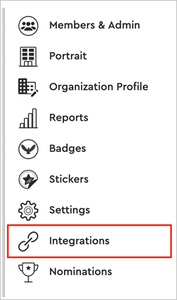
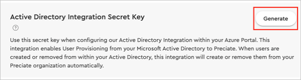

# Configure Preciate for automatic user provisioning with Microsoft Entra ID

This article describes the steps you need to perform in both Preciate and Microsoft Entra ID to configure automatic user provisioning. When configured, Microsoft Entra ID automatically provisions and deprovisions users and groups to [Preciate](https://preciate.com/) using the Microsoft Entra provisioning service. For important details on what this service does, how it works, and frequently asked questions, see [Automate user provisioning and deprovisioning to SaaS applications with Microsoft Entra ID](~/identity/app-provisioning/user-provisioning.md). 

## Capabilities supported
> [!div class="checklist"]
> * Create users in Preciate
> * Remove users in Preciate when they don't require access anymore
> * Keep user attributes synchronized between Microsoft Entra ID and Preciate

## Prerequisites

The scenario outlined in this article assumes that you already have the following prerequisites:

[!INCLUDE [common-prerequisites.md](~/identity/saas-apps/includes/common-prerequisites.md)]
* A Preciate tenant.
* A user account in Preciate with Admin permissions.

## Step 1: Plan your provisioning deployment
1. Learn about [how the provisioning service works](~/identity/app-provisioning/user-provisioning.md).
2. Determine who's in [scope for provisioning](~/identity/app-provisioning/define-conditional-rules-for-provisioning-user-accounts.md).
3. Determine what data to [map between Microsoft Entra ID and Preciate](~/identity/app-provisioning/customize-application-attributes.md). 

## Step 2: Configure Preciate to support provisioning with Microsoft Entra ID

1.  Sign in to [Preciate Admin Portal](https://preciate.com/web/admin/keys) and navigate to the **Integrations** page.

	

2.  Select the **Generate** button where it says Active Directory Integration Secret Key. 
 
	

3.  A new **Secret Key** appears. Copy and save the **Secret Key**. Also make a note that Tenant URL is `https://preciate.com/api/v1/scim`. These values are entered in the **Secret Token** and **Tenant URL** field in the Provisioning tab of your Preciate's application.
 
> [!NOTE]
>Every time you select the Generate button a new secret key is created. This immediately invalidates the current one. If an integration is already actively using the current key, generating the new one causes the integration to stop functioning until the Secret Token is updated in Preciate's application in the Azure portal.

## Step 3: Add Preciate from the Microsoft Entra application gallery

Add Preciate from the Microsoft Entra application gallery to start managing provisioning to Preciate. If you have previously setup Preciate for Single sign-on (SSO), you can use the same application. However, we recommend that you create a separate app when testing out the integration initially. Learn more about adding an application from the [gallery](~/identity/enterprise-apps/add-application-portal.md). 

## Step 4: Define who is in scope for provisioning 

[!INCLUDE [create-assign-users-provisioning.md](~/identity/saas-apps/includes/create-assign-users-provisioning.md)]

## Step 5: Configure automatic user provisioning to Preciate 

This section guides you through the steps to configure the Microsoft Entra provisioning service to create, update, and disable users and/or groups in TestApp based on user and/or group assignments in Microsoft Entra ID.

### To configure automatic user provisioning for Preciate in Microsoft Entra ID:

1. Sign in to the [Microsoft Entra admin center](https://entra.microsoft.com) as at least a [Cloud Application Administrator](~/identity/role-based-access-control/permissions-reference.md#cloud-application-administrator).
1. Browse to **Entra ID** > **Enterprise apps**

	

1. In the applications list, select **Preciate**.

	

3. Select the **Provisioning** tab.

	

4. Set the **Provisioning Mode** to **Automatic**.

	

5. Under the **Admin Credentials** section, input your Preciate Tenant URL and Secret Token. Select **Test Connection** to ensure Microsoft Entra ID can connect to Preciate. If the connection fails, ensure your Preciate account has Admin permissions and try again.

 	

6. In the **Notification Email** field, enter the email address of a person or group who should receive the provisioning error notifications and select the **Send an email notification when a failure occurs** check box.

	

7. Select **Save**.

8. Under the **Mappings** section, select **Synchronize Microsoft Entra users to Preciate**.

9. Review the user attributes that are synchronized from Microsoft Entra ID to Preciate in the **Attribute-Mapping** section. The attributes selected as **Matching** properties are used to match the user accounts in Preciate for update operations. If you choose to change the [matching target attribute](~/identity/app-provisioning/customize-application-attributes.md), you need to ensure that the Preciate API supports filtering users based on that attribute. Select the **Save** button to commit any changes.

   |Attribute|Type|Supported for filtering|
   |---|---|---|
   |userName|String|&check;|
   |active|Boolean|
   |displayName|String|
   |title|String|
   |name.givenName|String|
   |name.familyName|String|
   |name.formatted|String|
   |externalId|String|
   |urn:ietf:params:scim:schemas:extension:enterprise:2.0:User:department|String|

10. To configure scoping filters, refer to the following instructions provided in the [Scoping filter  article](~/identity/app-provisioning/define-conditional-rules-for-provisioning-user-accounts.md).

11. To enable the Microsoft Entra provisioning service for Preciate, change the **Provisioning Status** to **On** in the **Settings** section.

	

12. Define the users and/or groups that you would like to provision to Preciate by choosing the desired values in **Scope** in the **Settings** section.

	

13. When you're ready to provision, select **Save**.

	

This operation starts the initial synchronization cycle of all users and groups defined in **Scope** in the **Settings** section. The initial cycle takes longer to perform than subsequent cycles, which occur approximately every 40 minutes as long as the Microsoft Entra provisioning service is running. 

## Step 6: Monitor your deployment

[!INCLUDE [monitor-deployment.md](~/identity/saas-apps/includes/monitor-deployment.md)]

## More resources

* [Managing user account provisioning for Enterprise Apps](~/identity/app-provisioning/configure-automatic-user-provisioning-portal.md)
* [What is application access and single sign-on with Microsoft Entra ID?](~/identity/enterprise-apps/what-is-single-sign-on.md)

## Related content

* [Learn how to review logs and get reports on provisioning activity](~/identity/app-provisioning/check-status-user-account-provisioning.md)
