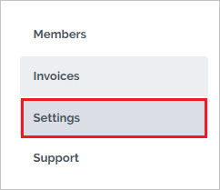
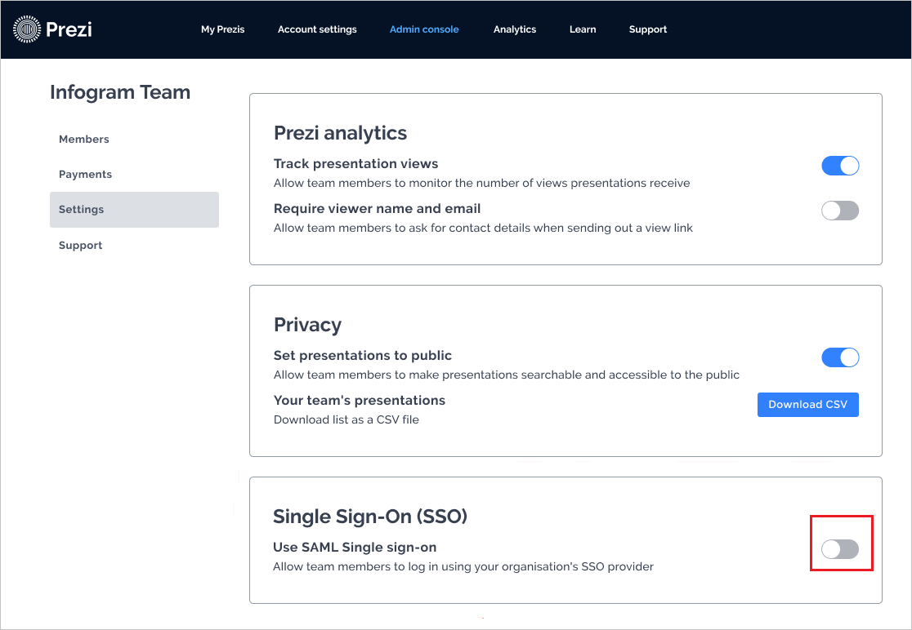
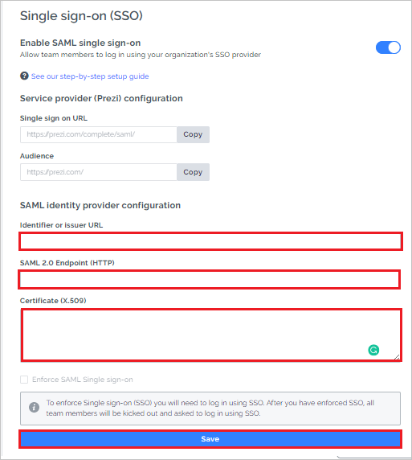

# Configure Prezi for Single sign-on with Microsoft Entra ID

In this article,  you learn how to integrate Prezi with Microsoft Entra ID. When you integrate Prezi with Microsoft Entra ID, you can:

* Control who has access to Prezi in Microsoft Entra ID.
* Enable your users to be automatically signed in to Prezi with their Microsoft Entra accounts.
* Manage your accounts.

## Prerequisites
The scenario outlined in this article assumes that you already have the following prerequisites:

[!INCLUDE [common-prerequisites.md](~/identity/saas-apps/includes/common-prerequisites.md)]
* A Prezi subscription enabled with single sign-on (SSO).

## Scenario description

In this article,  you configure and test Microsoft Entra SSO in a test environment.

* Prezi supports SP and IDP initiated SSO.
* Prezi supports just-in-time user provisioning.

> [!NOTE]
> Identifier of this application is a fixed string value so only one instance can be configured in one tenant.

## Add Prezi from the gallery

To configure the integration of Prezi into Microsoft Entra ID, you need to add Prezi from the gallery to your list of managed SaaS apps.

1. Sign in to the [Microsoft Entra admin center](https://entra.microsoft.com) as at least a [Cloud Application Administrator](~/identity/role-based-access-control/permissions-reference.md#cloud-application-administrator).
1. Browse to **Entra ID** > **Enterprise apps** > **New application**.
1. In the **Add from the gallery** section, enter **Prezi** in the search box.
1. Select **Prezi** from the results panel, and then add the app. Wait a few seconds while the app is added to your tenant.

 Alternatively, you can also use the [Enterprise App Configuration Wizard](https://portal.office.com/AdminPortal/home?Q=Docs#/azureadappintegration). In this wizard, you can add an application to your tenant, add users/groups to the app, assign roles, and walk through the SSO configuration as well. [Learn more about Microsoft 365 wizards.](/microsoft-365/admin/misc/azure-ad-setup-guides)

## Configure and test Microsoft Entra SSO for Prezi

Configure and test Microsoft Entra SSO with Prezi by using a test user called B.Simon. For SSO to work, you establish a link relationship between a Microsoft Entra user and the related user in Prezi.

To configure and test Microsoft Entra SSO with Prezi, perform the following steps:

1. [Configure Microsoft Entra SSO](#configure-azure-ad-sso) to enable your users to use this feature.
    1. Create a Microsoft Entra test user to test Microsoft Entra SSO with B.Simon.
    1. Assign the Microsoft Entra test user to enable B.Simon to use Microsoft Entra SSO.
1. [Configure Prezi SSO](#configure-prezi-sso) to configure the SSO settings on the application side.
    1. [Create a Prezi test user](#create-a-prezi-test-user) to have a counterpart of B.Simon in Prezi that's linked to the Microsoft Entra representation of the user.
1. [Test SSO](#test-sso) to verify whether the configuration works.

## Configure Microsoft Entra SSO

To enable Microsoft Entra SSO in the Azure portal:

1. Sign in to the [Microsoft Entra admin center](https://entra.microsoft.com) as at least a [Cloud Application Administrator](~/identity/role-based-access-control/permissions-reference.md#cloud-application-administrator).
1. Browse to **Entra ID** > **Enterprise apps** > **Prezi** application integration page, find the **Manage** section and select **Single sign-on**.
1. On the **Select a single sign-on method** page, select **SAML**.
1. On the **Set up Single Sign-On with SAML** page, select the pencil icon to edit the settings on **Basic SAML Configuration**.

   

1. In the **Basic SAML Configuration** section, the user doesn't have to do any step because the app is already preintegrated with Azure.

1. Select **Set additional URLs**, and do the following step if you want to configure the application in **SP**-initiated mode:

    In the **Sign-on URL** box, type the URL: 
    `https://prezi.com/login/sso/`.

1. Select **Save**.

1. The Prezi application expects the SAML assertions in a specific format, which requires you to add custom attribute mappings to your SAML token attributes configuration. The following screenshot shows the list of default attributes.

	

1. The Prezi application also expects a few more attributes to be passed back in SAML response, as shown here. These attributes are also prepopulated, but you can review them based on your requirements.
	
	| Name | Source attribute|
	| ---------------| --------------- |
	| given_name | user.givenname |
	| family_name | user.surname |

1. On the **Set up Single Sign-On with SAML** page, in the **SAML Signing Certificate** section, find **Certificate (Base64)**. Select **Download** to download the certificate and save it on your computer.

	

1. In the **Set up Prezi** section, copy the appropriate URLs based on your requirements.

	

[!INCLUDE [create-assign-users-sso.md](~/identity/saas-apps/includes/create-assign-users-sso.md)]

## Configure Prezi SSO

1. In a different web browser window, sign in to Prezi with your team account and go to the [Admin Console](https://prezi.com/organizations/manage).

1. From the **Admin Console**, select the **Settings** tab.

    

1. Go to the **Single Sign-On (SSO)** section, and turn on the toggle to enable SSO.
    
    

1. In the **Single sign-on (SSO)** section, follow these steps:

    

    1. In the **Identifier or Issuer URL** box, paste the **Microsoft Entra Identifier** value, which you copied.

    1. In the **SAML 2.0 Endpoint (HTTP)** box, paste the **Login URL** value, which you copied.

    1. Open the downloaded **Certificate (Base64)** into Notepad. Copy the contents of the certificate, and paste the contents into the **Certificate (X.509)** box.

    1. Select **Save**.

### Create a Prezi test user

In this section, a user called Britta Simon is created in Prezi. Prezi supports just-in-time user provisioning, which is enabled by default. There's no action item for you in this section. If a user doesn't already exist in Prezi, a new one is created after authentication.

## Test SSO 

In this section, you test your Microsoft Entra single sign-on configuration with following options. 

#### SP initiated:

* Select **Test this application**, this option redirects to Prezi Sign on URL where you can initiate the login flow.  

* Go to Prezi Sign-on URL directly and initiate the login flow from there.

#### IDP initiated:

* Select **Test this application**, and you should be automatically signed in to the Prezi for which you set up the SSO. 

You can also use Microsoft My Apps to test the application in any mode. When you select the Prezi tile in the My Apps, if configured in SP mode you would be redirected to the application sign on page for initiating the login flow and if configured in IDP mode, you should be automatically signed in to the Prezi for which you set up the SSO. For more information about the My Apps, see [Introduction to the My Apps](https://support.microsoft.com/account-billing/sign-in-and-start-apps-from-the-my-apps-portal-2f3b1bae-0e5a-4a86-a33e-876fbd2a4510).

## Related content

Once you configure Prezi you can enforce session control, which protects exfiltration and infiltration of your organization’s sensitive data in real time. Session control extends from Conditional Access. [Learn how to enforce session control with Microsoft Defender for Cloud Apps](/cloud-app-security/proxy-deployment-aad).
