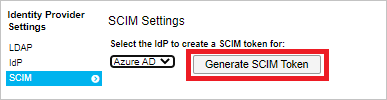

# Configure PrinterLogic SaaS for automatic user provisioning with Microsoft Entra ID

This article describes the steps you need to perform in both PrinterLogic SaaS and Microsoft Entra ID to configure automatic user provisioning. When configured, Microsoft Entra ID automatically provisions and de-provisions users and groups to [PrinterLogic SaaS](https://www.printerlogic.com/) using the Microsoft Entra provisioning service. For important details on what this service does, how it works, and frequently asked questions, see [Automate user provisioning and deprovisioning to SaaS applications with Microsoft Entra ID](~/identity/app-provisioning/user-provisioning.md). 

## Capabilities supported
> [!div class="checklist"]
> * Create users in PrinterLogic SaaS
> * Remove users in PrinterLogic SaaS when they don't require access anymore
> * Keep user attributes synchronized between Microsoft Entra ID and PrinterLogic SaaS
> * Provision groups and group memberships in PrinterLogic SaaS
> * [Single sign-on](./printerlogic-saas-tutorial.md) to PrinterLogic SaaS (recommended)

## Prerequisites

The scenario outlined in this article assumes that you already have the following prerequisites:

* [!INCLUDE [common-prerequisites.md](~/identity/saas-apps/includes/common-prerequisites.md)]
* A [PrinterLogic SaaS](https://www.printerlogic.com/) tenant.

## Step 1: Plan your provisioning deployment
1. Learn about [how the provisioning service works](~/identity/app-provisioning/user-provisioning.md).
1. Determine who's in [scope for provisioning](~/identity/app-provisioning/define-conditional-rules-for-provisioning-user-accounts.md).
1. Determine what data to [map between Microsoft Entra ID and PrinterLogic SaaS](~/identity/app-provisioning/customize-application-attributes.md). 

## Step 2: Configure PrinterLogic SaaS to support provisioning with Microsoft Entra ID

1. In PrinterLogic, Navigate to **Tools > Settings > General**.

1. Scroll to the **Identity Provider Settings** section.

1. Select the **SCIM** option.

1. Ensure that **Microsoft Entra ID** is selected in the drop-down menu.

1. Select **Generate SCIM Token**.

      

1. Copy and save the **Bearer token**. This value is entered in the **Secret Token** field in the Provisioning tab of your PrinterLogic SaaS application.

1. Enter https://gw.app.printercloud.com/{instance_name}/scim/v2 in the **Tenant URL** field in the Provisioning tab of your PrinterLogic SaaS application.

## Step 3: Add PrinterLogic SaaS from the Microsoft Entra application gallery

Add PrinterLogic SaaS from the Microsoft Entra application gallery to start managing provisioning to PrinterLogic SaaS. If you have previously setup PrinterLogic SaaS for SSO, you can use the same application. However, we recommend that you create a separate app when testing out the integration initially. Learn more about adding an application from the gallery [here](~/identity/enterprise-apps/add-application-portal.md). 

## Step 4: Define who is in scope for provisioning 

[!INCLUDE [create-assign-users-provisioning.md](~/identity/saas-apps/includes/create-assign-users-provisioning.md)]

## Step 5: Configure automatic user provisioning to PrinterLogic SaaS 

This section guides you through the steps to configure the Microsoft Entra provisioning service to create, update, and disable users and/or groups in TestApp based on user and/or group assignments in Microsoft Entra ID.

### To configure automatic user provisioning for PrinterLogic SaaS in Microsoft Entra ID:

1. Sign in to the [Microsoft Entra admin center](https://entra.microsoft.com) as at least a [Cloud Application Administrator](~/identity/role-based-access-control/permissions-reference.md#cloud-application-administrator).
1. Browse to **Entra ID** > **Enterprise apps**

	

1. In the applications list, select **PrinterLogic SaaS**.

	

1. Select the **Provisioning** tab.

	

1. Select **+ New configuration**.

	

1. In the **Tenant URL** field, enter your PrinterLogic SaaS Tenant URL and Secret Token. Select **Test Connection** to ensure Microsoft Entra ID can connect to PrinterLogic SaaS. If the connection fails, ensure your PrinterLogic SaaS account has the required admin permissions and try again.

	

1. Select **Create** to create your configuration.

1. Select **Properties** on the **Overview** page.

1. In the **Notification Email** field, enter the email address of a person who should receive the provisioning error notifications and select the **Send an email notification when a failure occurs** check box.

   

1. Select **Attribute Mapping** in the left panel and select **users**.

1. Review the user attributes that are synchronized from Microsoft Entra ID to PrinterLogic SaaS in the **Attribute-Mapping** section. The attributes selected as **Matching** properties are used to match the user accounts in PrinterLogic SaaS for update operations. If you choose to change the [matching target attribute](~/identity/app-provisioning/customize-application-attributes.md), you need to ensure that the PrinterLogic SaaS API supports filtering users based on that attribute. Select the **Save** button to commit any changes.

   |Attribute|Type|Supported for Filtering|
   |---|---|---|
   |userName|String|&check;|
   |active|Boolean|
   |title|String|
   |name.givenName|String|
   |name.familyName|String|
   |emails[type eq "work"].value|String|
   |externalId|String|
   |urn:ietf:params:scim:schemas:extension:enterprise:2.0:User:department|String|
   |urn:ietf:params:scim:schemas:extension:enterprise:2.0:User:manager|String|
   |urn:ietf:params:scim:schemas:extension:printercloud:2.0:User:authPin|String|
   |urn:ietf:params:scim:schemas:extension:printercloud:2.0:User:authPinUser|String|
   |urn:ietf:params:scim:schemas:extension:printercloud:2.0:User:badgeId|String|

1. Review the group attributes that are synchronized from Microsoft Entra ID to PrinterLogic SaaS in the **Attribute-Mapping** section. The attributes selected as **Matching** properties are used to match the groups in PrinterLogic SaaS for update operations. Select the **Save** button to commit any changes.

      |Attribute|Type|Supported for Filtering|
      |---|---|---|
      |displayName|String|&check;|
      |externalId|String|
      |members|Reference|

1. To configure scoping filters, refer to the instructions provided in the [Scoping filter article](~/identity/app-provisioning/define-conditional-rules-for-provisioning-user-accounts.md).

1. Use [on-demand provisioning](~/identity/app-provisioning/provision-on-demand.md) to validate sync with a small number of users before deploying more broadly in your organization.

1. When you're ready to provision, select **Start Provisioning** from the **Overview** page.

## Step 6: Monitor your deployment

[!INCLUDE [monitor-deployment.md](~/identity/saas-apps/includes/monitor-deployment.md)]

## Additional resources

* [Managing user account provisioning for Enterprise Apps](~/identity/app-provisioning/configure-automatic-user-provisioning-portal.md)
* [What is application access and single sign-on with Microsoft Entra ID?](~/identity/enterprise-apps/what-is-single-sign-on.md)

## Related content

* [Learn how to review logs and get reports on provisioning activity](~/identity/app-provisioning/check-status-user-account-provisioning.md)
