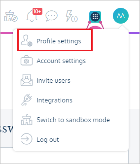
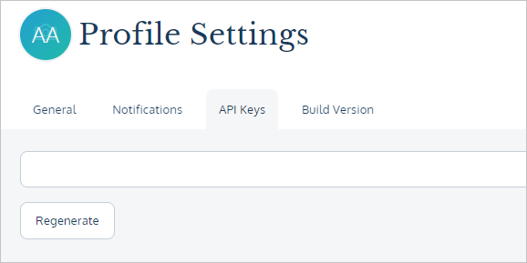

# Configure ProdPad for automatic user provisioning with Microsoft Entra ID

This article describes the steps you need to perform in both ProdPad and Microsoft Entra ID to configure automatic user provisioning. When configured, Microsoft Entra ID automatically provisions and de-provisions users and groups to [ProdPad](https://www.prodpad.com/) using the Microsoft Entra provisioning service. For important details on what this service does, how it works, and frequently asked questions, see [Automate user provisioning and deprovisioning to SaaS applications with Microsoft Entra ID](~/identity/app-provisioning/user-provisioning.md). 

## Capabilities supported
> [!div class="checklist"]
> * Create users in ProdPad.
> * Remove users in ProdPad when they don't require access anymore.
> * Keep user attributes synchronized between Microsoft Entra ID and ProdPad.
> * [Single sign-on](prodpad-tutorial.md) to ProdPad.

## Prerequisites

The scenario outlined in this article assumes that you already have the following prerequisites:

* [A Microsoft Entra tenant](~/identity-platform/quickstart-create-new-tenant.md). 
* One of the following roles: [Application Administrator](/entra/identity/role-based-access-control/permissions-reference#application-administrator), [Cloud Application Administrator](/entra/identity/role-based-access-control/permissions-reference#cloud-application-administrator), or [Application Owner](/entra/fundamentals/users-default-permissions#owned-enterprise-applications). 
* A user account in ProdPad with Admin permissions.

## Step 1: Plan your provisioning deployment
1. Learn about [how the provisioning service works](~/identity/app-provisioning/user-provisioning.md).
1. Determine who's in [scope for provisioning](~/identity/app-provisioning/define-conditional-rules-for-provisioning-user-accounts.md).
1. Determine what data to [map between Microsoft Entra ID and ProdPad](~/identity/app-provisioning/customize-application-attributes.md). 

## Step 2: Configure ProdPad to support provisioning with Microsoft Entra ID

1. Login to [ProdPad admin console](https://app.prodpad.com/).
1. Navigate to **Profile Settings**.

	

1. Navigate to **API key** to get your API key. If you need to regenerate your API key, select the regenerate key. Please note this will also make the previous API key as invalid.

	

1. Copy and save the **API key**. This value is entered in the **Secret Token** field in the Provisioning tab of your ProdPad application.

## Step 3: Add ProdPad from the Microsoft Entra application gallery

Add ProdPad from the Microsoft Entra application gallery to start managing provisioning to ProdPad. If you have previously setup [ProdPad for SSO](prodpad-tutorial.md), you can use the same application. However, we recommend that you create a separate app when testing out the integration initially. Learn more about adding an application from the gallery [here](~/identity/enterprise-apps/add-application-portal.md). 

## Step 4: Define who is in scope for provisioning 

[!INCLUDE [create-assign-users-provisioning.md](~/identity/saas-apps/includes/create-assign-users-provisioning.md)]

## Step 5: Configure automatic user provisioning to ProdPad 

This section guides you through the steps to configure the Microsoft Entra provisioning service to create, update, and disable users and/or groups in ProdPad based on user and/or group assignments in Microsoft Entra ID.

### To configure automatic user provisioning for ProdPad in Microsoft Entra ID:

1. Sign in to the [Microsoft Entra admin center](https://entra.microsoft.com) as at least a [Cloud Application Administrator](~/identity/role-based-access-control/permissions-reference.md#cloud-application-administrator).
1. Browse to **Entra ID** > **Enterprise apps**

	

1. In the applications list, select **ProdPad**.

	

1. Select the **Provisioning** tab.

	

1. Select **+ New configuration**.

	

1. In the **Tenant URL** field, enter your ProdPad Tenant URL and Secret Token. Select **Test Connection** to ensure Microsoft Entra ID can connect to ProdPad. If the connection fails, ensure your ProdPad account has the required admin permissions and try again.

	

1. Select **Create** to create your configuration.

1. Select **Properties** on the **Overview** page.

1. In the **Notification Email** field, enter the email address of a person who should receive the provisioning error notifications and select the **Send an email notification when a failure occurs** check box.

   

1. Select **Attribute Mapping** in the left panel and select **users**.

1. Review the user attributes that are synchronized from Microsoft Entra ID to ProdPad in the **Attribute-Mapping** section. The attributes selected as **Matching** properties are used to match the user accounts in ProdPad for update operations. If you choose to change the [matching target attribute](~/identity/app-provisioning/customize-application-attributes.md), you need to ensure that the ProdPad API supports filtering users based on that attribute. Select the **Save** button to commit any changes.

   |Attribute|Type|Supported for filtering|Required by ProdPad|
   |---|---|---|---|
   |userName|String|&check;|&check;
   |emails[type eq "work"].value|String||&check; 
   |active|Boolean||; 
   |name.givenName|String||; 
   |name.familyName|String||; 

1. To configure scoping filters, refer to the instructions provided in the [Scoping filter article](~/identity/app-provisioning/define-conditional-rules-for-provisioning-user-accounts.md).

1. Use [on-demand provisioning](~/identity/app-provisioning/provision-on-demand.md) to validate sync with a small number of users before deploying more broadly in your organization.

1. When you're ready to provision, select **Start Provisioning** from the **Overview** page.	

## Step 6: Monitor your deployment

[!INCLUDE [monitor-deployment.md](~/identity/saas-apps/includes/monitor-deployment.md)]

## Troubleshooting Tips
Reach out to [ProdPad support team](mailto:help@prodpad.com) in case of any issues.

## More resources

* [Managing user account provisioning for Enterprise Apps](~/identity/app-provisioning/configure-automatic-user-provisioning-portal.md)
* [What is application access and single sign-on with Microsoft Entra ID?](~/identity/enterprise-apps/what-is-single-sign-on.md)

## Related content

* [Learn how to review logs and get reports on provisioning activity](~/identity/app-provisioning/check-status-user-account-provisioning.md)
