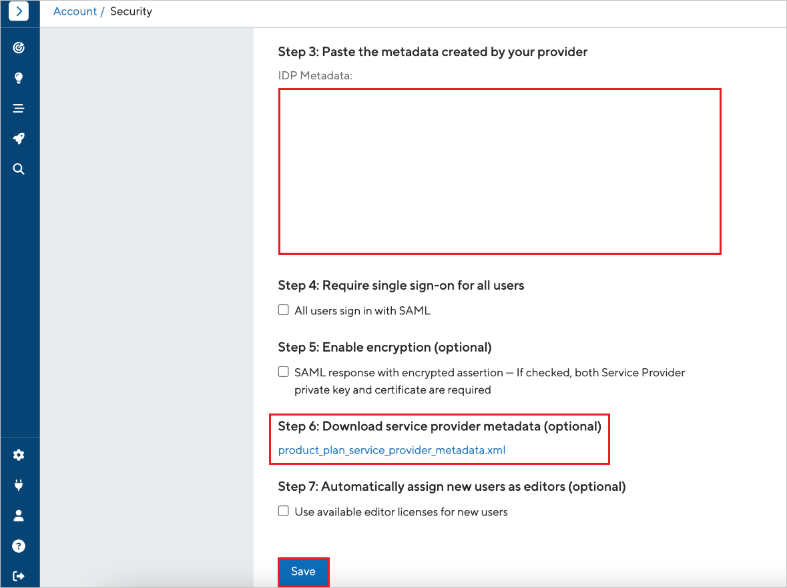

# Configure ProductPlan for Single sign-on with Microsoft Entra ID

In this article,  you learn how to integrate ProductPlan with Microsoft Entra ID. When you integrate ProductPlan with Microsoft Entra ID, you can:

* Control in Microsoft Entra ID who has access to ProductPlan.
* Enable your users to be automatically signed-in to ProductPlan with their Microsoft Entra accounts.
* Manage your accounts in one central location.

## Prerequisites
The scenario outlined in this article assumes that you already have the following prerequisites:

[!INCLUDE [common-prerequisites.md](~/identity/saas-apps/includes/common-prerequisites.md)]
* ProductPlan single sign-on (SSO) enabled subscription.

## Scenario description

In this article,  you configure and test Microsoft Entra SSO in a test environment.

* ProductPlan supports only **SP and IDP** initiated SSO.
* ProductPlan supports **Just In Time** user provisioning.

## Add ProductPlan from the gallery

To configure the integration of ProductPlan into Microsoft Entra ID, you need to add ProductPlan from the gallery to your list of managed SaaS apps.

1. Sign in to the [Microsoft Entra admin center](https://entra.microsoft.com) as at least a [Cloud Application Administrator](~/identity/role-based-access-control/permissions-reference.md#cloud-application-administrator).
1. Browse to **Entra ID** > **Enterprise apps** > **New application**.
1. In the **Add from the gallery** section, type **ProductPlan** in the search box.
1. Select **ProductPlan** from results panel and then add the app. Wait a few seconds while the app is added to your tenant.

Alternatively, you can also use the [Enterprise App Configuration Wizard](https://portal.office.com/AdminPortal/home?Q=Docs#/azureadappintegration). In this wizard, you can add an application to your tenant, add users/groups to the app, assign roles, and walk through the SSO configuration as well. [Learn more about Microsoft 365 wizards.](/microsoft-365/admin/misc/azure-ad-setup-guides)

## Configure and test Microsoft Entra SSO for ProductPlan

Configure and test Microsoft Entra SSO with ProductPlan using a test user called **B.Simon**. For SSO to work, you need to establish a link relationship between a Microsoft Entra user and the related user in ProductPlan.

To configure and test Microsoft Entra SSO with ProductPlan, perform the following steps:

1. **[Configure Microsoft Entra SSO](#configure-microsoft-entra-sso)** - to enable your users to use this feature.
    1. **Create a Microsoft Entra test user** - to test Microsoft Entra single sign-on with B.Simon.
    1. **Assign the Microsoft Entra test user** - to enable B.Simon to use Microsoft Entra single sign-on.
1. **[Configure ProductPlan SSO](#configure-productplan-sso)** - to configure the single sign-on settings on application side.
    1. **[Create ProductPlan test user](#create-productplan-test-user)** - to have a counterpart of B.Simon in ProductPlan that's linked to the Microsoft Entra representation of user.
1. **[Test SSO](#test-sso)** - to verify whether the configuration works.

## Configure Microsoft Entra SSO

Follow these steps to enable Microsoft Entra SSO in the Microsoft Entra admin center.

1. Sign in to the [Microsoft Entra admin center](https://entra.microsoft.com) as at least a [Cloud Application Administrator](~/identity/role-based-access-control/permissions-reference.md#cloud-application-administrator).
1. Browse to **Entra ID** > **Enterprise apps** > **ProductPlan** > **Single sign-on**.
1. On the **Select a single sign-on method** page, select **SAML**.
1. On the **Set up single sign-on with SAML** page, select the pencil icon for **Basic SAML Configuration** to edit the settings.

   

1. On the **Basic SAML Configuration** section, if you have **Service Provider metadata file**, perform the following steps:

	a. Select **Upload metadata file**.

    

	b. Select **folder logo** to select the metadata file and select **Upload**.

	

	c. After the metadata file is successfully uploaded, the values get auto populated in **Basic SAML Configuration** section.

	> [!Note]
	> If the values aren't auto populated, then please fill in the values manually according to your requirement. You can also refer to the patterns shown in the **Basic SAML Configuration** section in the Microsoft Entra admin center.

1. Perform the following step, if you wish to configure the application in **SP** initiated mode:

    In the **Sign-on URL** text box, type the URL:
    `https://app.productplan.com`

1. ProductPlan application expects the SAML assertions in a specific format, which requires you to add custom attribute mappings to your SAML token attributes configuration. The following screenshot shows the list of default attributes.

	

1. In addition to above, ProductPlan application expects few more attributes to be passed back in SAML response which are shown below. These attributes are also pre populated but you can review them as per your requirements.
	
	| Name |  Source Attribute|
	| ---- | ---------------- |
	| displayName | user.displayname |
	| mail | user.mail |

1. On the **Set up single sign-on with SAML** page, in the **SAML Signing Certificate** section, find **Federation Metadata XML** and select **Download** to download the certificate and save it on your computer.

	

1. On the **Set up ProductPlan** section, copy the appropriate URL(s) based on your requirement.

	

[!INCLUDE [create-assign-users-sso.md](~/identity/saas-apps/includes/create-assign-users-sso.md)]

## Configure ProductPlan SSO

1. Log in to ProductPlan company site as an administrator.

1. Go to **Account** > **Security** and perform the following steps:

    1. Download **Federation Metadata XML** from Microsoft Entra admin center and paste the XML content into **IDP Metadata** textbox.

    1. Download service provider metadata and upload the file in the **Basic SAML Configuration** section in Microsoft Entra admin center.
    
    1. Select **Save**.

### Create ProductPlan test user

In this section, a user called Britta Simon is created in ProductPlan. ProductPlan supports just-in-time user provisioning, which is enabled by default. There's no action item for you in this section. If a user doesn't already exist in ProductPlan, a new one is created after authentication.

## Test SSO 

In this section, you test your Microsoft Entra single sign-on configuration with following options.
 
#### SP initiated:
 
* Select **Test this application** in Microsoft Entra admin center. this option redirects to ProductPlan Sign on URL where you can initiate the login flow.  
 
* Go to ProductPlan Sign-on URL directly and initiate the login flow from there.
 
#### IDP initiated:
 
* Select **Test this application** in Microsoft Entra admin center and you should be automatically signed in to the ProductPlan for which you set up the SSO.
 
You can also use Microsoft My Apps to test the application in any mode. When you select the ProductPlan tile in the My Apps, if configured in SP mode you would be redirected to the application sign-on page for initiating the login flow and if configured in IDP mode, you should be automatically signed in to the ProductPlan for which you set up the SSO. For more information about the My Apps, see [Introduction to the My Apps](https://support.microsoft.com/account-billing/sign-in-and-start-apps-from-the-my-apps-portal-2f3b1bae-0e5a-4a86-a33e-876fbd2a4510).

## Related content

Once you configure ProductPlan you can enforce session control, which protects exfiltration and infiltration of your organization's sensitive data in real time. Session control extends from Conditional Access. [Learn how to enforce session control with Microsoft Defender for Cloud Apps](/cloud-app-security/proxy-deployment-any-app).
