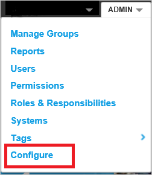
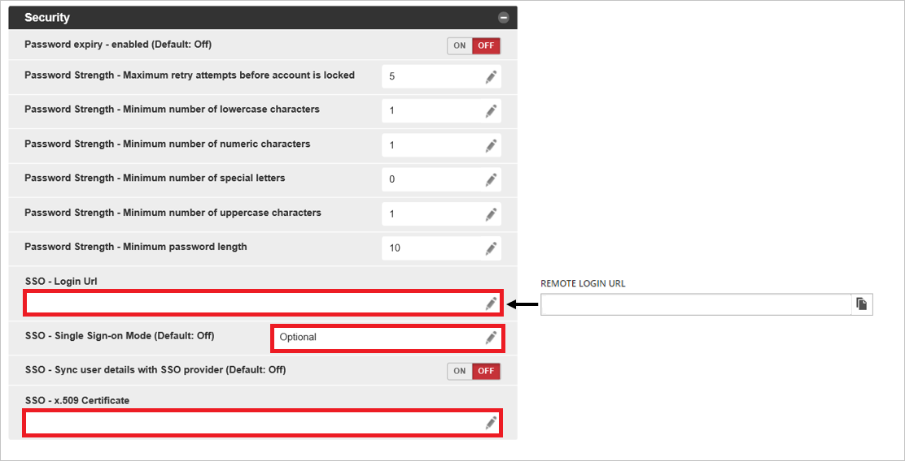

# Configure Nintex Promapp for Single sign-on with Microsoft Entra ID

In this article,  you learn how to integrate Nintex Promapp with Microsoft Entra ID. When you integrate Nintex Promapp with Microsoft Entra ID, you can:

* Control in Microsoft Entra ID who has access to Nintex Promapp.
* Enable your users to be automatically signed-in to Nintex Promapp with their Microsoft Entra accounts.
* Manage your accounts in one central location.

## Prerequisites
The scenario outlined in this article assumes that you already have the following prerequisites:

[!INCLUDE [common-prerequisites.md](~/identity/saas-apps/includes/common-prerequisites.md)]
* Nintex Promapp single sign-on (SSO) enabled subscription.

## Scenario description

In this article,  you configure and test Microsoft Entra SSO in a test environment.

* Nintex Promapp supports **SP and IDP** initiated SSO.
* Nintex Promapp supports **Just In Time** user provisioning.

* Nintex Promapp supports [Automated user provisioning](promapp-provisioning-tutorial.md).

> [!NOTE]
> Identifier of this application is a fixed string value so only one instance can be configured in one tenant.

## Add Nintex Promapp from the gallery

To configure the integration of Nintex Promapp into Microsoft Entra ID, you need to add Nintex Promapp from the gallery to your list of managed SaaS apps.

1. Sign in to the [Microsoft Entra admin center](https://entra.microsoft.com) as at least a [Cloud Application Administrator](~/identity/role-based-access-control/permissions-reference.md#cloud-application-administrator).
1. Browse to **Entra ID** > **Enterprise apps** > **New application**.
1. In the **Add from the gallery** section, type **Nintex Promapp** in the search box.
1. Select **Nintex Promapp** from results panel and then add the app. Wait a few seconds while the app is added to your tenant.

 Alternatively, you can also use the [Enterprise App Configuration Wizard](https://portal.office.com/AdminPortal/home?Q=Docs#/azureadappintegration). In this wizard, you can add an application to your tenant, add users/groups to the app, assign roles, and walk through the SSO configuration as well. [Learn more about Microsoft 365 wizards.](/microsoft-365/admin/misc/azure-ad-setup-guides)

## Configure and test Microsoft Entra SSO for Nintex Promapp

Configure and test Microsoft Entra SSO with Nintex Promapp using a test user called **B.Simon**. For SSO to work, you need to establish a link relationship between a Microsoft Entra user and the related user in Nintex Promapp.

To configure and test Microsoft Entra SSO with Nintex Promapp, perform the following steps:

1. **[Configure Microsoft Entra SSO](#configure-azure-ad-sso)** - to enable your users to use this feature.
    1. **Create a Microsoft Entra test user** - to test Microsoft Entra single sign-on with B.Simon.
    1. **Assign the Microsoft Entra test user** - to enable B.Simon to use Microsoft Entra single sign-on.
1. **[Configure Nintex Promapp SSO](#configure-nintex-promapp-sso)** - to configure the single sign-on settings on application side.
    1. **[Create Nintex Promapp test user](#create-nintex-promapp-test-user)** - to have a counterpart of B.Simon in Nintex Promapp that's linked to the Microsoft Entra representation of user.
1. **[Test SSO](#test-sso)** - to verify whether the configuration works.

## Configure Microsoft Entra SSO

Follow these steps to enable Microsoft Entra SSO.

1. Sign in to the [Microsoft Entra admin center](https://entra.microsoft.com) as at least a [Cloud Application Administrator](~/identity/role-based-access-control/permissions-reference.md#cloud-application-administrator).
1. Browse to **Entra ID** > **Enterprise apps** > **Nintex Promapp** > **Single sign-on**.
1. On the **Select a single sign-on method** page, select **SAML**.
1. On the **Set up single sign-on with SAML** page, select the pencil icon for **Basic SAML Configuration** to edit the settings.

   

1. On the **Basic SAML Configuration** section, if you wish to configure the application in **IDP** initiated mode, perform the following steps:

    1. In the **Identifier** box, type one of the following URLs:
        
        | Identifier URL |
        |-----|
        |`https://go.promapp.com/TENANTNAME/`|
        |`https://au.promapp.com/TENANTNAME/`|
        |`https://us.promapp.com/TENANTNAME/`|
        |`https://eu.promapp.com/TENANTNAME/`|
        |`https://ca.promapp.com/TENANTNAME/`|

	   > [!NOTE]
	   > Microsoft Entra integration with Nintex Promapp is currently configured only for service-initiated authentication. (That is, going to a Nintex Promapp URL initiates the authentication process.) But the **Reply URL** field is a required field.

    1. In the **Reply URL** box, type a URL using the following pattern:
     `https://<DOMAIN_NAME>.promapp.com/TENANTNAME/saml/authenticate.aspx`

1. Select **Set additional URLs** and perform the following step if you wish to configure the application in **SP** initiated mode:

    In the **Sign on URL** box, type a URL using the following pattern: `https://<DOMAIN_NAME>.promapp.com/TENANTNAME/saml/authenticate`

    > [!NOTE]
	> These values are placeholders. You need to use the actual Identifier,Reply URL and Sign on URL. Contact the [Nintex Promapp support team](https://www.promapp.com/about-us/contact-us/) to get the values. You can also refer to the patterns shown in the **Basic SAML Configuration** dialog box.

1. On the **Set up single sign-on with SAML** page, in the **SAML Signing Certificate** section,  find **Certificate (Base64)** and select **Download** to download the certificate and save it on your computer.

	

1. On the **Set up Nintex Promapp** section, copy the appropriate URL(s) based on your requirement.

	

[!INCLUDE [create-assign-users-sso.md](~/identity/saas-apps/includes/create-assign-users-sso.md)]

## Configure Nintex Promapp SSO

1. Sign in to your Nintex Promapp company site as an admin.

2. In the menu at the top of the window, select **Admin**:

    

3. Select **Configure**:

    

4. In the **Security** dialog box, take the following steps.

    

	1. Paste the **Login URL** that you copied into the **SSO-Login URL** box.

	1. In the **SSO - Single Sign-on Mode** list, select **Optional**. Select **Save**.

       > [!NOTE]
	   > Optional mode is for testing only. After you're happy with the configuration, select **Required** in the **SSO - Single Sign-on Mode** list to force all users to authenticate with Microsoft Entra ID.

	1. In Notepad, open the certificate that you downloaded in the previous section. Copy the contents of the certificate without the first line (**-----BEGIN CERTIFICATE-----**) or the last line (**-----END CERTIFICATE-----**). Paste the certificate content into the **SSO-x.509 Certificate** box, and then select **Save**.

### Create Nintex Promapp test user

In this section, a user called B.Simon is created in Nintex Promapp. Nintex Promapp supports just-in-time user provisioning, which is enabled by default. There's no action item for you in this section. If a user doesn't already exist in Nintex Promapp, a new one is created after authentication.

Nintex Promapp also supports automatic user provisioning, you can find more details [here](./promapp-provisioning-tutorial.md) on how to configure automatic user provisioning.

## Test SSO

In this section, you test your Microsoft Entra single sign-on configuration with following options. 

#### SP initiated:

* Select **Test this application**, this option redirects to Nintex Promapp Sign on URL where you can initiate the login flow.  

* Go to Nintex Promapp Sign-on URL directly and initiate the login flow from there.

#### IDP initiated:

* Select **Test this application**, and you should be automatically signed in to the Nintex Promapp for which you set up the SSO. 

You can also use Microsoft My Apps to test the application in any mode. When you select the Nintex Promapp tile in the My Apps, if configured in SP mode you would be redirected to the application sign on page for initiating the login flow and if configured in IDP mode, you should be automatically signed in to the Nintex Promapp for which you set up the SSO. For more information about the My Apps, see [Introduction to the My Apps](https://support.microsoft.com/account-billing/sign-in-and-start-apps-from-the-my-apps-portal-2f3b1bae-0e5a-4a86-a33e-876fbd2a4510).

## Related content

Once you configure Nintex Promapp you can enforce session control, which protects exfiltration and infiltration of your organization’s sensitive data in real time. Session control extends from Conditional Access. [Learn how to enforce session control with Microsoft Defender for Cloud Apps](/cloud-app-security/proxy-deployment-aad).
