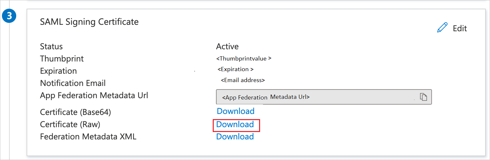

# Configure ProNovos Ops Manager for Single sign-on with Microsoft Entra ID

In this article,  you learn how to integrate ProNovos Ops Manager with Microsoft Entra ID. When you integrate ProNovos Ops Manager with Microsoft Entra ID, you can:

* Control in Microsoft Entra ID who has access to ProNovos Ops Manager.
* Enable your users to be automatically signed-in to ProNovos Ops Manager with their Microsoft Entra accounts.
* Manage your accounts in one central location.

## Prerequisites

To get started, you need the following items:

* A Microsoft Entra subscription. If you don't have a subscription, you can get a [free account](https://azure.microsoft.com/free/).
* ProNovos Ops Manager single sign-on (SSO) enabled subscription.
* Along with Cloud Application Administrator, Application Administrator can also add or manage applications in Microsoft Entra ID.
For more information, see [Azure built-in roles](~/identity/role-based-access-control/permissions-reference.md).

## Scenario description

In this article,  you configure and test Microsoft Entra SSO in a test environment.

* ProNovos Ops Manager supports **SP and IDP** initiated SSO.

## Add ProNovos Ops Manager from the gallery

To configure the integration of ProNovos Ops Manager into Microsoft Entra ID, you need to add ProNovos Ops Manager from the gallery to your list of managed SaaS apps.

1. Sign in to the [Microsoft Entra admin center](https://entra.microsoft.com) as at least a [Cloud Application Administrator](~/identity/role-based-access-control/permissions-reference.md#cloud-application-administrator).
1. Browse to **Entra ID** > **Enterprise apps** > **New application**.
1. In the **Add from the gallery** section, type **ProNovos Ops Manager** in the search box.
1. Select **ProNovos Ops Manager** from results panel and then add the app. Wait a few seconds while the app is added to your tenant.

 Alternatively, you can also use the [Enterprise App Configuration Wizard](https://portal.office.com/AdminPortal/home?Q=Docs#/azureadappintegration). In this wizard, you can add an application to your tenant, add users/groups to the app, assign roles, and walk through the SSO configuration as well. [Learn more about Microsoft 365 wizards.](/microsoft-365/admin/misc/azure-ad-setup-guides)

## Configure and test Microsoft Entra SSO for ProNovos Ops Manager

Configure and test Microsoft Entra SSO with ProNovos Ops Manager using a test user called **B.Simon**. For SSO to work, you need to establish a link relationship between a Microsoft Entra user and the related user in ProNovos Ops Manager.

To configure and test Microsoft Entra SSO with ProNovos Ops Manager, perform the following steps:

1. **[Configure Microsoft Entra SSO](#configure-azure-ad-sso)** - to enable your users to use this feature.
   1. **Create a Microsoft Entra test user** - to test Microsoft Entra single sign-on with B.Simon.
   1. **Assign the Microsoft Entra test user** - to enable B.Simon to use Microsoft Entra single sign-on.
1. **[Configure ProNovos Ops Manager SSO](#configure-pronovos-ops-manager-sso)** - to configure the single sign-on settings on application side.
   1. **[Create ProNovos Ops Manager test user](#create-pronovos-ops-manager-test-user)** - to have a counterpart of B.Simon in ProNovos Ops Manager that's linked to the Microsoft Entra representation of user.
1. **[Test SSO](#test-sso)** - to verify whether the configuration works.

## Configure Microsoft Entra SSO

Follow these steps to enable Microsoft Entra SSO.

1. Sign in to the [Microsoft Entra admin center](https://entra.microsoft.com) as at least a [Cloud Application Administrator](~/identity/role-based-access-control/permissions-reference.md#cloud-application-administrator).
1. Browse to **Entra ID** > **Enterprise apps** > **ProNovos Ops Manager** application integration page, find the **Manage** section and select **Single sign-on**.
1. On the **Select a Single sign-on method** page, select **SAML**.
1. On the **Set up Single Sign-On with SAML** page, select the pencil icon for **Basic SAML Configuration** to edit the settings.

   

1. On the **Basic SAML Configuration** section the application is pre-configured in **IDP** initiated mode and the necessary URLs are already pre-populated with Azure. The user needs to save the configuration by selecting the **Save** button.

1. Select **Set additional URLs** and perform the following step if you wish to configure the application in **SP** initiated mode:

   In the **Sign-on URL** text box, type the URL:
    `https://gly.smartsubz.com/saml2/acs`

4. On the **Set up Single Sign-On with SAML** page, in the **SAML Signing Certificate** section,  find **Certificate (Raw)** and select **Download** to download the certificate and save it on your computer.

	

6. On the **Set up ProNovos Ops Manager** section, copy the appropriate URL(s) based on your requirement.

	

[!INCLUDE [create-assign-users-sso.md](~/identity/saas-apps/includes/create-assign-users-sso.md)]

## Configure ProNovos Ops Manager SSO

To configure single sign-on on **ProNovos Ops Manager** side, you need to send the downloaded **Certificate (Raw)** and appropriate copied URLs from the application configuration to [ProNovos Ops Manager support team](mailto:support@pronovos.com). They set this setting to have the SAML SSO connection set properly on both sides.

### Create ProNovos Ops Manager test user

In this section, you create a user called B.Simon in ProNovos Ops Manager. Work with [ProNovos Ops Manager support team](mailto:support@pronovos.com) to add the users in the ProNovos Ops Manager platform. Users must be created and activated before you use single sign-on.

## Test SSO 

In this section, you test your Microsoft Entra single sign-on configuration with following options. 

#### SP initiated:

* Select **Test this application**, this option redirects to ProNovos Ops Manager Sign on URL where you can initiate the login flow.  

* Go to ProNovos Ops Manager Sign-on URL directly and initiate the login flow from there.

#### IDP initiated:

* Select **Test this application**, and you should be automatically signed in to the ProNovos Ops Manager for which you set up the SSO. 

You can also use Microsoft My Apps to test the application in any mode. When you select the ProNovos Ops Manager tile in the My Apps, if configured in SP mode you would be redirected to the application sign on page for initiating the login flow and if configured in IDP mode, you should be automatically signed in to the ProNovos Ops Manager for which you set up the SSO. For more information, see [Microsoft Entra My Apps](/azure/active-directory/manage-apps/end-user-experiences#azure-ad-my-apps).

## Related content

Once you configure ProNovos Ops Manager you can enforce session control, which protects exfiltration and infiltration of your organization’s sensitive data in real time. Session control extends from Conditional Access. [Learn how to enforce session control with Microsoft Cloud App Security](/cloud-app-security/proxy-deployment-aad).
