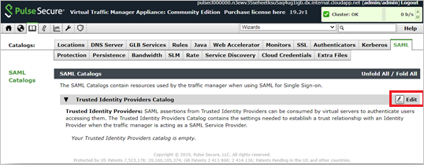
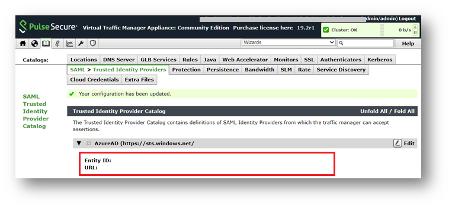
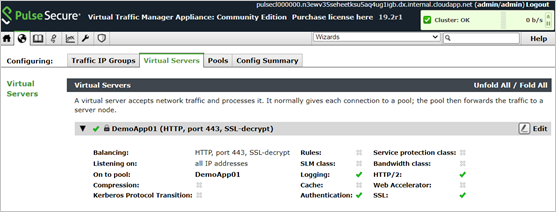
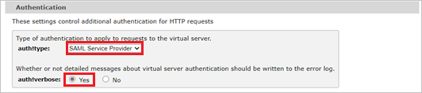
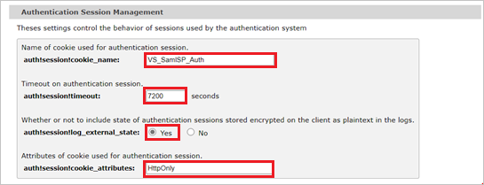
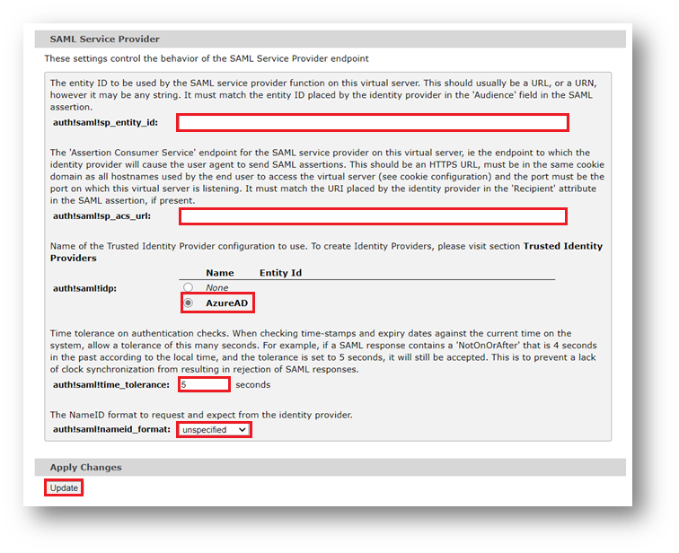

# Configure Pulse Secure Virtual Traffic Manager for Single sign-on with Microsoft Entra ID

In this article,  you learn how to integrate Pulse Secure Virtual Traffic Manager with Microsoft Entra ID. When you integrate Pulse Secure Virtual Traffic Manager with Microsoft Entra ID, you can:

* Control in Microsoft Entra ID who has access to Pulse Secure Virtual Traffic Manager.
* Enable your users to be automatically signed-in to Pulse Secure Virtual Traffic Manager with their Microsoft Entra accounts.
* Manage your accounts in one central location.

## Prerequisites
The scenario outlined in this article assumes that you already have the following prerequisites:

[!INCLUDE [common-prerequisites.md](~/identity/saas-apps/includes/common-prerequisites.md)]
* Pulse Secure Virtual Traffic Manager single sign-on (SSO) enabled subscription.

## Scenario description

In this article,  you configure and test Microsoft Entra SSO in a test environment.

* Pulse Secure Virtual Traffic Manager supports **SP** initiated SSO.

## Add Pulse Secure Virtual Traffic Manager from the gallery

To configure the integration of Pulse Secure Virtual Traffic Manager into Microsoft Entra ID, you need to add Pulse Secure Virtual Traffic Manager from the gallery to your list of managed SaaS apps.

1. Sign in to the [Microsoft Entra admin center](https://entra.microsoft.com) as at least a [Cloud Application Administrator](~/identity/role-based-access-control/permissions-reference.md#cloud-application-administrator).
1. Browse to **Entra ID** > **Enterprise apps** > **New application**.
1. In the **Add from the gallery** section, type **Pulse Secure Virtual Traffic Manager** in the search box.
1. Select **Pulse Secure Virtual Traffic Manager** from results panel and then add the app. Wait a few seconds while the app is added to your tenant.

 Alternatively, you can also use the [Enterprise App Configuration Wizard](https://portal.office.com/AdminPortal/home?Q=Docs#/azureadappintegration). In this wizard, you can add an application to your tenant, add users/groups to the app, assign roles, and walk through the SSO configuration as well. [Learn more about Microsoft 365 wizards.](/microsoft-365/admin/misc/azure-ad-setup-guides)

## Configure and test Microsoft Entra SSO for Pulse Secure Virtual Traffic Manager

Configure and test Microsoft Entra SSO with Pulse Secure Virtual Traffic Manager using a test user called **B.Simon**. For SSO to work, you need to establish a link relationship between a Microsoft Entra user and the related user in Pulse Secure Virtual Traffic Manager.

To configure and test Microsoft Entra SSO with Pulse Secure Virtual Traffic Manager, perform the following steps:

1. **[Configure Microsoft Entra SSO](#configure-azure-ad-sso)** - to enable your users to use this feature.
    1. **Create a Microsoft Entra test user** - to test Microsoft Entra single sign-on with B.Simon.
    1. **Assign the Microsoft Entra test user** - to enable B.Simon to use Microsoft Entra single sign-on.
1. **[Configure Pulse Secure Virtual Traffic Manager SSO](#configure-pulse-secure-virtual-traffic-manager-sso)** - to configure the single sign-on settings on application side.
    1. **[Create Pulse Secure Virtual Traffic Manager test user](#create-pulse-secure-virtual-traffic-manager-test-user)** - to have a counterpart of B.Simon in Pulse Secure Virtual Traffic Manager that's linked to the Microsoft Entra representation of user.
1. **[Test SSO](#test-sso)** - to verify whether the configuration works.

## Configure Microsoft Entra SSO

Follow these steps to enable Microsoft Entra SSO.

1. Sign in to the [Microsoft Entra admin center](https://entra.microsoft.com) as at least a [Cloud Application Administrator](~/identity/role-based-access-control/permissions-reference.md#cloud-application-administrator).
1. Browse to **Entra ID** > **Enterprise apps** > **Pulse Secure Virtual Traffic Manager** > **Single sign-on**.
1. On the **Select a single sign-on method** page, select **SAML**.
1. On the **Set up single sign-on with SAML** page, select the pencil icon for **Basic SAML Configuration** to edit the settings.

   

1. On the **Basic SAML Configuration** section, perform the following steps:

	a. In the **Sign on URL** text box, type a URL using the following pattern:
    `https://<PUBLISHED VIRTUAL SERVER FQDN>/saml/consume`

    b. In the **Identifier (Entity ID)** text box, type a URL using the following pattern:
    `https://<PUBLISHED VIRTUAL SERVER FQDN>/saml/metadata`

    c. In the **Reply URL** text box, type a URL using the following pattern:
    `https://<PUBLISHED VIRTUAL SERVER FQDN>/saml/consume`

	> [!NOTE]
	> These values aren't real. Update these values with the actual Sign on URL,Reply URL and Identifier. Contact [Pulse Secure Virtual Traffic Manager Client support team](mailto:support@pulsesecure.net) to get these values. You can also refer to the patterns shown in the **Basic SAML Configuration** section.

1. On the **Set up single sign-on with SAML** page, in the **SAML Signing Certificate** section,  find **Certificate (Base64)** and select **Download** to download the certificate and save it on your computer.

	

1. On the **Set up Pulse Secure Virtual Traffic Manager** section, copy the appropriate URL(s) based on your requirement.

	

[!INCLUDE [create-assign-users-sso.md](~/identity/saas-apps/includes/create-assign-users-sso.md)]

## Configure Pulse Secure Virtual Traffic Manager SSO

This section covers the configuration needed to enable Microsoft Entra SAML authentication on the Pulse Virtual Traffic Manager. All configuration changes are made on the Pulse Virtual Traffic Manager using the Admin web UI. 

### Create a SAML Trusted Identity Provider

a. Go to the **Pulse Virtual Traffic Manager Appliance Admin UI > Catalog > SAML > Trusted Identity Providers Catalog** page and select **Edit**.

b. Add the details for the new SAML Trusted Identity Provider, copying the information from the Microsoft Entra Enterprise application under the Single sign-on settings page and then select **Create New Trusted Identity Provider**.

* In the **Name** textbox, enter a name for the trusted identity provider. 

* In the **Entity_id** textbox, enter the **Microsoft Entra Identifier** value which you copied previously.  

* In the **Url** textbox, enter the **Login URL** value which you copied previously. 

* Open the downloaded **Certificate** into Notepad and paste the content into the **Certificate** textbox.

c. Verify that the new SAML Identity Provider was successfully created. 

### Configure the Virtual Server to use Microsoft Entra authentication

a. Go to the **Pulse Virtual Traffic Manager Appliance Admin UI > Services > Virtual Servers** page and select **Edit** next to the previously created Virtual server.

b. In the **Authentication** section, select **Edit**. 

c. Configure the following authentication settings for the virtual server: 

1. Authentication -

    

    a. In the **Auth!type**, select **SAML Service Provider**. 

    b. In the **Auth!verbose**, set to “Yes” to troubleshoot any authentication issues, otherwise, leave default as “No”. 

2. Authentication Session Management -

    

    a. For **Auth!session!cookie_name**, leave default as “VS_SamlSP_Auth”. 

    b. For **auth!session!timeout**, leave default to “7200”. 

    c. In **auth!session!log_external_state**, set to “Yes” to troubleshoot any authentication issues, otherwise, leave default as “No”. 

    d. In **auth!session!cookie_attributes**, change to “HTTPOnly”.

3. SAML Service Provider -

    

    a. In the **auth!saml!sp_entity_id** textbox, set to the same URL used as the Microsoft Entra Single sign-on configuration Identifier (Entity ID). Like `https://pulseweb.labb.info/saml/metadata`. 

    b. In the **auth!saml!sp_acs_url**, set to the same URL used as the Microsoft Entra Single sign-on configuration Replay URL (Assertion Consumer Service URL). Like `https://pulseweb.labb.info/saml/consume`. 

    c. In the **auth!saml!idp**, select the **Trusted Identity Provider** you created in previous step. 

    d. In the auth!saml!time_tolerance, leave default to “5” seconds. 

    e. In the auth!saml!nameid_format, select **unspecified**.

    f. Apply changes by selecting **Update** on the bottom of the page.
    
### Create Pulse Secure Virtual Traffic Manager test user

In this section, you create a user called Britta Simon in Pulse Secure Virtual Traffic Manager. Work with [Pulse Secure Virtual Traffic Manager support team](mailto:support@pulsesecure.net) to add the users in the Pulse Secure Virtual Traffic Manager platform. Users must be created and activated before you use single sign-on.

## Test SSO 

In this section, you test your Microsoft Entra single sign-on configuration with following options. 

* Select **Test this application**, this option redirects to Pulse Secure Virtual Traffic Manager Sign-on URL where you can initiate the login flow. 

* Go to Pulse Secure Virtual Traffic Manager Sign-on URL directly and initiate the login flow from there.

* You can use Microsoft My Apps. When you select the Pulse Secure Virtual Traffic Manager tile in the My Apps, this option redirects to Pulse Secure Virtual Traffic Manager Sign-on URL. For more information about the My Apps, see [Introduction to the My Apps](https://support.microsoft.com/account-billing/sign-in-and-start-apps-from-the-my-apps-portal-2f3b1bae-0e5a-4a86-a33e-876fbd2a4510).

## Related content

Once you configure Pulse Secure Virtual Traffic Manager you can enforce session control, which protects exfiltration and infiltration of your organization’s sensitive data in real time. Session control extends from Conditional Access. [Learn how to enforce session control with Microsoft Defender for Cloud Apps](/cloud-app-security/proxy-deployment-aad).
