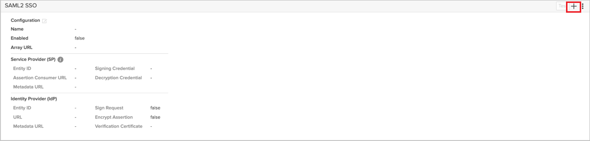
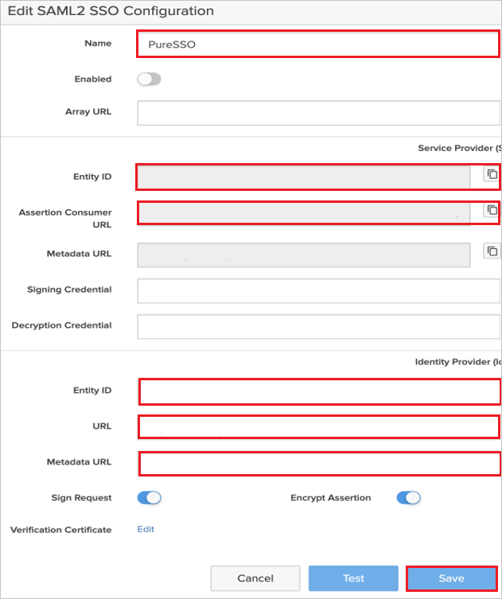

# Microsoft Entra SSO integration with Pure Storage SSO

In this tutorial, you'll learn how to integrate Pure Storage SSO with Microsoft Entra ID. When you integrate Pure Storage SSO with Microsoft Entra ID, you can:

* Control in Microsoft Entra ID who has access to Pure Storage SSO.
* Enable your users to be automatically signed-in to Pure Storage SSO with their Microsoft Entra accounts.
* Manage your accounts in one central location.

## Prerequisites

To integrate Microsoft Entra ID with Pure Storage SSO, you need:

* A Microsoft Entra subscription. If you don't have a subscription, you can get a [free account](https://azure.microsoft.com/free/).
* Pure Storage SSO single sign-on (SSO) enabled subscription.

* **[Optional]** If you intend to use Signing Certificate & Encrypting Assertion features, you should import your certificate & private key into Pure Stotage FlashArray using **purecert create --certificate --key "cert-name"**. Use preferred mode of certificate creation, for self signed cert please contact [Pure Storage SSO support team](mailto:security-solutions-support@purestorage.com) for more details.

## Scenario description

In this tutorial, you configure and test Microsoft Entra SSO in a test environment.

* Pure Storage SSO supports both **SP and IDP** initiated SSO.

## Add Pure Storage SSO from the gallery

To configure the integration of Pure Storage SSO into Microsoft Entra ID, you need to add Pure Storage SSO from the gallery to your list of managed SaaS apps.

1. Sign in to the [Microsoft Entra admin center](https://entra.microsoft.com) as at least a [Cloud Application Administrator](~/identity/role-based-access-control/permissions-reference.md#cloud-application-administrator).
1. Browse to **Identity** > **Applications** > **Enterprise applications** > **New application**.
1. In the **Add from the gallery** section, type **Pure Storage SSO** in the search box.
1. Select **Pure Storage SSO** from results panel and then add the app. Wait a few seconds while the app is added to your tenant.

Alternatively, you can also use the [Enterprise App Configuration Wizard](https://portal.office.com/AdminPortal/home?Q=Docs#/azureadappintegration). In this wizard, you can add an application to your tenant, add users/groups to the app, assign roles, and walk through the SSO configuration as well. [Learn more about Microsoft 365 wizards.](/microsoft-365/admin/misc/azure-ad-setup-guides)

## Configure and test Microsoft Entra SSO for Pure Storage SSO

Configure and test Microsoft Entra SSO with Pure Storage SSO using a test user called **B.Simon**. For SSO to work, you need to establish a link relationship between a Microsoft Entra user and the related user in Pure Storage SSO.

To configure and test Microsoft Entra SSO with Pure Storage SSO, perform the following steps:

1. **[Configure Microsoft Entra SSO](#configure-microsoft-entra-sso)** - to enable your users to use this feature.
    1. **[Create a Microsoft Entra ID test user](#create-a-microsoft-entra-id-test-user)** - to test Microsoft Entra single sign-on with B.Simon.
    1. **[Assign the Microsoft Entra ID test user](#assign-the-microsoft-entra-id-test-user)** - to enable B.Simon to use Microsoft Entra single sign-on.
1. **[Configure Pure Storage SSO](#configure-pure-storage-sso)** - to configure the single sign-on settings on application side.
1. **[Test SSO](#test-sso)** - to verify whether the configuration works.

## Configure Microsoft Entra SSO

Follow these steps to enable Microsoft Entra SSO in the Microsoft Entra admin center.

1. Sign in to the [Microsoft Entra admin center](https://entra.microsoft.com) as at least a [Cloud Application Administrator](~/identity/role-based-access-control/permissions-reference.md#cloud-application-administrator).
1. Browse to **Identity** > **Applications** > **Enterprise applications** > **Pure Storage SSO** > **Single sign-on**.
1. On the **Select a single sign-on method** page, select **SAML**.
1. On the **Set up single sign-on with SAML** page, click the pencil icon for **Basic SAML Configuration** to edit the settings.

   

1. On the **Basic SAML Configuration** section, perform the following steps:

    a. In the **Identifier** text box, type a URL using the following pattern:
    `https://<ARRAY-NAME>.purestorage.com/saml2/service-provider-metadata/<SSO_CONFIG_NAME>`

    b. In the **Reply URL** text box, type a URL using the following pattern:
    `https://<ARRAY-NAME>.purestorage.com/login/saml2/sso/<SSO_CONFIG_NAME>`

1. Perform the following step, if you wish to configure the application in **SP** initiated mode:

    In the **Sign-on URL** text box, type a URL using the following pattern:
    `https://<ARRAY-NAME>.purestorage.com/login/saml2/sso/<FQDN_of_Array_Name>`

	> [!NOTE]
	> These values are not real. Update these values with the actual Identifier, Reply URL and Sign on URL. Contact [Pure Storage SSO support team](mailto:security-solutions-support@purestorage.com) to get these values. You can also refer to the patterns shown in the **Basic SAML Configuration** section in the Microsoft Entra admin center.

1. Pure Storage SSO application expects the SAML assertions in a specific format, which requires you to add custom attribute mappings to your SAML token attributes configuration. The following screenshot shows the list of default attributes.

	

1. In addition to above, Pure Storage SSO application expects few more attributes to be passed back in SAML response which are shown below. These attributes are also pre populated but you can review them as per your requirements.
	
	| Name | Source Attribute|
	| ---------------| --------------- |
	| purity_roles | user.assignedroles |

    > [!NOTE]
    > Edit default roles in the Entra app and update their values as **"storage_admin", "ops_admin", "readonly", "array_admin"** respectively. Please refer **"App roles UI - section for updating values"** and **"Assign users and groups to Microsoft Entra roles - section for role assignment" [here](~/identity-platform/howto-add-app-roles-in-apps.md#app-roles-ui)** for more details.

1. On the **Set up single sign-on with SAML** page, in the **SAML Signing Certificate** section, click copy button to copy **App Federation Metadata Url** and save it on your computer.

	

1. On the **Set up Pure Storage SSO** section, copy the appropriate URL(s) based on your requirement.

	

### Create a Microsoft Entra ID test user

In this section, you'll create a test user in the Microsoft Entra admin center called B.Simon.

1. Sign in to the [Microsoft Entra admin center](https://entra.microsoft.com) as at least a [User Administrator](~/identity/role-based-access-control/permissions-reference.md#user-administrator).
1. Browse to **Identity** > **Users** > **All users**.
1. Select **New user** > **Create new user**, at the top of the screen.
1. In the **User** properties, follow these steps:
   1. In the **Display name** field, enter `B.Simon`.  
   1. In the **User principal name** field, enter the username@companydomain.extension. For example, `B.Simon@contoso.com`.
   1. Select the **Show password** check box, and then write down the value that's displayed in the **Password** box.
   1. Select **Review + create**.
1. Select **Create**.

### Assign the Microsoft Entra ID test user

In this section, you'll enable B.Simon to use Microsoft Entra single sign-on by granting access to Pure Storage SSO.

1. Sign in to the [Microsoft Entra admin center](https://entra.microsoft.com) as at least a [Cloud Application Administrator](~/identity/role-based-access-control/permissions-reference.md#cloud-application-administrator).
1. Browse to **Identity** > **Applications** > **Enterprise applications** > **Pure Storage SSO**.
1. In the app's overview page, select **Users and groups**.
1. Select **Add user/group**, then select **Users and groups** in the **Add Assignment** dialog.
   1. In the **Users and groups** dialog, select **B.Simon** from the Users list, then click the **Select** button at the bottom of the screen.
   1. If you are expecting a role to be assigned to the users, you can select it from the **Select a role** dropdown. Should select any role out of **"storage_admin_role", "ops_admin_role", "readonly_role", "array_admin_role"**.
   1. In the **Add Assignment** dialog, click the **Assign** button.

## Configure Pure Storage SSO

1. Log in to Pure Storage SSO company site as an administrator.

1. Go to **Settings** > **Access** > **SAML2 SSO** section and click **+** button on the right top corner of the page to add your SSO configuration.

    

1. Perform the following steps in SAML2 SSO Configuration page:

    

    1. Enter a valid name in the **Name** textbox.

    1. Copy **Entity ID** value and paste it in the **Identifier** text box in the **Basic SAML Configuration** section in Microsoft Entra admin center.

    1. Copy **Assertion Consumer URL** and paste it in the **Reply URL** text box in the **Basic SAML Configuration** section in Microsoft Entra admin center.

    1. In the **Entity ID** textbox, paste the **Microsoft Entra Identifier** value, which you have copied from Microsoft Entra admin center.

    1. In the **URL** textbox, paste the **Login URL**, which you have copied from Microsoft Entra admin center.

    1. In the **Metadata URL** textbox, paste the **App Federation Metadata Url** value, which you have copied from Microsoft Entra admin center.

    1. **[Optional]** Fill in **Signing Credential** and **Decryption Credential** with **cert-name** imported into Pure Storage FlashArray. Toggle and enable **Sign Request** and **Encrypt Assertion**.

    1. Get verification certificate from Entra app and update in FlashArray SSO Configuration for **Verification Certificate** field. You can follow the steps shown in the [document](~/identity/enterprise-apps/tutorial-manage-certificates-for-federated-single-sign-on.md) to get a relevant certificate.

    1. Click **Save**.

        > [!NOTE]
        > Perform this on Entra app side, only if you intend to enable Encrypt Assertions. Import certificates and enable **Token Encryption** by following this [link](~/identity/enterprise-apps/howto-saml-token-encryption.md).

## Test SSO 

In this section, you test your Microsoft Entra single sign-on configuration with following options.
 
#### SP initiated:
 
* Click on **Test this application** in Microsoft Entra admin center. This will redirect to Pure Storage SSO Sign-on URL where you can initiate the login flow.  
 
* Go to Pure Storage SSO Sign-on URL directly and initiate the login flow from there.
 
#### IDP initiated:
 
* Click on **Test this application** in Microsoft Entra admin center and you should be automatically signed in to the Pure Storage SSO for which you set up the SSO.
 
You can also use Microsoft My Apps to test the application in any mode. When you click the Pure Storage SSO tile in the My Apps, if configured in SP mode you would be redirected to the application sign-on page for initiating the login flow and if configured in IDP mode, you should be automatically signed in to the Pure Storage SSO for which you set up the SSO. For more information about the My Apps, see [Introduction to the My Apps](https://support.microsoft.com/account-billing/sign-in-and-start-apps-from-the-my-apps-portal-2f3b1bae-0e5a-4a86-a33e-876fbd2a4510).

## Next steps

Once you configure Pure Storage SSO you can enforce session control, which protects exfiltration and infiltration of your organization's sensitive data in real time. Session control extends from Conditional Access. [Learn how to enforce session control with Microsoft Defender for Cloud Apps](/cloud-app-security/proxy-deployment-any-app).
