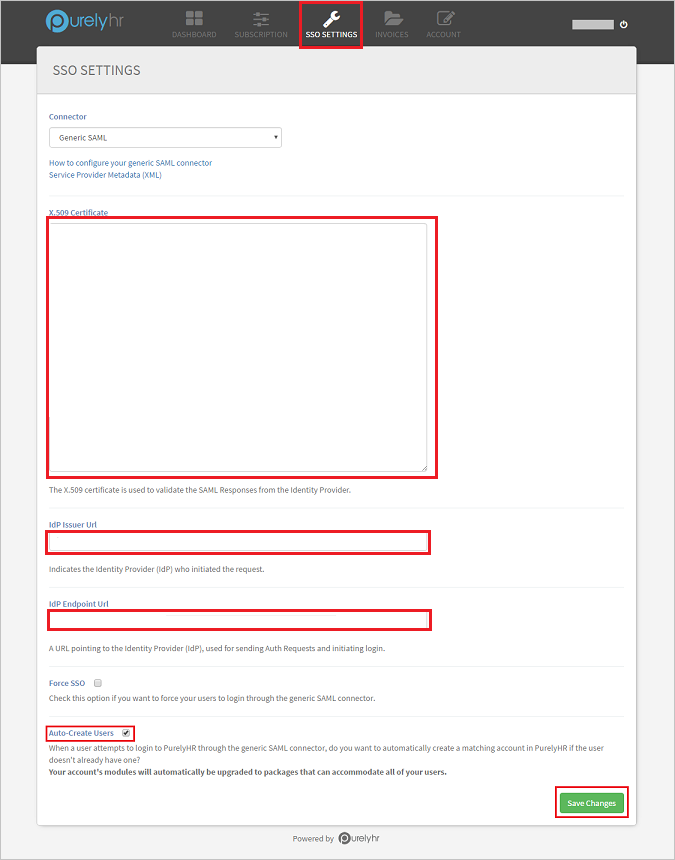
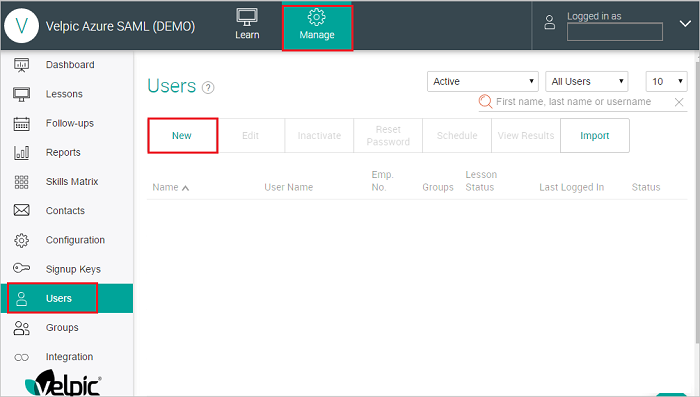
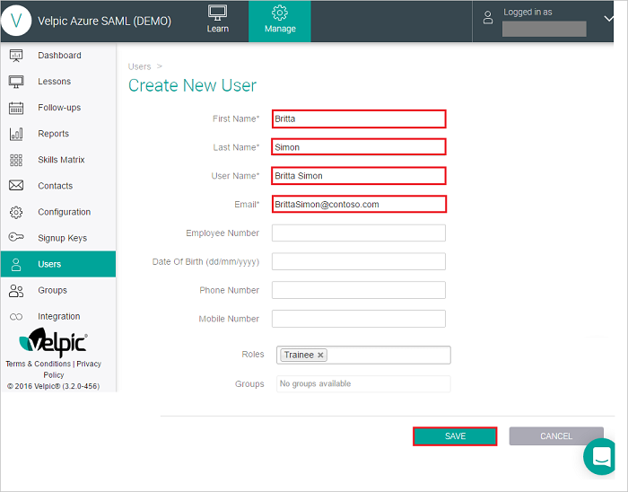

# Configure PurelyHR for Single sign-on with Microsoft Entra ID

In this article,  you learn how to integrate PurelyHR with Microsoft Entra ID. When you integrate PurelyHR with Microsoft Entra ID, you can:

* Control in Microsoft Entra ID who has access to PurelyHR.
* Enable your users to be automatically signed-in to PurelyHR with their Microsoft Entra accounts.
* Manage your accounts in one central location.

## Prerequisites
The scenario outlined in this article assumes that you already have the following prerequisites:

[!INCLUDE [common-prerequisites.md](~/identity/saas-apps/includes/common-prerequisites.md)]
* PurelyHR single sign-on (SSO) enabled subscription.

## Scenario description

In this article,  you configure and test Microsoft Entra SSO in a test environment.

* PurelyHR supports **SP and IDP** initiated SSO.
* PurelyHR supports **Just In Time** user provisioning.

> [!NOTE]
> Identifier of this application is a fixed string value so only one instance can be configured in one tenant.

## Add PurelyHR from the gallery

To configure the integration of PurelyHR into Microsoft Entra ID, you need to add PurelyHR from the gallery to your list of managed SaaS apps.

1. Sign in to the [Microsoft Entra admin center](https://entra.microsoft.com) as at least a [Cloud Application Administrator](~/identity/role-based-access-control/permissions-reference.md#cloud-application-administrator).
1. Browse to **Entra ID** > **Enterprise apps** > **New application**.
1. In the **Add from the gallery** section, type **PurelyHR** in the search box.
1. Select **PurelyHR** from results panel and then add the app. Wait a few seconds while the app is added to your tenant.

 Alternatively, you can also use the [Enterprise App Configuration Wizard](https://portal.office.com/AdminPortal/home?Q=Docs#/azureadappintegration). In this wizard, you can add an application to your tenant, add users/groups to the app, assign roles, and walk through the SSO configuration as well. [Learn more about Microsoft 365 wizards.](/microsoft-365/admin/misc/azure-ad-setup-guides)

## Configure and test Microsoft Entra SSO for PurelyHR

Configure and test Microsoft Entra SSO with PurelyHR using a test user called **B.Simon**. For SSO to work, you need to establish a link relationship between a Microsoft Entra user and the related user in PurelyHR.

To configure and test Microsoft Entra SSO with PurelyHR, perform the following steps:

1. **[Configure Microsoft Entra SSO](#configure-azure-ad-sso)** - to enable your users to use this feature.
    1. **Create a Microsoft Entra test user** - to test Microsoft Entra single sign-on with B.Simon.
    1. **Assign the Microsoft Entra test user** - to enable B.Simon to use Microsoft Entra single sign-on.
1. **[Configure PurelyHR SSO](#configure-purelyhr-sso)** - to configure the single sign-on settings on application side.
    1. **[Create PurelyHR test user](#create-purelyhr-test-user)** - to have a counterpart of B.Simon in PurelyHR that's linked to the Microsoft Entra representation of user.
1. **[Test SSO](#test-sso)** - to verify whether the configuration works.

## Configure Microsoft Entra SSO

Follow these steps to enable Microsoft Entra SSO.

1. Sign in to the [Microsoft Entra admin center](https://entra.microsoft.com) as at least a [Cloud Application Administrator](~/identity/role-based-access-control/permissions-reference.md#cloud-application-administrator).
1. Browse to **Entra ID** > **Enterprise apps** > **PurelyHR** > **Single sign-on**.
1. On the **Select a single sign-on method** page, select **SAML**.
1. On the **Set up single sign-on with SAML** page, select the pencil icon for **Basic SAML Configuration** to edit the settings.

   

1. On the **Basic SAML Configuration** section, if you wish to configure the application in **IDP** initiated mode, perform the following step:

    In the **Reply URL** text box, type a URL using the following pattern:
    `https://<COMPANY_ID>.purelyhr.com/sso-consume`

1. Select **Set additional URLs** and perform the following step if you wish to configure the application in **SP** initiated mode:

    In the **Sign-on URL** text box, type a URL using the following pattern:
    `https://<COMPANY_ID>.purelyhr.com/sso-initiate`

	> [!NOTE]
	> These values aren't real. Update these values with the actual Reply URL and Sign-On URL. Contact [PurelyHR Client support team](https://support.purelyhr.com/) to get these values. You can also refer to the patterns shown in the **Basic SAML Configuration** section.

1. On the **Set up single sign-on with SAML** page, in the **SAML Signing Certificate** section,  find **Certificate (Base64)** and select **Download** to download the certificate and save it on your computer.

	

1. On the **Set up PurelyHR** section, copy the appropriate URL(s) based on your requirement.

	

[!INCLUDE [create-assign-users-sso.md](~/identity/saas-apps/includes/create-assign-users-sso.md)]

## Configure PurelyHR SSO

1. In a different web browser window, sign in to your up PurelyHR company site as an administrator

1. Open the **Dashboard** from the options in the toolbar and select **SSO Settings**.

1. Paste the values in the boxes as described below-

		

	a. Open the **Certificate(Bas64)** downloaded in notepad and copy the certificate value. Paste the copied value into the **X.509 Certificate** box.

	b. In the **Idp Issuer URL** box, paste the **Microsoft Entra Identifier** copied.

	c. In the **Idp Endpoint URL** box, paste the **Login URL** copied. 

	d. Check the **Auto-Create Users** checkbox to enable automatic user provisioning in PurelyHR.

	e. Select **Save Changes** to save the settings.

### Create PurelyHR test user

This step is usually not required as the application supports just in time user provisioning. If the automatic user provisioning isn't enabled then manual user creation can be done as described below.

Sign into your Velpic SAML company site as an administrator and perform following steps:

1. Select Manage tab and go to Users section, then select New button to add users.

	

2. On the **“Create New User”** dialog page, perform the following steps.

	

	a. In the **First Name** textbox, type the first name of B.

	b. In the **Last Name** textbox, type the last name of Simon.

	c. In the **User Name** textbox, type the user name of B.Simon.

	d. In the **Email** textbox, type the email address of B.Simon@contoso.com account.

	e. Rest of the information is optional, you can fill it if needed.

	f. Select **SAVE**.

## Test SSO 

In this section, you test your Microsoft Entra single sign-on configuration with following options. 

#### SP initiated:

* Select **Test this application**, this option redirects to PurelyHR Sign on URL where you can initiate the login flow.  

* Go to PurelyHR Sign-on URL directly and initiate the login flow from there.

#### IDP initiated:

* Select **Test this application**, and you should be automatically signed in to the PurelyHR for which you set up the SSO. 

You can also use Microsoft My Apps to test the application in any mode. When you select the PurelyHR tile in the My Apps, if configured in SP mode you would be redirected to the application sign on page for initiating the login flow and if configured in IDP mode, you should be automatically signed in to the PurelyHR for which you set up the SSO. For more information about the My Apps, see [Introduction to the My Apps](https://support.microsoft.com/account-billing/sign-in-and-start-apps-from-the-my-apps-portal-2f3b1bae-0e5a-4a86-a33e-876fbd2a4510).

## Related content

Once you configure PurelyHR you can enforce session control, which protects exfiltration and infiltration of your organization’s sensitive data in real time. Session control extends from Conditional Access. [Learn how to enforce session control with Microsoft Defender for Cloud Apps](/cloud-app-security/proxy-deployment-aad).
