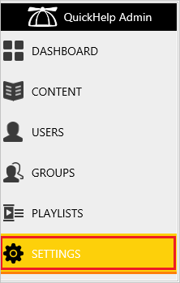
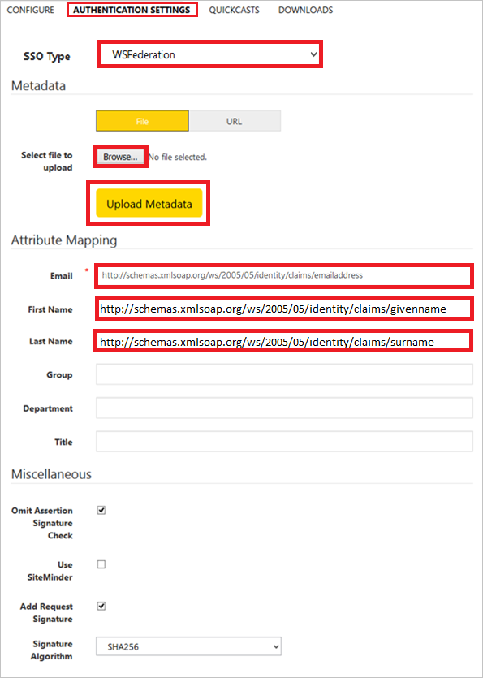

# Configure QuickHelp for Single sign-on with Microsoft Entra ID

In this article,  you learn how to integrate QuickHelp with Microsoft Entra ID. When you integrate QuickHelp with Microsoft Entra ID, you can:

* Control in Microsoft Entra ID who has access to QuickHelp.
* Enable your users to be automatically signed-in to QuickHelp with their Microsoft Entra accounts.
* Manage your accounts in one central location.

## Prerequisites
The scenario outlined in this article assumes that you already have the following prerequisites:

[!INCLUDE [common-prerequisites.md](~/identity/saas-apps/includes/common-prerequisites.md)]
* QuickHelp single sign-on (SSO) enabled subscription.

## Scenario description

In this article,  you configure and test Microsoft Entra single sign-on in a test environment.

* QuickHelp supports **SP** initiated SSO.

* QuickHelp supports **Just In Time** user provisioning.

> [!NOTE]
> Identifier of this application is a fixed string value so only one instance can be configured in one tenant.

## Add QuickHelp from the gallery

To configure the integration of QuickHelp into Microsoft Entra ID, you need to add QuickHelp from the gallery to your list of managed SaaS apps.

1. Sign in to the [Microsoft Entra admin center](https://entra.microsoft.com) as at least a [Cloud Application Administrator](~/identity/role-based-access-control/permissions-reference.md#cloud-application-administrator).
1. Browse to **Entra ID** > **Enterprise apps** > **New application**.
1. In the **Add from the gallery** section, type **QuickHelp** in the search box.
1. Select **QuickHelp** from results panel and then add the app. Wait a few seconds while the app is added to your tenant.

 Alternatively, you can also use the [Enterprise App Configuration Wizard](https://portal.office.com/AdminPortal/home?Q=Docs#/azureadappintegration). In this wizard, you can add an application to your tenant, add users/groups to the app, assign roles, and walk through the SSO configuration as well. [Learn more about Microsoft 365 wizards.](/microsoft-365/admin/misc/azure-ad-setup-guides)

## Configure and test Microsoft Entra SSO for QuickHelp

Configure and test Microsoft Entra SSO with QuickHelp using a test user called **B.Simon**. For SSO to work, you need to establish a link relationship between a Microsoft Entra user and the related user in QuickHelp.

To configure and test Microsoft Entra SSO with QuickHelp, perform the following steps:

1. **[Configure Microsoft Entra SSO](#configure-azure-ad-sso)** - to enable your users to use this feature.
    1. **Create a Microsoft Entra test user** - to test Microsoft Entra single sign-on with B.Simon.
    1. **Assign the Microsoft Entra test user** - to enable B.Simon to use Microsoft Entra single sign-on.
1. **[Configure QuickHelp SSO](#configure-quickhelp-sso)** - to configure the single sign-on settings on application side.
    1. **[Create QuickHelp test user](#create-quickhelp-test-user)** - to have a counterpart of B.Simon in QuickHelp that's linked to the Microsoft Entra representation of user.
1. **[Test SSO](#test-sso)** - to verify whether the configuration works.

## Configure Microsoft Entra SSO

Follow these steps to enable Microsoft Entra SSO.

1. Sign in to the [Microsoft Entra admin center](https://entra.microsoft.com) as at least a [Cloud Application Administrator](~/identity/role-based-access-control/permissions-reference.md#cloud-application-administrator).
1. Browse to **Entra ID** > **Enterprise apps** > **QuickHelp** > **Single sign-on**.
1. On the **Select a single sign-on method** page, select **SAML**.
1. On the **Set up single sign-on with SAML** page, select the pencil icon for **Basic SAML Configuration** to edit the settings.

   

1. On the **Basic SAML Configuration** section, perform the following steps:

    a. In the **Identifier (Entity ID)** text box, type the URL:
    `https://auth.quickhelp.com`

	b. In the **Sign on URL** text box, type a URL using the following pattern:
    `https://quickhelp.com/<ROUTE_URL>`

	> [!NOTE]
	> The Sign-on URL value isn't real. Update the value with the actual Sign-On URL. Contact your organization’s QuickHelp administrator or your BrainStorm Client Success Manager to get the value. You can also refer to the patterns shown in the **Basic SAML Configuration** section.

1. On the **Set up Single Sign-On with SAML** page, in the **SAML Signing Certificate** section, select **Download** to download the **Federation Metadata XML** from the given options as per your requirement and save it on your computer.

	

6. On the **Set up QuickHelp** section, copy the appropriate URL(s) as per your requirement.

	

[!INCLUDE [create-assign-users-sso.md](~/identity/saas-apps/includes/create-assign-users-sso.md)]

## Configure QuickHelp SSO

1. Sign in to your QuickHelp company site as administrator.

2. In the menu on the top, select **Admin**.
   
    

3. In the **QuickHelp Admin** menu, select **Settings**.
   
    

4. Select **Authentication Settings**.

5. On the **Authentication Settings** page, perform the following steps.
   
    
   
    a. As **SSO Type**, select **WSFederation**.
   
    b. To upload your downloaded Azure metadata file, select **Browse**, navigate to the file, end then select **Upload Metadata**.
   
    c. In the **Email** textbox, type `http://schemas.xmlsoap.org/ws/2005/05/identity/claims/emailaddress`.
   
    d. In the **First Name** textbox, `type http://schemas.xmlsoap.org/ws/2005/05/identity/claims/givenname`.
   
    e. In the **Last Name** textbox, `type http://schemas.xmlsoap.org/ws/2005/05/identity/claims/surname`.
   
    f. In the **Action Bar**, select **Save**.

### Create QuickHelp test user

In this section, a user called Britta Simon is created in QuickHelp. QuickHelp supports just-in-time user provisioning, which is enabled by default. There's no action item for you in this section. If a user doesn't already exist in QuickHelp, a new one is created after authentication.

## Test SSO 

In this section, you test your Microsoft Entra single sign-on configuration with following options. 

* Select **Test this application**, this option redirects to QuickHelp Sign-on URL where you can initiate the login flow. 

* Go to QuickHelp Sign-on URL directly and initiate the login flow from there.

* You can use Microsoft My Apps. When you select the QuickHelp tile in the My Apps, this option redirects to QuickHelp Sign-on URL. For more information about the My Apps, see [Introduction to the My Apps](https://support.microsoft.com/account-billing/sign-in-and-start-apps-from-the-my-apps-portal-2f3b1bae-0e5a-4a86-a33e-876fbd2a4510).

## Related content

Once you configure QuickHelp you can enforce session control, which protects exfiltration and infiltration of your organization’s sensitive data in real time. Session control extends from Conditional Access. [Learn how to enforce session control with Microsoft Defender for Cloud Apps](/cloud-app-security/proxy-deployment-aad).
