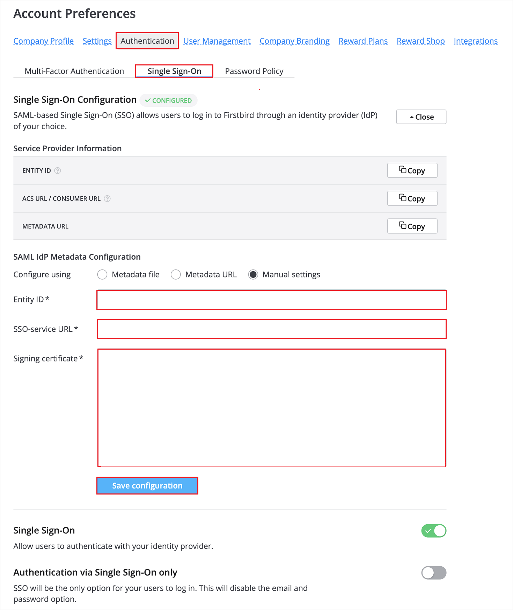

# Configure Radancy's Employee Referrals for Single sign-on with Microsoft Entra ID

In this article,  you learn how to integrate Radancy's Employee Referrals with Microsoft Entra ID. When you integrate Radancy's Employee Referrals with Microsoft Entra ID, you can:

* Control in Microsoft Entra ID who has access to Radancy's Employee Referrals.
* Enable your users to be automatically signed-in to Radancy's Employee Referrals with their Microsoft Entra accounts.
* Manage your accounts in one central location.

## Prerequisites
The scenario outlined in this article assumes that you already have the following prerequisites:

[!INCLUDE [common-prerequisites.md](~/identity/saas-apps/includes/common-prerequisites.md)]
* Radancy's Employee Referrals single sign-on (SSO) enabled subscription.

## Scenario description

In this article,  you configure and test Microsoft Entra SSO in a test environment.

* Radancy's Employee Referrals supports **SP and IDP** initiated SSO.
* Radancy's Employee Referrals supports **Just In Time** user provisioning.

## Add Radancy's Employee Referrals from the gallery

To configure the integration of Radancy's Employee Referrals into Microsoft Entra ID, you need to add Radancy's Employee Referrals from the gallery to your list of managed SaaS apps.

1. Sign in to the [Microsoft Entra admin center](https://entra.microsoft.com) as at least a [Cloud Application Administrator](~/identity/role-based-access-control/permissions-reference.md#cloud-application-administrator).
1. Browse to **Entra ID** > **Enterprise apps** > **New application**.
1. In the **Add from the gallery** section, type **Radancy's Employee Referrals** in the search box.
1. Select **Radancy's Employee Referrals** from results panel and then add the app. Wait a few seconds while the app is added to your tenant.

Alternatively, you can also use the [Enterprise App Configuration Wizard](https://portal.office.com/AdminPortal/home?Q=Docs#/azureadappintegration). In this wizard, you can add an application to your tenant, add users/groups to the app, assign roles, and walk through the SSO configuration as well. [Learn more about Microsoft 365 wizards.](/microsoft-365/admin/misc/azure-ad-setup-guides)

## Configure and test Microsoft Entra SSO for Radancy's Employee Referrals

Configure and test Microsoft Entra SSO with Radancy's Employee Referrals using a test user called **B.Simon**. For SSO to work, you need to establish a link relationship between a Microsoft Entra user and the related user in Radancy's Employee Referrals.

To configure and test Microsoft Entra SSO with Radancy's Employee Referrals, perform the following steps:

1. **[Configure Microsoft Entra SSO](#configure-azure-ad-sso)** - to enable your users to use this feature.
    1. **Create a Microsoft Entra test user** - to test Microsoft Entra single sign-on with B.Simon.
    1. **Assign the Microsoft Entra test user** - to enable B.Simon to use Microsoft Entra single sign-on.
1. **[Configure Radancy's Employee Referrals SSO](#configure-radancys-employee-referrals-sso)** - to configure the single sign-on settings on application side.
    1. **[Create Radancy's Employee Referrals test user](#create-radancys-employee-referrals-test-user)** - to have a counterpart of B.Simon in Radancy's Employee Referrals that are linked to the Microsoft Entra representation of user.
1. **[Test SSO](#test-sso)** - to verify whether the configuration works.

## Configure Microsoft Entra SSO

Follow these steps to enable Microsoft Entra SSO.

1. Sign in to the [Microsoft Entra admin center](https://entra.microsoft.com) as at least a [Cloud Application Administrator](~/identity/role-based-access-control/permissions-reference.md#cloud-application-administrator).
1. Browse to **Entra ID** > **Enterprise apps** > **Radancy's Employee Referrals** > **Single sign-on**.
1. On the **Select a single sign-on method** page, select **SAML**.
1. On the **Set up single sign-on with SAML** page, select the pencil icon for **Basic SAML Configuration** to edit the settings.

   

1. On the **Basic SAML Configuration** section, perform the following steps:

    a. In the **Identifier** text box, type a URL using the following pattern:
    `https://<company-domain>.auth.1brd.com/saml/sp`

    b. In the **Reply URL** text box, type a URL using the following pattern:
    `https://<company-domain>.auth.1brd.com/saml/callback`

1. Perform the following step if you wish to configure the application in **SP** initiated mode:

    In the **Sign-on URL** text box, type a URL using the following pattern:
    `https://<company-domain>.1brd.com/login`

	> [!NOTE]
	> These values aren't real. Update these values with the actual Identifier, Reply URL and Sign-on URL. Contact [Radancy's Employee Referrals Client support team](mailto:support@firstbird.com) to get these values. You can also refer to the patterns shown in the **Basic SAML Configuration** section.

1. Radancy's Employee Referrals application expects the SAML assertions in a specific format, which requires you to add custom attribute mappings to your SAML token attributes configuration. The following screenshot shows the list of default attributes.

	

1. In addition to above, Radancy's Employee Referrals application expects few more attributes to be passed back in SAML response, which are shown below. These attributes are also pre populated but you can review them as per your requirement.

	| Name | Source Attribute|
	| ---------------| --------- |
	| first_name | user.givenname |
	| last_name | user.surname |
    | email | user.mail |

1. On the **Set up single sign-on with SAML** page, in the **SAML Signing Certificate** section, find **Federation Metadata XML** and select **Download** to download the certificate and save it on your computer.

	

1. On the **Set up Radancy's Employee Referrals** section, copy the appropriate URL(s) based on your requirement.

	

[!INCLUDE [create-assign-users-sso.md](~/identity/saas-apps/includes/create-assign-users-sso.md)]

## Configure Radancy's Employee Referrals SSO

1. Log in to the Radancy's Employee Referrals website as an administrator.

1. Navigate to **Account Preferences** > **Authentication** > **Single Sign-On**.

1. In the **SAML IdP Metadata Configuration** section, perform the following steps:
    
    

    1. In the **Entity ID** textbox, paste the **Microsoft Entra Identifier** value, which you've copied.

    1. In the **SSO-service URL** textbox, paste the **Login URL** value, which you've copied.

    1. In the **Signing certificate** textbox, paste the **Federation Metadata XML** file, which you've downloaded.

    1. **Save configuration** and verify the setup.

    > [!NOTE]
    > You need to have the SSO option included in your contract.

### Create Radancy's Employee Referrals test user

In this section, a user called B.Simon is created in Radancy's Employee Referrals. Radancy's Employee Referrals supports just-in-time user provisioning, which is enabled by default. There's no action item for you in this section. If a user doesn't already exist in Radancy's Employee Referrals, a new one is created after authentication.

## Test SSO 

In this section, you test your Microsoft Entra single sign-on configuration with following options. 

#### SP initiated:

* Select **Test this application**, this option redirects to Radancy's Employee Referrals Sign-on URL where you can initiate the login flow.  

* Go to Radancy's Employee Referrals Sign-on URL directly and initiate the login flow from there.

#### IDP initiated:

* Select **Test this application**, and you should be automatically signed in to the Radancy's Employee Referrals for which you set up the SSO. 

You can also use Microsoft My Apps to test the application in any mode. When you select the Radancy's Employee Referrals tile in the My Apps, if configured in SP mode you would be redirected to the application sign-on page for initiating the login flow and if configured in IDP mode, you should be automatically signed in to the Radancy's Employee Referrals for which you set up the SSO. For more information, see [Microsoft Entra My Apps](/azure/active-directory/manage-apps/end-user-experiences#azure-ad-my-apps).

## Related content

Once you configure Radancy's Employee Referrals you can enforce session control, which protects exfiltration and infiltration of your organization’s sensitive data in real time. Session control extends from Conditional Access. [Learn how to enforce session control with Microsoft Cloud App Security](/cloud-app-security/proxy-deployment-aad).
