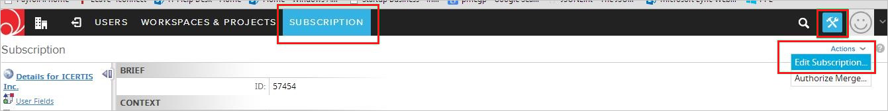
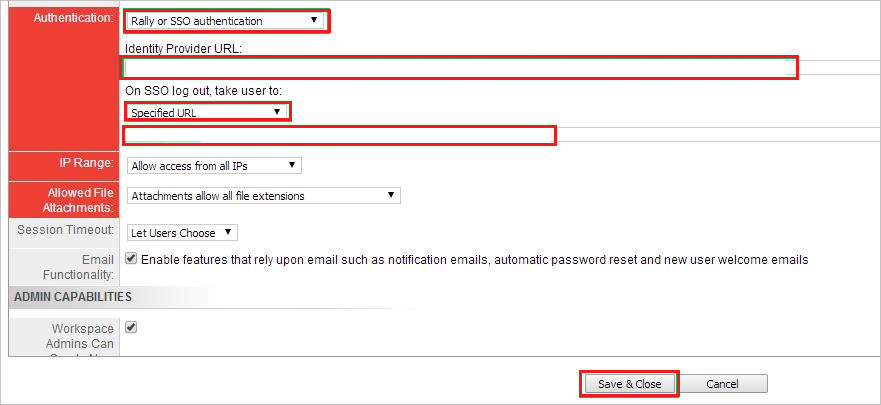
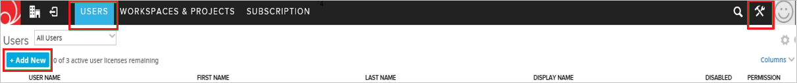
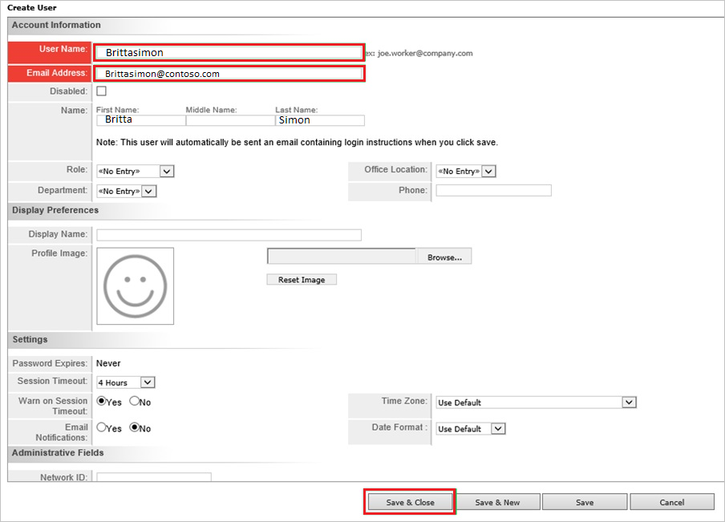

# Configure Rally Software for Single sign-on with Microsoft Entra ID

In this article,  you learn how to integrate Rally Software with Microsoft Entra ID. When you integrate Rally Software with Microsoft Entra ID, you can:

* Control in Microsoft Entra ID who has access to Rally Software.
* Enable your users to be automatically signed-in to Rally Software with their Microsoft Entra accounts.
* Manage your accounts in one central location.

## Prerequisites
The scenario outlined in this article assumes that you already have the following prerequisites:

[!INCLUDE [common-prerequisites.md](~/identity/saas-apps/includes/common-prerequisites.md)]
* Rally Software single sign-on (SSO) enabled subscription.

## Scenario description

In this article,  you configure and test Microsoft Entra single sign-on in a test environment.

* Rally Software supports **SP** initiated SSO.

## Add Rally Software from the gallery

To configure the integration of Rally Software into Microsoft Entra ID, you need to add Rally Software from the gallery to your list of managed SaaS apps.

1. Sign in to the [Microsoft Entra admin center](https://entra.microsoft.com) as at least a [Cloud Application Administrator](~/identity/role-based-access-control/permissions-reference.md#cloud-application-administrator).
1. Browse to **Entra ID** > **Enterprise apps** > **New application**.
1. In the **Add from the gallery** section, type **Rally Software** in the search box.
1. Select **Rally Software** from results panel and then add the app. Wait a few seconds while the app is added to your tenant.

 Alternatively, you can also use the [Enterprise App Configuration Wizard](https://portal.office.com/AdminPortal/home?Q=Docs#/azureadappintegration). In this wizard, you can add an application to your tenant, add users/groups to the app, assign roles, and walk through the SSO configuration as well. [Learn more about Microsoft 365 wizards.](/microsoft-365/admin/misc/azure-ad-setup-guides)

## Configure and test Microsoft Entra SSO for Rally Software

Configure and test Microsoft Entra SSO with Rally Software using a test user called **B.Simon**. For SSO to work, you need to establish a link relationship between a Microsoft Entra user and the related user in Rally Software.

To configure and test Microsoft Entra SSO with Rally Software, perform the following steps:

1. **[Configure Microsoft Entra SSO](#configure-azure-ad-sso)** - to enable your users to use this feature.
    1. **Create a Microsoft Entra test user** - to test Microsoft Entra single sign-on with B.Simon.
    1. **Assign the Microsoft Entra test user** - to enable B.Simon to use Microsoft Entra single sign-on.
1. **[Configure Rally Software SSO](#configure-rally-software-sso)** - to configure the single sign-on settings on application side.
    1. **[Create Rally Software test user](#create-rally-software-test-user)** - to have a counterpart of B.Simon in Rally Software that's linked to the Microsoft Entra representation of user.
1. **[Test SSO](#test-sso)** - to verify whether the configuration works.

## Configure Microsoft Entra SSO

Follow these steps to enable Microsoft Entra SSO.

1. Sign in to the [Microsoft Entra admin center](https://entra.microsoft.com) as at least a [Cloud Application Administrator](~/identity/role-based-access-control/permissions-reference.md#cloud-application-administrator).
1. Browse to **Entra ID** > **Enterprise apps** > **Rally Software** > **Single sign-on**.
1. On the **Select a single sign-on method** page, select **SAML**.
1. On the **Set up single sign-on with SAML** page, select the pencil icon for **Basic SAML Configuration** to edit the settings.

   

1. On the **Basic SAML Configuration** section, perform the following steps:

    a. In the **Identifier (Entity ID)** text box, type a URL using the following pattern:
    `https://<TENANT_NAME>.rally.com`

    b. In the **Sign on URL** text box, type a URL using the following pattern:
    `https://<TENANT_NAME>.rally.com`

	> [!NOTE]
	> These values aren't real. Update these values with the actual Identifier and Sign on URL. Contact [Rally Software Client support team](https://help.rallydev.com/) to get these values. You can also refer to the patterns shown in the **Basic SAML Configuration** section.

1. On the **Set up Single Sign-On with SAML** page, in the **SAML Signing Certificate** section, select **Download** to download the **Federation Metadata XML** from the given options as per your requirement and save it on your computer.

	

6. On the **Set up Rally Software** section, copy the appropriate URL(s) as per your requirement.

	

[!INCLUDE [create-assign-users-sso.md](~/identity/saas-apps/includes/create-assign-users-sso.md)]

## Configure Rally Software SSO

1. Sign in to your **Rally Software** tenant.

2. In the toolbar on the top, select **Setup**, and then select **Subscription**.
   
    

3. Select the **Action** button. Select **Edit Subscription** at the top right side of the toolbar.

4. On the **Subscription** dialog page, perform the following steps, and then select **Save & Close**:
   
    
   
    a. Select **Rally or SSO authentication** from Authentication dropdown.

    b. In the **Identity provider URL** textbox, paste the value of **Microsoft Entra Identifier**. 

    c. In the **SSO Logout** textbox, paste the value of **Logout URL**.

### Create Rally Software test user

For Microsoft Entra users to be able to sign in, they must be provisioned to the Rally Software application using their Microsoft Entra user names.

**To configure user provisioning, perform the following steps:**

1. Sign in to your Rally Software tenant.

2. Go to **Setup** > **USERS**, and then select **+ Add New**.
   
    

3. Type the name in the New User textbox, and then select **Add with Details**.

4. In the **Create User** section, perform the following steps:
   
    

	a. In the **User Name** textbox, type the name of user like **Brittsimon**.
   
    b. In **E-mail Address** textbox, enter the email of user like brittasimon@contoso.com.

	c. In **First Name** text box, enter the first name of user like **Britta**.

	d. In **Last Name** text box, enter the last name of user like **Simon**.

    e. Select **Save & Close**.

   >[!NOTE]
   >You can use any other Rally Software user account creation tools or APIs provided by Rally Software to provision Microsoft Entra user accounts.

## Test SSO

In this section, you test your Microsoft Entra single sign-on configuration with following options. 

* Select **Test this application**, this option redirects to Rally Software Sign-on URL where you can initiate the login flow. 

* Go to Rally Software Sign-on URL directly and initiate the login flow from there.

* You can use Microsoft My Apps. When you select the Rally Software tile in the My Apps, this option redirects to Rally Software Sign-on URL. For more information about the My Apps, see [Introduction to the My Apps](https://support.microsoft.com/account-billing/sign-in-and-start-apps-from-the-my-apps-portal-2f3b1bae-0e5a-4a86-a33e-876fbd2a4510).

## Related content

Once you configure Rally Software you can enforce session control, which protects exfiltration and infiltration of your organization’s sensitive data in real time. Session control extends from Conditional Access. [Learn how to enforce session control with Microsoft Defender for Cloud Apps](/cloud-app-security/proxy-deployment-aad).
