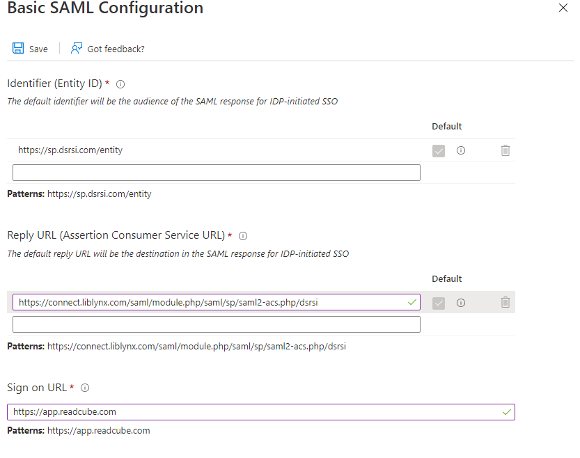

# Configure ReadCube Papers for Single sign-on with Microsoft Entra ID

In this article,  you learn how to integrate ReadCube Papers with Microsoft Entra ID. When you integrate ReadCube Papers with Microsoft Entra ID, you can:

* Control in Microsoft Entra ID who has access to ReadCube Papers.
* Enable your users to be automatically signed-in to ReadCube Papers with their Microsoft Entra accounts.
* Manage your accounts in one central location.

## Prerequisites
The scenario outlined in this article assumes that you already have the following prerequisites:

[!INCLUDE [common-prerequisites.md](~/identity/saas-apps/includes/common-prerequisites.md)]
* ReadCube Papers single sign-on (SSO) enabled subscription.

## Scenario description

In this article,  you configure and test Microsoft Entra SSO in a test environment.

* ReadCube Papers supports **SP** initiated SSO.
* ReadCube Papers supports **Just In Time** user provisioning.

> [!NOTE]
> Identifier of this application is a fixed string value so only one instance can be configured in one tenant.

## Add ReadCube Papers from the gallery

To configure the integration of ReadCube Papers into Microsoft Entra ID, you need to add ReadCube Papers from the gallery to your list of managed SaaS apps.

1. Sign in to the [Microsoft Entra admin center](https://entra.microsoft.com) as at least a [Cloud Application Administrator](~/identity/role-based-access-control/permissions-reference.md#cloud-application-administrator).
1. Browse to **Entra ID** > **Enterprise apps** > **New application**.
1. In the **Add from the gallery** section, type **ReadCube Papers** in the search box.
1. Select **ReadCube Papers** from results panel and then add the app. Wait a few seconds while the app is added to your tenant.

 Alternatively, you can also use the [Enterprise App Configuration Wizard](https://portal.office.com/AdminPortal/home?Q=Docs#/azureadappintegration). In this wizard, you can add an application to your tenant, add users/groups to the app, assign roles, and walk through the SSO configuration as well. [Learn more about Microsoft 365 wizards.](/microsoft-365/admin/misc/azure-ad-setup-guides)

## Configure and test Microsoft Entra SSO for ReadCube Papers

Configure and test Microsoft Entra SSO with ReadCube Papers using a test user called **B.Simon**. For SSO to work, you need to establish a link relationship between a Microsoft Entra user and the related user in ReadCube Papers.

To configure and test Microsoft Entra SSO with ReadCube Papers, perform the following steps:

1. **[Configure Microsoft Entra SSO](#configure-azure-ad-sso)** - to enable your users to use this feature.
    1. **Create a Microsoft Entra test user** - to test Microsoft Entra single sign-on with B.Simon.
    1. **Assign the Microsoft Entra test user** - to enable B.Simon to use Microsoft Entra single sign-on.
1. **[Configure ReadCube Papers SSO](#configure-readcube-papers-sso)** - to configure the single sign-on settings on application side.
    1. **[Create ReadCube Papers test user](#create-readcube-papers-test-user)** - to have a counterpart of B.Simon in ReadCube Papers that's linked to the Microsoft Entra representation of user.
1. **[Test SSO](#test-sso)** - to verify whether the configuration works.

## Configure Microsoft Entra SSO

Follow these steps to enable Microsoft Entra SSO.

1. Sign in to the [Microsoft Entra admin center](https://entra.microsoft.com) as at least a [Cloud Application Administrator](~/identity/role-based-access-control/permissions-reference.md#cloud-application-administrator).
1. Browse to **Entra ID** > **Enterprise apps** > **ReadCube Papers** > **Single sign-on**.
1. On the **Select a single sign-on method** page, select **SAML**.
1. On the **Set up single sign-on with SAML** page, select the pencil icon for **Basic SAML Configuration** to edit the settings.

   

1. On the **Basic SAML Configuration** section, perform the following step:
	1. In the **Reply URL (ACS URL)** text box, type the URL: `https://connect.liblynx.com/saml/module.php/saml/sp/saml2-acs.php/dsrsi`
	2. In the **Sign on URL** text box, type the URL: `https://app.readcube.com`

	    

    	 
1. On the **Set up single sign-on with SAML** page, In the **SAML Signing Certificate** section, select copy button to copy **App Federation Metadata Url** and save it on your computer.

	

[!INCLUDE [create-assign-users-sso.md](~/identity/saas-apps/includes/create-assign-users-sso.md)]

## Configure ReadCube Papers SSO

To configure single sign-on on the **ReadCube Papers** side, you need to send the **App Federation Metadata URL** to the [ReadCube Papers support team](mailto:sso-support@readcube.com). They change this setting so that the SAML SSO connection works properly on both sides.

### Create ReadCube Papers test user

In this section, a user called B.Simon is created in ReadCube Papers. ReadCube Papers supports just-in-time user provisioning, which is enabled by default. There's no action item for you in this section. If a user doesn't already exist in ReadCube Papers, a new one is created after authentication.

## Test SSO 

In this section, you test your Microsoft Entra single sign-on configuration with following options. 

> [!NOTE]
> Before testing, please confirm with the [ReadCube Papers support team](mailto:sso-support@readcube.com) that SSO is set up on the ReadCube side.

* Select **Test this application**, this option redirects to ReadCube Papers Sign-on URL where you can initiate the login flow. 

* Go to ReadCube Papers Sign-on URL directly and initiate the login flow from there.

* You can use Microsoft My Apps. When you select the ReadCube Papers tile in the My Apps portal, this option redirects to ReadCube Papers Sign-on URL. For more information about the My Apps portal, see [Introduction to My Apps](https://support.microsoft.com/account-billing/sign-in-and-start-apps-from-the-my-apps-portal-2f3b1bae-0e5a-4a86-a33e-876fbd2a4510).

## Related content

After you configure ReadCube Papers, you can enforce session control, which protects exfiltration and infiltration of your organization’s sensitive data in real time. Session control extends from Conditional Access. [Learn how to enforce session control with Microsoft Defender for Cloud Apps](/cloud-app-security/proxy-deployment-aad).
