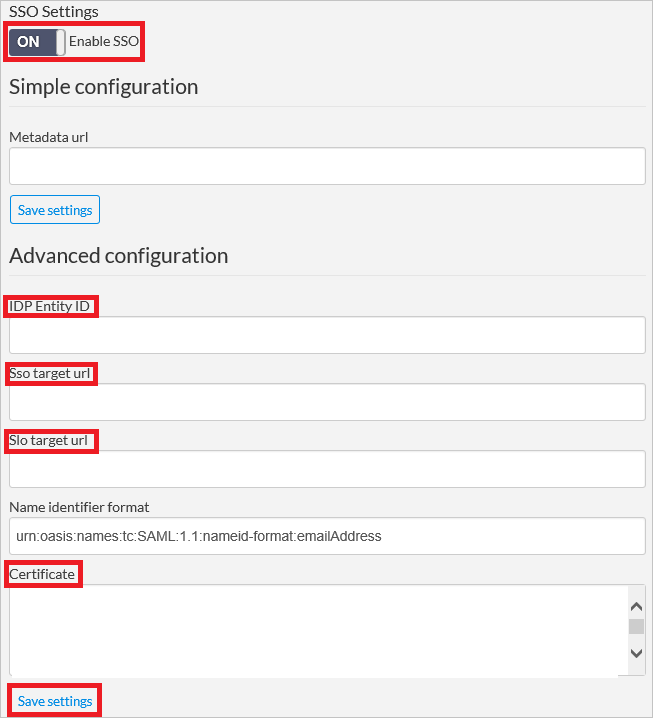
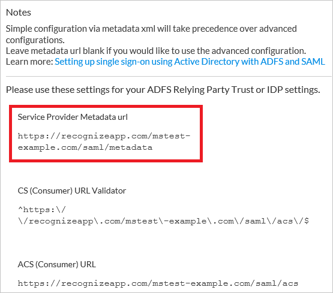
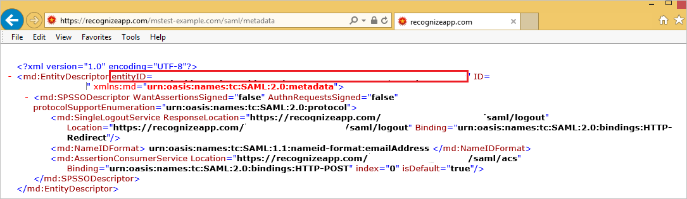
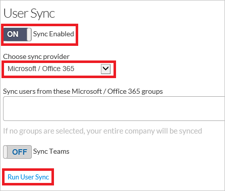

# Configure Recognize for Single sign-on with Microsoft Entra ID

In this article,  you learn how to integrate Recognize with Microsoft Entra ID. When you integrate Recognize with Microsoft Entra ID, you can:

* Control in Microsoft Entra ID who has access to Recognize.
* Enable your users to be automatically signed-in to Recognize with their Microsoft Entra accounts.
* Manage your accounts in one central location.

## Prerequisites
The scenario outlined in this article assumes that you already have the following prerequisites:

[!INCLUDE [common-prerequisites.md](~/identity/saas-apps/includes/common-prerequisites.md)]
* Recognize single sign-on (SSO) enabled subscription.

## Scenario description

In this article,  you configure and test Microsoft Entra single sign-on in a test environment.

* Recognize supports **SP** initiated SSO.

## Add Recognize from the gallery

To configure the integration of Recognize into Microsoft Entra ID, you need to add Recognize from the gallery to your list of managed SaaS apps.

1. Sign in to the [Microsoft Entra admin center](https://entra.microsoft.com) as at least a [Cloud Application Administrator](~/identity/role-based-access-control/permissions-reference.md#cloud-application-administrator).
1. Browse to **Entra ID** > **Enterprise apps** > **New application**.
1. In the **Add from the gallery** section, type **Recognize** in the search box.
1. Select **Recognize** from results panel and then add the app. Wait a few seconds while the app is added to your tenant.

 Alternatively, you can also use the [Enterprise App Configuration Wizard](https://portal.office.com/AdminPortal/home?Q=Docs#/azureadappintegration). In this wizard, you can add an application to your tenant, add users/groups to the app, assign roles, and walk through the SSO configuration as well. [Learn more about Microsoft 365 wizards.](/microsoft-365/admin/misc/azure-ad-setup-guides)

## Configure and test Microsoft Entra SSO for Recognize

Configure and test Microsoft Entra SSO with Recognize using a test user called **B.Simon**. For SSO to work, you need to establish a link relationship between a Microsoft Entra user and the related user in Recognize.

To configure and test Microsoft Entra SSO with Recognize, perform the following steps:

1. **[Configure Microsoft Entra SSO](#configure-azure-ad-sso)** - to enable your users to use this feature.
    1. **Create a Microsoft Entra test user** - to test Microsoft Entra single sign-on with B.Simon.
    1. **Assign the Microsoft Entra test user** - to enable B.Simon to use Microsoft Entra single sign-on.
1. **[Configure Recognize SSO](#configure-recognize-sso)** - to configure the single sign-on settings on application side.
    1. **[Create Recognize test user](#create-recognize-test-user)** - to have a counterpart of B.Simon in Recognize that's linked to the Microsoft Entra representation of user.
1. **[Test SSO](#test-sso)** - to verify whether the configuration works.

## Configure Microsoft Entra SSO

Follow these steps to enable Microsoft Entra SSO.

1. Sign in to the [Microsoft Entra admin center](https://entra.microsoft.com) as at least a [Cloud Application Administrator](~/identity/role-based-access-control/permissions-reference.md#cloud-application-administrator).
1. Browse to **Entra ID** > **Enterprise apps** > **Recognize** > **Single sign-on**.
1. On the **Select a single sign-on method** page, select **SAML**.
1. On the **Set up single sign-on with SAML** page, select the pencil icon for **Basic SAML Configuration** to edit the settings.

   

1. On the **Basic SAML Configuration** section, if you have **Service Provider metadata file**, perform the following steps:

	>[!NOTE]
	>You get the **Service Provider metadata file** from the **Configure Recognize Single Sign-On** section of the article.

	a. Select **Upload metadata file**.

	

	b. Select **folder logo** to select the metadata file and select **Upload**.

	

	c. After the metadata file is successfully uploaded, the **Identifier** value get auto populated in Basic SAML Configuration section.

	 In the **Sign on URL** text box, type a URL using the following pattern:
    `https://recognizeapp.com/<YOUR_DOMAIN>/saml/sso`

    > [!Note]
	> If the **Identifier** value don't get auto populated, you get the Identifier value by opening the Service Provider Metadata URL from the SSO Settings section that's explained later in the **Configure Recognize Single Sign-On** section of the article. The Sign-on URL value isn't real. Update the value with the actual Sign-on URL. Contact [Recognize Client support team](mailto:support@recognizeapp.com) to get the value. You can also refer to the patterns shown in the **Basic SAML Configuration** section.

1. On the **Set up Single Sign-On with SAML** page, in the **SAML Signing Certificate** section, select **Download** to download the **Certificate (Base64)** from the given options as per your requirement and save it on your computer.

	

1. On the **Set up Recognize** section, copy the appropriate URL(s) as per your requirement.

	

[!INCLUDE [create-assign-users-sso.md](~/identity/saas-apps/includes/create-assign-users-sso.md)]

## Configure Recognize SSO

1. In a different web browser window, sign in to your Recognize tenant as an administrator.

2. On the upper right corner, select **Menu**. Go to **Company Admin**.
   
    

3. On the left navigation pane, select **Settings**.
   
    

4. Perform the following steps on **SSO Settings** section.
   
    
	
	a. As **Enable SSO**, select **ON**.

	b. In the **IDP Entity ID** textbox, paste the value of **Microsoft Entra Identifier**..
	
	c. In the **Sso target url** textbox, paste the value of **Login URL**..
	
	d. In the **Slo target url** textbox, paste the value of **Logout URL**.. 
	
	e. Open your downloaded **Certificate (Base64)** file in notepad, copy the content of it into your clipboard, and then paste it to the **Certificate** textbox.
	
	f. Select the **Save settings** button. 

5. Beside the **SSO Settings** section, copy the URL under **Service Provider Metadata url**.
   
    

6. Open the **Metadata URL link** under a blank browser to download the metadata document. Then copy the EntityDescriptor value(entityID) from the file and paste it in **Identifier** textbox in **Basic SAML Configuration** on Azure portal.
    
    

### Create Recognize test user

In order to enable Microsoft Entra users to log into Recognize, they must be provisioned into Recognize. In the case of Recognize, provisioning is a manual task.

This app doesn't support SCIM provisioning but has an alternate user sync that provisions users. 

**To provision a user account, perform the following steps:**

1. Sign into your Recognize company site as an administrator.

2. On the upper right corner, select **Menu**. Go to **Company Admin**.

3. On the left navigation pane, select **Settings**.

4. Perform the following steps on **User Sync** section.
   
	
   
	a. As **Sync Enabled**, select **ON**.
   
	b. As **Choose sync provider**, select **Microsoft / Office 365**.
   
	c. Select **Run User Sync**.

## Test SSO 

In this section, you test your Microsoft Entra single sign-on configuration with following options. 

* Select **Test this application**, this option redirects to Recognize Sign-on URL where you can initiate the login flow. 

* Go to Recognize Sign-on URL directly and initiate the login flow from there.

* You can use Microsoft My Apps. When you select the Recognize tile in the My Apps, this option redirects to Recognize Sign-on URL. For more information about the My Apps, see [Introduction to the My Apps](https://support.microsoft.com/account-billing/sign-in-and-start-apps-from-the-my-apps-portal-2f3b1bae-0e5a-4a86-a33e-876fbd2a4510).

## Related content

Once you configure Recognize you can enforce session control, which protects exfiltration and infiltration of your organization’s sensitive data in real time. Session control extends from Conditional Access. [Learn how to enforce session control with Microsoft Defender for Cloud Apps](/cloud-app-security/proxy-deployment-aad).
