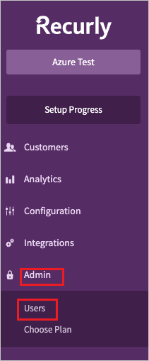
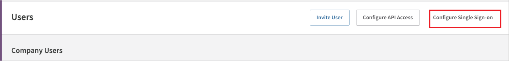
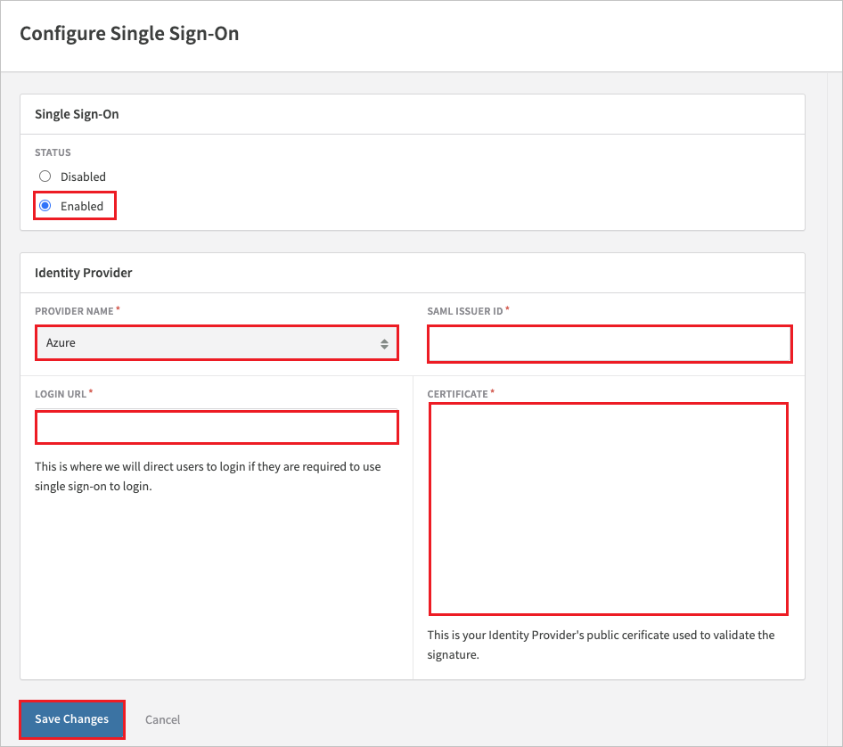
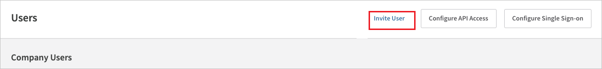
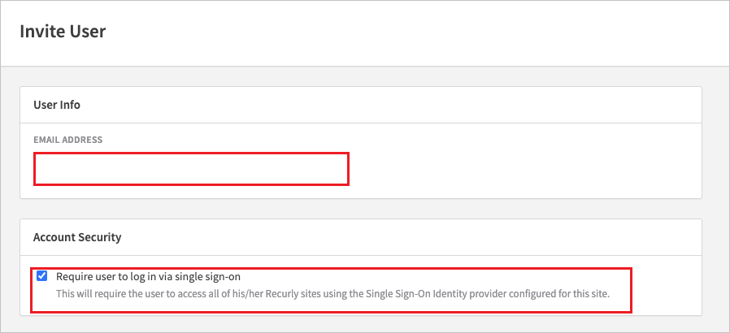

# Configure Recurly for Single sign-on with Microsoft Entra ID

In this article,  you learn how to integrate Recurly with Microsoft Entra ID. When you integrate Recurly with Microsoft Entra ID, you can:

* Control in Microsoft Entra ID who has access to Recurly.
* Enable your users to be automatically signed-in to Recurly with their Microsoft Entra accounts.
* Manage your accounts in one central location.

## Prerequisites
The scenario outlined in this article assumes that you already have the following prerequisites:

[!INCLUDE [common-prerequisites.md](~/identity/saas-apps/includes/common-prerequisites.md)]
* Recurly single sign-on (SSO) enabled subscription.

## Scenario description

In this article,  you configure and test Microsoft Entra SSO in a test environment.

* Recurly supports **SP and IDP** initiated SSO.

> [!NOTE]
> Identifier of this application is a fixed string value so only one instance can be configured in one tenant.

## Add Recurly from the gallery

To configure the integration of Recurly into Microsoft Entra ID, you need to add Recurly from the gallery to your list of managed SaaS apps.

1. Sign in to the [Microsoft Entra admin center](https://entra.microsoft.com) as at least a [Cloud Application Administrator](~/identity/role-based-access-control/permissions-reference.md#cloud-application-administrator).
1. Browse to **Entra ID** > **Enterprise apps** > **New application**.
1. In the **Add from the gallery** section, type **Recurly** in the search box.
1. Select **Recurly** from results panel and then add the app. Wait a few seconds while the app is added to your tenant.

 Alternatively, you can also use the [Enterprise App Configuration Wizard](https://portal.office.com/AdminPortal/home?Q=Docs#/azureadappintegration). In this wizard, you can add an application to your tenant, add users/groups to the app, assign roles, and walk through the SSO configuration as well. [Learn more about Microsoft 365 wizards.](/microsoft-365/admin/misc/azure-ad-setup-guides)

## Configure and test Microsoft Entra SSO for Recurly

Configure and test Microsoft Entra SSO with Recurly using a test user called **B.Simon**. For SSO to work, you need to establish a link relationship between a Microsoft Entra user and the related user in Recurly.

To configure and test Microsoft Entra SSO with Recurly, perform the following steps:

1. **[Configure Microsoft Entra SSO](#configure-azure-ad-sso)** - to enable your users to use this feature.
    1. **Create a Microsoft Entra test user** - to test Microsoft Entra single sign-on with B.Simon.
    1. **Assign the Microsoft Entra test user** - to enable B.Simon to use Microsoft Entra single sign-on.
1. **[Configure Recurly SSO](#configure-recurly-sso)** - to configure the single sign-on settings on application side.
    1. **[Create Recurly test user](#create-recurly-test-user)** - to have a counterpart of B.Simon in Recurly that's linked to the Microsoft Entra representation of user.
1. **[Test SSO](#test-sso)** - to verify whether the configuration works.

## Configure Microsoft Entra SSO

Follow these steps to enable Microsoft Entra SSO.

1. Sign in to the [Microsoft Entra admin center](https://entra.microsoft.com) as at least a [Cloud Application Administrator](~/identity/role-based-access-control/permissions-reference.md#cloud-application-administrator).
1. Browse to **Entra ID** > **Enterprise apps** > **Recurly** application integration page, find the **Manage** section and select **single sign-on**.
1. On the **Select a single sign-on method** page, select **SAML**.
1. On the **Set up single sign-on with SAML** page, select the pencil icon for **Basic SAML Configuration** to edit the settings.

   

1. On the **Basic SAML Configuration** section, the **Identifier** and **Reply URL** values are pre-configured with `https://app.recurly.com` and `https://app.recurly.com/login/sso` respectively. Perform the following step to complete the configuration:

    a. In the **Sign-on URL** text box, type the URL:
   `https://app.recurly.com/login/sso`

1. On the **Set up single sign-on with SAML** page, in the **SAML Signing Certificate** section, select **Edit**, select the `...` next to the thumbprint status, select **PEM certificate download** to download the certificate and save it on your computer.   

	

1. Your Recurly application expects the SAML assertions in a specific format, which requires you to add custom attribute mappings to your SAML token attributes configuration.
   The following screenshot shows an example of this. The default value of **Unique User Identifier** is **user.userprincipalname** but Recurly expects this to be mapped with the user's email address. For that you can use **user.mail** attribute from the list or use the appropriate attribute value based on your organization configuration.
    
   

7. Recurly application expects to enable token encryption in order to make SSO work. To activate token encryption, Browse to **Entra ID** > **Enterprise apps** > select your application > **Token encryption**. For more information see the article [Configure Microsoft Entra SAML token encryption](~/identity/enterprise-apps/howto-saml-token-encryption.md).

   1. Please contact [Recurly Support](mailto:support@recurly.com) to get a copy of the certificate to import.
   1. After importing the certificate, select the `...` next to the thumbprint status, select `Activate token encryption certificate`.
   1. For more information on configuring token encryption, please refer this [link](~/identity/enterprise-apps/howto-saml-token-encryption.md).

[!INCLUDE [create-assign-users-sso.md](~/identity/saas-apps/includes/create-assign-users-sso.md)]

## Configure Recurly SSO

Follow these steps to configure single sign-on for your **Recurly** site.

1. Log into your Recurly company site as an administrator.

2. Navigate to **Admin** > **Users**.

   

3.  Select the **Configure Single Sign on** button on the top right.   

    

4. In the **Single Sign-On** section, select the **Enabled** radio button and perform the following steps in the **Identity Provider** section:

    

   a. In **PROVIDER NAME**, select **Azure**.

   b. In the **SAML ISSUER ID** textbox, paste the **Application(Client ID)** value.

   c. In the **LOGIN URL** textbox, paste the **Login URL** value which you copied previously.

   d. Open the downloaded Certificate (PEM) into Notepad and paste the content into the **CERTIFICATE** textbox.

   e. Select **Save Changes**.

### Create Recurly test user

In this section, you invite a new user to join your site and require them to use SSO to test the configuration.

1. Navigate to **Admin** > **Users**, select **Invite User** and type the email address of the Azure test user that was previously created. Your invitation will default to requiring them to use SSO.

   

   

2. The test user will receive an email from Recurly inviting them to join your site.

3. After accepting the invite, the test user is listed under **Company Users** in your site and is able to log in using SSO.

## Test SSO 

In this section, you test your Microsoft Entra single sign-on configuration with following options. 

#### SP initiated:

* Select **Test this application**, this option redirects to Recurly Sign on URL where you can initiate the login flow.  

* Go to Recurly Sign-on URL directly and initiate the login flow from there.

#### IDP initiated:

* Select **Test this application**, and you should be automatically signed in to the Recurly for which you set up the SSO. 

You can also use Microsoft My Apps to test the application in any mode. When you select the Recurly tile in the My Apps, if configured in SP mode you would be redirected to the application sign on page for initiating the login flow and if configured in IDP mode, you should be automatically signed in to the Recurly for which you set up the SSO. For more information, see [Microsoft Entra My Apps](/azure/active-directory/manage-apps/end-user-experiences#azure-ad-my-apps).

## Related content

Once you configure Recurly you can enforce session control, which protects exfiltration and infiltration of your organization’s sensitive data in real time. Session control extends from Conditional Access. [Learn how to enforce session control with Microsoft Cloud App Security](/cloud-app-security/proxy-deployment-aad).
