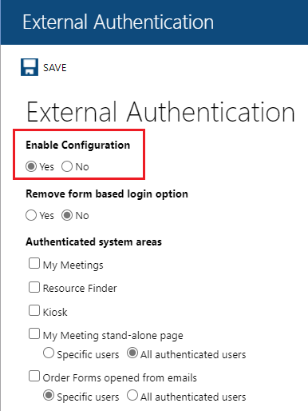
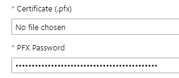

# Configure Resource Central – SAML SSO for Meeting Room Booking System for Single sign-on with Microsoft Entra ID

In this article,  you learn how to integrate Resource Central – SAML SSO for Meeting Room Booking System with Microsoft Entra ID. When you integrate Resource Central – SAML SSO for Meeting Room Booking System with Microsoft Entra ID, you can:

* Control in Microsoft Entra ID who has access to Resource Central – SAML SSO for Meeting Room Booking System.
* Enable your users to be automatically signed-in to Resource Central – SAML SSO for Meeting Room Booking System with their Microsoft Entra accounts.
* Manage your accounts in one central location.

## Prerequisites
The scenario outlined in this article assumes that you already have the following prerequisites:

[!INCLUDE [common-prerequisites.md](~/identity/saas-apps/includes/common-prerequisites.md)]
* Resource Central – SAML SSO for Meeting Room Booking System single sign-on (SSO) enabled subscription.

## Scenario description

In this article,  you configure and test Microsoft Entra SSO in a test environment.

* Resource Central – SAML SSO for Meeting Room Booking System supports **SP** initiated SSO

* Resource Central – SAML SSO for Meeting Room Booking System supports **Just In Time** user provisioning

## Add Resource Central – SAML SSO for Meeting Room Booking System from the gallery

To configure the integration of Resource Central – SAML SSO for Meeting Room Booking System into Microsoft Entra ID, you need to add Resource Central – SAML SSO for Meeting Room Booking System from the gallery to your list of managed SaaS apps.

1. Sign in to the [Microsoft Entra admin center](https://entra.microsoft.com) as at least a [Cloud Application Administrator](~/identity/role-based-access-control/permissions-reference.md#cloud-application-administrator).
1. Browse to **Entra ID** > **Enterprise apps** > **New application**.
1. In the **Add from the gallery** section, in the search box, enter **Resource Central – SAML SSO for Meeting Room Booking System**.
1. Select **Resource Central – SAML SSO for Meeting Room Booking System** from results panel and then add the app. Wait a few seconds while the app is added to your tenant.

 Alternatively, you can also use the [Enterprise App Configuration Wizard](https://portal.office.com/AdminPortal/home?Q=Docs#/azureadappintegration). In this wizard, you can add an application to your tenant, add users/groups to the app, assign roles, and walk through the SSO configuration as well. [Learn more about Microsoft 365 wizards.](/microsoft-365/admin/misc/azure-ad-setup-guides)

## Configure and test Microsoft Entra SSO for Resource Central – SAML SSO for Meeting Room Booking System

Configure and test Microsoft Entra SSO with Resource Central – SAML SSO for Meeting Room Booking System using a test user called **B.Simon**. For SSO to work, you need to establish a link relationship between a Microsoft Entra user and the related user in Resource Central – SAML SSO for Meeting Room Booking System.

To configure and test Microsoft Entra SSO with Resource Central – SAML SSO for Meeting Room Booking System, perform the following steps:

1. **[Configure Microsoft Entra SSO](#configure-azure-ad-sso)** - to enable your users to use this feature.
    1. **Create a Microsoft Entra test user** - to test Microsoft Entra single sign-on with B.Simon.
    1. **Assign the Microsoft Entra test user** - to enable B.Simon to use Microsoft Entra single sign-on.
    1. **[Create Resource Central SAML SSO for Meeting Room Booking System test user](#create-resource-central-saml-sso-for-meeting-room-booking-system-test-user)** - to have a counterpart of B.Simon in Resource Central – SAML SSO for Meeting Room Booking System that's linked to the Microsoft Entra representation of user.
1. **[Configure Resource Central SAML SSO for Meeting Room Booking System SSO](#configure-resource-central-saml-sso-for-meeting-room-booking-system-sso)** - to configure the single sign-on settings on application side.
1. **[Test SSO](#test-sso)** - to verify whether the configuration works.

## Configure Microsoft Entra SSO

Follow these steps to enable Microsoft Entra SSO.

1. Sign in to the [Microsoft Entra admin center](https://entra.microsoft.com) as at least a [Cloud Application Administrator](~/identity/role-based-access-control/permissions-reference.md#cloud-application-administrator).
1. Browse to **Entra ID** > **Enterprise apps** > **Resource Central – SAML SSO for Meeting Room Booking System** > **Single sign-on**.
1. On the **Select a single sign-on method** page, select **SAML**.
1. On the **Set up single sign-on with SAML** page, select the edit/pen icon for **Basic SAML Configuration** to edit the settings.

   

1. In **Basic SAML Configuration**, enter the values for the following fields:

   1. In the **Sign on URL** text box, type a URL using the following pattern: `https://<DOMAIN_NAME>/ResourceCentral`

   1. In the **Identifier (Entity ID)** text box, type a URL using the following pattern:  `https://<DOMAIN_NAME>/ResourceCentral`

   1. In the **Reply URL** text box, type a URL using the following pattern: `https://<DOMAIN_NAME>/ResourceCentral/ExAuth/Saml2Authentication/Acs`

    > [!NOTE]
    > These values aren't literal values. Update these values with the actual Sign-on URL, Identifier, and Reply URL values. Contact [Resource Central – SAML SSO for Meeting Room Booking System Client support team](mailto:st@aod.vn) to get these values.  You can also refer to the patterns shown in the **Basic SAML Configuration** section.

1. On the **Set up single sign-on with SAML** page, in **SAML Signing Certificate**,  find **Certificate (Base64)** and select **Download** to download the certificate and save it on your computer.

	

1. In **Set up Resource Central – SAML SSO for Meeting Room Booking System**, copy the appropriate URL(s) based on your requirement.

	

[!INCLUDE [create-assign-users-sso.md](~/identity/saas-apps/includes/create-assign-users-sso.md)]

### Create Resource Central SAML SSO for Meeting Room Booking System test user

In this section, a user called **B.Simon** is created in **Resource Central – SAML SSO for Meeting Room Booking System**.

1. In Resource Central – SAML SSO for Meeting Room Booking System, select **Security** > **Persons** > **New**.
  
    :::image type="content" source="./media/resource-central/new-person.png" alt-text="Screenshot that shows the Persons pane in Resource Central, with the New button highlighted.":::

1. In **Person Details**, for **Display name**, enter the user **B.Simon**. For **SMTP Address**, enter the user's Microsoft Entra user name. For example,  `B.Simon@contoso.com`.

    :::image type="content" source="./media/resource-central/person.png" alt-text="Screenshot that shows the Person Details pane in Resource Central.":::

## Configure Resource Central SAML SSO for Meeting Room Booking System SSO

In this section, you configure single sign-on in **Resource Central System Administrator**.

1. In Resource Central – SAML SSO for Meeting Room Booking System System Administrator, select **External Authentication**.
1.  For **Enable Configuration**, select **Yes**.

    

1. In **Authentication Protocol**, select **SAML2**. 

   :::image type="content" source="./media/resource-central/protocol.png" alt-text="Screenshot that shows SAML2 selected for Authentication Protocol in Resource Central.":::

1. Under **SAML2 Configuration**, enter the values for the following fields:

    1. For **Identifier (Entity ID)**, **Login URL**, **Logout URL**, and **Microsoft Entra Identifier**, enter the relevant URLs:

       :::image type="content" source="./media/resource-central/auth.png" alt-text="Screenshot of the SAML2 Configuration pane in Resource Central.":::

        Copy the URLs from the **Set up Resource Central – SAML SSO for Meeting Room Booking System** pane:

        :::image type="content" source="./media/resource-central/setup.png" alt-text="Screenshot of the Set up Resource Central pane in Resource Central.":::

   1. For **Return URL**, enter `https://<DOMAIN_NAME>/ResourceCentral/ExAuth/Saml2Authentication/CallbackHandler`.
  
1. For **Certificate**, upload your certificate and enter your password.

   
   
1. Select **Save**.

1. Return to the **Azure portal**. In **SAML Signing Certificate**, upload your certificate and enter your password.

1. Select **Add**.

## Test SSO 

In this section, you test your Microsoft Entra single sign-on configuration. To test single sign-on, you have three options:

* In the Azure portal, select **Test this application**. The link redirects to the Resource Central – SAML SSO for Meeting Room Booking System sign-on URL, where you can initiate login.

* Go to the Resource Central – SAML SSO for Meeting Room Booking System sign-on URL directly and initiate login.

   :::image type="content" source="./media/resource-central/test.png" alt-text="Screenshot of the Resource Central single sign-on test webpage.":::

* Use the My Apps portal from Microsoft. In the My Apps portal, select the **Resource Central – SAML SSO for Meeting Room Booking System** tile to redirect to the Resource Central – SAML SSO for Meeting Room Booking System sign-on URL. For more information, see [Sign in and start apps from the My Apps portal](https://support.microsoft.com/account-billing/sign-in-and-start-apps-from-the-my-apps-portal-2f3b1bae-0e5a-4a86-a33e-876fbd2a4510).

## Related content

After you set up Resource Central – SAML SSO for Meeting Room Booking System for single sign-on with Microsoft Entra ID, you can enforce session control, which protects exfiltration and infiltration of your organization’s sensitive data in real time. Session control extends from Conditional Access. [Learn how to enforce session control with Microsoft Defender for Cloud Apps](/cloud-app-security/proxy-deployment-any-app).
