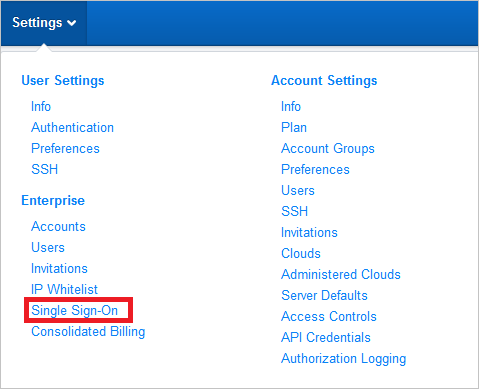
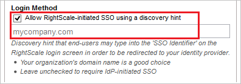

# Configure Rightscale for Single sign-on with Microsoft Entra ID

In this article,  you learn how to integrate Rightscale with Microsoft Entra ID. When you integrate Rightscale with Microsoft Entra ID, you can:

* Control in Microsoft Entra ID who has access to Rightscale.
* Enable your users to be automatically signed-in to Rightscale with their Microsoft Entra accounts.
* Manage your accounts in one central location.

## Prerequisites
The scenario outlined in this article assumes that you already have the following prerequisites:

[!INCLUDE [common-prerequisites.md](~/identity/saas-apps/includes/common-prerequisites.md)]
* Rightscale single sign-on enabled subscription.

## Scenario description

In this article,  you configure and test Microsoft Entra single sign-on in a test environment.

* Rightscale supports **SP and IDP** initiated SSO.

## Add Rightscale from the gallery

To configure the integration of Rightscale into Microsoft Entra ID, you need to add Rightscale from the gallery to your list of managed SaaS apps.

1. Sign in to the [Microsoft Entra admin center](https://entra.microsoft.com) as at least a [Cloud Application Administrator](~/identity/role-based-access-control/permissions-reference.md#cloud-application-administrator).
1. Browse to **Entra ID** > **Enterprise apps** > **New application**.
1. In the **Add from the gallery** section, type **Rightscale** in the search box.
1. Select **Rightscale** from results panel and then add the app. Wait a few seconds while the app is added to your tenant.

 Alternatively, you can also use the [Enterprise App Configuration Wizard](https://portal.office.com/AdminPortal/home?Q=Docs#/azureadappintegration). In this wizard, you can add an application to your tenant, add users/groups to the app, assign roles, and walk through the SSO configuration as well. [Learn more about Microsoft 365 wizards.](/microsoft-365/admin/misc/azure-ad-setup-guides)

## Configure and test Microsoft Entra SSO for Rightscale

Configure and test Microsoft Entra SSO with Rightscale using a test user called **B.Simon**. For SSO to work, you need to establish a link relationship between a Microsoft Entra user and the related user in Rightscale.

To configure and test Microsoft Entra SSO with Rightscale, perform the following steps:

1. **[Configure Microsoft Entra SSO](#configure-azure-ad-sso)** - to enable your users to use this feature.
    1. **Create a Microsoft Entra test user** - to test Microsoft Entra single sign-on with B.Simon.
    2. **Assign the Microsoft Entra test user** - to enable B.Simon to use Microsoft Entra single sign-on.
2. **[Configure Rightscale SSO](#configure-rightscale-sso)** - to configure the single sign-on settings on application side.
    1. **[Create Rightscale test user](#create-rightscale-test-user)** - to have a counterpart of B.Simon in Rightscale that's linked to the Microsoft Entra representation of user.
3. **[Test SSO](#test-sso)** - to verify whether the configuration works.

## Configure Microsoft Entra SSO

Follow these steps to enable Microsoft Entra SSO.

1. Sign in to the [Microsoft Entra admin center](https://entra.microsoft.com) as at least a [Cloud Application Administrator](~/identity/role-based-access-control/permissions-reference.md#cloud-application-administrator).
1. Browse to **Entra ID** > **Enterprise apps** > **Rightscale** > **Single sign-on**.
1. On the **Select a single sign-on method** page, select **SAML**.
1. On the **Set up single sign-on with SAML** page, select the pencil icon for **Basic SAML Configuration** to edit the settings.

   

1. On the **Basic SAML Configuration** section, the user doesn't have to perform any step as the app is already pre-integrated with Azure.

5. Select **Set additional URLs** and perform the following step if you wish to configure the application in **SP** initiated mode:

    In the **Sign-on URL** text box, type the URL:
    `https://login.rightscale.com/`

6. On the **Set up Single Sign-On with SAML** page, in the **SAML Signing Certificate** section, select **Download** to download the **Certificate (Base64)** from the given options as per your requirement and save it on your computer.

	

7. On the **Set up Rightscale** section, copy the appropriate URL(s) as per your requirement.

	

[!INCLUDE [create-assign-users-sso.md](~/identity/saas-apps/includes/create-assign-users-sso.md)]

## Configure Rightscale SSO

1. To get SSO configured for your application, you need to sign-on to your RightScale tenant as an administrator.

2. In the menu on the top, select the **Settings** tab and select **Single Sign-On**.

    

3. Select the **new** button to add **Your SAML Identity Providers**.

    

4. In the textbox of **Display Name**, input your company name.

    

5. Select **Allow RightScale-initiated SSO using a discovery hint** and input your **domain name** in the below textbox.

    

6. Paste the value of **Login URL** which you have into **SAML SSO Endpoint** in RightScale.

    

7. Paste the value of **Microsoft Entra Identifier** which you have into **SAML EntityID** in RightScale.

    

8. Select **Browser** button to upload the certificate which you downloaded previously.

    

9. Select **Save**.

### Create Rightscale test user

In this section, you create a user called Britta Simon in Rightscale. Work with [Rightscale Client support team](mailto:support@rightscale.com) to add the users in the Rightscale platform. Users must be created and activated before you use SSO.

## Test SSO

In this section, you test your Microsoft Entra SSO configuration with following options.

#### SP initiated:

* Select **Test this application**, this option redirects to Rightscale Sign on URL where you can initiate the login flow.

* Go to Rightscale Sign-on URL directly and initiate the login flow from there.

#### IDP initiated:

* Select **Test this application**, and you should be automatically signed in to the Rightscale for which you set up the SSO

You can also use Microsoft My Apps to test the application in any mode. When you select the Rightscale tile in the My Apps, if configured in SP mode you would be redirected to the application sign on page for initiating the login flow and if configured in IDP mode, you should be automatically signed in to the Rightscale for which you set up the SSO. For more information about the My Apps, see [Introduction to the My Apps](https://support.microsoft.com/account-billing/sign-in-and-start-apps-from-the-my-apps-portal-2f3b1bae-0e5a-4a86-a33e-876fbd2a4510).

## Related content

Once you configure Rightscale you can enforce session control, which protects exfiltration and infiltration of your organization’s sensitive data in real time. Session control extends from Conditional Access. [Learn how to enforce session control with Microsoft Defender for Cloud Apps](/cloud-app-security/proxy-deployment-aad).
