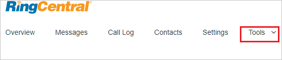
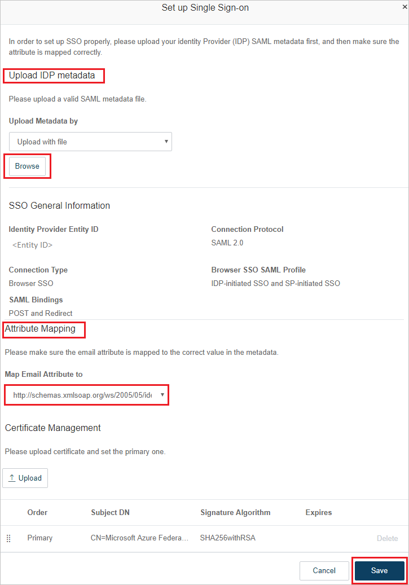
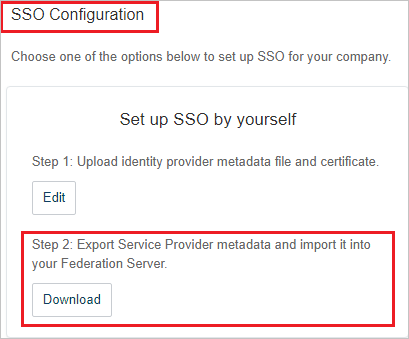
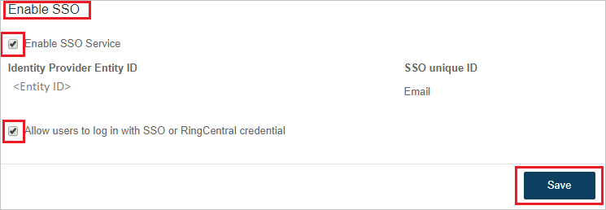

# Configure RingCentral for Single sign-on with Microsoft Entra ID

In this article,  you learn how to integrate RingCentral with Microsoft Entra ID. When you integrate RingCentral with Microsoft Entra ID, you can:

* Control in Microsoft Entra ID who has access to RingCentral.
* Enable your users to be automatically signed-in to RingCentral with their Microsoft Entra accounts.
* Manage your accounts in one central location.

## Prerequisites
The scenario outlined in this article assumes that you already have the following prerequisites:

[!INCLUDE [common-prerequisites.md](~/identity/saas-apps/includes/common-prerequisites.md)]
* RingCentral single sign-on (SSO) enabled subscription.

> [!NOTE]
> This integration is also available to use from Microsoft Entra US Government Cloud environment. You can find this application in the Microsoft Entra US Government Cloud Application Gallery and configure it in the same way as you do from public cloud.

## Scenario description

In this article,  you configure and test Microsoft Entra SSO in a test environment.

* RingCentral supports **IDP** initiated SSO.

* RingCentral supports  [Automated user provisioning](ringcentral-provisioning-tutorial.md).

## Add RingCentral from the gallery

To configure the integration of RingCentral into Microsoft Entra ID, you need to add RingCentral from the gallery to your list of managed SaaS apps.

1. Sign in to the [Microsoft Entra admin center](https://entra.microsoft.com) as at least a [Cloud Application Administrator](~/identity/role-based-access-control/permissions-reference.md#cloud-application-administrator).
1. Browse to **Entra ID** > **Enterprise apps** > **New application**.
1. In the **Add from the gallery** section, type **RingCentral** in the search box.
1. Select **RingCentral** from results panel and then add the app. Wait a few seconds while the app is added to your tenant.

 Alternatively, you can also use the [Enterprise App Configuration Wizard](https://portal.office.com/AdminPortal/home?Q=Docs#/azureadappintegration). In this wizard, you can add an application to your tenant, add users/groups to the app, assign roles, and walk through the SSO configuration as well. [Learn more about Microsoft 365 wizards.](/microsoft-365/admin/misc/azure-ad-setup-guides)

## Configure and test Microsoft Entra SSO for RingCentral

Configure and test Microsoft Entra SSO with RingCentral using a test user called **Britta Simon**. For SSO to work, you need to establish a link relationship between a Microsoft Entra user and the related user in RingCentral.

To configure and test Microsoft Entra SSO with RingCentral, perform the following steps:

1. **[Configure Microsoft Entra SSO](#configure-azure-ad-sso)** - to enable your users to use this feature.
    * **Create a Microsoft Entra test user** - to test Microsoft Entra single sign-on with B.Simon.
    * **Assign the Microsoft Entra test user** - to enable B.Simon to use Microsoft Entra single sign-on.
1. **[Configure RingCentral SSO](#configure-ringcentral-sso)** - to configure the single sign-on settings on application side.
    * **[Create RingCentral test user](#create-ringcentral-test-user)** - to have a counterpart of B.Simon in RingCentral that's linked to the Microsoft Entra representation of user.
1. **[Test SSO](#test-sso)** - to verify whether the configuration works.

## Configure Microsoft Entra SSO

Follow these steps to enable Microsoft Entra SSO.

1. Sign in to the [Microsoft Entra admin center](https://entra.microsoft.com) as at least a [Cloud Application Administrator](~/identity/role-based-access-control/permissions-reference.md#cloud-application-administrator).
1. Browse to **Entra ID** > **Enterprise apps** > **RingCentral** application integration page, find the **Manage** section and select **Single sign-on**.
1. On the **Select a Single sign-on method** page, select **SAML**.
1. On the **Set up Single Sign-On with SAML** page, select the pencil icon for **Basic SAML Configuration** to edit the settings.

   

1. On the **Basic SAML Configuration** section, if you have **Service Provider metadata file**, perform the following steps:

	1. Select **Upload metadata file**.
	1. Select **folder logo** to select the metadata file and select **Upload**.
	1. After the metadata file is successfully uploaded, the **Identifier** and **Reply URL** values get auto populated in **Basic SAML Configuration** section.

	> [!Note]
	> You get the **Service Provider metadata file** on the RingCentral SSO Configuration page which is explained later in the article.

1. If you don't have **Service Provider metadata file**, enter the values for the following fields:

	a. In the **Identifier** textbox, type one of the URLs:
  
	| Identifier |
	|--|
	|  `https://sso.ringcentral.com` |
	| `https://ssoeuro.ringcentral.com` |

	b. In the **Reply URL** textbox, type one of the URLs:

	| Reply URL |
	|--|
	| `https://sso.ringcentral.com/sp/ACS.saml2` |
	| `https://ssoeuro.ringcentral.com/sp/ACS.saml2` |

1. On the **Set up Single Sign-On with SAML** page, In the **SAML Signing Certificate** section, select copy button to copy **App Federation Metadata Url** and save it on your computer.

	

[!INCLUDE [create-assign-users-sso.md](~/identity/saas-apps/includes/create-assign-users-sso.md)]

## Configure RingCentral SSO

1. In a different web browser window, sign in to your RingCentral company site as an administrator

1. On the top, select **Tools**.

	

1. Navigate to **Single Sign-on**.

	

1. On the **Single Sign-on** page, under **SSO Configuration** section, from **Step 1** select **Edit** and perform the following steps:

	

1. On the **Set up Single Sign-on** page, perform the following steps:

	

	a. Select **Browse** to upload the metadata file which you have downloaded previously.

	b. After uploading metadata the values get auto-populated in **SSO General Information** section.

	c. Under **Attribute Mapping** section, select **Map Email Attribute to** as `http://schemas.xmlsoap.org/ws/2005/05/identity/claims/emailaddress`

	d. Select **Save**.

	e. From **Step 2** select **Download** to download the **Service Provider metadata file** and upload it in **Basic SAML Configuration** section to auto-populate the **Identifier** and **Reply URL** values in Azure portal.

	 

	f. On the same page, navigate to **Enable SSO** section and perform the following steps:

	

	* Select **Enable SSO Service**.

	* Select **Allow users to log in with SSO or RingCentral credential**.

	* Select **Save**.

### Create RingCentral test user

In this section, you create a user called Britta Simon in RingCentral. Work with [RingCentral Client support team](https://success.ringcentral.com/RCContactSupp) to add the users in the RingCentral platform. Users must be created and activated before you use single sign-on.

RingCentral also supports automatic user provisioning, you can find more details [here](./ringcentral-provisioning-tutorial.md) on how to configure automatic user provisioning.

## Test SSO

In this section, you test your Microsoft Entra single sign-on configuration with following options.

* Select **Test this application**, and you should be automatically signed in to the RingCentral for which you set up the SSO.

* You can use Microsoft My Apps. When you select the RingCentral tile in the My Apps, you should be automatically signed in to the RingCentral for which you set up the SSO. For more information about the My Apps, see [Introduction to the My Apps](https://support.microsoft.com/account-billing/sign-in-and-start-apps-from-the-my-apps-portal-2f3b1bae-0e5a-4a86-a33e-876fbd2a4510).

## Related content

Once you configure RingCentral you can enforce session control, which protects exfiltration and infiltration of your organization’s sensitive data in real time. Session control extends from Conditional Access. [Learn how to enforce session control with Microsoft Defender for Cloud Apps](/cloud-app-security/proxy-deployment-any-app).
