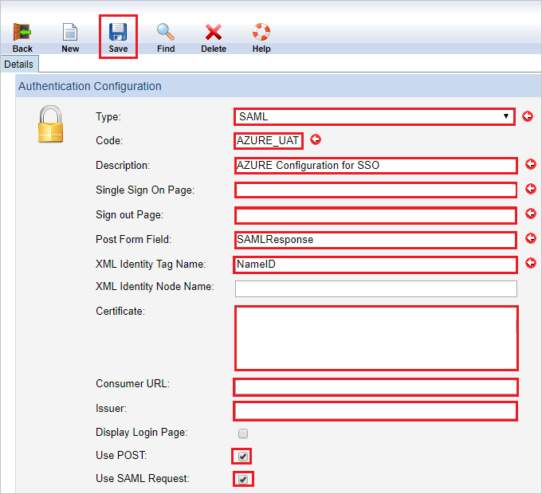
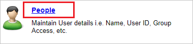
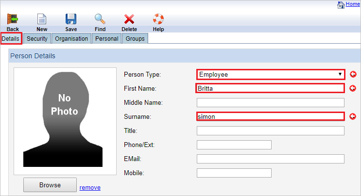
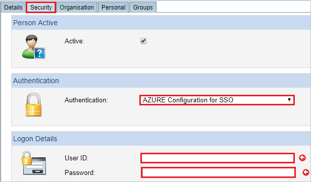
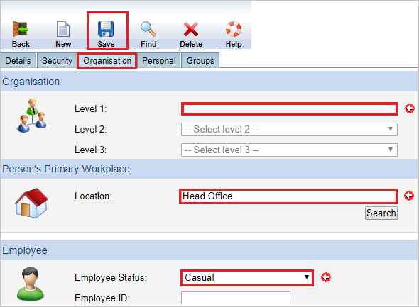

# Configure Riskware for Single sign-on with Microsoft Entra ID

In this article,  you learn how to integrate Riskware with Microsoft Entra ID. When you integrate Riskware with Microsoft Entra ID, you can:

* Control in Microsoft Entra ID who has access to Riskware.
* Enable your users to be automatically signed-in to Riskware with their Microsoft Entra accounts.
* Manage your accounts in one central location.

## Prerequisites

To configure Microsoft Entra integration with Riskware, you need the following items:

* A Microsoft Entra subscription. If you don't have a Microsoft Entra environment, you can get a [free account](https://azure.microsoft.com/free/).
* Riskware single sign-on enabled subscription.
* Along with Cloud Application Administrator, Application Administrator can also add or manage applications in Microsoft Entra ID.
For more information, see [Azure built-in roles](~/identity/role-based-access-control/permissions-reference.md).

## Scenario description

In this article,  you configure and test Microsoft Entra single sign-on in a test environment.

* Riskware supports **SP** initiated SSO.

## Add Riskware from the gallery

To configure the integration of Riskware into Microsoft Entra ID, you need to add Riskware from the gallery to your list of managed SaaS apps.

1. Sign in to the [Microsoft Entra admin center](https://entra.microsoft.com) as at least a [Cloud Application Administrator](~/identity/role-based-access-control/permissions-reference.md#cloud-application-administrator).
1. Browse to **Entra ID** > **Enterprise apps** > **New application**.
1. In the **Add from the gallery** section, type **Riskware** in the search box.
1. Select **Riskware** from results panel and then add the app. Wait a few seconds while the app is added to your tenant.

 Alternatively, you can also use the [Enterprise App Configuration Wizard](https://portal.office.com/AdminPortal/home?Q=Docs#/azureadappintegration). In this wizard, you can add an application to your tenant, add users/groups to the app, assign roles, and walk through the SSO configuration as well. [Learn more about Microsoft 365 wizards.](/microsoft-365/admin/misc/azure-ad-setup-guides)

## Configure and test Microsoft Entra SSO for Riskware

Configure and test Microsoft Entra SSO with Riskware using a test user called **B.Simon**. For SSO to work, you need to establish a link relationship between a Microsoft Entra user and the related user in Riskware.

To configure and test Microsoft Entra SSO with Riskware, perform the following steps:

1. **[Configure Microsoft Entra SSO](#configure-azure-ad-sso)** - to enable your users to use this feature.
    1. **Create a Microsoft Entra test user** - to test Microsoft Entra single sign-on with B.Simon.
    1. **Assign the Microsoft Entra test user** - to enable B.Simon to use Microsoft Entra single sign-on.
1. **[Configure Riskware SSO](#configure-riskware-sso)** - to configure the single sign-on settings on application side.
    1. **[Create Riskware test user](#create-riskware-test-user)** - to have a counterpart of B.Simon in Riskware that's linked to the Microsoft Entra representation of user.
1. **[Test SSO](#test-sso)** - to verify whether the configuration works.

## Configure Microsoft Entra SSO

Follow these steps to enable Microsoft Entra SSO.

1. Sign in to the [Microsoft Entra admin center](https://entra.microsoft.com) as at least a [Cloud Application Administrator](~/identity/role-based-access-control/permissions-reference.md#cloud-application-administrator).
1. Browse to **Entra ID** > **Enterprise apps** > **Riskware** > **Single sign-on**.
1. On the **Select a single sign-on method** page, select **SAML**.
1. On the **Set up single sign-on with SAML** page, select the pencil icon for **Basic SAML Configuration** to edit the settings.

    

1. On the **Basic SAML Configuration** section, perform the following steps:

    a. In the **Identifier (Entity ID)** text box, type one of the following URLs:
	
	| Environment| URL |
	|--|--|
	| UAT| `https://riskcloud.net/uat` |
	| PROD| `https://riskcloud.net/prod` |
	| DEMO| `https://riskcloud.net/demo` |
	
	
	b. In the **Sign on URL** text box, type a URL using one of the following patterns:
	
	| Environment| URL Pattern|
	|--|--|
	| UAT|  `https://riskcloud.net/uat?ccode=<COMPANYCODE>` |
	| PROD| `https://riskcloud.net/prod?ccode=<COMPANYCODE>` |
	| DEMO| `https://riskcloud.net/demo?ccode=<COMPANYCODE>` |

	> [!NOTE]
	> The Sign on URL value isn't real. Update the value with the actual Sign-On URL. Contact [Riskware Client support team](mailto:support@pansoftware.com.au) to get the value. You can also refer to the patterns shown in the **Basic SAML Configuration** section.

1. On the **Set up Single Sign-On with SAML** page, in the **SAML Signing Certificate** section, select **Download** to download the **Federation Metadata XML** from the given options as per your requirement and save it on your computer.

	

1. On the **Set up Riskware** section, copy the appropriate URL(s) as per your requirement.

	 

[!INCLUDE [create-assign-users-sso.md](~/identity/saas-apps/includes/create-assign-users-sso.md)]

## Configure Riskware SSO

1. In a different web browser window, sign in to your Riskware company site as an administrator.

1. On the top right, select **Maintenance** to open the maintenance page.

	

1. In the maintenance page, select **Authentication**.

1. In **Authentication Configuration** page, perform the following steps:

	

	a. Select **Type** as **SAML** for authentication.

	b. In the **Code** textbox, type your code like AZURE_UAT.

	c. In the **Description** textbox, type your description like AZURE Configuration for SSO.

	d. In **Single Sign On Page** textbox, paste the **Login URL** value.

	e. In **Sign out Page** textbox, paste the **Logout URL** value.

	f. In the **Post Form Field** textbox, type the field name present in Post Response that contains SAML like SAMLResponse.

	g. In the **XML Identity Tag Name** textbox, type attribute, which contains the unique identifier in the SAML response like NameID.

	h. Open the downloaded **Metadata Xml** from Azure portal in notepad, copy the certificate from the Metadata file and paste it into the **Certificate** textbox.

	i. In **Consumer URL** textbox, paste the value of **Reply URL**, which you get from the support team.

	j. In **Issuer** textbox, paste the value of **Identifier**, which you get from the support team.

	> [!Note]
	> Contact [Riskware Client support team](mailto:support@pansoftware.com.au) to get these values

	k. Select **Use POST** checkbox.

	l. Select **Use SAML Request** checkbox.

	m. Select **Save**.

### Create Riskware test user

To enable Microsoft Entra users to sign in to Riskware, they must be provisioned into Riskware. In Riskware, provisioning is a manual task.

**To provision a user account, perform the following steps:**

1. Sign in to Riskware as a Security Administrator.

1. On the top right, select **Maintenance** to open the maintenance page. 

	

1. In the maintenance page, select **People**.

	

1. Select **Details** tab and perform the following steps:

	

	a. Select **Person Type** like Employee.

	b. In **First Name** textbox, enter the first name of user like **Britta**.

	c. In **Surname** textbox, enter the last name of user like **Simon**.

1. On the **Security** tab, perform the following steps:

	

	a. Under **Authentication** section, select the **Authentication** mode, which you have setup like AZURE Configuration for SSO.

	b. Under **Logon Details** section, in the **User ID** textbox, enter the email of user like `brittasimon@contoso.com`.

	c. In the **Password** textbox, enter password of the user.

1. On the **Organization** tab, perform the following steps:

	

	a. Select the option as **Level1** organization.

	b. Under **Person's Primary Workplace** section, in the **Location** textbox, type your location.

	c. Under **Employee** section, select **Employee Status** like Casual.

	d. Select **Save**.

## Test SSO

In this section, you test your Microsoft Entra single sign-on configuration with following options. 

* Select **Test this application**, this option redirects to Riskware Sign-On URL where you can initiate the login flow. 

* Go to Riskware Sign-On URL directly and initiate the login flow from there.

* You can use Microsoft My Apps. When you select the Riskware tile in the My Apps, this option redirects to Riskware Sign-On URL. For more information, see [Microsoft Entra My Apps](/azure/active-directory/manage-apps/end-user-experiences#azure-ad-my-apps).

## Related content

Once you configure Riskware you can enforce session control, which protects exfiltration and infiltration of your organization’s sensitive data in real time. Session control extends from Conditional Access. [Learn how to enforce session control with Microsoft Cloud App Security](/cloud-app-security/proxy-deployment-aad).
