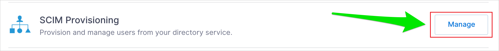
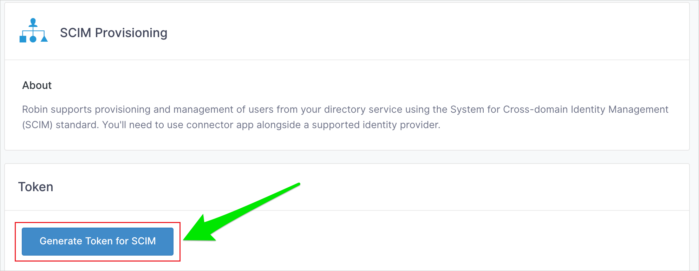
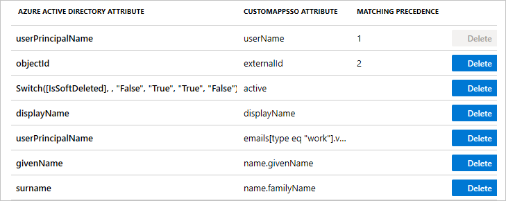
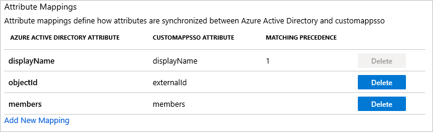

# Configure Robin for automatic user provisioning with Microsoft Entra ID

The objective of this article is to demonstrate the steps to be performed in Robin and Microsoft Entra ID to configure Microsoft Entra ID to automatically provision and de-provision users and/or groups to Robin.

> [!NOTE]
> This article describes a connector built on top of the Microsoft Entra user provisioning service. For important details on what this service does, how it works, and frequently asked questions, see [Automate user provisioning and deprovisioning to SaaS applications with Microsoft Entra ID](~/identity/app-provisioning/user-provisioning.md).
>

## Prerequisites

The scenario outlined in this article assumes that you already have the following prerequisites:

* [!INCLUDE [common-prerequisites.md](~/identity/saas-apps/includes/common-prerequisites.md)]
* [A Robin tenant](https://robinpowered.com/pricing/)
* A user account in Robin with Admin permissions.

## Assigning users to Robin

Microsoft Entra ID uses a concept called *assignments* to determine which users should receive access to selected apps. In the context of automatic user provisioning, only the users and/or groups that have been assigned to an application in Microsoft Entra ID are synchronized.

Before configuring and enabling automatic user provisioning, you should decide which users and/or groups in Microsoft Entra ID need access to Robin. Once decided, you can assign these users and/or groups to Robin by following the instructions here:
* [Assign a user or group to an enterprise app](~/identity/enterprise-apps/assign-user-or-group-access-portal.md)

## Important tips for assigning users to Robin

* It's recommended that a single Microsoft Entra user is assigned to Robin to test the automatic user provisioning configuration. Additional users and/or groups may be assigned later.

* When assigning a user to Robin, you must select any valid application-specific role (if available) in the assignment dialog. Users with the **Default Access** role are excluded from provisioning.

## Set up Robin for provisioning

1. Sign in to your [Robin Admin Console](https://dashboard.robinpowered.com/login). Navigate to **Manage > Integrations > SCIM > Manage**.

	

1.	Generate a new organization token. If you lose this token, you can always make a new one without affecting existing users.

	

1.	Copy the **SCIM Authentication Token**. This value is entered in the Secret Token field in the Provisioning tab of your Robin application.

## Add Robin from the gallery

Before configuring Robin for automatic user provisioning with Microsoft Entra ID, you need to add Robin from the Microsoft Entra application gallery to your list of managed SaaS applications.

**To add Robin from the Microsoft Entra application gallery, perform the following steps:**

1. Sign in to the [Microsoft Entra admin center](https://entra.microsoft.com) as at least a [Cloud Application Administrator](~/identity/role-based-access-control/permissions-reference.md#cloud-application-administrator).
1. Browse to **Entra ID** > **Enterprise apps** > **New application**.
1. In the **Add from the gallery** section, type **Robin**, select **Robin** in the search box.
1. Select **Robin** from results panel and then add the app. Wait a few seconds while the app is added to your tenant.
	

## Configuring automatic user provisioning to Robin 

This section guides you through the steps to configure the Microsoft Entra provisioning service to create, update, and disable users and/or groups in Robin based on user and/or group assignments in Microsoft Entra ID.

> [!TIP]
> You may also choose to enable SAML-based single sign-on for Robin, following the instructions provided in the [Robin Single sign-on  article](./robin-tutorial.md). Single sign-on can be configured independently of automatic user provisioning, though these two features complement each other

### To configure automatic user provisioning for Robin in Microsoft Entra ID:

1. Sign in to the [Microsoft Entra admin center](https://entra.microsoft.com) as at least a [Cloud Application Administrator](~/identity/role-based-access-control/permissions-reference.md#cloud-application-administrator).
1. Browse to **Entra ID** > **Enterprise apps**

	

1. In the applications list, select **Robin**.

	

1. Select the **Provisioning** tab.

	

1. Select **+ New configuration**.

	

1. In the **Tenant URL** field, enter your Robin Tenant URL and Secret Token. Select **Test Connection** to ensure Microsoft Entra ID can connect to Robin. If the connection fails, ensure your Robin account has the required admin permissions and try again.

	> [!NOTE]
	> Enter `https://api.robinpowered.com/v1.0/scim-2` in the **Tenant URL**.

	

1. Select **Create** to create your configuration.

1. Select **Properties** on the **Overview** page.

1. In the **Notification Email** field, enter the email address of a person who should receive the provisioning error notifications and select the **Send an email notification when a failure occurs** check box.

   

1. Select **Attribute Mapping** in the left panel and select **users**.

1. Review the user attributes that are synchronized from Microsoft Entra ID to Robin in the **Attribute-Mapping** section. The attributes selected as **Matching** properties are used to match the user accounts in Robin for update operations. If you choose to change the [matching target attribute](~/identity/app-provisioning/customize-application-attributes.md), you need to ensure that the Robin API supports filtering users based on that attribute. Select the **Save** button to commit any changes.

	

1. Review the group attributes that are synchronized from Microsoft Entra ID to Robin in the **Attribute Mapping** section. The attributes selected as **Matching** properties are used to match the groups in Robin for update operations. Select the **Save** button to commit any changes.

	

1. To configure scoping filters, refer to the instructions provided in the [Scoping filter article](~/identity/app-provisioning/define-conditional-rules-for-provisioning-user-accounts.md).

1. Use [on-demand provisioning](~/identity/app-provisioning/provision-on-demand.md) to validate sync with a small number of users before deploying more broadly in your organization.

1. When you're ready to provision, select **Start Provisioning** from the **Overview** page.

## Additional resources

* [Managing user account provisioning for Enterprise Apps](~/identity/app-provisioning/configure-automatic-user-provisioning-portal.md)
* [What is application access and single sign-on with Microsoft Entra ID?](~/identity/enterprise-apps/what-is-single-sign-on.md)

## Related content

* [Learn how to review logs and get reports on provisioning activity](~/identity/app-provisioning/check-status-user-account-provisioning.md)
