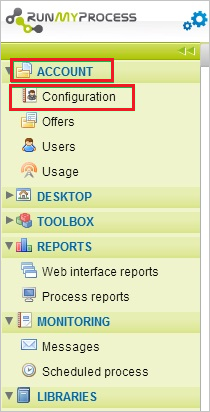

# Configure RunMyProcess for Single sign-on with Microsoft Entra ID

In this article,  you learn how to integrate RunMyProcess with Microsoft Entra ID. When you integrate RunMyProcess with Microsoft Entra ID, you can:

* Control in Microsoft Entra ID who has access to RunMyProcess.
* Enable your users to be automatically signed-in to RunMyProcess with their Microsoft Entra accounts.
* Manage your accounts in one central location.

## Prerequisites
The scenario outlined in this article assumes that you already have the following prerequisites:

[!INCLUDE [common-prerequisites.md](~/identity/saas-apps/includes/common-prerequisites.md)]
* RunMyProcess single sign-on (SSO) enabled subscription.

## Scenario description

In this article,  you configure and test Microsoft Entra SSO in a test environment.

* RunMyProcess supports **SP** initiated SSO.

> [!NOTE]
> Identifier of this application is a fixed string value so only one instance can be configured in one tenant.

## Add RunMyProcess from the gallery

To configure the integration of RunMyProcess into Microsoft Entra ID, you need to add RunMyProcess from the gallery to your list of managed SaaS apps.

1. Sign in to the [Microsoft Entra admin center](https://entra.microsoft.com) as at least a [Cloud Application Administrator](~/identity/role-based-access-control/permissions-reference.md#cloud-application-administrator).
1. Browse to **Entra ID** > **Enterprise apps** > **New application**.
1. In the **Add from the gallery** section, type **RunMyProcess** in the search box.
1. Select **RunMyProcess** from results panel and then add the app. Wait a few seconds while the app is added to your tenant.

 Alternatively, you can also use the [Enterprise App Configuration Wizard](https://portal.office.com/AdminPortal/home?Q=Docs#/azureadappintegration). In this wizard, you can add an application to your tenant, add users/groups to the app, assign roles, and walk through the SSO configuration as well. [Learn more about Microsoft 365 wizards.](/microsoft-365/admin/misc/azure-ad-setup-guides)

## Configure and test Microsoft Entra SSO for RunMyProcess

Configure and test Microsoft Entra SSO with RunMyProcess using a test user called **B.Simon**. For SSO to work, you need to establish a link relationship between a Microsoft Entra user and the related user in RunMyProcess.

To configure and test Microsoft Entra SSO with RunMyProcess, perform the following steps:

1. **[Configure Microsoft Entra SSO](#configure-azure-ad-sso)** - to enable your users to use this feature.
    1. **Create a Microsoft Entra test user** - to test Microsoft Entra single sign-on with B.Simon.
    1. **Assign the Microsoft Entra test user** - to enable B.Simon to use Microsoft Entra single sign-on.
1. **[Configure RunMyProcess SSO](#configure-runmyprocess-sso)** - to configure the single sign-on settings on application side.
    1. **[Create RunMyProcess test user](#create-runmyprocess-test-user)** - to have a counterpart of B.Simon in RunMyProcess that's linked to the Microsoft Entra representation of user.
1. **[Test SSO](#test-sso)** - to verify whether the configuration works.

## Configure Microsoft Entra SSO

Follow these steps to enable Microsoft Entra SSO.

1. Sign in to the [Microsoft Entra admin center](https://entra.microsoft.com) as at least a [Cloud Application Administrator](~/identity/role-based-access-control/permissions-reference.md#cloud-application-administrator).
1. Browse to **Entra ID** > **Enterprise apps** > **RunMyProcess** application integration page, find the **Manage** section and select **Single sign-on**.
1. On the **Select a Single sign-on method** page, select **SAML**.
1. On the **Set up Single Sign-On with SAML** page, select the pencil icon for **Basic SAML Configuration** to edit the settings.

   

1. On the **Basic SAML Configuration** section, perform the following step:

    In the **Sign-on URL** text box, type a URL using the following pattern:
    `https://live.runmyprocess.com/live/<tenant id>`

	> [!NOTE]
	> The value isn't real. Update the value with the actual Sign-On URL. Contact [RunMyProcess Client support team](mailto:support@runmyprocess.com) to get the value. You can also refer to the patterns shown in the **Basic SAML Configuration** section.

1. On the **Set up Single Sign-On with SAML** page, in the **SAML Signing Certificate** section,  find **Certificate (Base64)** and select **Download** to download the certificate and save it on your computer.

	

1. On the **Set up RunMyProcess** section, copy the appropriate URL(s) based on your requirement.

	

[!INCLUDE [create-assign-users-sso.md](~/identity/saas-apps/includes/create-assign-users-sso.md)]

## Configure RunMyProcess SSO

1. In a different web browser window, sign-on to your RunMyProcess tenant as an administrator.

1. In left navigation panel, select **Account** and select **Configuration**.

    

1. Go to **Authentication method** section and perform below steps:

    

    a. As **Method**, select **SSO with Samlv2**.

    b. In the **SSO redirect** textbox, paste the value of **Login URL**.

    c. In the **Logout redirect** textbox, paste the value of **Logout URL**.

    d. In the **Name ID Format** textbox, type the value of **Name Identifier Format** as **urn:oasis:names:tc:SAML:1.1:nameid-format:emailAddress**.

    e. Open the downloaded certificate file from Azure portal in notepad, copy the content of certificate file and then paste it into the **Certificate** textbox.

    f. Select **Save** icon.

### Create RunMyProcess test user

In order to enable Microsoft Entra users to sign in to RunMyProcess, they must be provisioned into RunMyProcess. In the case of RunMyProcess, provisioning is a manual task.

**To provision a user account, perform the following steps:**

1. Sign in to your RunMyProcess company site as an administrator.

1. Select **Account** and select **Users** in left navigation panel, then select **New User**.

    

1. In the **User Settings** section, perform the following steps:

    
  
    a. Type the **Name** and **E-mail** of a valid Microsoft Entra account you want to provision into the related textboxes.

    b. Select an **IDE language**, **Language**, and **Profile**.

    c. Select **Send account creation e-mail to me**.

    d. Select **Save**.

    > [!NOTE]
    > You can use any other RunMyProcess user account creation tools or APIs provided by RunMyProcess to provision Microsoft Entra user accounts.

## Test SSO 

In this section, you test your Microsoft Entra single sign-on configuration with following options. 

* Select **Test this application**, this option redirects to RunMyProcess Sign-on URL where you can initiate the login flow. 

* Go to RunMyProcess Sign-on URL directly and initiate the login flow from there.

* You can use Microsoft My Apps. When you select the RunMyProcess tile in the My Apps, this option redirects to RunMyProcess Sign-on URL. For more information, see [Microsoft Entra My Apps](/azure/active-directory/manage-apps/end-user-experiences#azure-ad-my-apps).

## Related content

Once you configure RunMyProcess you can enforce session control, which protects exfiltration and infiltration of your organization’s sensitive data in real time. Session control extends from Conditional Access. [Learn how to enforce session control with Microsoft Defender for Cloud Apps](/cloud-app-security/proxy-deployment-aad).
