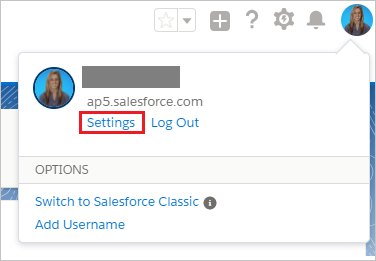
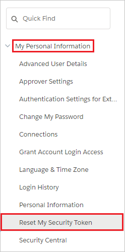
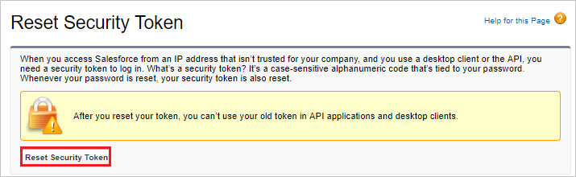

# Configure Salesforce for automatic user provisioning with Microsoft Entra ID

The objective of this article is to show the steps required to perform in Salesforce and Microsoft Entra ID to automatically provision and de-provision user accounts from Microsoft Entra ID to Salesforce.

## Prerequisites

The scenario outlined in this article assumes that you already have the following items:

[!INCLUDE [common-prerequisites.md](~/identity/saas-apps/includes/common-prerequisites.md)]
* A Salesforce.com tenant.
* A Salesforce account username and password, and the token. See [configure automatic user account provisioning](#configure-automatic-user-account-provisioning) for how to get the token. In future, if you reset the account password, Salesforce provides you with a new token and you need to edit the Salesforce provisioning settings.
* A custom user profile in Salesforce for the integration user. Once you have created a custom profile in the Salesforce portal, edit the profile's Administrative Permissions to enable the following:

    * API Enabled.

    * Manage Users: Enabling this option automatically enables the following: 
    Assign Permission Sets, Manage Internal UsersManage IP Addresses, Manage Login Access Policies, Manage Password Policies, Manage Profiles and Permission Sets, Manage Roles, Manage Sharing, Reset User Passwords and Unlock Users, View All Users, View Roles and Hierarchy, View Setup and Configuration.

  See also Salesforce [Create or Clone Profiles](https://help.salesforce.com/s/articleView?id=sf.users_profiles_cloning.htm&type=5) documentation.

  > [!Note]
  > Assign the permissions directly to this profile. Don't add the permissions through permission sets.

> [!IMPORTANT]
> If you're using a Salesforce.com trial account, then you'll be unable to configure automated user provisioning. Trial accounts don't have the necessary API access enabled until they are purchased. You can get around this limitation by using a free [developer account](https://developer.salesforce.com/signup) to complete this article.

If you're using a Salesforce Sandbox environment, see the [Salesforce Sandbox integration  article](./salesforce-sandbox-tutorial.md).

## Plan for assigning users to Salesforce

Microsoft Entra ID uses a concept called "assignments" to determine which users should receive access to selected apps. In the context of automatic user account provisioning, only the users and groups that are "assigned" to an application in Microsoft Entra ID are synchronized.

Before configuring and enabling the provisioning service, you need to decide which users or groups in Microsoft Entra ID need access to your Salesforce app. 

### Important tips for assigning users to Salesforce

* It's recommended that a single Microsoft Entra user is assigned to Salesforce to test the provisioning configuration. More users and/or groups can assigned later, through the mechanisms described in [Assign users](#assign-users).

* When assigning a user to Salesforce, you must select a valid user role. The "Default Access" role doesn't work for provisioning. Note that some roles may require licensing in Salesforce.

    > [!NOTE]
    > As part of the provisioning process, Microsoft Entra imports profiles from Salesforce. The profiles that get imported from Salesforce appear as application roles in Microsoft Entra ID, so you can select when assigning users in Microsoft Entra ID.  If you wish to assign users to a custom profile, then wait for profiles to be imported from Salesforce before assigning users to an application. Please note that the application roles shouldn't be manually edited in Microsoft Entra ID when doing role imports.

### Identifying existing users in Salesforce

Prior to integration with Microsoft Entra, your Salesforce account may already have one or more users, created by a Salesforce administrator or other processes. You can determine which users are already present by using the Salesforce export data feature. For more information, see [Export Backup Data from Salesforce](https://help.salesforce.com/s/articleView?id=xcloud.admin_exportdata.htm). When exporting from Salesforce, ensure that `User` data is included in the exported data set, and select a export file encoding that allows for all names for users in the organization, such as `Unicode (UTF-8)`.

Once you have the exported data from Salesforce, then you can extract the `User.csv` file and open in Excel, or in PowerShell, to view the list of active users already in Salesforce.

```powershell
import-csv .\User.csv | where {$_.IsActive -eq '1'}  | sort UserName | ft UserName
```

## Enable automated user provisioning

This section guides you through connecting your Microsoft Entra ID to [Salesforce's user account provisioning API - v40](https://developer.salesforce.com/docs/atlas.en-us.208.0.api.meta/api/implementation_considerations.htm).

> [!Tip]
> You may also choose to enabled SAML-based Single Sign-On for Salesforce, following the instructions provided in the [Azure portal](https://portal.azure.com). Single sign-on can be configured independently of automatic provisioning, though these two features complement each other.

### Configure automatic user account provisioning

The objective of this section is to outline how to enable user provisioning of Active Directory user accounts to Salesforce.

1. Sign in to the [Microsoft Entra admin center](https://entra.microsoft.com) as at least a [Cloud Application Administrator](~/identity/role-based-access-control/permissions-reference.md#cloud-application-administrator).
1. Browse to **Entra ID** > **Enterprise apps**.

2. If you have configured Salesforce for single sign-on, search for your instance of Salesforce using the search field. Otherwise, select **Add** and search for **Salesforce** in the application gallery. Select Salesforce from the search results, and add it to your list of applications.

3. Select your instance of Salesforce, then select the **Provisioning** tab.

4. Set the **Provisioning Mode** to **Automatic**.

    

5. Under the **Admin Credentials** section, provide the following configuration settings:

    1. In the **Admin Username** textbox, type a Salesforce account name that has the **System Administrator** profile in Salesforce.com assigned.

    1. In the **Admin Password** textbox, type the password for this account.

6. To get your Salesforce security token, open a new tab and sign into the same Salesforce admin account. On the top right corner of the page, select your name, and then select **Settings**.

    

7. On the left navigation pane, select **My Personal Information** to expand the related section, and then select **Reset My Security Token**.
  
    

8. On the **Reset Security Token** page, select **Reset Security Token** button.

    

9. Check the email inbox associated with this admin account. Look for an email from Salesforce.com that contains the new security token.

10. Copy the token, go to your Microsoft Entra window, and paste it into the **Secret Token** field.

11. The **Tenant URL** should be entered if the instance of Salesforce is on the Salesforce Government Cloud. Otherwise, it's optional. Enter the tenant URL using the format of `https://<your-instance>.my.salesforce.com`, replacing `<your-instance>` with the name of your Salesforce instance.

12. Select **Test Connection** to ensure Microsoft Entra ID can connect to your Salesforce app.

13. In the **Notification Email** field, enter the email address of a person or group who should receive provisioning error notifications, and check the checkbox below.

14. Select **Save.**  

15. Under the Mappings section, select **Synchronize Microsoft Entra users to Salesforce.**

16. In the **Attribute Mappings** section, review the user attributes that are synchronized from Microsoft Entra ID to Salesforce. Note that the attributes selected as **Matching** properties are used to match the user accounts in Salesforce for update operations. Select the Save button to commit any changes.

17. To enable the Microsoft Entra provisioning service for Salesforce, change the **Provisioning Status** to **On** in the Settings section

18. Select **Save.**

> [!NOTE]
> Once the users are provisioned in the Salesforce application, administrator need to configure the language specific settings for them. Please see [this](https://help.salesforce.com/articleView?id=setting_your_language.htm&type=5) article for more details on language configuration.

This starts the initial synchronization of any users and/or groups assigned to Salesforce in the Users and Groups section. The initial sync takes longer to perform than subsequent syncs, which occur approximately every 40 minutes as long as the service is running.

## Monitoring

You can use the **Synchronization Details** section to monitor progress and follow links to provisioning activity logs, which describe all actions performed by the provisioning service on your Salesforce app.

For more information on how to read the Microsoft Entra provisioning logs, see [Reporting on automatic user account provisioning](~/identity/app-provisioning/check-status-user-account-provisioning.md).

## Assign users

Once the testing is complete, and a user is successfully provisioned to Salesforce, then you will want to ensure any other users needing Salesforce are assigned to the application roles. This includes any users who currently have active accounts in Salesforce, as described in the section [Identifying existing users in Salesforce](#identifying-existing-users-in-salesforce). You can assign these and any additional authorized users to the Salesforce application in Microsoft Entra by following one of the instructions here:

* You can [assign each individual user to the application](~/identity/enterprise-apps/assign-user-or-group-access-portal.md) in the Microsoft Entra admin center,
* You can assign individual users to the application via Microsoft Graph or the PowerShell cmdlet `New-MgServicePrincipalAppRoleAssignedTo`, or
* if your organization has a license for Microsoft Entra ID Governance, you can also [deploy entitlement management policies for automating access assignment](~/id-governance/identity-governance-applications-deploy.md#deploy-entitlement-management-policies-for-automating-access-assignment), to add or remove assignments as people join the organization, or leave or change roles.  You can [create an entitlement management access package for this application](~/id-governance/entitlement-management-access-package-create-app.md). You can have policies for users to be assigned access, either when they request, [by an administrator](~/id-governance/entitlement-management-access-package-assignments.md#directly-assign-a-user), [automatically based on rules](~/id-governance/entitlement-management-access-package-auto-assignment-policy.md), or through [lifecycle workflows](~/id-governance/entitlement-management-scenarios.md#administrator-assign-employees-access-from-lifecycle-workflows).

As users that are in assigned to the application are updated in Microsoft Entra ID, those changes are automatically provisioned to Salesforce.

## Common issues
* If you're having issues enabling provisioning to Salesforce ensure the following:
    * The credentials used have admin access to Salesforce.
    * The version of Salesforce that you're using supports Web Access (such as Developer, Enterprise, Sandbox, and Unlimited editions of Salesforce.)
    * Web API access is enabled for the user.
* The Microsoft Entra provisioning service supports provisioning language, locale, and timeZone for a user. These attributes are in the default attribute mappings but don't have a default source attribute. Ensure that you select the default source attribute and that the source attribute is in the format expected by SalesForce. For example, localeSidKey for english(UnitedStates) is en_US. Review the guidance provided [here](https://help.salesforce.com/articleView?id=faq_getstart_what_languages_does.htm&type=5) to determine the proper localeSidKey format. The languageLocaleKey formats can be found [here](https://help.salesforce.com/articleView?id=faq_getstart_what_languages_does.htm&type=5). In addition to ensuring that the format is correct, you may need to ensure that the language is enabled for your users as described [here](https://help.salesforce.com/articleView?id=faq_getstart_what_languages_does.htm&type=5). 
* **SalesforceLicenseLimitExceeded:** The user could not be created in Salesforce because there are no available licenses for this user. Either procure additional licenses for the target application, or [review your user assignments](~/id-governance/access-reviews-application-preparation.md) to ensure that the correct users are assigned.
* **SalesforceDuplicateUserName:** The user can't be provisioned because it has a Salesforce.com 'Username' that's duplicated in another Salesforce.com tenant.  In Salesforce.com, values for the 'Username' attribute must be unique across all Salesforce.com tenants.  By default, a user’s userPrincipalName in Microsoft Entra ID becomes their 'Username' in Salesforce.com.   You have two options.  One option is to find and rename the user with the duplicate 'Username' in the other Salesforce.com tenant, if you administer that other tenant as well.  The other option is to remove access from the Microsoft Entra user to the Salesforce.com tenant with which your directory is integrated. We will retry this operation on the next synchronization attempt. 
* **SalesforceRequiredFieldMissing:** Salesforce requires certain attributes to be present on the user to successfully create or update the user. This user is missing one of the required attributes. Ensure that attributes such as email and alias are populated on all users that you would like to be provisioned into Salesforce. You can scope users that don't have these attributes out using [attribute based scoping filters](~/identity/app-provisioning/define-conditional-rules-for-provisioning-user-accounts.md). 
* The default attribute mapping for provisioning to Salesforce includes the SingleAppRoleAssignments expression to map appRoleAssignments in Microsoft Entra ID to ProfileName in Salesforce. Ensure that the users don't have multiple app role assignments in Microsoft Entra ID as the attribute mapping only supports provisioning one role. If you have a group of users where the group is assigned to one role, then a member of that group can't have a direct assignment to the Salesforce application with a different role.
* Salesforce requires that email updates be approved manually before being changed. As a result, you may see multiple entries in the provisioning logs to update the user's email (until the email change has been approved).


## Additional resources

* [Managing user account provisioning for Enterprise Apps](tutorial-list.md)
* [What is application access and single sign-on with Microsoft Entra ID?](~/identity/enterprise-apps/what-is-single-sign-on.md)
* [Configure Single Sign-on](./salesforce-tutorial.md)
