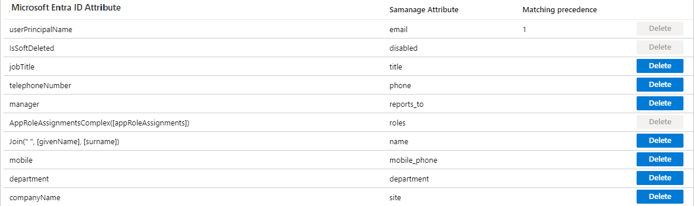
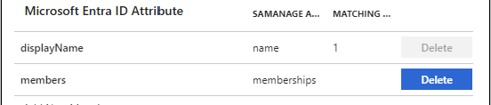

# Configure SolarWinds Service Desk (previously Samanage) for automatic user provisioning with Microsoft Entra ID

This article describes the steps you need to perform in both SolarWinds Service Desk (previously Samanage) and Microsoft Entra ID to configure automatic user provisioning. When configured, Microsoft Entra ID automatically provisions and de-provisions users and groups to [SolarWinds Service Desk](https://www.samanage.com/pricing/) using the Microsoft Entra provisioning service. For important details on what this service does, how it works, and frequently asked questions, see [Automate user provisioning and deprovisioning to SaaS applications with Microsoft Entra ID](~/identity/app-provisioning/user-provisioning.md).

## Migrate to the new SolarWinds Service Desk application

If you have an existing integration with SolarWinds Service Desk, see the following section about upcoming changes. If you're setting up SolarWinds Service Desk for the first time, you can skip this section and move to **Capabilities supported**.

#### What's changing?

* Changes on the Microsoft Entra ID side: The authorization method to provision users in Samange has historically been **Basic auth**. Soon you see the authorization method changed to **Long lived secret token**.

#### What do I need to do to migrate my existing custom integration to the new application?

If you have an existing SolarWinds Service Desk integration with valid admin credentials, **no action is required**. We automatically migrate customers to the new application. This process is done completely behind the scenes. If the existing credentials expire, or if you need to authorize access to the application again, you need to generate a long-lived secret token. To generate a new token, refer to Step 2 of this article.

#### How can I tell if my application has been migrated? 

When your application is migrated, in the **Admin Credentials** section, the **Admin Username** and **Admin Password** fields are replaced with a single **Secret Token** field.

## Capabilities supported

> [!div class="checklist"]
> * Create users in SolarWinds Service Desk
> * Remove users in SolarWinds Service Desk when they don't require access anymore
> * Keep user attributes synchronized between Microsoft Entra ID and SolarWinds Service Desk
> * Provision groups and group memberships in SolarWinds Service Desk
> * [Single sign-on](./samanage-tutorial.md) to SolarWinds Service Desk (recommended)

## Prerequisites

The scenario outlined in this article assumes that you already have the following prerequisites:

[!INCLUDE [common-prerequisites.md](~/identity/saas-apps/includes/common-prerequisites.md)]
* A [SolarWinds Service Desk tenant](https://www.samanage.com/pricing/) with the Professional package.
* A user account in SolarWinds Service Desk with admin permissions.

> [!Note]
> Roles shouldn't be manually edited in Microsoft Entra ID when doing role imports.

## Step 1: Plan your provisioning deployment
1. Learn about [how the provisioning service works](~/identity/app-provisioning/user-provisioning.md).
2. Determine who's in [scope for provisioning](~/identity/app-provisioning/define-conditional-rules-for-provisioning-user-accounts.md).
3. Determine what data to [map between Microsoft Entra ID and SolarWinds Service Desk](~/identity/app-provisioning/customize-application-attributes.md). 

## Step 2: Configure SolarWinds Service Desk to support provisioning with Microsoft Entra ID

To generate a secret token for authentication, see [Article tokens authentication for API integration](https://help.samanage.com/s/article/Tutorial-Tokens-Authentication-for-API-Integration-1536721557657).

## Step 3: Add SolarWinds Service Desk from the Microsoft Entra application gallery

Add SolarWinds Service Desk from the Microsoft Entra application gallery to start managing provisioning to SolarWinds Service Desk. If you previously set up SolarWinds Service Desk for SSO, you can use the same application. However, we recommend that you create a separate app when testing out the integration initially. Learn more about adding an application from the gallery [here](~/identity/enterprise-apps/add-application-portal.md). 

## Step 4: Define who is in scope for provisioning 

[!INCLUDE [create-assign-users-provisioning.md](~/identity/saas-apps/includes/create-assign-users-provisioning.md)]

## Step 5: Configure automatic user provisioning to SolarWinds Service Desk 

This section guides you through the steps to configure the Microsoft Entra provisioning service to create, update, and disable users and/or groups in TestApp based on user and/or group assignments in Microsoft Entra ID.

### To configure automatic user provisioning for SolarWinds Service Desk in Microsoft Entra ID:

1. Sign in to the [Microsoft Entra admin center](https://entra.microsoft.com) as at least a [Cloud Application Administrator](~/identity/role-based-access-control/permissions-reference.md#cloud-application-administrator).
1. Browse to **Entra ID** > **Enterprise apps**

	

1. In the applications list, select **SolarWinds Service Desk**.

3. Select the **Provisioning** tab.

	

4. Set the **Provisioning Mode** to **Automatic**.

	

5. Under the **Admin Credentials** section, input `https://api.samanage.com` in **Tenant URL**.  Input the secret token value retrieved earlier in **Secret Token**. Select **Test Connection** to ensure Microsoft Entra ID can connect to SolarWinds Service Desk. If the connection fails, ensure your SolarWinds Service Desk account has Admin permissions and try again.

	

6. In the **Notification Email** field, enter the email address of a person or group who should receive the provisioning error notifications and select the **Send an email notification when a failure occurs** check box.

	

7. Select **Save**.

8. Under the **Mappings** section, select **Synchronize Microsoft Entra users to SolarWinds Service Desk**.

9. Review the user attributes that are synchronized from Microsoft Entra ID to SolarWinds Service Desk in the **Attribute-Mapping** section. The attributes selected as **Matching** properties are used to match the user accounts in SolarWinds Service Desk for update operations. If you choose to change the [matching target attribute](~/identity/app-provisioning/customize-application-attributes.md), you need to ensure that the SolarWinds Service Desk API supports filtering users based on that attribute. Select the **Save** button to commit any changes.

      

10. Under the **Mappings** section, select **Synchronize Microsoft Entra groups to SolarWinds Service Desk**.

11. Review the group attributes that are synchronized from Microsoft Entra ID to SolarWinds Service Desk in the **Attribute-Mapping** section. The attributes selected as **Matching** properties are used to match the groups in SolarWinds Service Desk for update operations. Select the **Save** button to commit any changes.

      

12. To configure scoping filters, refer to the following instructions provided in the [Scoping filter  article](~/identity/app-provisioning/define-conditional-rules-for-provisioning-user-accounts.md).

13. To enable the Microsoft Entra provisioning service for SolarWinds Service Desk, change the **Provisioning Status** to **On** in the **Settings** section.

	

14. Define the users and/or groups that you would like to provision to SolarWinds Service Desk by choosing the desired values in **Scope** in the **Settings** section.

	

15. When you're ready to provision, select **Save**.

	

This operation starts the initial synchronization cycle of all users and groups defined in **Scope** in the **Settings** section. The initial cycle takes longer to perform than subsequent cycles, which occur approximately every 40 minutes as long as the Microsoft Entra provisioning service is running. 

## Step 6: Monitor your deployment

[!INCLUDE [monitor-deployment.md](~/identity/saas-apps/includes/monitor-deployment.md)]

## Connector limitations

If you select the **Sync all users and groups** option and configure a value for the SolarWinds Service Desk **roles** attribute, the value under the **Default value if null (is optional)** box must be expressed in the following format:

- {"displayName":"role"}, where role is the default value you want.

## Change log

* 09/14/2020 - Changed the company name in two SaaS articles from Samanage to SolarWinds Service Desk (previously Samanage) per `https://github.com/ravitmorales`.
* 04/22/2020 - Updated authorization method from basic auth to long lived secret token.

## Additional resources

* [Managing user account provisioning for Enterprise Apps](~/identity/app-provisioning/configure-automatic-user-provisioning-portal.md)

## Related content

* [Learn how to review logs and get reports on provisioning activity](~/identity/app-provisioning/check-status-user-account-provisioning.md)
