# Configure SAML SSO for Jira by Resolution GmbH for Single sign-on with Microsoft Entra ID

In this article,  you learn how to integrate SAML SSO for Jira by resolution GmbH with Microsoft Entra ID. When you integrate SAML SSO for Jira by resolution GmbH with Microsoft Entra ID, you can:

* Control in Microsoft Entra ID who has access to SAML SSO for Jira by resolution GmbH.
* Enable your users to be automatically signed-in to SAML SSO for Jira by resolution GmbH with their Microsoft Entra accounts.
* Manage your accounts in one central location.

## Prerequisites
The scenario outlined in this article assumes that you already have the following prerequisites:

[!INCLUDE [common-prerequisites.md](~/identity/saas-apps/includes/common-prerequisites.md)]
* SAML SSO for Jira by resolution GmbH single sign-on (SSO) enabled subscription.

## Scenario description

In this article,  you configure and test Microsoft Entra single sign-on in a test environment.

* SAML SSO for Jira by resolution GmbH supports **SP** and **IDP** initiated SSO.

> [!NOTE]
> Identifier of this application is a fixed string value so only one instance can be configured in one tenant.

## Add SAML SSO for Jira by resolution GmbH from the gallery

To configure the integration of SAML SSO for Jira by resolution GmbH into Microsoft Entra ID, you need to add SAML SSO for Jira by resolution GmbH from the gallery to your list of managed SaaS apps.

1. Sign in to the [Microsoft Entra admin center](https://entra.microsoft.com) as at least a [Cloud Application Administrator](~/identity/role-based-access-control/permissions-reference.md#cloud-application-administrator).
1. Browse to **Entra ID** > **Enterprise apps** > **New application**.
1. In the **Add from the gallery** section, type **SAML SSO for Jira by resolution GmbH** in the search box.
1. Select **SAML SSO for Jira by resolution GmbH** from results panel and then add the app. Wait a few seconds while the app is added to your tenant.

 Alternatively, you can also use the [Enterprise App Configuration Wizard](https://portal.office.com/AdminPortal/home?Q=Docs#/azureadappintegration). In this wizard, you can add an application to your tenant, add users/groups to the app, assign roles, and walk through the SSO configuration as well. [Learn more about Microsoft 365 wizards.](/microsoft-365/admin/misc/azure-ad-setup-guides)

## Configure and test Microsoft Entra SSO for SAML SSO for Jira by resolution GmbH

Configure and test Microsoft Entra SSO with SAML SSO for Jira by resolution GmbH using a test user called **B.Simon**. For SSO to work, you need to establish a link relationship between a Microsoft Entra user and the related user in SAML SSO for Jira by resolution GmbH.

To configure and test Microsoft Entra SSO with SAML SSO for Jira by resolution GmbH, perform the following steps:

1. **[Configure Microsoft Entra SSO](#configure-azure-ad-sso)** - to enable your users to use this feature.
    1. **Create a Microsoft Entra test user** - to test Microsoft Entra single sign-on with B.Simon.
    1. **Assign the Microsoft Entra test user** - to enable B.Simon to use Microsoft Entra single sign-on.
1. **[Configure SAML SSO for Jira by resolution GmbH SSO](#configure-saml-sso-for-jira-by-resolution-gmbh-sso)** - to configure the single sign-on settings on application side.
    1. **[Create SAML SSO for Jira by resolution GmbH test user](#create-saml-sso-for-jira-by-resolution-gmbh-test-user)** - to have a counterpart of B.Simon in SAML SSO for Jira by resolution GmbH that's linked to the Microsoft Entra representation of user.
1. **[Test SSO](#test-sso)** - to verify whether the configuration works.

## Configure Microsoft Entra SSO

Follow these steps to enable Microsoft Entra SSO.

1. Sign in to the [Microsoft Entra admin center](https://entra.microsoft.com) as at least a [Cloud Application Administrator](~/identity/role-based-access-control/permissions-reference.md#cloud-application-administrator).
1. Browse to **Entra ID** > **Enterprise apps** > **SAML SSO for Jira by resolution GmbH** > **Single sign-on**.
1. On the **Select a single sign-on method** page, select **SAML**.
1. On the **Set up single sign-on with SAML** page, select the pencil icon for **Basic SAML Configuration** to edit the settings.

   

4. In the **Basic SAML Configuration** section, if you wish to configure the application in the **IDP** initiated mode, then perform the following steps:

    a. In the **Identifier** text box, type a URL using the following pattern:
    `https://<server-base-url>/plugins/servlet/samlsso`

    b. In the **Reply URL** text box, type a URL using the following pattern:
    `https://<server-base-url>/plugins/servlet/samlsso`

    c. Select **Set additional URLs** and perform the following step, if you wish to configure the application in the **SP** initiated mode:

    In the **Sign-on URL** text box, type a URL using the following pattern:
    `https://<server-base-url>/plugins/servlet/samlsso`

    > [!NOTE]
	> For the Identifier, Reply URL and Sign-on URL,  substitute **\<server-base-url>** with the base URL of your Jira instance. You can also refer to the patterns shown in the **Basic SAML Configuration** section. If you have a problem, contact us at [SAML SSO for Jira by resolution GmbH Client support team](https://www.resolution.de/go/support).

4. On the **Set up Single Sign-On with SAML** page, in the **SAML Signing Certificate** section, download the **Federation Metadata XML** and save it to your computer.

	

[!INCLUDE [create-assign-users-sso.md](~/identity/saas-apps/includes/create-assign-users-sso.md)]

## Configure SAML SSO for Jira by resolution GmbH SSO 

1. In a different web browser window, sign in to your Jira instance as an administrator.

2. Hover over the cog at the right side and select **Manage apps**.
    
	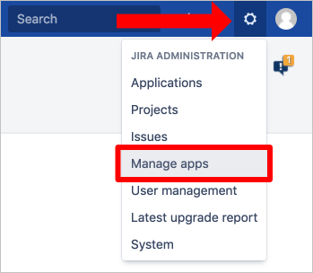

3. If you're redirected to Administrator Access page, enter the **Password** and select the **Confirm** button.

	

4. Jira normally redirects you to the Atlassian marketplace. If not, select **Find new apps** in the left panel. Search for **SAML Single Sign On (SSO) for JIRA** and select the **Install** button to install the SAML plugin.

	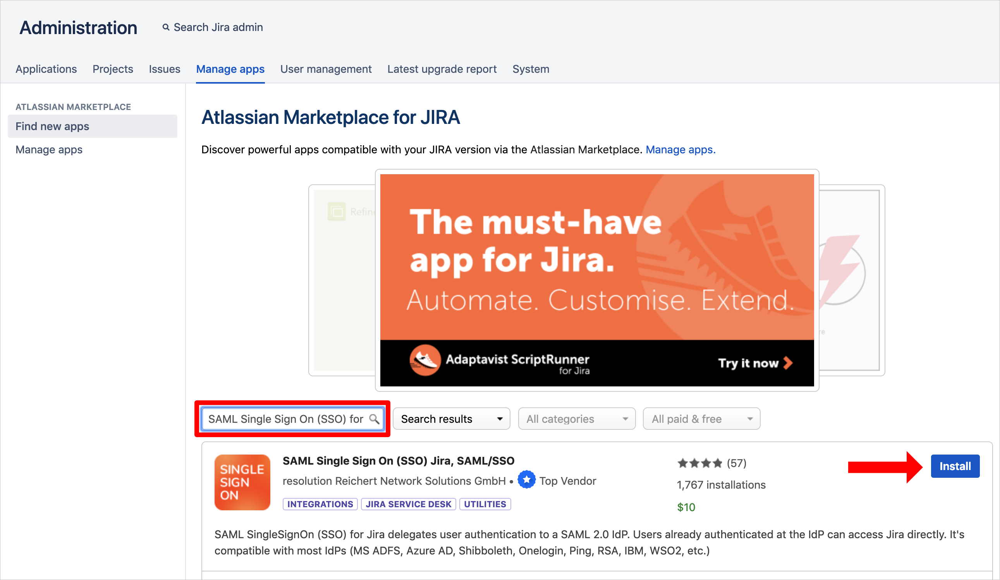

5. The plugin installation will start. When it's done, select the **Close** button.

	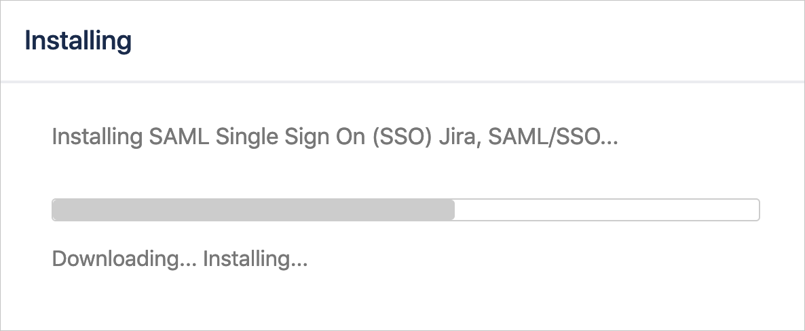

	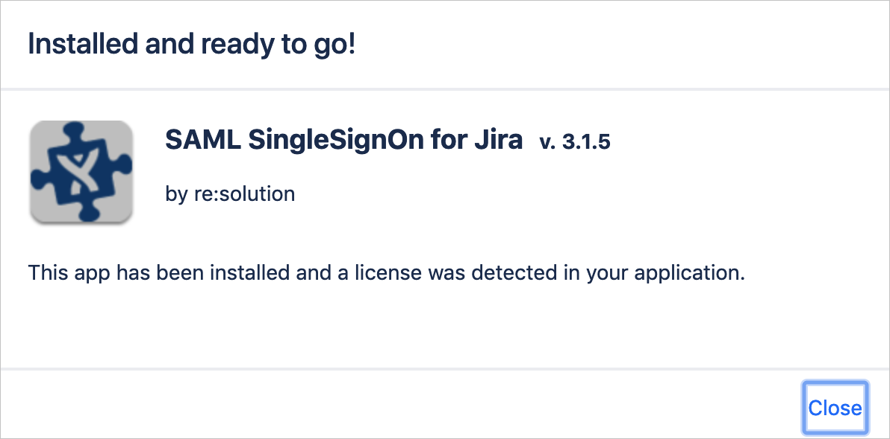

6. Then, select **Manage**.

7. Afterwards, select **Configure** to configure the just installed plugin.

	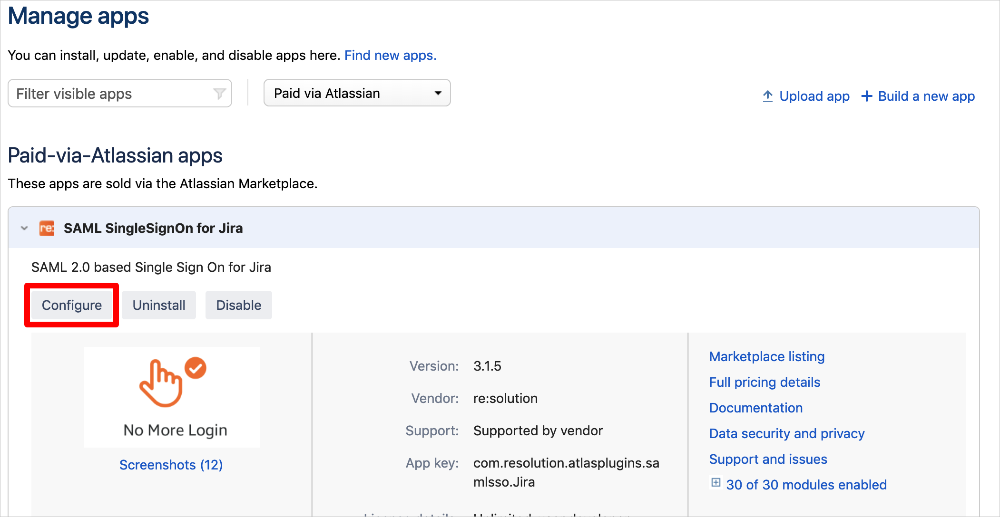

8. In the **SAML SingleSignOn Plugin Configuration** wizard, select **Add new IdP** to configure Microsoft Entra ID as a new Identity Provider.

	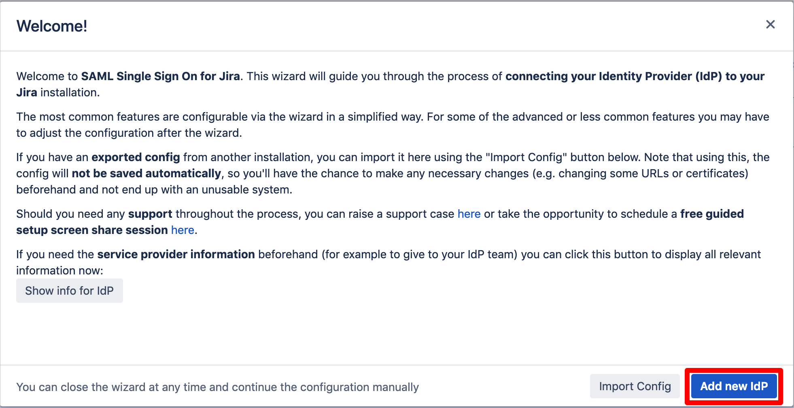 

9. On the **Choose your SAML Identity Provider** page, perform the following steps:

	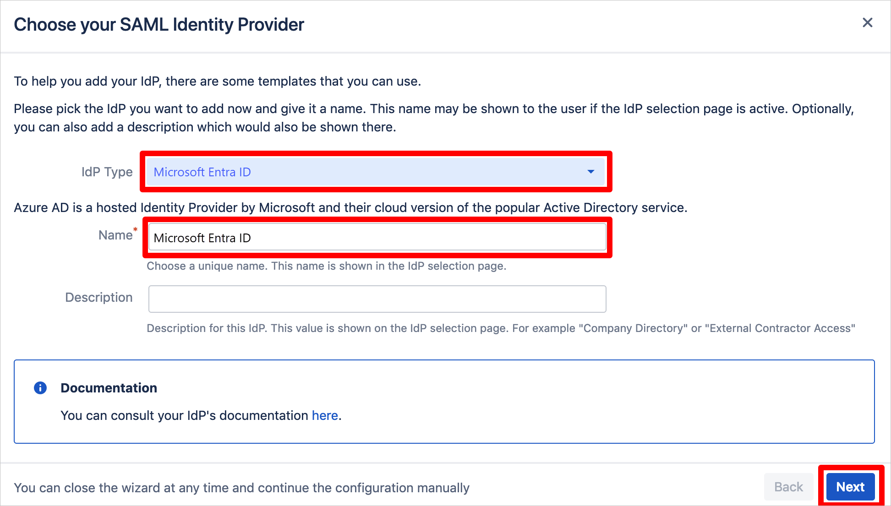
 
	a. Set **Microsoft Entra ID** as the IdP type.
	
	b. Add the **Name** of the Identity Provider (such as Microsoft Entra ID).
	
	c. Add an (optional) **Description** of the Identity Provider (such as Microsoft Entra ID).
	
	d. Select **Next**.
	
10. On the **Identity provider configuration** page, select **Next**.

11. On **Import SAML IdP Metadata** page, perform the following steps:

	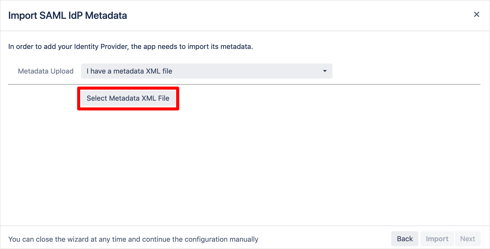

    a. Select the **Select Metadata XML File** button and pick the **Federation Metadata XML** file you downloaded before.

    b. Select the **Import** button.
     
    c. Wait briefly until the import succeeds.  
     
    d. Select the **Next** button.
    
12. On **User ID attribute and transformation** page, select the **Next** button.

	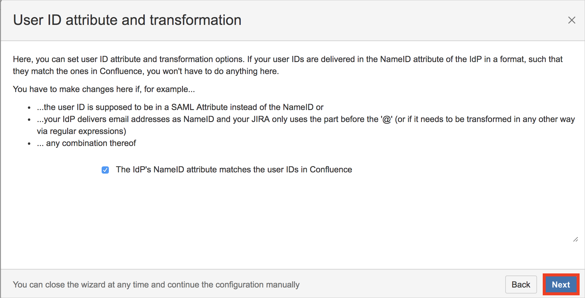
	
13. On the **User creation and update** page, select **Save & Next** to save the settings.
	
	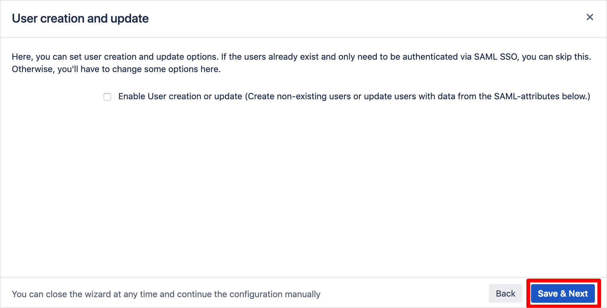
	
14. On the **Test your settings** page, select **Skip test & configure manually** to skip the user test for now. This are performed in the next section and requires some settings.
	
	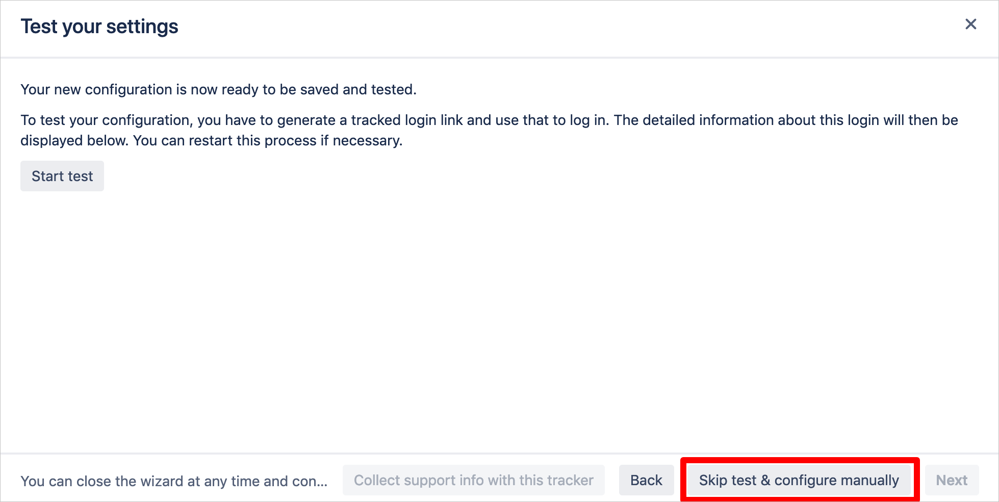
	
15. Select **OK** to skip the warning.
	
	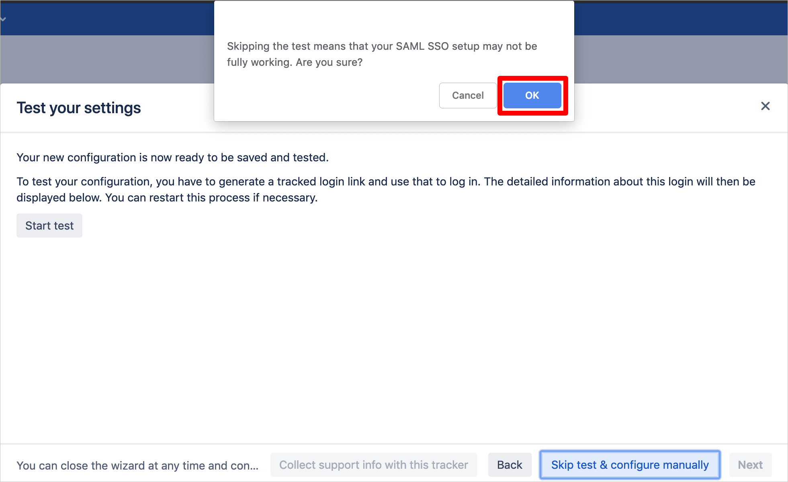

### Create SAML SSO for Jira by resolution GmbH test user

To enable Microsoft Entra users to sign in to SAML SSO for Jira by resolution GmbH, they must be provisioned into SAML SSO for Jira by resolution GmbH. For the case of this article,  you have to do the provisioning by hand. However, there are also other provisioning models available for the SAML SSO plugin by resolution, for example **Just In Time** provisioning. Refer to their documentation at [SAML SSO by resolution GmbH](https://wiki.resolution.de/doc/saml-sso/latest/all). If you have a question about it, contact support at [resolution support](https://www.resolution.de/go/support).

**To manually provision a user account, perform the following steps:**

1. Sign in to Jira instance as an administrator.

2. Hover over the cog and select **User management**.

   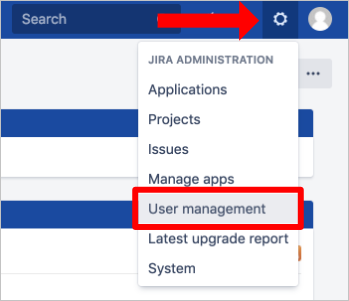

3. If you're redirected to the Administrator Access page, then enter the **Password** and select the **Confirm** button.

	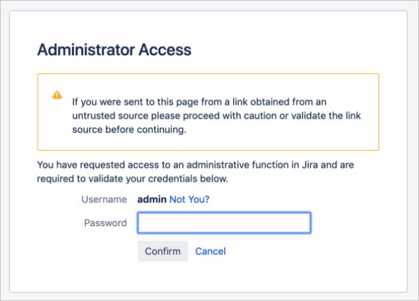 

4. Under the **User management** tab section, select **create user**.

	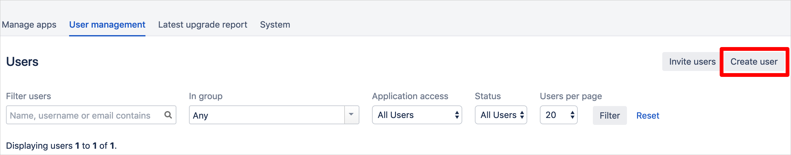 

5. On the **“Create new user”** dialog page, perform the following steps. You have to create the user exactly like in Microsoft Entra ID:

	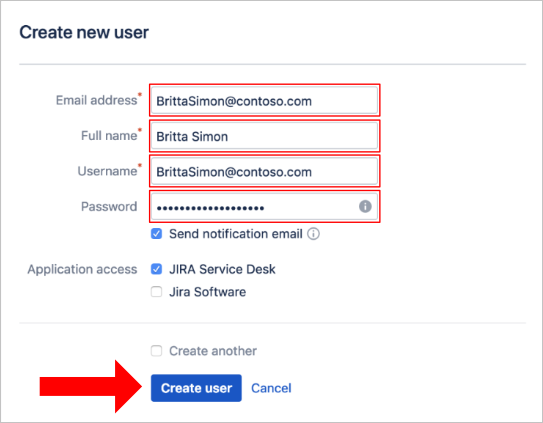 

	a. In the **Email address** textbox, type the email address of the user:  <b>BrittaSimon@contoso.com</b>.

	b. In the **Full Name** textbox, type full name of the user: **Britta Simon**.

	c. In the **Username** textbox, type the email address of the user: <b>BrittaSimon@contoso.com</b>. 

	d. In the **Password** textbox, enter the password of the user.

	e. Select **Create user** to finish the user creation.

## Test SSO

In this section, you test your Microsoft Entra single sign-on configuration with following options. 

#### SP initiated:

* Select **Test this application**, this option redirects to SAML SSO for Jira by resolution GmbH Sign on URL where you can initiate the login flow.  

* Go to SAML SSO for Jira by resolution GmbH Sign-on URL directly and initiate the login flow from there.

#### IDP initiated:

* Select **Test this application**, and you should be automatically signed in to the SAML SSO for Jira by resolution GmbH for which you set up the SSO. 

You can also use Microsoft My Apps to test the application in any mode. When you select the SAML SSO for Jira by resolution GmbH tile in the My Apps, if configured in SP mode you would be redirected to the application sign on page for initiating the login flow and if configured in IDP mode, you should be automatically signed in to the SAML SSO for Jira by resolution GmbH for which you set up the SSO. For more information about the My Apps, see [Introduction to the My Apps](https://support.microsoft.com/account-billing/sign-in-and-start-apps-from-the-my-apps-portal-2f3b1bae-0e5a-4a86-a33e-876fbd2a4510).

## Enable SSO redirection for Jira

As noted in the section before, there are currently two ways to trigger the single sign-on. Either by using the **Azure portal** or using **a special link to your Jira instance**. The SAML SSO plugin by resolution GmbH also allows you to trigger single sign-on by simply **accessing any URL pointing to your Jira instance**.

In essence, all users accessing Jira is redirected to the single sign-on after activating an option in the plugin.

To activate SSO redirect, do the following in **your Jira instance**:

1. Access the configuration page of the SAML SSO plugin in Jira.
1. Select **Redirection** in the left panel.
1. Tick **Enable SSO Redirect**.

   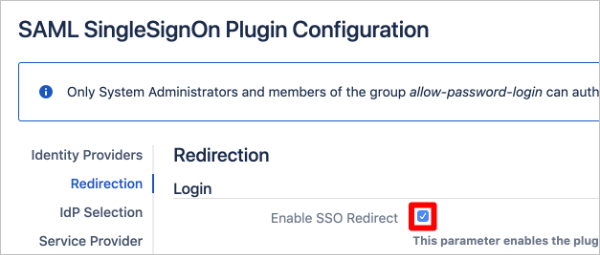 

1. Press the **Save Settings** button in the top right corner.

After activating the option, you can still reach the username/password prompt if the **Enable nosso** option is ticked by navigating to `https://<server-base-url>/login.jsp?nosso`. As always, substitute **\<server-base-url>** with your base URL.

## Related content

Once you configure SAML SSO for Jira by resolution GmbH you can enforce session control, which protects exfiltration and infiltration of your organization’s sensitive data in real time. Session control extends from Conditional Access. [Learn how to enforce session control with Microsoft Defender for Cloud Apps](/cloud-app-security/proxy-deployment-any-app).
