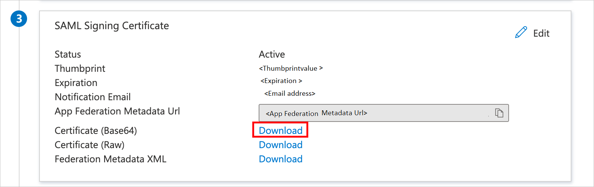

# Configure Sansan for Single sign-on with Microsoft Entra ID

In this article,  you learn how to integrate Sansan with Microsoft Entra ID. When you integrate Sansan with Microsoft Entra ID, you can:

* Control in Microsoft Entra ID who has access to Sansan.
* Enable your users to be automatically signed-in to Sansan with their Microsoft Entra accounts.
* Manage your accounts in one central location.

## Prerequisites
The scenario outlined in this article assumes that you already have the following prerequisites:

[!INCLUDE [common-prerequisites.md](~/identity/saas-apps/includes/common-prerequisites.md)]
* Sansan single sign-on (SSO) enabled subscription.

## Scenario description

In this article,  you configure and test Microsoft Entra SSO in a test environment.
* Sansan supports **SP** initiated SSO.

## Add Sansan from the gallery

To configure the integration of Sansan into Microsoft Entra ID, you need to add Sansan from the gallery to your list of managed SaaS apps.

1. Sign in to the [Microsoft Entra admin center](https://entra.microsoft.com) as at least a [Cloud Application Administrator](~/identity/role-based-access-control/permissions-reference.md#cloud-application-administrator).
1. Browse to **Entra ID** > **Enterprise apps** > **New application**.
1. In the **Add from the gallery** section, type **Sansan** in the search box.
1. Select **Sansan** from results panel and then add the app. Wait a few seconds while the app is added to your tenant.

 Alternatively, you can also use the [Enterprise App Configuration Wizard](https://portal.office.com/AdminPortal/home?Q=Docs#/azureadappintegration). In this wizard, you can add an application to your tenant, add users/groups to the app, assign roles, and walk through the SSO configuration as well. [Learn more about Microsoft 365 wizards.](/microsoft-365/admin/misc/azure-ad-setup-guides)

<a name='configure-and-test-azure-ad-sso-for-sansan'></a>

## Configure and test Microsoft Entra SSO for Sansan

Configure and test Microsoft Entra SSO with Sansan using a test user called **Britta Simon**. For SSO to work, you need to establish a link relationship between a Microsoft Entra user and the related user in Sansan.

To configure and test Microsoft Entra SSO with Sansan, perform the following steps:

1. **[Configure Microsoft Entra SSO](#configure-azure-ad-sso)** to enable your users to use this feature.
   1. **Create a Microsoft Entra test user** to test Microsoft Entra single sign-on with Britta Simon.
   1. **Assign the Microsoft Entra test user** to enable Britta Simon to use Microsoft Entra single sign-on.
1. **[Configure Sansan SSO](#configure-sansan-sso)** to configure the SSO settings on application side.
   1. **[Create Sansan test user](#create-sansan-test-user)** to have a counterpart of Britta Simon in Sansan that's linked to the Microsoft Entra representation of user.
1. **[Test SSO](#test-sso)** to verify whether the configuration works.

<a name='configure-azure-ad-sso'></a>

## Configure Microsoft Entra SSO

Follow these steps to enable Microsoft Entra SSO.

1. Sign in to the [Microsoft Entra admin center](https://entra.microsoft.com) as at least a [Cloud Application Administrator](~/identity/role-based-access-control/permissions-reference.md#cloud-application-administrator).
1. Browse to **Entra ID** > **Enterprise apps** > **Sansan** application integration page, find the **Manage** section and select **Single sign-on**.
1. On the **Select a Single sign-on method** page, select **SAML**.
1. On the **Set up Single Sign-On with SAML** page, select the pencil icon for **Basic SAML Configuration** to edit the settings.

   

1. On the **Basic SAML Configuration** page, perform the following steps:

   1. In the **Identifier (Entity ID)** text box, type a URL using the following pattern: 
   `https://ap.sansan.com/saml2/<COMPANY_NAME>`

   1. In the **Reply URL** text box, type a URL using one of the following patterns:
    
       | Environment | URL |
      |:--- |:--- |
      | PC |`https://ap.sansan.com/v/saml2/<COMPANY_NAME>/acs` |
      | Smartphone App |`https://internal.api.sansan.com/saml2/<COMPANY_NAME>/acs` |
      | Smartphone Web |`https://ap.sansan.com/s/saml2/<COMPANY_NAME>/acs` |

   1. In the **Sign-on URL** text box, type the URL: 
   `https://ap.sansan.com/`

    > [!NOTE]
    > These values aren't real. Check the actual Identifier and Reply URL values on the **Sansan admin settings**.

1. On the **Set up Single Sign-On with SAML** page, in the **SAML Signing Certificate** section, find **Certificate (Base64)** and select **Download** to download the certificate and save it on your computer.

   

1. On the **Set up Sansan** section, copy the appropriate URL(s) based on your requirement.

   

   ```Logout URL
    https://login.microsoftonline.com/common/wsfederation?wa=wsignout1.0
    ```

<a name='create-an-azure-ad-test-user'></a>

[!INCLUDE [create-assign-users-sso.md](~/identity/saas-apps/includes/create-assign-users-sso.md)]

## Configure Sansan SSO

To perform the **Single Sign-On settings** on the **Sansan** side, please follow the below steps according to your requirement.

   * [Japanese](https://jp-help.sansan.com/hc/ja/articles/900001551383) version.

   * [English](https://jp-help.sansan.com/hc/en-us/articles/900001551383) version.


### Create Sansan test user

In this section, you create a user called Britta Simon in Sansan. For more information on how to create a user, please refer [these](https://jp-help.sansan.com/hc/articles/206508997-Adding-users) steps.

## Test SSO

In this section, you test your Microsoft Entra single sign-on configuration with following options. 

* Select **Test this application**, this option redirects to Sansan Sign-on URL where you can initiate the login flow. 

* Go to Sansan Sign-on URL directly and initiate the login flow from there.

* You can use Microsoft My Apps. When you select the Sansan tile in the My Apps, this option redirects to Sansan Sign-on URL. For more information about the My Apps, see [Introduction to the My Apps](https://support.microsoft.com/account-billing/sign-in-and-start-apps-from-the-my-apps-portal-2f3b1bae-0e5a-4a86-a33e-876fbd2a4510).

## Related content

Once you configure Sansan you can enforce session control, which protects exfiltration and infiltration of your organization's sensitive data in real time. Session control extends from Conditional Access. [Learn how to enforce session control with Microsoft Defender for Cloud Apps](/cloud-app-security/proxy-deployment-aad).
