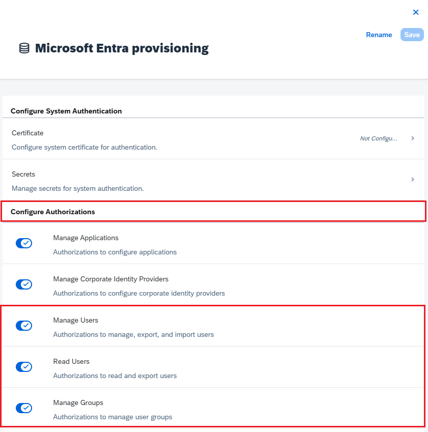

# Configure SAP Cloud Identity Services for automatic user provisioning with Microsoft Entra ID

This article demonstrates the steps for configuring provisioning from Microsoft Entra ID to SAP Cloud Identity Services. The goal is to set up Microsoft Entra ID to automatically provision and deprovision users to SAP Cloud Identity Services, so that those users can authenticate to SAP Cloud Identity Services and have access to other SAP workloads. SAP Cloud Identity Services supports provisioning from its local identity directory to other SAP applications as [target systems](https://help.sap.com/docs/identity-provisioning/identity-provisioning/target-systems).

> [!NOTE]
> This article describes a connector built in the Microsoft Entra user provisioning service. For important details on what this service does, how it works, and frequently asked questions, see [Automate user provisioning and deprovisioning to SaaS applications with Microsoft Entra ID](~/identity/app-provisioning/user-provisioning.md). SAP Cloud Identity Services also has its own separate connector to read users and groups from Microsoft Entra ID. For more information, see [SAP Cloud Identity Services - Identity Provisioning - Microsoft Entra ID as a source system](https://help.sap.com/docs/identity-provisioning/identity-provisioning/microsoft-azure-active-directory).
>

## Prerequisites

The scenario outlined in this article assumes that you already have the following prerequisites:

[!INCLUDE [common-prerequisites.md](~/identity/saas-apps/includes/common-prerequisites.md)]
* [An SAP Cloud Identity Services tenant](https://www.sap.com/products/cloud-platform.html)
* A user account in SAP Cloud Identity Services with Admin permissions.

> [!NOTE]
> This integration is also available to use from the Microsoft Entra US Government Cloud environment. You can find this application in the Microsoft Entra US Government Cloud Application Gallery and configure it in the same way as you do from the public cloud environment.

If you don't yet have users in Microsoft Entra ID, then start with the article [plan deploying Microsoft Entra for user provisioning with SAP source and target apps](~/identity/app-provisioning/plan-sap-user-source-and-target.md). That article illustrates how to connect Microsoft Entra with authoritative sources for the list of workers in an organization, such as SAP SuccessFactors. It also shows you how to use Microsoft Entra to set up identities for those workers, so they can sign in to one or more SAP applications, such as SAP ECC or SAP S/4HANA.

If you're configuring provisioning into SAP Cloud Identity Services in a production environment, where you be governing access to SAP workloads using Microsoft Entra ID Governance, then review the [prerequisites before configuring Microsoft Entra ID for identity governance](~/id-governance/identity-governance-applications-prepare.md#prerequisites-before-configuring-microsoft-entra-id-and-microsoft-entra-id-governance-for-identity-governance) before proceeding.

## Set up SAP Cloud Identity Services for provisioning

In this article,  you add an admin system in SAP Cloud Identity Services and then configure Microsoft Entra.


1. Sign in to your SAP Cloud Identity Services Admin Console, `https://<tenantID>.accounts.ondemand.com/admin` or `https://<tenantID>.trial-accounts.ondemand.com/admin` if a trial. Navigate to **Users & Authorizations > Administrators**.

	

1. Press the **+Add** button on the left hand panel in order to add a new administrator to the list. Choose **Add System** and enter the name of the system.   

	> [!NOTE]
	> The administrator identity in SAP Cloud Identity Services must be of type **System**. An administrator user isn't able to authenticate to the SAP SCIM API when provisioning. SAP Cloud Identity Services doesn't allow the name of a system to be changed after it's created.

1. Under Configure Authorizations, switch on the toggle button against **Manage Users**. Then select **Save** to create the system.

	

1.  After the administrator system is created, add a new secret to that system.

1. Copy the **Client ID** and **Client Secret** that's generated by SAP. These values are entered in the Admin Username and Admin Password fields respectively.
This is done in the Provisioning tab of your SAP Cloud Identity Services application, which you set up in the next section.

1. SAP Cloud Identity Services may have mappings to one or more SAP applications as target systems. Check if there are any attributes on the users that those SAP applications require to be provisioned through SAP Cloud Identity Services. This article assumes SAP Cloud Identity Services and downstream target systems require two attributes, `userName` and `emails[type eq "work"].value`. If your SAP target systems require other attributes, and those aren't part of your Microsoft Entra ID user schema, then you may need to configure [synching extension attributes](~/identity/app-provisioning/user-provisioning-sync-attributes-for-mapping.md).

## Add SAP Cloud Identity Services from the gallery

Before configuring Microsoft Entra ID to have automatic user provisioning into SAP Cloud Identity Services, you need to add SAP Cloud Identity Services from the Microsoft Entra application gallery to your tenant's list of enterprise applications. You can do this step in the Microsoft Entra admin center, or [via the Graph API](~/identity/app-provisioning/application-provisioning-configuration-api.md).

If SAP Cloud Identity Services is already configured for single-sign on from Microsoft Entra, and an application is already present in your Microsoft Entra list of enterprise applications, then continue at the next section.

**To add SAP Cloud Identity Services from the Microsoft Entra application gallery using the Microsoft Entra admin center, perform the following steps:**

1. Sign in to the [Microsoft Entra admin center](https://entra.microsoft.com) as at least a [Cloud Application Administrator](~/identity/role-based-access-control/permissions-reference.md#cloud-application-administrator).
1. Browse to **Entra ID** > **Enterprise apps** > **New application**.
1. To add the app from the gallery, type **SAP Cloud Identity Services** in the search box.
1. Select **SAP Cloud Identity Services** from results panel and then add the app. Wait a few seconds while the app is added to your tenant.

## Configure automatic user provisioning to SAP Cloud Identity Services

This section guides you through the steps to configure the Microsoft Entra provisioning service to create, update, and disable users in SAP Cloud Identity Services based on user assignments to an application in Microsoft Entra ID.

### To configure automatic user provisioning for SAP Cloud Identity Services in Microsoft Entra ID:

1. Sign in to the [Microsoft Entra admin center](https://entra.microsoft.com) as at least a [Cloud Application Administrator](~/identity/role-based-access-control/permissions-reference.md#cloud-application-administrator).
1. Browse to **Entra ID** > **Enterprise apps**

	

1. In the applications list, select the application, **SAP Cloud Identity Services**.

	

1. Select the **Properties** tab.

1. Verify that the **Assignment required?** option is set to **Yes**. If it's set to **No**, all users in your directory, including external identities, can access the application, and you can't review access to the application.

1. Select the **Provisioning** tab.

	

1. Set the **Provisioning Mode** to **Automatic**.

	

1. Under the **Admin Credentials** section, input `https://<tenantID>.accounts.ondemand.com/service/scim`, or `https://<tenantid>.trial-accounts.ondemand.com/service/scim` if a trial, with the tenant ID of your SAP Cloud Identity Services in **Tenant URL**. Input the **Client ID** and **Client Secret** values retrieved earlier in **Admin Username** and **Admin Password** respectively. Select **Test Connection** to ensure Microsoft Entra ID can connect to SAP Cloud Identity Services. If the connection fails, ensure your SAP Cloud Identity Services system account has Admin permissions, the secret is still valid, and try again.

	

1. In the **Notification Email** field, enter the email address of a person or group who should receive the provisioning error notifications and check the checkbox - **Send an email notification when a failure occurs**.

	

1. Select **Save**.

1. Under the **Mappings** section, select **Provision Microsoft Entra ID users**.

	

1. Review the user attributes that are synchronized from Microsoft Entra ID to SAP Cloud Identity Services in the **Attribute Mapping** section. If you don't see the attributes in your SAP Cloud Identity Services available as a target for mapping, then select **Show advanced options** and select **Edit attribute list for SAP Cloud Platform Identity Authentication Service** to [edit the list of supported attributes](~/identity/app-provisioning/customize-application-attributes.md#editing-the-list-of-supported-attributes). Add the attributes of your SAP Cloud Identity Services tenant.
1. Review and record the source and target attributes selected as **Matching** properties, mappings that have a **Matching precedence**, as these attributes are used to match the user accounts in SAP Cloud Identity Services for the Microsoft Entra provisioning service to determine whether to create a new user or update an existing user. For more information on matching, see [matching users in the source and target systems](~/identity/app-provisioning/customize-application-attributes.md#matching-users-in-the-source-and-target--systems). In a subsequent step, you ensure that any users already in SAP Cloud Identity Services have the attributes selected as **Matching** properties populated, to prevent duplicate users from being created.
1. Confirm that there's an attribute mapping for `IsSoftDeleted`, or a function containing `IsSoftDeleted`, mapped to an attribute of the application. When a user is unassigned from the application, soft-deleted in Microsoft Entra ID, or blocked from sign-in, the Microsoft Entra provisioning service will update the attribute mapped to `isSoftDeleted`. If no attribute is mapped, users who later are unassigned from the application role will continue to exist in the application's data store.
1. Add any additional mappings that your SAP Cloud Identity Services, or downstream target SAP systems, require.
1. Select the **Save** button to commit any changes.

	|Attribute|Type|Supported for filtering|Required by SAP Cloud Identity Services|
	|---|---|---|---|
	|`userName`|String|&check;|&check;
	|`emails[type eq "work"].value`|String||&check;
	|`active`|Boolean||
	|`displayName`|String||
	|`urn:ietf:params:scim:schemas:extension:enterprise:2.0:User:manager`|Reference||
	|`addresses[type eq "work"].country`|String||
	|`addresses[type eq "work"].locality`|String||
	|`addresses[type eq "work"].postalCode`|String||
	|`addresses[type eq "work"].region`|String||
	|`addresses[type eq "work"].streetAddress`|String||
	|`name.givenName`|String||
	|`name.familyName`|String||
	|`name.honorificPrefix`|String||
	|`phoneNumbers[type eq "fax"].value`|String||
	|`phoneNumbers[type eq "mobile"].value`|String||
	|`phoneNumbers[type eq "work"].value`|String||
	|`urn:ietf:params:scim:schemas:extension:enterprise:2.0:User:costCenter`|String||
	|`urn:ietf:params:scim:schemas:extension:enterprise:2.0:User:department`|String||
	|`urn:ietf:params:scim:schemas:extension:enterprise:2.0:User:division`|String||
	|`urn:ietf:params:scim:schemas:extension:enterprise:2.0:User:employeeNumber`|String||
	|`urn:ietf:params:scim:schemas:extension:enterprise:2.0:User:organization`|String||
	|`locale`|String||
	|`timezone`|String||
	|`userType`|String||
	|`company`|String||
	|`urn:sap:cloud:scim:schemas:extension:custom:2.0:User:attributes:customAttribute1`|String||
	|`urn:sap:cloud:scim:schemas:extension:custom:2.0:User:attributes:customAttribute2`|String||
	|`urn:sap:cloud:scim:schemas:extension:custom:2.0:User:attributes:customAttribute3`|String||
	|`urn:sap:cloud:scim:schemas:extension:custom:2.0:User:attributes:customAttribute4`|String||
	|`urn:sap:cloud:scim:schemas:extension:custom:2.0:User:attributes:customAttribute5`|String||
	|`urn:sap:cloud:scim:schemas:extension:custom:2.0:User:attributes:customAttribute6`|String||
	|`urn:sap:cloud:scim:schemas:extension:custom:2.0:User:attributes:customAttribute7`|String||
	|`urn:sap:cloud:scim:schemas:extension:custom:2.0:User:attributes:customAttribute8`|String||
	|`urn:sap:cloud:scim:schemas:extension:custom:2.0:User:attributes:customAttribute9`|String||
	|`urn:sap:cloud:scim:schemas:extension:custom:2.0:User:attributes:customAttribute10`|String||
	|`sendMail`|String||
	|`mailVerified`|String||

1. To configure scoping filters, refer to the following instructions provided in the [Scoping filter  article](~/identity/app-provisioning/define-conditional-rules-for-provisioning-user-accounts.md).

1. To enable the Microsoft Entra provisioning service for SAP Cloud Identity Services, change the **Provisioning Status** to **On** in the **Settings** section.

	

1.  For the value of **Scope** in the **Settings** section, select **Sync only assigned users and groups**.

	

1. When you're ready to provision, select **Save**.

	

This operation starts the initial synchronization of all users defined in **Scope** in the **Settings** section. If you have the scope set to **Sync only assigned users and groups** and no users or groups have been assigned to the application, then no synchronization will occur, until users are assigned to the application.  

## Provision a new test user from Microsoft Entra ID to SAP Cloud Identity Services

It's recommended that a single new Microsoft Entra test user is assigned to SAP Cloud Identity Services to test the automatic user provisioning configuration.

1. Sign in to the [Microsoft Entra admin center](https://entra.microsoft.com) as at least a [Cloud Application Administrator](~/identity/role-based-access-control/permissions-reference.md#cloud-application-administrator) and a User Administrator.
1. Browse to **Entra ID** > **Users**.
1. Select **New user** > **Create new user**.
1. Type in the **User principal name** and **Display Name** of the new test user. The user principal name must be unique and not the same of any current or previous Microsoft Entra user or SAP Cloud Identity Services user. Select **Review + create** and **Create**.
1. Once the test user is created, browse to **Entra ID** > **Enterprise apps**.
1. Select the SAP Cloud Identity Services application.
1. Select **Users and groups** and then select **Add user/group**.
1. In the **Users and groups** , select **None Selected**, and in text box, type the user principal name of the test user.
1. Select **Select**, and then **Assign**.
1. Select **Provisioning** and then select **Provision on demand**.
1. In the **Select a user or group** text box, type the user principal name of the test user.
1. Select **Provision**.
1. Wait for the provisioning to complete. If successful, you see the message `Modified attributes (successful)`.

You can also optionally verify what the Microsoft Entra provisioning service will provision when a user goes out of scope of the application.

1. Select **Users and groups**.
1. Select the test user, then select **Remove**.
1. After the test user is removed, select **Provisioning** and then select **Provision on demand**.
1. In the **Select a user or group** text box, type the user principal name of the test user just de-assigned.
1. Select **Provision**.
1. Wait for the provisioning to complete.

Finally, you can remove the test user from Microsoft Entra ID.

1. Browse to **Entra ID** > **Users**.
1. Select the test user, select **Delete**, and select **OK**. This action soft-deletes the test user from Microsoft Entra ID.

You can also then remove the test user from SAP Cloud Identity Services.

## Ensure existing SAP Cloud Identity Services users have the necessary matching attributes

Before assigning non-test users to the SAP Cloud Identity Services application in Microsoft Entra ID, you should ensure that any users already in SAP Cloud Identity Services that represent the same people as the users in Microsoft Entra ID, have the mapping attributes populated in SAP Cloud Identity services.

In the provisioning mapping, the attributes selected as **Matching** properties are used to match the user accounts in Microsoft Entra ID with the user accounts in SAP Cloud Identity Services. If there is a user in Microsoft Entra ID with no match in SAP Cloud Identity Services, then the Microsoft Entra provisioning service will attempt to create a new user. If there is a user in Microsoft Entra ID and a match in SAP Cloud Identity Services, then the Microsoft Entra provisioning service will update that SAP Cloud Identity Services user. For this reason, you should ensure that any users already in SAP Cloud Identity Services have the attributes selected as **Matching** properties populated, otherwise duplicate users may be created. If you need to change the matching attribute in your Microsoft Entra application attribute mapping, see [matching users in the source and target systems](~/identity/app-provisioning/customize-application-attributes.md#matching-users-in-the-source-and-target--systems).

1. Sign in to your SAP Cloud Identity Services Admin Console, `https://<tenantID>.accounts.ondemand.com/admin` or `https://<tenantID>.trial-accounts.ondemand.com/admin` if a trial.
1. Navigate to **Users & Authorizations > Export Users**.
1. Select all attributes required for matching Microsoft Entra users with those in SAP. These attributes include the `SCIM ID`, `userName`, `emails`, and other attributes you may be using in your SAP systems as identifiers.
1. Select **Export** and wait for the browser to download the CSV file.
1. Open a PowerShell window.
1. Type the following script into an editor. In line one, if you selected a different matching attribute other than `userName`, change the value of the `sapScimUserNameField` variable to the name of the SAP Cloud Identity Services attribute. In line two, change the argument to the filename of the exported CSV file  from `Users-exported-from-sap.csv` to the name of your downloaded file.

   ```powershell
   $sapScimUserNameField = "userName"
   $existingSapUsers = import-csv -Path ".\Users-exported-from-sap.csv" -Encoding UTF8
   $count = 0
   $warn = 0
   foreach ($u in $existingSapUsers) {
    $id = $u.id
    if (($null -eq $id) -or ($id.length -eq 0)) {
        write-error "Exported CSV file doesn't contain the id attribute of SAP Cloud Identity Services users."
        throw "id attribute not available, re-export"
        return
    }
    $count++
    $userName = $u.$sapScimUserNameField
    if (($null -eq $userName) -or ($userName.length -eq 0)) {
        write-warning "SAP Cloud Identity Services user $id doesn't have a $sapScimUserNameField attribute populated"
        $warn++
    }
   }
   write-output "$warn of $count users in SAP Cloud Identity Services did not have the $sapScimUserNameFIeld attribute populated."
   ```

7. Run the script. When the script completes, if there were one or more users that were lacking the required matching attribute, then look up those users in the exported CSV file or in the SAP Cloud Identity Services Admin Console. If those users are also present in Microsoft Entra, then you need to first update the SAP Cloud Identity Services representation of those users so that they have the matching attribute populated.
1. Once you have updated the attributes of those users in SAP Cloud Identity Services, then re-export the users from SAP Cloud Identity Services, as described in steps 2-5, and PowerShell steps in this section, to confirm no users in SAP Cloud Identity Services are lacking the matching attributes that would prevent provisioning to those users.

Now that you have a list of all the users obtained from SAP Cloud Identity Services, you match those users from the application's data store, with users already in Microsoft Entra ID, to determine which users should be in scope for provisioning.

[!INCLUDE [active-directory-identity-governance-applications-retrieve-users.md](~/includes/entra-identity-governance-applications-retrieve-users.md)]

## Ensure existing Microsoft Entra users have the necessary attributes

Before enabling automatic user provisioning, you must decide which users in Microsoft Entra ID need access to SAP Cloud Identity Services, and then you need to check to make sure that those users have the necessary attributes in Microsoft Entra ID, and those attributes are mapped to the expected schema of SAP Cloud Identity Services.

* By default, the value of the Microsoft Entra user `userPrincipalName` attribute is mapped to both the `userName` and `emails[type eq "work"].value` attributes of SAP Cloud Identity Services. If user's email addresses are different from their user principal names, then you may need to change this mapping.
* SAP Cloud Identity Services may ignore values of the `postalCode` attribute if the format of Company ZIP/postal code doesn't match the company country or region.
* By default, the Microsoft Entra attribute `country` is mapped to the SAP Cloud Identity Services `addresses[type eq "work"].country` field. If the values of the `country` attribute are not two character ISO 3166 country codes, then creation of those users in SAP Cloud Identity Services may fail. For more information, see [countries.properties](https://help.sap.com/docs/cloud-identity-services/cloud-identity-services/change-master-data-texts-rest-api#countries-properties).
* By default, the Microsoft Entra attribute `department` is mapped to the SAP Cloud Identity Services `urn:ietf:params:scim:schemas:extension:enterprise:2.0:User:department` attribute. If Microsoft Entra users have values of the `department` attribute, those values must match those departments already configured in SAP Cloud Identity Services, otherwise creation, or update, of the user will fail. For more information, see [departments.properties](https://help.sap.com/docs/cloud-identity-services/cloud-identity-services/change-master-data-texts-rest-api#departments-properties). If the `department` values in your Microsoft Entra users aren't consistent with those in your SAP environment, then either update the department values in Microsoft Entra, update the allowed department values in SAP Cloud Identity Services, or remove the mapping, prior to assigning users.
* SAP Cloud Identity Services's SCIM endpoint requires certain attributes to be of specific format. You can know more about these attributes and their specific format [here](https://help.sap.com/viewer/6d6d63354d1242d185ab4830fc04feb1/Cloud/en-US/b10fc6a9a37c488a82ce7489b1fab64c.html#).

## Assign users to the SAP Cloud Identity Services application in Microsoft Entra ID

Microsoft Entra ID uses a concept called *assignments* to determine which users should receive access to selected apps. In the context of automatic user provisioning, if the Settings value of **Scope** is **Sync only assigned users and groups**, then only the users and groups that have been assigned to an application role of that application in Microsoft Entra ID are synchronized with SAP Cloud Identity Services. When assigning a user to SAP Cloud Identity Services, you must select any valid application-specific role (if available) in the assignment dialog. Users with the **Default Access** role are excluded from provisioning. Currently the only available role for SAP Cloud Identity Services is **User**.

If provisioning has already been enabled for the application, check that the application provisioning isn't in [quarantine](~/identity/app-provisioning/application-provisioning-quarantine-status.md) before assigning more users to the application. Resolve any issues that are causing the quarantine, before you proceed.

### Check for users who are present in SAP Cloud Identity Services and aren't already assigned to the application in Microsoft Entra ID

The previous steps have evaluated whether the users in SAP Cloud Identity Services also exist as users in Microsoft Entra ID. However, they might not all currently be assigned to the application's roles in Microsoft Entra ID. So the next steps are to see which users don't have assignments to application roles.

1. Using PowerShell, look up the service principal ID for the application's service principal.

   For example, if the enterprise application is named `SAP Cloud Identity Services`, enter the following commands:

   ```powershell
   $azuread_app_name = "SAP Cloud Identity Services"
   $azuread_sp_filter = "displayName eq '" + ($azuread_app_name -replace "'","''") + "'"
   $azuread_sp = Get-MgServicePrincipal -Filter $azuread_sp_filter -All
   ```

1. Retrieve the users who currently have assignments to the application in Microsoft Entra ID.

   This builds upon the `$azuread_sp` variable set in the previous command.

   ```powershell
   $azuread_existing_assignments = @(Get-MgServicePrincipalAppRoleAssignedTo -ServicePrincipalId $azuread_sp.Id -All)
   ```

1. Compare the list of user IDs of the users already in both SAP Cloud Identity Services and Microsoft Entra ID to those users currently assigned to the application in Microsoft Entra ID. This script builds upon the `$azuread_match_id_list` variable set in the previous sections:

   ```powershell
   $azuread_not_in_role_list = @()
   foreach ($id in $azuread_match_id_list) {
      $found = $false
      foreach ($existing in $azuread_existing_assignments) {
         if ($existing.principalId -eq $id) {
            $found = $true; break;
         }
      }
      if ($found -eq $false) { $azuread_not_in_role_list += $id }
   }
   $azuread_not_in_role_count = $azuread_not_in_role_list.Count
   Write-Output "$azuread_not_in_role_count users in the application's data store aren't assigned to the application roles."
   ```

   If zero users are *not* assigned to application roles, indicating that all users *are* assigned to application roles, then this indicates that there were no users in common across Microsoft Entra ID and SAP Cloud Identity Services, so no changes are needed. However, if one or more users already in SAP Cloud Identity Services aren't currently assigned to the application roles, you need to continue the procedure and add them to one of the application's roles.

1. Select the `User` role of the application service principal.

   ```powershell
   $azuread_app_role_name = "User"
   $azuread_app_role_id = ($azuread_sp.AppRoles | where-object {$_.AllowedMemberTypes -contains "User" -and $_.DisplayName -eq "User"}).Id
   if ($null -eq $azuread_app_role_id) { write-error "role $azuread_app_role_name not located in application manifest"}
   ```

1. Create application role assignments for users who are already present in SAP Cloud Identity Services and Microsoft Entra, and don't currently have role assignments to the application:

   ```powershell
   foreach ($u in $azuread_not_in_role_list) {
      $res = New-MgServicePrincipalAppRoleAssignedTo -ServicePrincipalId $azuread_sp.Id -AppRoleId $azuread_app_role_id -PrincipalId $u -ResourceId $azuread_sp.Id
   }
   ```

1. Wait one minute for changes to propagate within Microsoft Entra ID.
1. On the next Microsoft Entra provisioning cycle, the Microsoft Entra provisioning service will compare the representation of those users assigned to the application, with the representation in SAP Cloud Identity Services, and update SAP Cloud Identity Services users to have the attributes from Microsoft Entra ID.

### Assign remaining users and monitor initial sync

Once the testing is complete, a user is successfully provisioned to SAP Cloud Identity Services, and any existing SAP Cloud Identity Services users are assigned to the application role, you can assign any additional authorized users to the SAP Cloud Identity Services application by following one of the instructions here:

* You can [assign each individual user to the application](~/identity/enterprise-apps/assign-user-or-group-access-portal.md) in the Microsoft Entra admin center,
* You can assign individual users to the application via PowerShell cmdlet `New-MgServicePrincipalAppRoleAssignedTo` as shown in the previous section, or
* if your organization has a license for Microsoft Entra ID Governance, you can also [deploy entitlement management policies for automating access assignment](~/id-governance/identity-governance-applications-deploy.md#deploy-entitlement-management-policies-for-automating-access-assignment).

Once users are assigned to the application role and are in scope for provisioning, then the Microsoft Entra provisioning service will provision them to SAP Cloud Identity Services.
Note that the initial sync takes longer to perform than subsequent syncs, which occur approximately every 40 minutes as long as the Microsoft Entra provisioning service is running.  

If you don't see users being provisioned, review the steps in the [troubleshooting guide for no users being provisioned](~/identity/app-provisioning/application-provisioning-config-problem-no-users-provisioned.md). Then, check the provisioning log through the [Microsoft Entra admin center](~/identity/monitoring-health/concept-provisioning-logs.md) or [Graph APIs](~/identity/app-provisioning/application-provisioning-configuration-api.md#monitor-provisioning-events-using-the-provisioning-logs). Filter the log to the status **Failure**. If there are failures with an ErrorCode of **DuplicateTargetEntries**,  this indicates an ambiguity in your provisioning matching rules, and you need to update the Microsoft Entra users or the mappings that are used for matching to ensure each Microsoft Entra user matches one application user. Then filter the log to the action **Create** and status **Skipped**. If users were skipped with the SkipReason code of **NotEffectivelyEntitled**, this may indicate that the user accounts in Microsoft Entra ID weren't matched because the user account status was **Disabled**.

## Configure single-sign on

You may also choose to enable SAML-based single sign-on for SAP Cloud Identity Services, following the instructions provided in the [SAP Cloud Identity Services Single sign-on  article](./sap-hana-cloud-platform-identity-authentication-tutorial.md). Single sign-on can be configured independently of automatic user provisioning, though these two features complement each other.

## Monitor provisioning

You can use the **Synchronization Details** section to monitor progress and follow links to provisioning activity report, which describes all actions performed by the Microsoft Entra provisioning service on SAP Cloud Identity Services. You can also monitor the provisioning project via the Microsoft [Graph APIs](~/identity/app-provisioning/application-provisioning-configuration-api.md#monitor-the-provisioning-job-status).

For more information on how to read the Microsoft Entra provisioning logs, see [Reporting on automatic user account provisioning](~/identity/app-provisioning/check-status-user-account-provisioning.md).

## Maintain application role assignments

As users that are in assigned to the application are updated in Microsoft Entra ID, those changes are automatically provisioned to SAP Cloud Identity Services.

If you have Microsoft Entra ID Governance, you can automate changes to the application role assignments for SAP Cloud Identity Services in Microsoft Entra ID, to add or remove assignments as people join the organization, or leave or change roles.

* You can [perform a one-time or recurring access review of the application role assignments](~/id-governance/access-reviews-application-preparation.md).
* You can [create an entitlement management access package for this application](~/id-governance/entitlement-management-access-package-create-app.md). You can have policies for users to be assigned access, either when they request, [by an administrator](~/id-governance/entitlement-management-access-package-assignments.md#directly-assign-a-user), [automatically based on rules](~/id-governance/entitlement-management-access-package-auto-assignment-policy.md), or through [lifecycle workflows](~/id-governance/entitlement-management-scenarios.md#administrator-assign-employees-access-from-lifecycle-workflows).


## More resources

* [Managing user account provisioning for Enterprise Apps](~/identity/app-provisioning/configure-automatic-user-provisioning-portal.md)
* [What is application access and single sign-on with Microsoft Entra ID?](~/identity/enterprise-apps/what-is-single-sign-on.md)
* [Manage access to your SAP applications](~/id-governance/sap.md)
* [Govern access for applications in your environment](~/id-governance/identity-governance-applications-prepare.md)


## Related content

* [Learn how to review logs and get reports on provisioning activity](~/identity/app-provisioning/check-status-user-account-provisioning.md)
