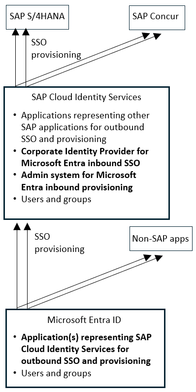
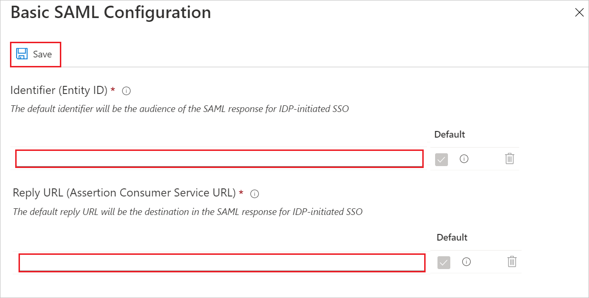
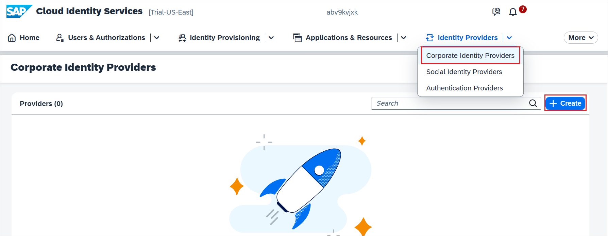

# Configure SAP Cloud Identity Services for Single sign-on with Microsoft Entra ID

In this article,  you learn how to integrate SAP Cloud Identity Services with Microsoft Entra ID. When you integrate SAP Cloud Identity Services with Microsoft Entra ID, you can:

* Control in Microsoft Entra ID who has access to SAP Cloud Identity Services.
* Enable your users to be automatically signed-in to SAP Cloud Identity Services and downstream SAP applications with their Microsoft Entra accounts.
* Manage your accounts in one central location.

> [!TIP]
> Follow the recommendations and best-practice guide "[Using Microsoft Entra ID to secure access to SAP platforms and applications](~/fundamentals/scenario-azure-first-sap-identity-integration.md)" to operationalize the setup.

## Prerequisites
The scenario outlined in this article assumes that you already have the following prerequisites:

[!INCLUDE [common-prerequisites.md](~/identity/saas-apps/includes/common-prerequisites.md)]
* [An SAP Cloud Identity Services tenant](https://www.sap.com/products/cloud-platform.html)
* A user account in SAP Cloud Identity Services with Admin permissions.

If you don't yet have users in Microsoft Entra ID, then start with the article [plan deploying Microsoft Entra for user provisioning with SAP source and target apps](~/identity/app-provisioning/plan-sap-user-source-and-target.md). That article illustrates how to connect Microsoft Entra with authoritative sources for the list of workers in an organization, such as SAP SuccessFactors. It also shows you how to use Microsoft Entra to set up identities for those workers, so they can sign in to one or more SAP applications, such as SAP ECC or SAP S/4HANA.

If you're configuring single sign-in into SAP Cloud Identity Services in a production environment, where you be governing access to SAP workloads using Microsoft Entra ID Governance, then review the [prerequisites before configuring Microsoft Entra ID for identity governance](~/id-governance/identity-governance-applications-prepare.md#prerequisites-before-configuring-microsoft-entra-id-and-microsoft-entra-id-governance-for-identity-governance) before proceeding.

## Scenario description

In this article,  you configure and test Microsoft Entra single sign-on in a test environment.

* SAP Cloud Identity Services supports service provider (**SP**) and identity provider (**IDP**) initiated SSO.
* SAP Cloud Identity Services supports [Automated user provisioning](sap-cloud-platform-identity-authentication-provisioning-tutorial.md).

Before you dive into the technical details, it's vital to understand the concepts you're going to look at. SAP Cloud Identity Services enable you to implement SSO across SAP applications and services, with the same SSO experience as non-SAP applications integrated directly with Microsoft Entra ID as an Identity Provider.

SAP Cloud Identity Services acts as a Proxy Identity Provider to other SAP applications as [target systems](https://help.sap.com/docs/identity-provisioning/identity-provisioning/target-systems). Microsoft Entra ID in turn acts as the leading Identity Provider in this setup.

The following diagram illustrates the trust relationship:

With this setup, your SAP Cloud Identity Services is configured as one or more applications in Microsoft Entra ID. Microsoft Entra is configured as a **Corporate Identity Provider** in your SAP Cloud Identity Services.

All SAP applications and services that you want to provide single sign-in for this way are subsequently configured as applications in SAP Cloud Identity Services.

User assignment to an SAP Cloud Identity Services application role in Microsoft Entra controls Microsoft Entra token issuance to SAP Cloud Identity Services. The authorization for granting access to specific SAP applications and services, and role assignments for those SAP applications, takes place in SAP Cloud Identity Services and the applications themselves. This authorization can be based on user and groups provisioned from Microsoft Entra ID.

> [!NOTE]
> Currently only Web SSO has been tested by both parties. The flows that are necessary for App-to-API or API-to-API communication should work but have not been tested yet. They is tested during subsequent activities.

## Adding SAP Cloud Identity Services from the gallery

To configure the integration of SAP Cloud Identity Services into Microsoft Entra ID, you need to add SAP Cloud Identity Services from the gallery to your list of managed SaaS apps.

1. Sign in to the [Microsoft Entra admin center](https://entra.microsoft.com) as at least a [Cloud Application Administrator](~/identity/role-based-access-control/permissions-reference.md#cloud-application-administrator).
1. Browse to **Entra ID** > **Enterprise apps** > **New application**.
1. In the **Add from the gallery** section, type **SAP Cloud Identity Services** in the search box.
1. Select **SAP Cloud Identity Services** from results panel and then add the app. Wait a few seconds while the app is added to your tenant.

 Alternatively, you can also use the [Enterprise App Configuration Wizard](https://portal.office.com/AdminPortal/home?Q=Docs#/azureadappintegration). In this wizard, you can add an application to your tenant, add users/groups to the app, assign roles, and walk through the SSO configuration as well. [Learn more about Microsoft 365 wizards.](/microsoft-365/admin/misc/azure-ad-setup-guides)

## Configure and test Microsoft Entra SSO for SAP Cloud Identity Services

Configure and test Microsoft Entra SSO with SAP Cloud Identity Services using a test user called **B.Simon**. For SSO to work, you need to establish a link relationship between a Microsoft Entra user and the related user in SAP Cloud Identity Services.

To configure and test Microsoft Entra SSO with SAP Cloud Identity Services, perform the following steps:

1. **[Configure Microsoft Entra SSO](#configure-azure-ad-sso)** - to enable your users to use this feature.
    1. **Create a Microsoft Entra test user** - to test Microsoft Entra single sign-on with B.Simon.
    1. **Assign the Microsoft Entra test user** - to enable B.Simon to use Microsoft Entra single sign-on.
1. **[Configure SAP Cloud Identity Services SSO](#configure-sap-cloud-identity-services-sso)** - to configure the single sign-on settings on application side.
    1. **[Create SAP Cloud Identity Services test user](#create-sap-cloud-identity-services-test-user)** - to have a counterpart of B.Simon in SAP Cloud Identity Services that's linked to the Microsoft Entra representation of user.
1. **[Test SSO](#test-sso)** - to verify whether the configuration works.

## Obtain the SAP Cloud Identity Services federation metadata

1. Sign in to the SAP Cloud Identity Services administration console. The URL has the following pattern: `https://<tenant-id>.accounts.ondemand.com/admin` or `https://<tenant-id>.trial-accounts.ondemand.com/admin`.

1. Under **Applications and Resources**, select **Tenant Settings**.

    

1. In the **Single Sign-On** tab, select **SAML 2.0 Configuration**. Then select **Download Metadata File** to download the federation metadata of SAP Cloud Identity Services.

    

## Configure Microsoft Entra SSO

Follow these steps to enable Microsoft Entra SSO.

1. Sign in to the [Microsoft Entra admin center](https://entra.microsoft.com) as at least a [Cloud Application Administrator](~/identity/role-based-access-control/permissions-reference.md#cloud-application-administrator).
1. Browse to **Entra ID** > **Enterprise apps**. Type the name of your application, such as **SAP Cloud Identity Services**. Select the application, then select **Single sign-on**.
1. On the **Select a single sign-on method** page, select **SAML**.
1. On the **Basic SAML Configuration** section, if you have **Service Provider metadata file** from SAP Cloud Identity Services, perform the following steps:

	a. Select **Upload metadata file**.

	b. Select **folder logo** to select the metadata file which you have downloaded from SAP and select **Upload**.

	

	c. After the metadata file is successfully uploaded, the **Identifier** and **Reply URL** values get auto populated in Basic SAML Configuration section.

	

	> [!Note]
	> If the **Identifier** and **Reply URL** values don't get auto populated, then fill in the values manually according to your requirement.

1. If you wish to make further configurations, then on the **Set up single sign-on with SAML** page, select the pencil icon for **Basic SAML Configuration** to edit the settings.

   

	In the **Sign on URL (Optional)** text box, type your specific business application Sign-on URL.

	> [!NOTE]
	> Update this value with the actual sign-on URL. For more information, see [SAP knowledge base article 3128585](https://userapps.support.sap.com/sap/support/knowledge/en/3128585). Contact the [SAP Cloud Identity Services Client support team](https://cloudplatform.sap.com/capabilities/security/trustcenter.html) if you have any questions.

1. SAP Cloud Identity Services application expects the SAML assertions in a specific format, which requires you to add custom attribute mappings to your SAML token attributes configuration. The following screenshot shows the list of default attributes.

	

1. In addition to above, SAP Cloud Identity Services application expects few more attributes to be passed back in SAML response, which are shown below. These attributes are also pre populated but you can review them as per your requirements.

    | Name | Source Attribute|
	| ---------------| --------------- |
    | firstName | user.givenname |

8. On the **Set up Single Sign-On with SAML** page, in the **SAML Signing Certificate** section, select **Download** to download the **Metadata XML** from the given options as per your requirement and save it on your computer.

	

9. On the **Set up SAP Cloud Identity Services** section, copy the appropriate URL(s) as per your requirement.

	

[!INCLUDE [create-assign-users-sso.md](~/identity/saas-apps/includes/create-assign-users-sso.md)]

## Configure SAP Cloud Identity Services SSO

In this section, you create a Corporate Identity Provider in the SAP Cloud Identity Services administration console. For more information, see [Create Corporate IdP in Administration Console](https://help.sap.com/docs/cloud-identity-services/cloud-identity-services/create-corporate-idp-in-administration-console).

1. Sign in to the SAP Cloud Identity Services administration console. The URL has the following pattern: `https://<tenant-id>.accounts.ondemand.com/admin` or `https://<tenant-id>.trial-accounts.ondemand.com/admin`.

1. Under **Identity Providers**, choose the **Corporate Identity Providers** tile.

1. Select **+ Create** to create an identity provider.

    

1. Perform the following steps on **Create Identity Provider** dialog box.

    

    a. Give a valid name in **Display Name**.

    b. Select **Microsoft ADFS/Entra ID (SAML 2.0)** from the dropdown.

    c. Select **Create**.

1. Go to **Trust -> SAML 2.0 Configuration**. On the field for **Metadata File**, select **Browse** to upload the **Metadata XML** file which you have downloaded from the Microsoft Entra SSO configuration.

    

1. Select **Save**.

3. Continue with the following only if you want to add and enable SSO for another SAP application. Repeat the steps under the section **Adding SAP Cloud Identity Services from the gallery**.

4. In the Entra side, on the **SAP Cloud Identity Services** application integration page, select **Linked Sign-on**.

	

5. Save the configuration.
6. For more information, please read the documentation about SAP Cloud Identity Services at [Integration with Microsoft Entra ID](https://developers.sap.com/tutorials/cp-ias-azure-ad.html).

> [!NOTE]
> The new application leverages the single sign-on configuration of the previous SAP application. Make sure you use the same Corporate Identity Providers in the SAP Cloud Identity Services administration console.

### Create SAP Cloud Identity Services test user

You don't need to create a user in SAP Cloud Identity Services. Users who are in the Microsoft Entra user store can use the SSO functionality.

SAP Cloud Identity Services supports the Identity Federation option. This option allows the application to check whether users who are authenticated by the corporate identity provider exist in the user store of SAP Cloud Identity Services.

The Identity Federation option is disabled by default. If Identity Federation is enabled, only the users that are imported in SAP Cloud Identity Services can access the application.

For more information about how to enable or disable Identity Federation with SAP Cloud Identity Services, see "Enable Identity Federation with SAP Cloud Identity Services" in [Configure Identity Federation with the User Store of SAP Cloud Identity Services](https://help.sap.com/viewer/6d6d63354d1242d185ab4830fc04feb1/Cloud/c029bbbaefbf4350af15115396ba14e2.html).

> [!NOTE]
> SAP Cloud Identity Services also supports automatic user provisioning, you can find more details [here](./sap-cloud-platform-identity-authentication-provisioning-tutorial.md) on how to configure automatic user provisioning.

## Test SSO 

In this section, you test your Microsoft Entra single sign-on configuration with following options, **SP initiated** and **IDP initiated**.

If you encounter errors from signing into SAP Cloud Identity Services, with a correlation ID, then in the SAP Cloud Identity Services administration console you can [search the troubleshooting logs](https://help.sap.com/docs/cloud-identity-services/cloud-identity-services/view-troubleshooting-logs) for that correlation ID. For more information, see [SAP knowledge base article 2698571](https://userapps.support.sap.com/sap/support/knowledge/en/2698571) and [SAP knowledge base article 3201824](https://userapps.support.sap.com/sap/support/knowledge/en/3201824).

#### SP initiated:

* Select **Test this application**, this option redirects to SAP Cloud Identity Services Sign on URL where you can initiate the login flow.

* Go to SAP Cloud Identity Services Sign on URL directly and initiate the login flow from there.

#### IDP initiated:

* Select **Test this application**, and you should be automatically signed in to the SAP Cloud Identity Services for which you set up the SSO

You can also use Microsoft My Apps to test the application in any mode. When you select the SAP Cloud Identity Services tile in the My Apps, if configured in SP mode you would be redirected to the application sign-on page for initiating the login flow and if configured in IDP mode, you should be automatically signed in to the SAP Cloud Identity Services for which you set up the SSO. For more information about the My Apps, see [Introduction to the My Apps](https://support.microsoft.com/account-billing/sign-in-and-start-apps-from-the-my-apps-portal-2f3b1bae-0e5a-4a86-a33e-876fbd2a4510).

## Related content

To synchronize users from Microsoft Entra to SAP Cloud Identity Services, enable [automated user provisioning](sap-cloud-platform-identity-authentication-provisioning-tutorial.md).

Once you configure single-sign on to SAP Cloud Identity Services, you can also configure SAP Cloud Identity Services to [forward all SSO requests](https://help.sap.com/docs/cloud-identity-services/cloud-identity-services/forward-all-sso-requests-to-corporate-idp) to Microsoft Entra. When this option is enabled in SAP Cloud Identity Services, then each time a user tries to access an application connected to SAP Cloud Identity Services for the first time, SAP Cloud Identity Services will forward an authentication request to Microsoft Entra, even when the user has an active session in SAP Cloud Identity Services.

You can also enforce session controls, which protect exfiltration and infiltration of your organization’s sensitive data in real time. Session controls extend from Conditional Access. [Learn how to enforce session control with Microsoft Defender for Cloud Apps](/cloud-app-security/proxy-deployment-aad).

You can also manage access to SAP BTP applications, using Microsoft Entra ID Governance to populate groups associated to roles in the BTP role collection. For more information, see [Managing access to SAP BTP](https://community.sap.com/t5/technology-blogs-by-members/identity-and-access-management-with-microsoft-entra-part-i-managing-access/ba-p/13873276).

Consult the [recommendations and best-practice guide](~/fundamentals/scenario-azure-first-sap-identity-integration.md) to operationalize the setup.
