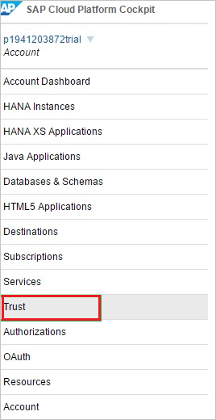
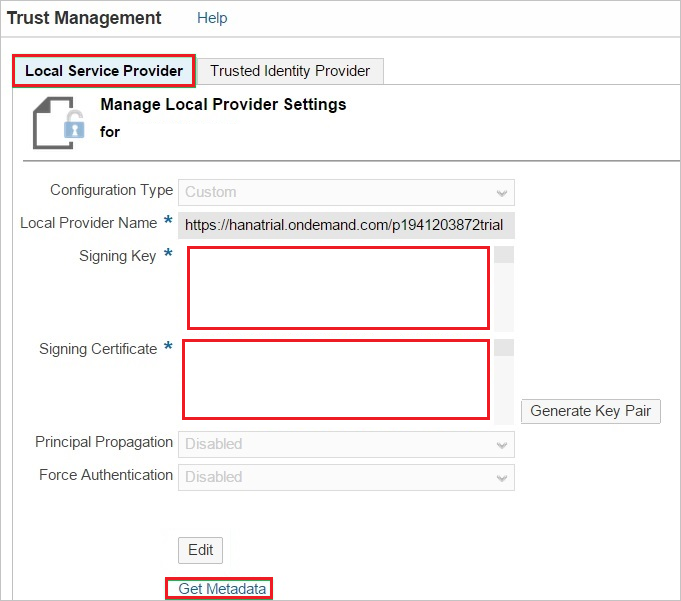
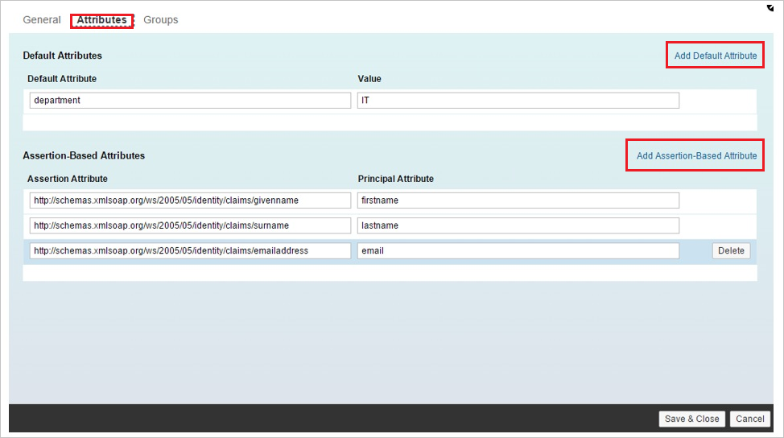
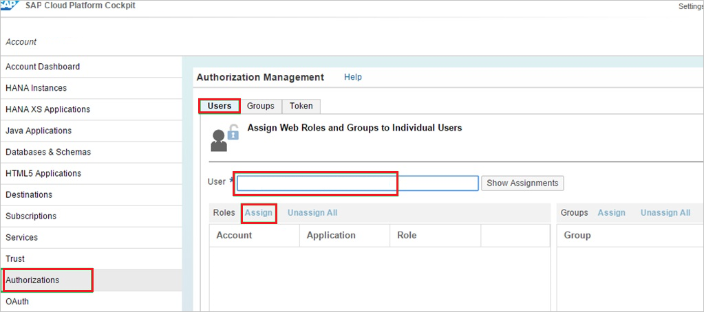

# Tutorial: Microsoft Entra SSO integration with SAP Business Technology Platform

In this tutorial, you'll learn how to integrate SAP Business Technology Platform with Microsoft Entra ID. When you integrate SAP Business Technology Platform with Microsoft Entra ID, you can:

* Control in Microsoft Entra ID who has access to SAP Business Technology Platform.
* Enable your users to be automatically signed-in to SAP Business Technology Platform with their Microsoft Entra accounts.
* Manage your accounts in one central location.

## Prerequisites

To get started, you need the following items:

* A Microsoft Entra subscription. If you don't have a subscription, you can get a [free account](https://azure.microsoft.com/free/).
* SAP Business Technology Platform single sign-on (SSO) enabled subscription.

>[!IMPORTANT]
>You need to deploy your own application or subscribe to an application on your SAP Business Technology Platform account to test single sign on. In this tutorial, an application is deployed in the account.
> 

## Scenario description

In this tutorial, you configure and test Microsoft Entra single sign-on in a test environment.

* SAP Business Technology Platform supports **SP** initiated SSO.

## Add SAP Business Technology Platform from the gallery

To configure the integration of SAP Business Technology Platform into Microsoft Entra ID, you need to add SAP Business Technology Platform from the gallery to your list of managed SaaS apps.

1. Sign in to the [Microsoft Entra admin center](https://entra.microsoft.com) as at least a [Cloud Application Administrator](~/identity/role-based-access-control/permissions-reference.md#cloud-application-administrator).
1. Browse to **Identity** > **Applications** > **Enterprise applications** > **New application**.
1. In the **Add from the gallery** section, type **SAP Business Technology Platform** in the search box.
1. Select **SAP Business Technology Platform** from results panel and then add the app. Wait a few seconds while the app is added to your tenant.

 Alternatively, you can also use the [Enterprise App Configuration Wizard](https://portal.office.com/AdminPortal/home?Q=Docs#/azureadappintegration). In this wizard, you can add an application to your tenant, add users/groups to the app, assign roles, as well as walk through the SSO configuration as well. [Learn more about Microsoft 365 wizards.](/microsoft-365/admin/misc/azure-ad-setup-guides)

## Configure and test Microsoft Entra SSO for SAP Business Technology Platform

Configure and test Microsoft Entra SSO with SAP Business Technology Platform using a test user called **B.Simon**. For SSO to work, you need to establish a link relationship between a Microsoft Entra user and the related user in SAP Business Technology Platform.

To configure and test Microsoft Entra SSO with SAP Business Technology Platform, perform the following steps:

1. **[Configure Microsoft Entra SSO](#configure-azure-ad-sso)** - to enable your users to use this feature.
    1. **[Create a Microsoft Entra test user](#create-an-azure-ad-test-user)** - to test Microsoft Entra single sign-on with Britta Simon.
    1. **[Assign the Microsoft Entra test user](#assign-the-azure-ad-test-user)** - to enable Britta Simon to use Microsoft Entra single sign-on.
2. **[Configure SAP Business Technology Platform SSO](#configure-sap-business-technology-platform-sso)** - to configure the Single Sign-On settings on application side.
    1. **[Create SAP Business Technology Platform test user](#create-sap-business-technology-platform-test-user)** - to have a counterpart of Britta Simon in SAP Business Technology Platform that is linked to the Microsoft Entra representation of user.
1. **[Test SSO](#test-sso)** - to verify whether the configuration works.

## Configure Microsoft Entra SSO

Follow these steps to enable Microsoft Entra SSO.

1. Sign in to the [Microsoft Entra admin center](https://entra.microsoft.com) as at least a [Cloud Application Administrator](~/identity/role-based-access-control/permissions-reference.md#cloud-application-administrator).
1. Browse to **Identity** > **Applications** > **Enterprise applications** > **SAP Business Technology Platform** > **Single sign-on**.
1. On the **Select a single sign-on method** page, select **SAML**.
1. On the **Set up single sign-on with SAML** page, click the pencil icon for **Basic SAML Configuration** to edit the settings.

   

1. On the **Basic SAML Configuration** section, enter the values for the following fields:

	a. In the **Identifier** textbox you will provide your SAP Business Technology Platform's type a URL using one of the following patterns: 

    | **Identifier** |
    |-----------|
    | `https://hanatrial.ondemand.com/<instancename>` |
    | `https://hana.ondemand.com/<instancename>` |
    | `https://us1.hana.ondemand.com/<instancename>` |
    | `https://ap1.hana.ondemand.com/<instancename>` |

	b. In the **Reply URL** textbox, type a URL using one of the following patterns:

    | **Reply URL** |
    |----------|
    | `https://<subdomain>.hanatrial.ondemand.com/<instancename>` |
    | `https://<subdomain>.hana.ondemand.com/<instancename>` |
    | `https://<subdomain>.us1.hana.ondemand.com/<instancename>` |
    | `https://<subdomain>.dispatcher.us1.hana.ondemand.com/<instancename>` |
    | `https://<subdomain>.ap1.hana.ondemand.com/<instancename>` |
    | `https://<subdomain>.dispatcher.ap1.hana.ondemand.com/<instancename>` |
    | `https://<subdomain>.dispatcher.hana.ondemand.com/<instancename>` |

    c. In the **Sign On URL** textbox, type the URL used by your users to sign into your **SAP Business Technology Platform** application. This is the account-specific URL of a protected resource in your SAP Business Technology Platform application. The URL is based on the following pattern: `https://<applicationName><accountName>.<landscape host>.ondemand.com/<path_to_protected_resource>`
      
    >[!NOTE]
    >This is the URL in your SAP Business Technology Platform application that requires the user to authenticate.
    > 

    | **Sign On URL** |
    |------|
    | `https://<subdomain>.hanatrial.ondemand.com/<instancename>` |
    | `https://<subdomain>.hana.ondemand.com/<instancename>` |

	> [!NOTE] 
	> These values are not real. Update these values with the actual Identifier,Reply URL and Sign on URL. Contact [SAP Business Technology Platform Client support team](https://help.sap.com/viewer/65de2977205c403bbc107264b8eccf4b/Cloud/5dd739823b824b539eee47b7860a00be.html) to get Sign-On URL and Identifier. Reply URL you can get from trust management section which is explained later in the tutorial.
	> 
4. On the **Set up Single Sign-On with SAML** page, in the **SAML Signing Certificate** section, click **Download** to download the **Federation Metadata XML** from the given options as per your requirement and save it on your computer.

	

### Create a Microsoft Entra test user

In this section, you'll create a test user called B.Simon.

1. Sign in to the [Microsoft Entra admin center](https://entra.microsoft.com) as at least a [User Administrator](~/identity/role-based-access-control/permissions-reference.md#user-administrator).
1. Browse to **Identity** > **Users** > **All users**.
1. Select **New user** > **Create new user**, at the top of the screen.
1. In the **User** properties, follow these steps:
   1. In the **Display name** field, enter `B.Simon`.  
   1. In the **User principal name** field, enter the username@companydomain.extension. For example, `B.Simon@contoso.com`.
   1. Select the **Show password** check box, and then write down the value that's displayed in the **Password** box.
   1. Select **Review + create**.
1. Select **Create**.

### Assign the Microsoft Entra test user

In this section, you'll enable B.Simon to use single sign-on by granting access to SAP Business Technology Platform.

1. Sign in to the [Microsoft Entra admin center](https://entra.microsoft.com) as at least a [Cloud Application Administrator](~/identity/role-based-access-control/permissions-reference.md#cloud-application-administrator).
1. Browse to **Identity** > **Applications** > **Enterprise applications** > **SAP Business Technology Platform**.
1. In the app's overview page, select **Users and groups**.
1. Select **Add user/group**, then select **Users and groups** in the **Add Assignment** dialog.
   1. In the **Users and groups** dialog, select **B.Simon** from the Users list, then click the **Select** button at the bottom of the screen.
   1. If you are expecting a role to be assigned to the users, you can select it from the **Select a role** dropdown. If no role has been set up for this app, you see "Default Access" role selected.
   1. In the **Add Assignment** dialog, click the **Assign** button.

## Configure SAP Business Technology Platform SSO

1. In a different web browser window, sign on to the SAP Business Technology Platform Cockpit at `https://account.<landscape host>.ondemand.com/cockpit`(for example: https://account.hanatrial.ondemand.com/cockpit).

2. Click the **Trust** tab.
   
    

3. In the Trust Management section, under **Local Service Provider**, perform the following steps:

    
   
    a. Click **Edit**.

    b. As **Configuration Type**, select **Custom**.

    c. As **Local Provider Name**, leave the default value. Copy this value and paste it into the **Identifier** field in the Microsoft Entra configuration for SAP Business Technology Platform.

    d. To generate a **Signing Key** and a **Signing Certificate** key pair, click **Generate Key Pair**.

    e. As **Principal Propagation**, select **Disabled**.

    f. As **Force Authentication**, select **Disabled**.

    g. Click **Save**.

4. After saving the **Local Service Provider** settings, perform the following to obtain the Reply URL:
   
    

    a. Download the SAP Business Technology Platform metadata file by clicking **Get Metadata**.

    b. Open the downloaded SAP Business Technology Platform metadata XML file, and then locate the **ns3:AssertionConsumerService** tag.
 
    c. Copy the value of the **Location** attribute, and then paste it into the **Reply URL** field in the Microsoft Entra configuration for SAP Business Technology Platform.

5. Click the **Trusted Identity Provider** tab, and then click **Add Trusted Identity Provider**.
   
    
   
    >[!NOTE]
    >To manage the list of trusted identity providers, you need to have chosen the Custom configuration type in the Local Service Provider section. For Default configuration type, you have a non-editable and implicit trust to the SAP ID Service. For None, you don't have any trust settings.
    > 
    > 

6. Click the **General** tab, and then click **Browse** to upload the downloaded metadata file.
    
    
    
    >[!NOTE]
    >After uploading the metadata file, the values for **Single Sign-on URL**, **Single Logout URL**, and **Signing Certificate** are populated automatically.
    > 
     
7. Click the **Attributes** tab.

8. On the **Attributes** tab, perform the following step:
    
     

    a. Click **Add Assertion-Based Attribute**, and then add the following assertion-based attributes:
       
    | Assertion Attribute | Principal Attribute |
    | --- | --- |
    | `http://schemas.xmlsoap.org/ws/2005/05/identity/claims/givenname` |firstname |
    | `http://schemas.xmlsoap.org/ws/2005/05/identity/claims/surname` |lastname |
    | `http://schemas.xmlsoap.org/ws/2005/05/identity/claims/emailaddress` |email |
   
    >[!NOTE]
    >The configuration of the Attributes depends on how the application(s) on SCP are developed, that is, which attribute(s) they expect in the SAML response and under which name (Principal Attribute) they access this attribute in the code.
    > 
    
    b. The **Default Attribute** in the screenshot is just for illustration purposes. It is not required to make the scenario work.  
 
    c. The names and values for **Principal Attribute** shown in the screenshot depend on how the application is developed. It is possible that your application requires different mappings.

### Assertion-based groups

As an optional step, you can configure assertion-based groups for your Microsoft Entra identity Provider.

Using groups on SAP Business Technology Platform allows you to dynamically assign one or more users to one or more roles in your SAP Business Technology Platform applications, determined by values of attributes in the SAML 2.0 assertion. 

For example, if the assertion contains the attribute "*contract=temporary*", you may want all affected users to be added to the group "*TEMPORARY*". The group "*TEMPORARY*" may contain one or more roles from one or more applications deployed in your SAP Business Technology Platform account.
 
Use assertion-based groups when you want to simultaneously assign many users to one or more roles of applications in your SAP Business Technology Platform account. If you want to assign only a single or small number of users to specific roles, we recommend assigning them directly in the “**Authorizations**” tab of the SAP Business Technology Platform cockpit.

### Create SAP Business Technology Platform test user

In order to enable Microsoft Entra users to log in to SAP Business Technology Platform, you must assign roles in the SAP Business Technology Platform to them.

**To assign a role to a user, perform the following steps:**

1. Log in to your **SAP Business Technology Platform** cockpit.

2. Perform the following:
   
    
   
    a. Click **Authorization**.

    b. Click the **Users** tab.

    c. In the **User** textbox, type the user’s email address.

    d. Click **Assign** to assign the user to a role.

    e. Click **Save**.

## Test SSO 

In this section, you test your Microsoft Entra single sign-on configuration with following options. 

* Click on **Test this application**, this will redirect to SAP Business Technology Platform Sign-on URL where you can initiate the login flow. 

* Go to SAP Business Technology Platform Sign-on URL directly and initiate the login flow from there.

* You can use Microsoft My Apps. When you click the SAP Business Technology Platform tile in the My Apps, you should be automatically signed in to the SAP Business Technology Platform for which you set up the SSO. For more information about the My Apps, see [Introduction to the My Apps](https://support.microsoft.com/account-billing/sign-in-and-start-apps-from-the-my-apps-portal-2f3b1bae-0e5a-4a86-a33e-876fbd2a4510).

## Next steps

* Once you configure SAP Business Technology Platform you can enforce session control, which protects exfiltration and infiltration of your organization’s sensitive data in real time. Session control extends from Conditional Access. [Learn how to enforce session control with Microsoft Defender for Cloud Apps](/cloud-app-security/proxy-deployment-any-app).
* [Manage access to SAP BTP apps via groups](https://community.sap.com/t5/technology-blogs-by-members/identity-and-access-management-with-microsoft-entra-part-i-managing-access/ba-p/13873276)
