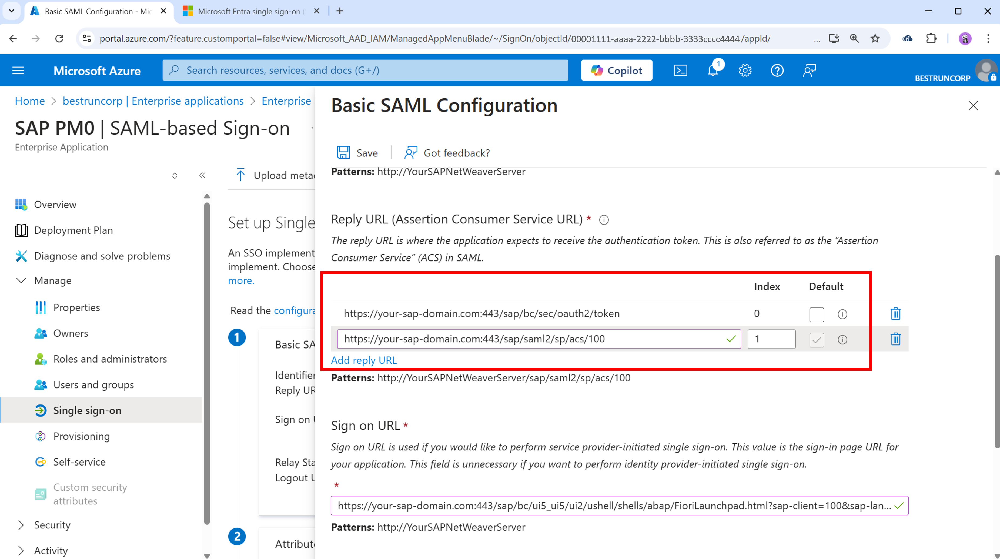

# Configure SAP NetWeaver for Single sign-on with Microsoft Entra ID

In this article,  you learn how to integrate SAP NetWeaver with Microsoft Entra ID. When you integrate SAP NetWeaver with Microsoft Entra ID, you can:

* Control in Microsoft Entra ID who has access to SAP NetWeaver.
* Enable your users to be automatically signed-in to SAP NetWeaver with their Microsoft Entra accounts.
* Manage your accounts in one central location.

## Prerequisites
The scenario outlined in this article assumes that you already have the following prerequisites:

[!INCLUDE [common-prerequisites.md](~/identity/saas-apps/includes/common-prerequisites.md)]
* SAP NetWeaver single sign-on (SSO) enabled subscription.
* SAP NetWeaver V7.20 or later

## Scenario description

* SAP NetWeaver supports both **SAML** (**SP initiated SSO**) and **OAuth**. In this article,  you configure and test Microsoft Entra SSO in a test environment. 

> [!NOTE]
> Identifier of this application is a fixed string value so only one instance can be configured in one tenant.

> [!NOTE]
> Configure the application either in SAML or in OAuth as per your organizational requirement. 

## Adding SAP NetWeaver from the gallery

To configure the integration of SAP NetWeaver into Microsoft Entra ID, you need to add SAP NetWeaver from the gallery to your list of managed SaaS apps.

1. Sign in to the [Microsoft Entra admin center](https://entra.microsoft.com) as at least a [Cloud Application Administrator](~/identity/role-based-access-control/permissions-reference.md#cloud-application-administrator).
1. Browse to **Entra ID** > **Enterprise apps** > **New application**.
1. In the **Add from the gallery** section, type **SAP NetWeaver** in the search box.
1. Select **SAP NetWeaver** from results panel and then add the app. Wait a few seconds while the app is added to your tenant.

 Alternatively, you can also use the [Enterprise App Configuration Wizard](https://portal.office.com/AdminPortal/home?Q=Docs#/azureadappintegration). In this wizard, you can add an application to your tenant, add users/groups to the app, assign roles, and walk through the SSO configuration as well. [Learn more about Microsoft 365 wizards.](/microsoft-365/admin/misc/azure-ad-setup-guides)

<a name='configure-and-test-microsoft-entra-sso-for-sap-netweaver'></a>

## Configure and test Microsoft Entra SSO for SAP NetWeaver

Configure and test Microsoft Entra SSO with SAP NetWeaver using a test user called **B.Simon**. For SSO to work, you need to establish a link relationship between a Microsoft Entra user and the related user in SAP NetWeaver.

To configure and test Microsoft Entra SSO with SAP NetWeaver, perform the following steps:

1. **[Configure Microsoft Entra SSO](#configure-microsoft-entra-sso)** to enable your users to use this feature.
    1. **Create a Microsoft Entra test user** to test Microsoft Entra single sign-on with B.Simon.
    1. **Assign the Microsoft Entra test user** to enable B.Simon to use Microsoft Entra single sign-on.
1. **[Configure SAP NetWeaver using SAML](#configure-sap-netweaver-using-saml)** to configure the SSO settings on application side.
    1. **[Create SAP NetWeaver test user](#create-sap-netweaver-test-user)** to have a counterpart of B.Simon in SAP NetWeaver that's linked to the Microsoft Entra representation of user.
1. **[Test SSO](#test-sso)** to verify whether the configuration works.
1. **[Configure SAP NetWeaver for OAuth​](#configure-sap-netweaver-for-oauth)** to configure the OAuth settings on application side.
1. **[Request Access Token from Microsoft Entra ID](#request-access-token-from-microsoft-entra-id)** to use Microsoft Entra ID as the Identity Provider (IdP).

<a name='configure-microsoft-entra-sso'></a>

## Configure Microsoft Entra SSO

In this section, you enable Microsoft Entra single sign-on.

To configure Microsoft Entra single sign-on with SAP NetWeaver, perform the following steps:

1. Open a new web browser window and sign into your SAP NetWeaver company site as an administrator

1. Make sure that **http** and **https** services are active and appropriate ports are assigned in **SMICM** T-Code.

1. Sign on to business client of SAP System (T01), where SSO is required and activate HTTP Security session Management.

   1. Go to Transaction code **SICF_SESSIONS**. It displays all relevant profile parameters with current values. They look like below:-

      ```
      login/create_sso2_ticket = 2
      login/accept_sso2_ticket = 1
      login/ticketcache_entries_max = 1000
      login/ticketcache_off = 0  login/ticket_only_by_https = 0 
      icf/set_HTTPonly_flag_on_cookies = 3
      icf/user_recheck = 0  http/security_session_timeout = 1800
      http/security_context_cache_size = 2500
      rdisp/plugin_auto_logout = 1800
      rdisp/autothtime = 60
      ```

      >[!NOTE]
      > Adjust above parameters as per your organization requirements, Above parameters are given here as indication only.

   1. If necessary adjust parameters, in the instance/default profile of SAP system and restart SAP system.

   1. Double-select relevant client to enable HTTP security session.

      

   1. Activate below SICF services:

      ```
      /sap/public/bc/sec/saml2
      /sap/public/bc/sec/cdc_ext_service
      /sap/bc/webdynpro/sap/saml2
      /sap/bc/webdynpro/sap/sec_diag_tool (This is only to enable / disable trace)
      ```

1. Go to Transaction code **SAML2** in business client of SAP system [T01/122]. It will open a user interface in a browser. In this example, we assumed 122 as SAP business client.

   

1. Provide your username and password to enter in user interface and select **Edit**.

   

1. Replace **Provider Name** from T01122 to `http://T01122` and select **Save**.

   > [!NOTE]
   > By default provider name come as `<sid><client>` format but Microsoft Entra ID expects name in the format of `<protocol>://<name>`, recommending to maintain provider name as `https://<sid><client>` to allow multiple SAP NetWeaver ABAP engines to configure in Microsoft Entra ID.

   

1. **Generating Service Provider Metadata**:- Once we're done with configuring the **Local Provider** and **Trusted Providers** settings on SAML 2.0 User Interface, the next step would be to generate the service provider’s metadata file (which would contain all the settings, authentication contexts, and other configurations in SAP). Once this file is generated, upload this file to Microsoft Entra ID.

   

   1. Go to **Local Provider tab**.

   1. Select **Metadata**.

   1. Save the generated **Metadata XML file** on your computer and upload it in **Basic SAML Configuration** section to autopopulate the **Identifier** and **Reply URL** values in Azure portal.

Follow these steps to enable Microsoft Entra SSO.

1. Sign in to the [Microsoft Entra admin center](https://entra.microsoft.com) as at least a [Cloud Application Administrator](~/identity/role-based-access-control/permissions-reference.md#cloud-application-administrator).
1. Browse to **Entra ID** > **Enterprise apps** > **SAP NetWeaver** application integration page, find the **Manage** section, and select **Single sign-on**.
1. On the **Select a Single sign-on method** page, select **SAML**.
1. On the **Set up Single Sign-On with SAML** page, select the pencil icon for **Basic SAML Configuration** to edit the settings.

   

1. On the **Basic SAML Configuration** section, if you wish to configure the application in **IDP** initiated mode, perform the following step:

   1. Select **Upload metadata file** to upload the **Service Provider metadata file**, which you have obtained earlier.

   1. Select **folder logo** to select the metadata file and select **Upload**.

   1. After the metadata file is successfully uploaded, the **Identifier** and **Reply URL** values get auto populated in **Basic SAML Configuration** section textbox as shown below:

   1. In the **Sign-on URL** text box, type a URL using the following pattern:
    `https://<your company instance of SAP NetWeaver>`

   > [!NOTE]
   > Some customers have encountered an error of an incorrect Reply URL configured for their instance. If you receive any such error, use these PowerShell commands. First update the Reply URLs in the application object with the Reply URL, then update the service principal. Use the [Get-MgServicePrincipal](/powershell/module/microsoft.graph.applications/get-mgserviceprincipal) to get the Service Principal ID value.
   >
   > ```powershell
   > $params = @{
   >    web = @{
   >       redirectUris = "<Your Correct Reply URL>"
   >    }
   > }
   > Update-MgApplication -ApplicationId "<Application ID>" -BodyParameter $params
   > Update-MgServicePrincipal -ServicePrincipalId "<Service Principal ID>" -ReplyUrls "<Your Correct Reply URL>"
   > ```
   >

1. SAP NetWeaver application expects the SAML assertions in a specific format, which requires you to add custom attribute mappings to your SAML token attributes configuration. The following screenshot shows the list of default attributes. Select **Edit** icon to open User Attributes dialog.

    

1. In the **User Claims** section on the **User Attributes** dialog, configure SAML token attribute as shown in the image above and perform the following steps:

    1. Select **Edit icon** to open the **Manage user claims** dialog.

        

        

    1. From the **Transformation** list, select **ExtractMailPrefix()**.

    1. From the **Parameter 1** list, select **user.userprincipalname**.

    1. Select **Save**.

1. On the **Set up Single Sign-On with SAML** page, in the **SAML Signing Certificate** section, find **Federation Metadata XML** and select **Download** to download the certificate and save it on your computer.

   

1. On the **Set up SAP NetWeaver** section, copy the appropriate URLs, based on your requirement.

   

<a name='create-an-azure-ad-test-user'></a>

[!INCLUDE [create-assign-users-sso.md](~/identity/saas-apps/includes/create-assign-users-sso.md)]

## Configure SAP NetWeaver using SAML

1. Sign in to SAP system and go to transaction code SAML2. It opens new browser window with SAML configuration screen.

2. For configuring End points for trusted Identity provider (Microsoft Entra ID) go to **Trusted Providers** tab.

    

3. Press **Add** and select **Upload Metadata File** from the context menu.

    

4. Upload metadata file, which you have downloaded.

    

5. In the next screen, type the Alias name. For example, type `aadsts`, and press **Next** to continue.

    

6. Make sure that your **Digest Algorithm** should be **SHA-256** and don’t require any changes and press **Next**.

    

7. On **Single Sign-On Endpoints**, use **HTTP POST** and select **Next** to continue.

    

8. On **Single Logout Endpoints** select **HTTPRedirect** and select **Next** to continue.

    

9. On **Artifact Endpoints**, press **Next** to continue.

    

10. On **Authentication Requirements**, select **Finish**.

    

11. Go to tab **Trusted Provider** > **Identity Federation** (from bottom of the screen). Select **Edit**.

    

12. Select **Add** under the **Identity Federation** tab (bottom window).

    

13. From the pop-up window, select **Unspecified** from the **Supported NameID formats** and select OK.

    

1. Give the **User ID Source** value as **Assertion Attribute**, **User ID mapping mode** value as **Email** and **Assertion Attribute Name** as `http://schemas.xmlsoap.org/ws/2005/05/identity/claims/name`.

    

14. Note that **User ID Source** and **User ID mapping mode** values determine the link between SAP user and Microsoft Entra claim.

   <a name='scenario-sap-user-to-azure-ad-user-mapping'></a>

   **Scenario: SAP User to Microsoft Entra user mapping.**

   1. NameID details screenshot from SAP.

      

   1. Screenshot mentioning Required claims from Microsoft Entra ID.

      

      **Scenario: Select SAP user ID based on configured email address in SU01. In this case email ID should be configured in su01 for each user who requires SSO.**

      1. NameID details screenshot from SAP.

         

      2. screenshot mentioning Required claims from Microsoft Entra ID.

        

15. Select **Save** and then select **Enable** to enable identity provider.

    

16. Select **OK** once prompted.

    

### Create SAP NetWeaver test user

In this section, you create a user called B.simon in SAP NetWeaver. Please work your in house SAP expert team or work with your organization SAP partner to add the users in the SAP NetWeaver platform.

## Test SSO

1. Once the identity provider Microsoft Entra ID was activated, try accessing below URL to check SSO, ensuring there isn't a prompt for username & password.

    `https://<sapurl>/sap/bc/bsp/sap/it00/default.htm`

    (or) use the URL below

    `https://<sapurl>/sap/bc/bsp/sap/it00/default.htm`

    > [!NOTE]
    > Replace sapurl with actual SAP hostname.

2. The above URL should take you to below mentioned screen. If you're able to reach up to the below page, Microsoft Entra SSO setup is successfully done.

    

3. If a username and password prompt occurs, you can diagnose the issue by enabling a trace, using the URL:

    `https://<sapurl>/sap/bc/webdynpro/sap/sec_diag_tool?sap-client=122&sap-language=EN#`

## Configure SAP NetWeaver for OAuth

1. SAP Documented process is available at the location: [NetWeaver Gateway Service Enabling and OAuth 2.0 Scope Creation](https://wiki.scn.sap.com/wiki/display/Security/NetWeaver+Gateway+Service+Enabling+and+OAuth+2.0+Scope+Creation)

2. Go to SPRO and find **Activate and Maintain services**.

    

3. In this example we want to connect the OData service: `DAAG_MNGGRP` with OAuth to Microsoft Entra SSO. Use the technical service name search for the service `DAAG_MNGGRP` and activate if not yet active, already (look for `green` status under ICF nodes tab). Ensure if system alias (the connected backend system, where the service actually running) is correct.

    

    * Then select pushbutton **OAuth** on the top button bar and assign `scope` (keep default name as offered).

4. For our example, the scope is `DAAG_MNGGRP_001`. It's generated from the service name by automatically adding a number. Report `/IWFND/R_OAUTH_SCOPES` can be used to change name of scope or create manually.

    

    > [!NOTE]
    > Message `soft state status isn't supported` – can be ignored, as no problem.

### Create a service user for the OAuth 2.0 Client

1. OAuth2 uses a `service ID` to get the access token for the end-user on its behalf. Important restriction by OAuth design: the `OAuth 2.0 Client ID` must be identical with the `username` the OAuth 2.0 client uses for login when requesting an Access Token. Therefore, for our example, we're going to register an OAuth 2.0 client with name CLIENT1. As a prerequisite, a user with the same name (CLIENT1) must exist in the SAP system and that user we will configure to be used by the referred application. 

2. When registering an OAuth Client we use the `SAML Bearer Grant type`.

    >[!NOTE]
    >For more details, refer OAuth 2.0 Client Registration for the SAML Bearer Grant Type [here](https://wiki.scn.sap.com/wiki/display/Security/OAuth+2.0+Client+Registration+for+the+SAML+Bearer+Grant+Type).

3. Execute T-Code `SU01` to create user CLIENT1 as `System type` and assign password. Save the password as you need to provide the credential to the API programmer, who should save it with the username to the calling code. No profile or role should be assigned.

### Register the new OAuth 2.0 Client ID with the creation wizard

1. To register a new **OAuth 2.0 client** start transaction **SOAUTH2**. The transaction will display an overview about the OAuth 2.0 clients that were already registered. Choose **Create** to start the wizard for the new OAuth client named as CLIENT1 in this example.

2. Go to T-Code: **SOAUTH2** and Provide the description then select **next**.

    

    

3. Select the already added **SAML2 IdP – Microsoft Entra ID** from the dropdown list and save.

    

    

    

4. Select **Add** under scope assignment to add the previously created scope: `DAAG_MNGGRP_001`

    

    

5. Select **finish**.

## Request Access Token from Microsoft Entra ID

To request an access token from the SAP system using Microsoft Entra ID (formerly Azure AD) as the Identity Provider (IdP), follow these steps:

### Step 1: Register Application in Microsoft Entra ID
1. **Log into the Azure portal**: Navigate to the Azure portal at [portal.azure.com](https://portal.azure.com).
2. **Register a new application**:
   - Go to "Microsoft Entra ID".
   - Select "App registrations" > "New registration".
   - Fill in the application details such as Name, Redirect URI, etc.
   - Select "Register".
3. **Configure API permissions**:
   - After registration, navigate to "API permissions".
   - Select "Add a permission" and select "APIs my organization uses".
   - Search for the SAP system or relevant API and add the necessary permissions.
   - Grant admin consent for the permissions.

### Step 2: Create Client Secret
1. **Navigate to the registered application**: Go to "Certificates & secrets".
2. **Create a new client secret**:
   - Select "New client secret".
   - Provide a description and set an expiry period.
   - Select "Add" and note down the client secret value as it's needed for authentication.

### Step 3: Configure SAP System for Microsoft Entra ID Integration
1. **Access SAP Cloud Platform**: Log into your SAP Cloud Platform Cockpit.
2. **Set up trust configuration**:
   - Go to "Security" > "Trust Configuration".
   - Add Microsoft Entra ID as a trusted IdP by importing the federation metadata XML from Microsoft Entra ID. This can be found in the "Endpoints" section of the Microsoft Entra ID app registration (under Federation Metadata Document).
3. **Configure OAuth2 client**:
   - In the SAP system, configure an OAuth2 client using the client ID and client secret obtained from Microsoft Entra ID.
   - Set the token endpoint and other relevant OAuth2 parameters.

### Step 4: Request Access Token

> [!TIP]
> Consider using Azure API Management to streamline the SAP Principal Propagation process for all client apps in Azure, Power Platform, Microsoft 365 and more, in a single place including smart token caching, secure token handling and governance options like request throttling. [Learn more about SAP Principal Propagation with Azure API Management](https://community.powerplatform.com/blogs/post/?postid=c6a609ab-3556-ef11-a317-6045bda95bf0). In case SAP Business Technology Platform is preferred, see [this article](https://community.sap.com/t5/enterprise-resource-planning-blogs-by-members/integrating-low-code-solutions-with-microsoft-using-sap-integration-suite/ba-p/13789298).

1. **Prepare the token request**:
   - Construct a token request using the following details:
     - **Token Endpoint**: This is typically `https://login.microsoftonline.com/{tenant}/oauth2/v2.0/token`.
     - **Client ID**: The Application (client) ID from Microsoft Entra ID.
     - **Client Secret**: The client secret value from Microsoft Entra ID.
     - **Scope**: The required scopes (e.g., `https://your-sap-system.com/.default`).
     - **Grant Type**: Use `client_credentials` for server-to-server authentication.

2. **Make the token request**:
   - Use a tool like Postman or a script to send a POST request to the token endpoint.
   - Example request (in cURL):
     ```sh
     curl -X POST \
       https://login.microsoftonline.com/{tenant}/oauth2/v2.0/token \
       -H 'Content-Type: application/x-www-form-urlencoded' \
       -d 'client_id={client_id}&scope=https://your-sap-system.com/.default&client_secret={client_secret}&grant_type=client_credentials'
     ```

3. **Extract the access token**:
   - The response will contain an access token if the request is successful. Use this access token to authenticate API requests to the SAP system.

### Step 5: Use the Access Token for API Requests
1. **Include the access token in API requests**:
   - For each request to the SAP system, include the access token in the `Authorization` header.
   - Example header:
     ```
     Authorization: Bearer {access_token}
     ```

## Configure enterprise app for SAP NetWeaver for SAML2 and OAuth2 simultaneously

For parallel use of SAML2 for SSO and OAuth2 for API access, you can configure the same enterprise app in Microsoft Entra ID for both protocols.

A typical setup defaults to SAML2 for SSO and OAuth2 for API access.




## Related content

- Configure Microsoft Entra SAP NetWeaver to enforce Session Control, which protects exfiltration and infiltration of your organization’s sensitive data in real time. Session Control extends from Conditional Access. [Learn how to enforce session control with Microsoft Defender for Cloud Apps](/cloud-app-security/proxy-deployment-aad).
- Configure SAP Principal Propagation (OAuth2) using Azure API Management to govern and secure access to SAP systems from client apps in Azure, Power Platform, Microsoft 365 and others. [Learn more about SAP Principal Propagation with Azure API Management](https://community.powerplatform.com/blogs/post/?postid=c6a609ab-3556-ef11-a317-6045bda95bf0).
