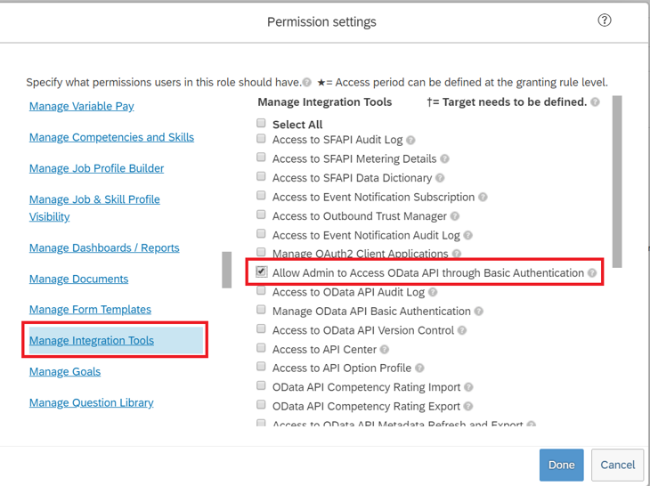
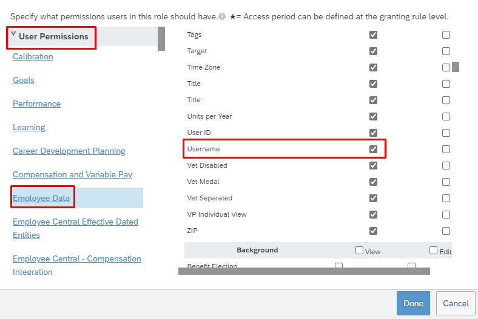
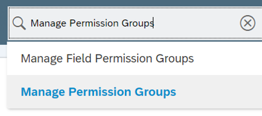

# Configure SAP SuccessFactors to Microsoft Entra user provisioning
The objective of this article is to show the steps you need to perform to provision worker data from SuccessFactors Employee Central into Microsoft Entra ID, with optional write-back of email address to SuccessFactors. 

>[!NOTE]
>Use this article if the users you want to provision from SuccessFactors are cloud-only users who don't need an on-premises AD account. If the users require only on-premises AD account or both AD and Microsoft Entra account, then please refer to the article on [configure SAP SuccessFactors to Active Directory](sap-successfactors-inbound-provisioning-tutorial.md#overview) user provisioning. 

The following video provides a quick overview of the steps involved when planning your provisioning integration with SAP SuccessFactors. 

> [!VIDEO https://www.youtube-nocookie.com/embed/66v2FR2-QrY]

## Overview

The [Microsoft Entra user provisioning service](~/identity/app-provisioning/user-provisioning.md) integrates with the [SuccessFactors Employee Central](https://www.successfactors.com/products-services/core-hr-payroll/employee-central.html) in order to manage the identity life cycle of users. 

The SuccessFactors user provisioning workflows supported by the Microsoft Entra user provisioning service enable automation of the following human resources and identity lifecycle management scenarios:

* **Hiring new employees** - When a new employee is added to SuccessFactors, a user account is automatically created in Microsoft Entra ID and optionally Microsoft 365 and [other SaaS applications supported by Microsoft Entra ID](~/identity/app-provisioning/user-provisioning.md), with write-back of the email address to SuccessFactors.

* **Employee attribute and profile updates** - When an employee record is updated in SuccessFactors (such as their name, title, or manager), their user account is automatically updated Microsoft Entra ID and optionally Microsoft 365 and [other SaaS applications supported by Microsoft Entra ID](~/identity/app-provisioning/user-provisioning.md).

* **Employee terminations** - When an employee is terminated in SuccessFactors, their user account is automatically disabled in Microsoft Entra ID and optionally Microsoft 365 and [other SaaS applications supported by Microsoft Entra ID](~/identity/app-provisioning/user-provisioning.md).

* **Employee rehires** - When an employee is rehired in SuccessFactors, their old account can be automatically reactivated or re-provisioned (depending on your preference) to Microsoft Entra ID and optionally Microsoft 365 and [other SaaS applications supported by Microsoft Entra ID](~/identity/app-provisioning/user-provisioning.md).

### Who is this user provisioning solution best suited for?

This SuccessFactors to Microsoft Entra user provisioning solution is ideally suited for:

* Organizations that desire a pre-built, cloud-based solution for SuccessFactors user provisioning, including organizations that are populating SuccessFactors from SAP HCM using SAP Integration Suite

* Organizations that will be [deploying Microsoft Entra for user provisioning with SAP source and target apps](~/identity/app-provisioning/plan-sap-user-source-and-target.md), using Microsoft Entra to set up identities for workers so they can sign in to one or more SAP applications, such as SAP ECC or SAP S/4HANA, as well as optionally non-SAP applications

* Organizations that require direct user provisioning from SuccessFactors to Microsoft Entra ID but do not require those users to also be in Windows Server Active Directory

* Organizations that require users to be provisioned using data obtained from the [SuccessFactors Employee Central (EC)](https://www.successfactors.com/products-services/core-hr-payroll/employee-central.html)

* Organizations using Microsoft 365 for email

## Solution Architecture

This section describes the end-to-end user provisioning solution architecture for cloud-only users. There are two related flows:

* **Authoritative HR Data Flow – from SuccessFactors to Microsoft Entra ID:** In this flow worker events (such as New Hires, Transfers, Terminations) first occur in the cloud SuccessFactors Employee Central and then the event data flows into Microsoft Entra ID. Depending on the event, it may lead to create/update/enable/disable operations in Microsoft Entra ID.
* **Email Writeback Flow – from Microsoft Entra ID to SuccessFactors:** Once the account creation is complete in Microsoft Entra ID, the email attribute value or UPN generated in Microsoft Entra ID can be written back to SuccessFactors.

  

### End-to-end user data flow

1. The HR team performs worker transactions (Joiners/Movers/Leavers or New Hires/Transfers/Terminations) in SuccessFactors Employee Central.
2. The Microsoft Entra provisioning service runs scheduled synchronizations of identities from SuccessFactors EC and identifies changes that need to be processed for sync with Microsoft Entra ID.
3. The Microsoft Entra provisioning service determines the change and invokes create/update/enable/disable operation for the user in Microsoft Entra ID.
4. If the [SuccessFactors Writeback app](sap-successfactors-writeback-tutorial.md) is configured, then the user's email address is retrieved from Microsoft Entra ID. 
5. Microsoft Entra provisioning service writes back email attribute to SuccessFactors, based on the matching attribute used.

## Planning your deployment

Configuring Cloud HR driven user provisioning from SuccessFactors to Microsoft Entra ID requires considerable planning covering different aspects such as:

* Determining the Matching ID 
* Attribute mapping
* Attribute transformation 
* Scoping filters

Please refer to the [cloud HR deployment plan](~/identity/app-provisioning/plan-cloud-hr-provision.md) for comprehensive guidelines around these topics. 
Please refer to the [SAP SuccessFactors integration reference](~/identity/app-provisioning/sap-successfactors-integration-reference.md) to learn about the supported entities, processing details and how to customize the integration for different HR scenarios. 

## Configuring SuccessFactors for the integration

A common requirement of all the SuccessFactors provisioning connectors is that they require credentials of a SuccessFactors account with the right permissions to invoke the SuccessFactors OData APIs. This section describes steps to create the service account in SuccessFactors and grant appropriate permissions. 

* [Create/identify API user account in SuccessFactors](#createidentify-api-user-account-in-successfactors)
* [Create an API permissions role](#create-an-api-permissions-role)
* [Create a Permission Group for the API user](#create-a-permission-group-for-the-api-user)
* [Grant Permission Role to the Permission Group](#grant-permission-role-to-the-permission-group)

### Create/identify API user account in SuccessFactors
Work with your SuccessFactors admin team or implementation partner to create or identify a user account in SuccessFactors to invoke the OData APIs. The username and password credentials of this account are required when configuring the provisioning apps in Microsoft Entra ID. 

### Create an API permissions role

1. Log in to SAP SuccessFactors with a user account that has access to the Admin Center.
1. Search for *Manage Permission Roles*, then select **Manage Permission Roles** from the search results.
  
1. From the Permission Role List, click **Create New**.
    > [!div class="mx-imgBorder"]
    > 
1. Add a **Role Name** and **Description** for the new permission role. The name and description should indicate that the role is for API usage permissions.
1. Under Permission settings, click **Permission...**, then scroll down the permission list and click **Manage Integration Tools**. Check the box for **Allow Admin to Access to OData API through Basic Authentication**.
    > [!div class="mx-imgBorder"]
    > 
1. Scroll down in the same box and select **Employee Central API**. Add permissions as shown below to read using ODATA API and edit using ODATA API. Select the edit option if you plan to use the same account for the Writeback to SuccessFactors scenario. 
    > [!div class="mx-imgBorder"]
    > 

1. In the same permissions box, go to **User Permissions -> Employee Data** and review the attributes that the service account can read from the SuccessFactors tenant. For example, to retrieve the *Username* attribute from SuccessFactors, ensure that "View" permission is granted for this attribute. Similarly review each attribute for view permission. 

    > [!div class="mx-imgBorder"]
    > 
   

    >[!NOTE]
    >For the complete list of attributes retrieved by this provisioning app, please refer to [SuccessFactors Attribute Reference](~/identity/app-provisioning/sap-successfactors-attribute-reference.md)

1. Click on **Done**. Click **Save Changes**.

### Create a Permission Group for the API user

1. In the SuccessFactors Admin Center, search for *Manage Permission Groups*, then select **Manage Permission Groups** from the search results.
    > [!div class="mx-imgBorder"]
    > 
1. From the Manage Permission Groups window, click **Create New**.
    > [!div class="mx-imgBorder"]
    > 
1. Add a Group Name for the new group. The group name should indicate that the group is for API users.
    > [!div class="mx-imgBorder"]
    > 
1. Add members to the group. For example, you could select **Username** from the People Pool drop-down menu and then enter the username of the API account that will be used for the integration. 
    > [!div class="mx-imgBorder"]
    > 
1. Click **Done** to finish creating the Permission Group.

### Grant Permission Role to the Permission Group

1. In SuccessFactors Admin Center, search for *Manage Permission Roles*, then select **Manage Permission Roles** from the search results.
1. From the **Permission Role List**, select the role that you created for API usage permissions.
1. Under **Grant this role to...**, click **Add...** button.
1. Select **Permission Group...** from the drop-down menu, then click **Select...** to open the Groups window to search and select the group created above.
1. Review the Permission Role grant to the Permission Group. 
1. Click **Save Changes**.

## Configuring user provisioning from SuccessFactors to Microsoft Entra ID

This section provides steps for user account provisioning from SuccessFactors to Microsoft Entra ID.

* [Add the provisioning connector app and configure connectivity to SuccessFactors](#part-1-add-the-provisioning-connector-app-and-configure-connectivity-to-successfactors)
* [Configure attribute mappings](#part-2-configure-attribute-mappings)
* [Enable and launch user provisioning](#enable-and-launch-user-provisioning)

### Part 1: Add the provisioning connector app and configure connectivity to SuccessFactors

**To configure SuccessFactors to Microsoft Entra provisioning:**

1. Sign in to the [Microsoft Entra admin center](https://entra.microsoft.com) as at least a [Cloud Application Administrator](~/identity/role-based-access-control/permissions-reference.md#cloud-application-administrator).
1. Browse to **Identity** > **Applications** > **Enterprise applications** > **New application**.

5. Search for **SuccessFactors to Microsoft Entra user provisioning**, and add that app from the gallery.

6. After the app is added and the app details screen is shown, select **Provisioning**

7. Change the **Provisioning** **Mode** to **Automatic**

8. Complete the **Admin Credentials** section as follows:

   * **Admin Username** – Enter the username of the SuccessFactors API user account, with the company ID appended. It has the format: **username\@companyID**

   * **Admin password –** Enter the password of the SuccessFactors API user account. 

   * **Tenant URL –** Enter the name of the SuccessFactors OData API services endpoint. Only enter the host name of server without http or https. This value should look like: **api-server-name.successfactors.com**.

   * **Notification Email –** Enter your email address, and check the "send email if failure occurs" checkbox.
    > [!NOTE]
    > The Microsoft Entra provisioning service sends email notification if the provisioning job goes into a [quarantine](~/identity/app-provisioning/application-provisioning-quarantine-status.md) state.

   * Click the **Test Connection** button. If the connection test succeeds, click the **Save** button at  the top. If it fails, double-check that the SuccessFactors credentials and URL are valid.

   * Once the credentials are saved successfully, the **Mappings** section displays the default mapping **Synchronize SuccessFactors Users to Microsoft Entra ID**

### Part 2: Configure attribute mappings

In this section, you'll configure how user data flows from SuccessFactors to Microsoft Entra ID.

1. On the Provisioning tab under **Mappings**, click **Synchronize SuccessFactors Users to Microsoft Entra ID**.

1. In the **Source Object Scope** field, you can select which sets of users in SuccessFactors should be in scope for provisioning to Microsoft Entra ID, by defining a set of attribute-based filters. The default scope is "all users in SuccessFactors". Example filters:

   * Example: Scope to users with personIdExternal between 1000000 and
        2000000 (excluding 2000000)

      * Attribute: personIdExternal

      * Operator: REGEX Match

      * Value: (1[0-9][0-9][0-9][0-9][0-9][0-9])

   * Example: Only employees and not contingent workers

      * Attribute: EmployeeID

      * Operator: IS NOT NULL

   > [!TIP]
   > When you are configuring the provisioning app for the first time, you'll need to test and verify your attribute mappings and expressions to make sure that it's giving you the desired result. Microsoft recommends using the scoping filters under **Source Object Scope** to test your mappings with a few test users from SuccessFactors. Once you've verified that the mappings work, then you can either remove the filter or gradually expand it to include more users.

   > [!CAUTION] 
   > The default behavior of the provisioning engine is to disable/delete users that go out of scope. This may not be desirable in your SuccessFactors to Microsoft Entra integration. To override this default behavior refer to the article [Skip deletion of user accounts that go out of scope](~/identity/app-provisioning/skip-out-of-scope-deletions.md)
  
1. In the **Target Object Actions** field, you can globally filter what actions are performed in Microsoft Entra ID. **Create** and **Update** are most common.

1. In the **Attribute mappings** section, you can define how individual SuccessFactors attributes map to Microsoft Entra attributes.

     >[!NOTE]
     >For the complete list of SuccessFactors attribute supported by the application, please refer to [SuccessFactors Attribute Reference](~/identity/app-provisioning/sap-successfactors-attribute-reference.md)

1. Click on an existing attribute mapping to update it, or click **Add new mapping** at the bottom of the screen to add new mappings. An individual attribute mapping supports these properties:

      * **Mapping Type**

         * **Direct** – Writes the value of the SuccessFactors attribute to the Microsoft Entra attribute, with no changes

         * **Constant** - Write a static, constant string value to the Microsoft Entra attribute

         * **Expression** – Allows you to write a custom value to the Microsoft Entra attribute, based on one or more SuccessFactors attributes. [For more info, see this article on expressions](~/identity/app-provisioning/functions-for-customizing-application-data.md).

      * **Source attribute** - The user attribute from SuccessFactors

      * **Default value** – Optional. If the source attribute has an empty value, the mapping writes this value instead.
            Most common configuration is to leave this blank.

      * **Target attribute** – The user attribute in Microsoft Entra ID.

      * **Match objects using this attribute** – Whether or not this mapping should be used to uniquely identify users between SuccessFactors and Microsoft Entra ID. This value is typically set on the  Worker ID field for SuccessFactors, which is typically mapped to one of the Employee ID attributes in Microsoft Entra ID.

      * **Matching precedence** – Multiple matching attributes can be set. When there are multiple, they are evaluated in the order defined by this field. As soon as a match is found, no further matching attributes are evaluated.

      * **Apply this mapping**

         * **Always** – Apply this mapping on both user creation and update actions

         * **Only during creation** - Apply this mapping only on user creation actions

1. To save your mappings, click **Save** at the top of the  Attribute-Mapping section.

Once your attribute mapping configuration is complete, you can now [enable and launch the user provisioning service](#enable-and-launch-user-provisioning).

## Enable and launch user provisioning

Once the SuccessFactors provisioning app configurations have been completed, you can turn on the provisioning service.

> [!TIP]
> By default when you turn on the provisioning service, it will initiate provisioning operations for all users in scope. If there are errors in the mapping or SuccessFactors data issues, then the provisioning job might fail and go into the quarantine state. To avoid this, as a best practice, we recommend configuring **Source Object Scope** filter and testing  your attribute mappings with a few test users before launching the full sync for all users. Once you have verified that the mappings work and are giving you the desired results, then you can either remove the filter or gradually expand it to include more users.

1. In the **Provisioning** tab, set the **Provisioning Status** to **On**.

2. Click **Save**.

3. This operation starts the initial sync, which can take a variable number of hours depending on how many users are in the SuccessFactors tenant. You can check the progress bar to the track the progress of the sync cycle. 

4. At any time, check the **Provisioning** tab in the Entra admin center to see what actions the provisioning service has performed. The provisioning logs lists all individual sync events performed by the provisioning service, such as which users are being read out of SuccessFactors and then subsequently added or updated to Microsoft Entra ID. 

5. Once the initial sync is completed, it writes an audit summary report in the **Provisioning** tab, as shown below.

   > [!div class="mx-imgBorder"]
   > 

## Related content

* [Learn more about supported SuccessFactors Attributes for inbound provisioning](~/identity/app-provisioning/sap-successfactors-attribute-reference.md)
* [Learn how to configure email writeback to SuccessFactors](sap-successfactors-writeback-tutorial.md)
* [Learn how to review logs and get reports on provisioning activity](~/identity/app-provisioning/check-status-user-account-provisioning.md)
* [Learn how to integrate other SaaS applications with Microsoft Entra ID](tutorial-list.md)
