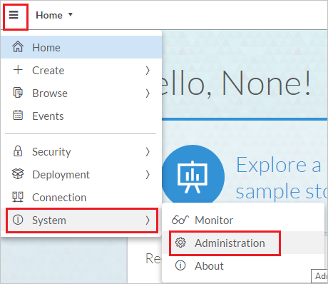
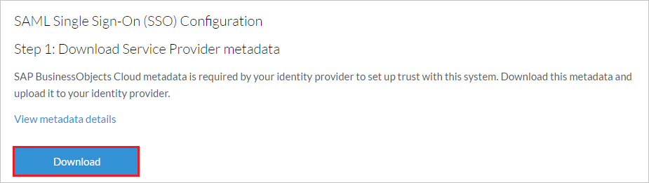

# Configure SAP Analytics Cloud for Single sign-on with Microsoft Entra ID

In this article,  you learn how to integrate SAP Analytics Cloud with Microsoft Entra ID. When you integrate SAP Analytics Cloud with Microsoft Entra ID, you can:

* Manage your accounts in one central location.
* Enable your users to be automatically signed-in to SAP Analytics Cloud with their Microsoft Entra accounts.

## Prerequisites
The scenario outlined in this article assumes that you already have the following prerequisites:

[!INCLUDE [common-prerequisites.md](~/identity/saas-apps/includes/common-prerequisites.md)]
* SAP Analytics Cloud single sign-on (SSO) enabled subscription.

## Scenario description

In this article,  you configure and test Microsoft Entra SSO in a test environment.

* SAP Analytics Cloud supports **SP** initiated SSO.

* SAP Analytics Cloud supports [Automated user provisioning](sap-analytics-cloud-provisioning-tutorial.md). 

## Add SAP Analytics Cloud from the gallery

To configure the integration of SAP Analytics Cloud into Microsoft Entra ID, you need to add SAP Analytics Cloud from the gallery to your list of managed SaaS apps.

1. Sign in to the [Microsoft Entra admin center](https://entra.microsoft.com) as at least a [Cloud Application Administrator](~/identity/role-based-access-control/permissions-reference.md#cloud-application-administrator).
1. Browse to **Entra ID** > **Enterprise apps** > **New application**.
1. In the **Add from the gallery** section, type **SAP Analytics Cloud** in the search box.
1. Select **SAP Analytics Cloud** from results panel and then add the app. Wait a few seconds while the app is added to your tenant.

 Alternatively, you can also use the [Enterprise App Configuration Wizard](https://portal.office.com/AdminPortal/home?Q=Docs#/azureadappintegration). In this wizard, you can add an application to your tenant, add users/groups to the app, assign roles, and walk through the SSO configuration as well. [Learn more about Microsoft 365 wizards.](/microsoft-365/admin/misc/azure-ad-setup-guides)

## Configure and test Microsoft Entra SSO for SAP Analytics Cloud

Configure and test Microsoft Entra SSO with SAP Analytics Cloud using a test user called **B.Simon**. For SSO to work, you need to establish a link relationship between a Microsoft Entra user and the related user in SAP Analytics Cloud.

To configure and test Microsoft Entra SSO with SAP Analytics Cloud, perform the following steps:

1. **[Configure Microsoft Entra SSO](#configure-azure-ad-sso)** - to enable your users to use this feature.
    1. **Create a Microsoft Entra test user** - to test Microsoft Entra single sign-on with B.Simon.
    1. **Assign the Microsoft Entra test user** - to enable B.Simon to use Microsoft Entra single sign-on.
1. **[Configure SAP Analytics Cloud SSO](#configure-sap-analytics-cloud-sso)** - to configure the single sign-on settings on application side.
    1. **[Create SAP Analytics Cloud test user](#create-sap-analytics-cloud-test-user)** - to have a counterpart of B.Simon in SAP Analytics Cloud that's linked to the Microsoft Entra representation of user.
1. **[Test SSO](#test-sso)** - to verify whether the configuration works.

## Configure Microsoft Entra SSO

Follow these steps to enable Microsoft Entra SSO.

1. Sign in to the [Microsoft Entra admin center](https://entra.microsoft.com) as at least a [Cloud Application Administrator](~/identity/role-based-access-control/permissions-reference.md#cloud-application-administrator).
1. Browse to **Entra ID** > **Enterprise apps** > **SAP Analytics Cloud** application integration page, find the **Manage** section and select **Single sign-on**.
1. On the **Select a Single sign-on method** page, select **SAML**.
1. On the **Set up Single Sign-On with SAML** page, select the pencil icon for **Basic SAML Configuration** to edit the settings.

   

1. On the **Basic SAML Configuration** section, enter the values for the following fields:

    a. In the **Identifier (Entity ID)** text box, type a value using one of the following patterns:

    | **Identifier URL** |
    |----|
    | `<sub-domain>.sapbusinessobjects.cloud` |
    | `<sub-domain>.sapanalytics.cloud` |

    b. In the **Sign on URL** text box, type a URL using one of the following patterns:
    
    | **Sign on URL** |
    |------|
    | `https://<sub-domain>.sapanalytics.cloud/` |
    | `https://<sub-domain>.sapbusinessobjects.cloud/` |

	> [!NOTE] 
	> The values in these URLs are for demonstration only. Update the values with the actual Identifier and Sign on URL. To get the sign-on URL, contact the [SAP Analytics Cloud Client support team](https://help.sap.com/viewer/product/SAP_BusinessObjects_Cloud/release/). You can get the identifier URL by downloading the SAP Analytics Cloud metadata from the admin console. This is explained later in the article.

4. On the **Set up Single Sign-On with SAML** page, in the **SAML Signing Certificate** section,  find **Federation Metadata XML** and select **Download** to download the certificate and save it on your computer.

	

6. On the **Set up SAP Analytics Cloud** section, copy the appropriate URL(s) based on your requirement.

	

[!INCLUDE [create-assign-users-sso.md](~/identity/saas-apps/includes/create-assign-users-sso.md)]

## Configure SAP Analytics Cloud SSO

1. In a different web browser window, sign in to your SAP Analytics Cloud company site as an administrator.

2. Select **Menu** > **System** > **Administration**.
    
	

3. On the **Security** tab, select the **Edit** (pen) icon.
    
	  

4. For **Authentication Method**, select **SAML Single Sign-On (SSO)**.

	  

5. To download the service provider metadata (Step 1), select **Download**. In the metadata file, find and copy the **entityID** value. In the Azure portal, on the **Basic SAML Configuration** dialog, paste the value in the **Identifier** box.

	  

6. To upload the service provider metadata (Step 2) in the file that you downloaded, under **Upload Identity Provider metadata**, select **Upload**.  

	

7. In the **User Attribute** list, select the user attribute (Step 3) that you want to use for your implementation. This user attribute maps to the identity provider. To enter a custom attribute on the user's page, use the **Custom SAML Mapping** option. Or, you can select either **Email** or **USER ID** as the user attribute. In our example, we selected **Email** because we mapped the user identifier claim with the **userprincipalname** attribute in the **User Attributes & Claims** section. This provides a unique user email, which is sent to the SAP Analytics Cloud application in every successful SAML response.

	

8. To verify the account with the identity provider (Step 4), in the **Login Credential (Email)** box, enter the user's email address. Then, select **Verify Account**. The system adds sign-in credentials to the user account.

    

9. Select the **Save** icon.

	

### Create SAP Analytics Cloud test user

Microsoft Entra users must be provisioned in SAP Analytics Cloud before they can sign in to SAP Analytics Cloud. In SAP Analytics Cloud, provisioning is a manual task.

To provision a user account:

1. Sign in to your SAP Analytics Cloud company site as an administrator.

2. Select **Menu** > **Security** > **Users**.

    

3. On the **Users** page, to add new user details, select **+**. 

    

    Then, complete the following steps:

    1. In the **USER ID** box, enter the user ID of the user, like **B**.

    1. In the **FIRST NAME** box, enter the first name of the user, like **B**.

    1. In the **LAST NAME** box, enter the last name of the user, like **Simon**.

    1. In the **DISPLAY NAME** box, enter the full name of the user, like **B.Simon**.

    1. In the **E-MAIL** box, enter the email address of the user, like `b.simon@contoso.com`.

    1. On the **Select Roles** page, select the appropriate role for the user, and then select **OK**.

        

    1. Select the **Save** icon.

> [!NOTE]
> SAP Analytics Cloud also supports automatic user provisioning, you can find more details [here](./sap-analytics-cloud-provisioning-tutorial.md) on how to configure automatic user provisioning.

## Test SSO 

In this section, you test your Microsoft Entra single sign-on configuration with following options. 

* Select **Test this application**, this option redirects to SAP Analytics Cloud Sign-on URL where you can initiate the login flow. 

* Go to SAP Analytics Cloud Sign-on URL directly and initiate the login flow from there.

* You can use Microsoft My Apps. When you select the SAP Analytics Cloud tile in the My Apps, this option redirects to SAP Analytics Cloud Sign-on URL. For more information about the My Apps, see [Introduction to the My Apps](https://support.microsoft.com/account-billing/sign-in-and-start-apps-from-the-my-apps-portal-2f3b1bae-0e5a-4a86-a33e-876fbd2a4510).

## Related content

Once you configure SAP Analytics Cloud you can enforce session control, which protects exfiltration and infiltration of your organization’s sensitive data in real time. Session control extends from Conditional Access. [Learn how to enforce session control with Microsoft Defender for Cloud Apps](/cloud-app-security/proxy-deployment-any-app).
