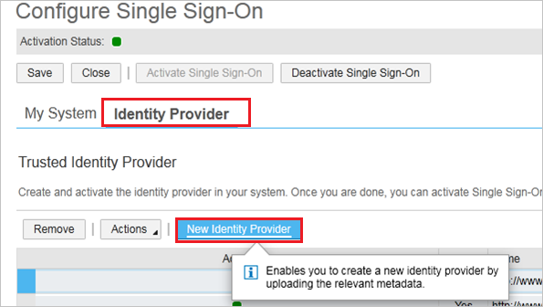

# Configure SAP Business ByDesign for Single sign-on with Microsoft Entra ID

In this article,  you learn how to integrate SAP Business ByDesign with Microsoft Entra ID. When you integrate SAP Business ByDesign with Microsoft Entra ID, you can:

* Control in Microsoft Entra ID who has access to SAP Business ByDesign.
* Enable your users to be automatically signed-in to SAP Business ByDesign with their Microsoft Entra accounts.
* Manage your accounts in one central location.

## Prerequisites
The scenario outlined in this article assumes that you already have the following prerequisites:

[!INCLUDE [common-prerequisites.md](~/identity/saas-apps/includes/common-prerequisites.md)]
* SAP Business ByDesign single sign-on (SSO) enabled subscription.

## Scenario description

In this article,  you configure and test Microsoft Entra SSO in a test environment.

* SAP Business ByDesign supports **SP** initiated SSO

## Add SAP Business ByDesign from the gallery

To configure the integration of SAP Business ByDesign into Microsoft Entra ID, you need to add SAP Business ByDesign from the gallery to your list of managed SaaS apps.

1. Sign in to the [Microsoft Entra admin center](https://entra.microsoft.com) as at least a [Cloud Application Administrator](~/identity/role-based-access-control/permissions-reference.md#cloud-application-administrator).
1. Browse to **Entra ID** > **Enterprise apps** > **New application**.
1. In the **Add from the gallery** section, type **SAP Business ByDesign** in the search box.
1. Select **SAP Business ByDesign** from results panel and then add the app. Wait a few seconds while the app is added to your tenant.

 Alternatively, you can also use the [Enterprise App Configuration Wizard](https://portal.office.com/AdminPortal/home?Q=Docs#/azureadappintegration). In this wizard, you can add an application to your tenant, add users/groups to the app, assign roles, and set up the SSO configuration. [Learn more about Microsoft 365 wizards.](/microsoft-365/admin/misc/azure-ad-setup-guides)

## Configure and test Microsoft Entra SSO

Configure and test Microsoft Entra SSO with SAP Business ByDesign using a test user called **B.Simon**. For SSO to work, you need to establish a link relationship between a Microsoft Entra user and the related user in SAP Business ByDesign.

To configure and test Microsoft Entra SSO with SAP Business ByDesign, perform the following steps:

1. **[Configure Microsoft Entra SSO](#configure-azure-ad-sso)** - to enable your users to use this feature.
    1. **Create a Microsoft Entra test user** - to test Microsoft Entra single sign-on with B.Simon.
    1. **Assign the Microsoft Entra test user** - to enable B.Simon to use Microsoft Entra single sign-on.
1. **[Configure SAP Business ByDesign SSO](#configure-sap-business-bydesign-sso)** - to configure the single sign-on settings on application side.
    1. **[Create SAP Business ByDesign test user](#create-sap-business-bydesign-test-user)** - to have a counterpart of Britta Simon in SAP Business ByDesign that's linked to the Microsoft Entra representation of user.
1. **[Test SSO](#test-sso)** - to verify whether the configuration works.

### Configure Microsoft Entra SSO

Follow these steps to enable Microsoft Entra SSO.

1. Sign in to the [Microsoft Entra admin center](https://entra.microsoft.com) as at least a [Cloud Application Administrator](~/identity/role-based-access-control/permissions-reference.md#cloud-application-administrator).
1. Browse to **Entra ID** > **Enterprise apps** > **SAP Business ByDesign** > **Single sign-on**.
1. On the **Select a single sign-on method** page, select **SAML**.
1. On the **Set up single sign-on with SAML** page, select the pencil icon for **Basic SAML Configuration** to edit the settings.

   

1. On the **Basic SAML Configuration** section, perform the following steps:

	a. In the **Sign on URL** text box, type a URL using the following pattern:
    `https://<servername>.sapbydesign.com`

    b. In the **Identifier (Entity ID)** text box, type a URL using the following pattern:
    `https://<servername>.sapbydesign.com`

	> [!NOTE]
	> These values aren't real. Update these values with the actual Sign on URL and Identifier. Contact [SAP Business ByDesign Client support team](https://www.sap.com/products/cloud-analytics.support.html) to get these values. You can also refer to the patterns shown in the **Basic SAML Configuration** section.

5. The SAP Business ByDesign application expects the SAML assertions in a specific format. Configure the following claims for this application. You can manage the values of these attributes from the **User Attributes** section on application integration page. On the **Set up Single Sign-On with SAML** page, select **Edit** button to open **User Attributes** dialog.

	

6. Select the **Edit** icon to edit the **Name identifier value**.

	

7. On the **Manage user claims** section, perform the following steps:

	

	a. Select **Transformation** as a **Source**.

	b. In the **Transformation** dropdown list, select **ExtractMailPrefix()**.

    > [!NOTE]
    > By default, SAP Business ByDesign uses the NameID format **unspecified** for user mapping. This application maps the NameID of SAML-assertions on the SAP Business ByDesign User Alias. Additionally this application supports the name ID format **emailAddress**. In this case, the application maps the NameID of the SAML assertion on the SAP Business ByDesign user e-mail address of the SAP Business ByDesign employee contact data. For more information, see [Single Sign-On (SSO) with SAP Business ByDesign](https://community.sap.com/t5/enterprise-resource-planning-blogs-by-sap/single-sign-on-sso-with-sap-business-bydesign/ba-p/13337088).

8. On the **Set up Single Sign-On with SAML** page, in the **SAML Signing Certificate** section, select **Download** to download the **Federation Metadata XML** from the given options as per your requirement and save it on your computer.

	

9. On the **Set up SAP Business ByDesign** section, copy the appropriate URLs, as required for the application.

	

[!INCLUDE [create-assign-users-sso.md](~/identity/saas-apps/includes/create-assign-users-sso.md)]

## Configure SAP Business ByDesign SSO

1. Sign on to your SAP Business ByDesign portal with administrator rights.

2. Navigate to **Application and User Management Common Task** and select the **Identity Provider** tab.

3. Select **New Identity Provider** and select the metadata XML file that you downloaded. After you import the metadata, the application automatically uploads the required signature certificate and encryption certificate.

	

4. To include the **Assertion Consumer Service URL** into the SAML request, select **Include Assertion Consumer Service URL**.

5. Select **Activate Single Sign-On**.

6. Save your changes.

7. Select the **My System** tab.

    

8. In the **Microsoft Entra ID Sign On URL** textbox, paste **Login URL** value, which you copied previously.

    

9. Specify whether the employee can manually choose between logging on with user ID and password or SSO by selecting **Manual Identity Provider Selection**.

10. In the **SSO URL** section, specify the URL that should be used by the employee to sign on to the application.
    In the URL Sent to Employee dropdown list, you can choose between the following options:

    **Non-SSO URL**

    The system sends only the normal system URL to the employee. The employee can't sign on using SSO, and must use a password or certificate instead.

    **SSO URL**

    The system sends only the SSO URL to the employee. The employee can sign on using SSO. Authentication request is redirected through the IdP.

    **Automatic Selection**

    If SSO isn't active, the system sends the normal system URL to the employee. If SSO is active, the system checks whether the employee has a password. If a password is available, both SSO URL and Non-SSO URL are sent to the employee. However, if the employee has no password, only the SSO URL is sent to the employee.

11. Save your changes.

### Create SAP Business ByDesign test user

In this section, you create a user called Britta Simon in SAP Business ByDesign. Please work with [SAP Business ByDesign Client support team](https://www.sap.com/products/cloud-analytics.support.html) to add the users in the SAP Business ByDesign platform. 

> [!NOTE]
> Please make sure that NameID value should match with the username field in the SAP Business ByDesign platform.

## Test SSO 

In this section, you test your Microsoft Entra single sign-on configuration with following options. 

1. Select **Test this application**, which will redirect the web browser to the SAP Business ByDesign Sign-on URL, where you can initiate the login flow. 

2. Go to SAP Business ByDesign Sign-on URL directly and initiate the login flow from there.

3. You can use Microsoft My Apps. When you select the SAP Business ByDesign tile in the My Apps, the web browser will redirect to SAP Business ByDesign Sign-on URL. For more information about the My Apps, see [Introduction to the My Apps](https://support.microsoft.com/account-billing/sign-in-and-start-apps-from-the-my-apps-portal-2f3b1bae-0e5a-4a86-a33e-876fbd2a4510).

## Related content

* Once you configure SAP Business ByDesign for SSO, you can enforce session control, which prevents exfiltration and infiltration of your organization’s sensitive data in real time. Session control extends from Conditional Access. [Learn how to enforce session control with Microsoft Defender for Cloud Apps](/cloud-app-security/proxy-deployment-any-app).
