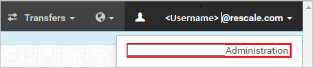
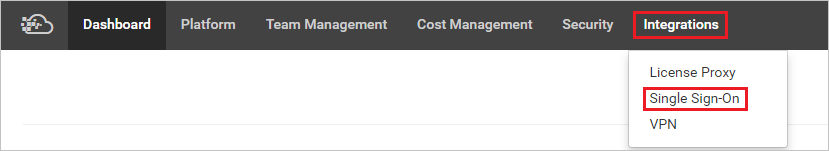
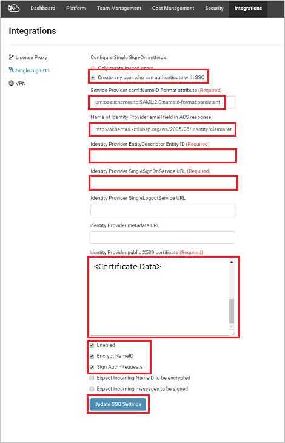

# Configure ScaleX Enterprise for Single sign-on with Microsoft Entra ID

In this article,  you learn how to integrate ScaleX Enterprise with Microsoft Entra ID. When you integrate ScaleX Enterprise with Microsoft Entra ID, you can:

* Control in Microsoft Entra ID who has access to ScaleX Enterprise.
* Enable your users to be automatically signed-in to ScaleX Enterprise with their Microsoft Entra accounts.
* Manage your accounts in one central location.

## Prerequisites
The scenario outlined in this article assumes that you already have the following prerequisites:

[!INCLUDE [common-prerequisites.md](~/identity/saas-apps/includes/common-prerequisites.md)]
* ScaleX Enterprise single sign-on (SSO) enabled subscription.

## Scenario description

In this article,  you configure and test Microsoft Entra SSO in a test environment.

* ScaleX Enterprise supports **SP and IDP** initiated SSO.

## Add ScaleX Enterprise from the gallery

To configure the integration of ScaleX Enterprise into Microsoft Entra ID, you need to add ScaleX Enterprise from the gallery to your list of managed SaaS apps.

1. Sign in to the [Microsoft Entra admin center](https://entra.microsoft.com) as at least a [Cloud Application Administrator](~/identity/role-based-access-control/permissions-reference.md#cloud-application-administrator).
1. Browse to **Entra ID** > **Enterprise apps** > **New application**.
1. In the **Add from the gallery** section, type **ScaleX Enterprise** in the search box.
1. Select **ScaleX Enterprise** from results panel and then add the app. Wait a few seconds while the app is added to your tenant.

 Alternatively, you can also use the [Enterprise App Configuration Wizard](https://portal.office.com/AdminPortal/home?Q=Docs#/azureadappintegration). In this wizard, you can add an application to your tenant, add users/groups to the app, assign roles, and walk through the SSO configuration as well. [Learn more about Microsoft 365 wizards.](/microsoft-365/admin/misc/azure-ad-setup-guides)

## Configure and test Microsoft Entra SSO for ScaleX Enterprise

Configure and test Microsoft Entra SSO with ScaleX Enterprise using a test user called **B.Simon**. For SSO to work, you need to establish a link relationship between a Microsoft Entra user and the related user in ScaleX Enterprise.

To configure and test Microsoft Entra SSO with ScaleX Enterprise, perform the following steps:
1. **[Configure Microsoft Entra SSO](#configure-azure-ad-sso)** - to enable your users to use this feature.
    1. **Create a Microsoft Entra test user** - to test Microsoft Entra single sign-on with B.Simon.
    1. **Assign the Microsoft Entra test user** - to enable B.Simon to use Microsoft Entra single sign-on.
1. **[Configure ScaleX Enterprise SSO](#configure-scalex-enterprise-sso)** - to configure the single sign-on settings on application side.
    1. **[Create ScaleX Enterprise test user](#create-scalex-enterprise-test-user)** - to have a counterpart of B.Simon in ScaleX Enterprise that's linked to the Microsoft Entra representation of user.
1. **[Test SSO](#test-sso)** - to verify whether the configuration works.

## Configure Microsoft Entra SSO

Follow these steps to enable Microsoft Entra SSO.

1. Sign in to the [Microsoft Entra admin center](https://entra.microsoft.com) as at least a [Cloud Application Administrator](~/identity/role-based-access-control/permissions-reference.md#cloud-application-administrator).
1. Browse to **Entra ID** > **Enterprise apps** > **ScaleX Enterprise** > **Single sign-on**.
1. On the **Select a single sign-on method** page, select **SAML**.
1. On the **Set up single sign-on with SAML** page, select the pencil icon for **Basic SAML Configuration** to edit the settings.

   

1. On the **Basic SAML Configuration** section, if you wish to configure the application in **IDP** initiated mode, perform the following steps:

    a. In the **Identifier** text box, type a URL using the following pattern:
    `https://platform.rescale.com/saml2/<company id>/`

    b. In the **Reply URL** text box, type a URL using the following pattern:
    `https://platform.rescale.com/saml2/<company id>/acs/`

1. Select **Set additional URLs** and perform the following step if you wish to configure the application in **SP** initiated mode:

    In the **Sign-on URL** text box, type a URL using the following pattern:
    `https://platform.rescale.com/saml2/<company id>/sso/`

	> [!NOTE]
	> These values aren't real. Update these values with the actual Identifier, Reply URL and Sign-on URL. Contact [ScaleX Enterprise Client support team](https://about.rescale.com/contactus.html) to get these values. You can also refer to the patterns shown in the **Basic SAML Configuration** section.

1. Your ScaleX Enterprise application expects the SAML assertions in a specific format, which requires you to add custom attribute mappings to your SAML token attributes configuration. The following screenshot shows the list of default attributes, whereas **emailaddress** is mapped with **user.mail**. ScaleX Enterprise application expects **emailaddress** to be mapped with **user.userprincipalname**, so you need to edit the attribute mapping by selecting **Edit** icon and change the attribute mapping.

	

1. On the **Set up single sign-on with SAML** page, in the **SAML Signing Certificate** section,  find **Certificate (Base64)** and select **Download** to download the certificate and save it on your computer.

	

1. On the **Set up ScaleX Enterprise** section, copy the appropriate URL(s) based on your requirement.

	

[!INCLUDE [create-assign-users-sso.md](~/identity/saas-apps/includes/create-assign-users-sso.md)]

## Configure ScaleX Enterprise SSO

1. In a different web browser window, sign in to your ScaleX Enterprise company site as an administrator

1. Select the menu in the upper right and select **Contoso Administration**.

	> [!NOTE]
	> Contoso is just an example. This should be your actual Company Name.

	

1. Select **Integrations** from the top menu and select **single sign-on**.

	 

1. Complete the form as follows:

	

	a. Select **Create any user who can authenticate with SSO**.

	b. **Service Provider saml**: Paste the value **urn:oasis:names:tc:SAML:2.0:nameid-format:persistent**.

	c. **Name of Identity Provider email field in ACS response**: Paste the value `http://schemas.xmlsoap.org/ws/2005/05/identity/claims/emailaddress`.

	d. **Identity Provider EntityDescriptor Entity ID:** Paste the **Microsoft Entra Identifier** value copied.

	e. **Identity Provider SingleSignOnService URL:** Paste the **Login URL**.

	f. **Identity Provider public X509 certificate:** Open the X509 certificate downloaded from the Azure in notepad and paste the contents in this box. Ensure there are no line breaks in the middle of the certificate contents.

	g. Check the following checkboxes: **Enabled, Encrypt NameID and Sign AuthnRequests.**

	h. Select **Update SSO Settings** to save the settings.

### Create ScaleX Enterprise test user

To enable Microsoft Entra users to sign in to ScaleX Enterprise, they must be provisioned in to ScaleX Enterprise. In the case of ScaleX Enterprise, provisioning is an automatic task and no manual steps are required. Any user who can successfully authenticate with SSO credentials are automatically provisioned on the ScaleX side.

## Test SSO

In this section, you test your Microsoft Entra single sign-on configuration with following options. 

#### SP initiated:

* Select **Test this application**, this option redirects to ScaleX Enterprise Sign on URL where you can initiate the login flow.  

* Go to ScaleX Enterprise Sign-on URL directly and initiate the login flow from there.

#### IDP initiated:

* Select **Test this application**, and you should be automatically signed in to the ScaleX Enterprise for which you set up the SSO. 

You can also use Microsoft My Apps to test the application in any mode. When you select the ScaleX Enterprise tile in the My Apps, if configured in SP mode you would be redirected to the application sign on page for initiating the login flow and if configured in IDP mode, you should be automatically signed in to the ScaleX Enterprise for which you set up the SSO. For more information, see [Microsoft Entra My Apps](/azure/active-directory/manage-apps/end-user-experiences#azure-ad-my-apps).

## Related content

Once you configure ScaleX Enterprise you can enforce session control, which protects exfiltration and infiltration of your organization’s sensitive data in real time. Session control extends from Conditional Access. [Learn how to enforce session control with Microsoft Defender for Cloud Apps](/cloud-app-security/proxy-deployment-aad).
